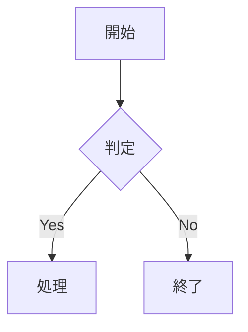

# Offline Markdown Workbench

完全オフラインで動作する、ローカルMarkdownファイル向けの高機能ビューアーです。

Chrome / Microsoft Edgeで `index.html` をダブルクリックするだけで起動できます。Live Serverなどのローカルサーバーは必要ありません。

---

## 1. 起動方法

1. ZIPファイルを任意の場所へ展開します。
2. 展開したフォルダ内の `index.html` をダブルクリックします。
3. ブラウザでMarkdownファイルを開きます。
   - 上部の **「開く」** ボタンからファイルを選択
   - またはMarkdownファイルを画面へドラッグ＆ドロップ
4. Markdownファイルの内容が表示されます。

対応ファイル：

- `.md`
- `.markdown`
- `.mdown`
- `.mkdn`
- `.txt`

### 対応ブラウザ

- Google Chrome
- Microsoft Edge

`file://` で直接開くことを前提にしています。

---

## 2. Markdownファイルを開く

### ファイル選択

画面上部の **「開く」** をクリックしてMarkdownファイルを選択します。

### ドラッグ＆ドロップ

Markdownファイルをビューアー画面へドラッグ＆ドロップして開くこともできます。

対応していないファイルをドロップした場合はエラーとして通知され、現在表示している文書は維持されます。

### 完全オフライン

Markdown本文はブラウザのFile APIを使用して読み込みます。

```javascript
const text = await file.text();
```

ローカルMarkdownファイルを `fetch()` で取得する方式ではありません。

---

# 3. 主な機能

## Markdown表示

GFM相当のMarkdownを表示できます。

- 見出し `h1` ～ `h6`
- 太字
- 斜体
- 取り消し線
- 箇条書き
- 番号付きリスト
- タスクリスト
- 引用
- 水平線
- リンク
- 画像
- インラインコード
- コードブロック
- 表
- 自動リンク
- 改行
- 見出しアンカー

Markdownから生成されるHTMLはサニタイズされ、危険なHTMLやJavaScriptが実行されないように処理されます。

---

# 4. 目次

Markdownの見出しから自動的に目次を生成します。

対応：

- h1 ～ h6
- 階層表示
- クリックによる見出し移動
- 現在位置の表示
- 目次検索
- サイドバーの開閉
- 見出し番号の表示切り替え
- 同じ見出し名が複数ある場合の一意ID生成

本文をスクロールすると、現在読んでいる見出しが目次側にも反映されます。

---

# 5. 表

Markdownの表は、通常のMarkdown表よりも多くの操作に対応しています。

## 表のスクロール

表ごとに独立したスクロール領域を持っています。

そのため、横幅の広い表や行数の多い表でも、文書全体のレイアウトを崩さず閲覧できます。

- 横スクロール
- 縦スクロール
- 表ごとの独立スクロール

## 先頭行・先頭列の固定

各表には以下の操作があります。

- 先頭列固定
- 先頭行固定
- 両方固定

固定した状態はボタンの表示で確認できます。

大きな表でも、項目名を確認しながらスクロールできます。

## 列幅変更

表のヘッダーをドラッグして列幅を変更できます。

- 最小幅：80px
- 最大幅：1200px
- マウス対応
- タッチ操作対応
- 列幅リセット

列幅は文書を再読み込みすると初期状態へ戻ります。

## 表全体のサイズ変更

表の右下にあるリサイズ領域から、表全体の大きさを変更できます。

- 横方向のサイズ変更
- 縦方向のサイズ変更
- 右下から幅と高さを同時変更
- リセット可能

表のサイズはページを再読み込みすると初期状態へ戻ります。

## 表のソート

各列のヘッダーにはソートボタンがあります。

クリックすると、

```text
未ソート
  ↓
昇順
  ↓
降順
  ↓
未ソート
```

の順に切り替えられます。

現在ソートされている列と方向は視覚的に確認できます。

`aria-sort` も設定されているため、キーボードや支援技術から状態を確認できます。

## 表の絞り込み

各列には絞り込み機能があります。

列の絞り込みボタンから、その列に含まれる値を検索・選択できます。

複数の列を同時に絞り込むこともできます。

絞り込み中は、

- ボタンの状態
- 件数
- フィルター状態

から、現在絞り込み中であることを確認できます。

絞り込みポップアップの外側をクリックすると閉じられます。

絞り込みは簡単に解除できます。

## 表のコピー・CSV

各表について、

- 表全体をクリップボードへコピー
- CSVとして保存

ができます。

---

# 6. Mermaid

Mermaidをローカルで動作させ、Markdown内のMermaidコードブロックを図として表示します。

例えば、

````markdown

````

のように記述します。

対応例：

- flowchart
- graph
- sequenceDiagram
- classDiagram
- stateDiagram
- erDiagram
- gantt
- pie
- journey
- mindmap
- timeline

図ごとに、

- 拡大
- 縮小
- 初期倍率へ戻す
- 再描画
- Mermaid原文の表示・非表示
- SVGのコピー・保存

などの操作ができます。

テーマを変更するとMermaid図もテーマに合わせて再描画されます。

Mermaidの構文エラーが発生した場合でも、アプリ全体を停止せず、その図の場所にエラーを表示します。

### Mermaidライブラリ

`vendor/mermaid.min.js` にローカルのMermaidブラウザ版を配置します。

インターネット接続は実行時には必要ありません。

---

# 7. コードブロック

コードブロックには以下の機能があります。

- 言語名表示
- 行番号
- コピー
- 横スクロール
- 折り返し切り替え
- 折りたたみ

コピーに成功すると通知が表示されます。

---

# 8. 文書内検索

`Ctrl + F` でビューアー独自の検索を開けます。

対応：

- 検索結果件数
- 前の結果
- 次の結果
- 現在の結果の強調
- 大文字・小文字の切り替え
- 表の内容
- コードブロック
- 必要に応じたMermaid原文

`Esc` で検索を閉じられます。

---

# 9. テーマ・表示設定

表示設定から文書の表示を変更できます。

テーマ：

- Light
- Dark
- High Contrast
- System

その他、

- フォントサイズ
- 行間
- 本文幅
- 目次表示
- 見出し番号
- コード折り返し

などを変更できます。

設定はLocalStorageへ保存されるため、次回起動時にも表示設定を維持できます。

Markdown本文そのものはLocalStorageへ保存しません。

---

# 10. キーボードショートカット

| キー | 動作 |
|---|---|
| `Ctrl + O` | Markdownファイルを開く |
| `Ctrl + F` | 文書内検索 |
| `Esc` | 検索・モーダルなどを閉じる |
| `Ctrl + Shift + F` | 目次検索 |
| `Ctrl + Shift + D` | ダークモード切り替え |
| `Ctrl + Shift + C` | 現在のコードをコピー |
| `Home` | 文書先頭 |
| `End` | 文書末尾 |

入力欄にフォーカスしている場合は、ブラウザ標準のキーボード操作を優先します。

---

# 11. アクセシビリティ

キーボード操作を考慮したUIになっています。

主な対応：

- `aria-label`
- `aria-pressed`
- `aria-sort`
- `aria-live`
- キーボード操作
- フォーカスリング
- 表の `th` / `scope`
- Mermaidエラーのテキスト表示
- 色だけに依存しない状態表示
- ボタンのツールチップ

表の固定・ソート・絞り込みなどもボタンから操作できます。

---

# 12. サンプルMarkdown

フォルダには複数のテスト用Markdownを収録しています。

### `sample-design-document.md`

総合的な機能確認用です。

- 日本語見出し
- 深い見出し階層
- 長い表
- 広い表
- 長文セル
- 表の固定
- Mermaid
- コードブロック
- タスクリスト
- 引用
- リンク
- 危険なHTMLのサンプル

### `sample-mermaid.md`

Mermaidの表示確認用です。

### `sample-table-patterns.md`

表の固定・ソート・絞り込み・リサイズなどを確認するためのサンプルです。

### `sample-wide-table.md`

横幅の広い表を確認するためのサンプルです。

### `sample-basic-elements.md`

Markdownの基本要素を確認するためのサンプルです。

---

JavaScriptはES Modulesではなく、通常の `<script src="...">` 方式で読み込まれています。

---

# 14. 完全オフラインについて

実行時に以下へアクセスしません。

- CDN
- Google Fonts
- 外部API
- 外部JavaScript
- 外部CSS
- ネットワーク上のMarkdownファイル
- `fetch()`によるローカルMarkdown取得

必要なJavaScriptライブラリは `vendor/` に配置します。

そのため、インターネット接続がないPCでも使用できます。

---

# 15. LocalStorageに保存される情報

次の表示設定はLocalStorageへ保存されます。

- テーマ
- フォントサイズ
- 行間
- 本文幅
- 目次の表示状態
- 見出し番号
- コード折り返し設定
- その他の表示設定

以下は保存しません。

- Markdown本文
- Mermaidコード
- 表の列幅
- 表のサイズ
- 表のソート状態
- 表の絞り込み状態
- 開いたファイルの内容

---

# 16. セキュリティ

Markdownから生成されたHTMLはサニタイズされます。

例えば以下のような危険なHTMLがMarkdownに含まれていても、JavaScriptが実行されないように処理されます。

```html
<script>alert("test")</script>
```

```html

```

```html
<a href="javascript:alert('test')">危険なリンク</a>
```

サンプル文書にも安全性を確認するための例を収録しています。

---

# 17. file:// で使用する理由

このビューアーは、サーバーを立てなくても技術文書を閲覧できることを重視しています。

そのため、

```text
index.html
   ↓
Chrome / Edge
   ↓
file://
```

という使い方ができます。

ES Modulesではなく通常のJavaScriptファイルを使用しているのも、`file://` 直開きでの互換性を優先するためです。

---

# 18. 推奨される使い方

技術文書・設計書・仕様書・README・API仕様書などを読む用途に適しています。

特に、

- 長いMarkdown
- 表が多い設計書
- 横幅の広い仕様表
- コードを含むREADME
- Mermaidで構成図を含む設計書

などの閲覧に向いています。

Markdownファイルを開くだけで使用できるため、文書をローカルに保存しておき、必要なときに `index.html` から開く使い方がおすすめです。
