# 注文管理システム テーブル定義書

## 1. 概要

本ドキュメントは、次世代ECプラットフォームにおける「注文管理システム（OMS）」のデータベーステーブル定義および関連設計をまとめた仕様書です。
本システムは、顧客からの注文受付から決済、在庫引当、出荷手手配、アフターサポートまでのデータ一元管理を担当します。

## 2. テーブル一覧 (Table Overview)

本システムで管理する全50テーブルの一覧です。

| テーブルID | テーブル名 (物理名) | 論理名 | 区分 | レコード件数見込み | ステータス | 担当チーム | 最終更新日 | 
 | ----- | ----- | ----- | ----- | ----- | ----- | ----- | ----- | 
| TBL-001 | `t_orders` | 注文ヘッダ | トランザクション | 10,000,000+ | 確定 | 注文チーム | 2026/08/15 | 
| TBL-002 | `m_users` | 会員基本情報 | マスタ | 1,000,000+ | 確定 | ユーザーチーム | 2026/08/10 | 
| TBL-003 | `t_order_items` | 注文明細 | トランザクション | 30,000,000+ | 確定 | 注文チーム | 2026/08/15 | 
| TBL-004 | `m_products` | 商品基本情報 | マスタ | 500,000 | 確定 | 商品チーム | 2026/07/20 | 
| TBL-005 | `t_payments` | 決済履歴 | トランザクション | 12,000,000+ | 確定 | 決済チーム | 2026/08/18 | 
| TBL-006 | `m_payment_methods` | 決済種別マスタ | マスタ | 20 | 確定 | 決済チーム | 2026/05/11 | 
| TBL-007 | `t_shipments` | 出荷指示データ | トランザクション | 8,000,000+ | レビュー中 | 物流チーム | 2026/09/01 | 
| TBL-008 | `m_warehouses` | 倉庫マスタ | マスタ | 50 | 確定 | 物流チーム | 2026/06/15 | 
| TBL-009 | `t_inventory` | 在庫変動履歴 | トランザクション | 50,000,000+ | レビュー中 | 物流チーム | 2026/09/02 | 
| TBL-010 | `m_categories` | 商品カテゴリ | マスタ | 1,500 | 確定 | 商品チーム | 2026/06/01 | 
| TBL-011 | `m_brands` | ブランドマスタ | マスタ | 800 | 確定 | 商品チーム | 2026/06/05 | 
| TBL-012 | `t_coupons` | クーポン発行履歴 | トランザクション | 2,000,000+ | 確定 | 販促チーム | 2026/07/29 | 
| TBL-013 | `m_coupon_templates` | クーポン原券マスタ | マスタ | 300 | 確定 | 販促チーム | 2026/07/25 | 
| TBL-014 | `m_user_ranks` | 会員ランクマスタ | マスタ | 10 | 確定 | ユーザーチーム | 2026/04/01 | 
| TBL-015 | `t_cart` | カート情報 | 一時データ | 500,000 | 確定 | UI/UXチーム | 2026/08/12 | 
| TBL-016 | `t_cart_items` | カート投入商品 | 一時データ | 1,500,000 | 確定 | UI/UXチーム | 2026/08/12 | 
| TBL-017 | `m_suppliers` | 仕入先マスタ | マスタ | 3,000 | 確定 | 調達チーム | 2026/04/10 | 
| TBL-018 | `t_purchase_orders` | 発注データ | トランザクション | 100,000 | 作成中 | 調達チーム | 2026/09/10 | 
| TBL-019 | `m_product_tags` | 商品タグマスタ | マスタ | 5,000 | 確定 | 商品チーム | 2026/06/18 | 
| TBL-020 | `t_returns` | 返品リクエスト | トランザクション | 50,000 | 確定 | CSチーム | 2026/08/01 | 
| TBL-021 | `m_return_reasons` | 返品理由マスタ | マスタ | 15 | 確定 | CSチーム | 2026/03/15 | 
| TBL-022 | `t_reviews` | 商品レビュー | コンテンツ | 3,000,000+ | 確定 | メディアチーム | 2026/07/11 | 
| TBL-023 | `m_review_badges` | レビューバッジマスタ | マスタ | 25 | 作成中 | メディアチーム | 2026/09/08 | 
| TBL-024 | `t_audit_logs` | システム操作ログ | ログ | 100,000,000+ | 確定 | 基盤チーム | 2026/08/30 | 
| TBL-025 | `m_tax_rates` | 税率マスタ | マスタ | 10 | 確定 | 会計チーム | 2026/01/05 | 
| TBL-026 | `m_currencies` | 通貨マスタ | マスタ | 50 | 確定 | 会計チーム | 2026/01/10 | 
| TBL-027 | `t_invoices` | 請求・領収データ | トランザクション | 10,000,000+ | 作成中 | 会計チーム | 2026/09/12 | 
| TBL-028 | `m_shipping_carriers` | 配送業者マスタ | マスタ | 12 | 確定 | 物流チーム | 2026/05/20 | 
| TBL-029 | `m_shipping_rates` | 送料設定マスタ | マスタ | 500 | レビュー中 | 物流チーム | 2026/08/28 | 
| TBL-030 | `t_user_addresses` | 配送先住所録 | マスタ | 2,500,000 | 確定 | ユーザーチーム | 2026/08/05 | 
| TBL-031 | `t_notifications` | ユーザー通知履歴 | トランザクション | 20,000,000+ | 廃止予定 | 基盤チーム | 2026/06/30 | 
| TBL-032 | `m_notification_templates` | 通知テンプレート | マスタ | 150 | 確定 | 基盤チーム | 2026/07/02 | 
| TBL-033 | `m_campaigns` | キャンペーン設定 | マスタ | 200 | 確定 | 販促チーム | 2026/08/22 | 
| TBL-034 | `t_points_history` | ポイント増減履歴 | トランザクション | 40,000,000+ | 確定 | 販促チーム | 2026/08/19 | 
| TBL-035 | `m_point_rules` | ポイント付与条件マスタ | マスタ | 30 | 確定 | 販促チーム | 2026/05/14 | 
| TBL-036 | `t_api_access_logs` | 外部連携ログ | ログ | 500,000,000+ | レビュー中 | 基盤チーム | 2026/09/05 | 
| TBL-037 | `m_system_config` | システム設定値 | システム | 100 | 確定 | 基盤チーム | 2026/02/01 | 
| TBL-038 | `t_temp_registrations` | 仮会員登録 | 一時データ | 10,000 | 確定 | ユーザーチーム | 2026/07/01 | 
| TBL-039 | `m_regions` | 都道府県・地域マスタ | マスタ | 47 | 確定 | 共通チーム | 2025/11/01 | 
| TBL-040 | `m_zip_codes` | 郵便番号マスタ | マスタ | 150,000 | 確定 | 共通チーム | 2026/03/01 | 
| TBL-041 | `m_store_locations` | 実店舗マスタ | マスタ | 120 | レビュー中 | OMOチーム | 2026/08/30 | 
| TBL-042 | `t_store_stock` | 店舗別在庫 | トランザクション | 5,000,000 | 作成中 | OMOチーム | 2026/09/11 | 
| TBL-043 | `m_gift_wrappings` | ギフト包装マスタ | マスタ | 20 | 確定 | 物流チーム | 2026/04/18 | 
| TBL-044 | `t_gift_messages` | ギフトメッセージデータ | トランザクション | 300,000 | 確定 | 注文チーム | 2026/07/15 | 
| TBL-045 | `m_promotions` | プロモーションマスタ | マスタ | 80 | 作成中 | 販促チーム | 2026/09/01 | 
| TBL-046 | `m_vendors` | 委託先事業者マスタ | マスタ | 40 | 確定 | 調達チーム | 2026/02/20 | 
| TBL-047 | `t_vendor_payouts` | 委託先支払データ | トランザクション | 15,000 | レビュー中 | 会計チーム | 2026/09/03 | 
| TBL-048 | `m_blacklists` | 不正ユーザー判定マスタ | マスタ | 1,200 | 確定 | セキュリティ | 2026/08/11 | 
| TBL-049 | `t_security_alerts` | セキュリティ検知ログ | ログ | 2,000,000 | 確定 | セキュリティ | 2026/08/29 | 
| TBL-050 | `m_faq_categories` | FAQカテゴリマスタ | マスタ | 30 | 確定 | CSチーム | 2026/05/01 | 

## 3. 主要テーブル詳細定義

### 3.1 注文ヘッダ (`t_orders`)

顧客が確定させた注文の基本情報を保持するテーブルです。

* **テーブル名**: `t_orders`

* **主キー**: `order_id`

* **文字コード**: UTF-8MB4

| カラムID | 物理名 | 論理名 | データ型 | NULL許容 | 初期値 | 制約 / 備考 | 
 | ----- | ----- | ----- | ----- | ----- | ----- | ----- | 
| COL-001 | `order_id` | 注文ID | BIGINT | NO | Auto Increment | 主キー, 内部識別子 | 
| COL-002 | `order_code` | 注文番号 | VARCHAR(32) | NO | \- | UNIQUE, 顧客用参照コード | 
| COL-003 | `user_id` | ユーザーID | BIGINT | NO | \- | FK (`m_users.user_id`) | 
| COL-004 | `order_status` | 注文ステータス | VARCHAR(16) | NO | 'PENDING' | PENDING, PAID, SHIPPED, CANCELED | 
| COL-005 | `total_amount` | 注文合計金額 | DECIMAL(12,2) | NO | 0.00 | 税込合計額 | 
| COL-006 | `tax_amount` | 消費税額 | DECIMAL(10,2) | NO | 0.00 | 内消費税額 | 
| COL-007 | `shipping_fee` | 送料 | DECIMAL(8,2) | NO | 0.00 | \- | 
| COL-008 | `discount_amount` | 割引額 | DECIMAL(10,2) | NO | 0.00 | クーポン・ポイント割引適用額 | 
| COL-009 | `payment_method_id` | 決済手段ID | INT | NO | \- | FK (`m_payment_methods.payment_id`) | 
| COL-010 | `shipping_address_id` | 配送先ID | BIGINT | YES | NULL | FK (`t_user_addresses.address_id`) | 
| COL-011 | `ordered_at` | 注文日時 | DATETIME | NO | CURRENT_TIMESTAMP | \- | 
| COL-012 | `updated_at` | 最終更新日時 | DATETIME | YES | NULL | ON UPDATE CURRENT_TIMESTAMP | 
| COL-013 | `is_deleted` | 削除フラグ | TINYINT(1) | NO | 0 | 0:有効, 1:論理削除済み | 

### 3.2 注文明細 (`t_order_items`)

1つの注文に含まれる個々の商品明細データを保持します。

* **テーブル名**: `t_order_items`

* **主キー**: `order_item_id`

* **文字コード**: UTF-8MB4

| カラムID | 物理名 | 論理名 | データ型 | NULL許容 | 初期値 | 制約 / 備考 | 
 | ----- | ----- | ----- | ----- | ----- | ----- | ----- | 
| COL-001 | `order_item_id` | 注文明細ID | BIGINT | NO | Auto Increment | 主キー | 
| COL-002 | `order_id` | 注文ID | BIGINT | NO | \- | FK (`t_orders.order_id`) | 
| COL-003 | `product_id` | 商品ID | BIGINT | NO | \- | FK (`m_products.product_id`) | 
| COL-004 | `product_sku` | 商品SKU | VARCHAR(64) | NO | \- | 購入時点のSKU保持 | 
| COL-005 | `product_name` | 商品名 | VARCHAR(255) | NO | \- | 購入時点の商品名保持 | 
| COL-006 | `unit_price` | 単価 | DECIMAL(10,2) | NO | \- | 購入時点の適用単価 | 
| COL-007 | `quantity` | 数量 | INT | NO | 1 | \- | 
| COL-008 | `subtotal_price` | 小計 | DECIMAL(12,2) | NO | \- | `unit_price` \* `quantity` | 
| COL-009 | `tax_rate_id` | 適用税率ID | INT | NO | \- | FK (`m_tax_rates.tax_rate_id`) | 

## 4. 共通運用ルール・命名規約

1. **テーブル命名規則**

   * マスタテーブル: `m_` から始まるスネークケース (`m_products` 等)

   * トランザクションテーブル: `t_` から始まるスネークケース (`t_orders` 等)

2. **共通カラム**

   * 全ての永続化テーブルは原則として `created_at`（作成日時）および `updated_at`（更新日時）カラムを含めること。

3. **論理削除ポリシー**

   * 個人情報や注文履歴を含むトランザクションデータの物理削除は禁止し、`is_deleted` フラグによる論理削除を実施する。

# 技術詳細設計書：マイクロサービスECプラットフォーム

| メタデータ | 詳細内容 |
| --- | --- |
| **ドキュメントバージョン** | 1.2.0 |
| **ステータス** | 承認済み (Approved) |
| **作成者** | プリンシパル・システムアーキテクト |
| **対象リリース** | 2026年 第4四半期 |

---

## 1. エグゼクティブ・サマリー（概要）

本技術設計書（TDD）は、次世代ECマイクロサービスプラットフォームのシステムアーキテクチャ、統合パターン、およびデータ永続化モデルを定義するものです。本システムは、高トラフィックなトランザクション処理に耐えうる設計となっており、分散システム間における複数パーティのイベントフロー、並びにクラウドネイティブなマイクロサービス間におけるレジリエンス（障害復旧性）の高いリカバリ機構を備えています。

---

## 2. エンドツーエンド・システムシーケンス図

以下のシーケンス図は、システム全体に関わるリクエストのライフサイクルを示しています。ユーザーの新規アカウント登録、商品検索から、分散環境下での複雑な決済トランザクション処理、外部決済ゲートウェイ連携、非同期での在庫ロック、および配送指示（出荷処理）までの一連の流れを網羅しています。

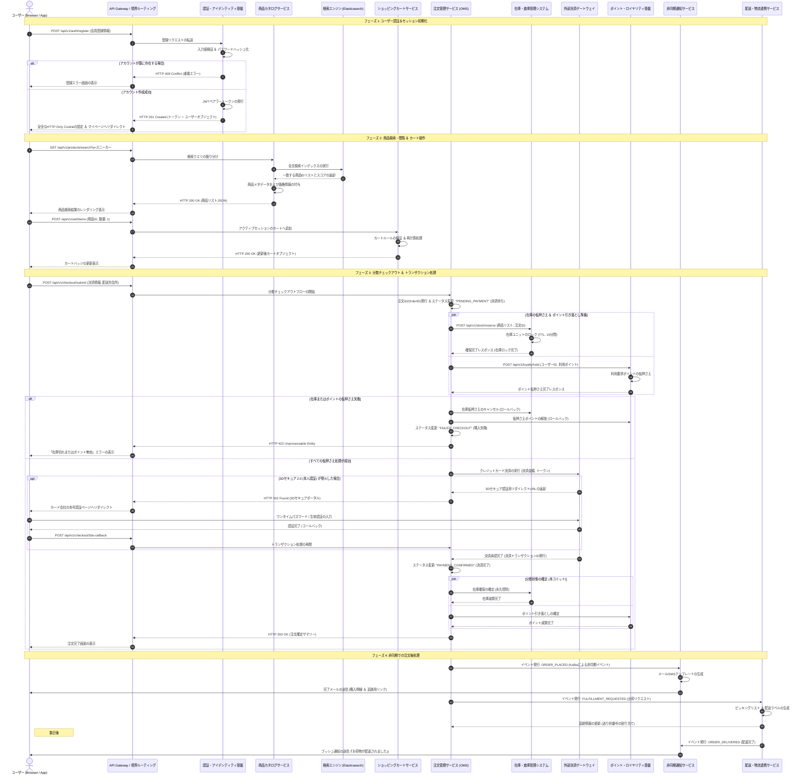

---

## 3. ハイレベル・システムアーキテクチャ概要

本システムは、Elastic Kubernetes Service (EKS) クラスター上で稼働するイベント駆動型マイクロサービスアーキテクチャを採用しています。

```
                                  +-----------------------+
                                  |   API Gateway (Edge)  |
                                  +-----------+-----------+
                                              |
      +-------------------+-------------------+-------------------+-------------------+
      |                   |                   |                   |                   |
+-----+-----+       +-----+-----+       +-----+-----+       +-----+-----+       +-----+-----+
| 認証・認可  |       | カタログ  |       | カート    |       | 注文管理  |       | 在庫・倉庫 |
| サービス  |       | サービス  |       | サービス  |       | (OMS)     |       | サービス  |
+-----------+       +-----------+       +-----------+       +-----------+       +-----------+

```

### 主要コンポーネント

* **API Gateway / 境界ルーティング**: TLS終端、レート制限（Token Bucketアルゴリズム）、認証トークン検証、およびリクエストのルーティングを担当。
* **注文管理サービス (OMS)**: 分散処理における Saga オーケストレーターとして機能し、一連の注文トランザクションを制御。
* **在庫・倉庫管理サービス**: 在庫割り当て、TTL（有効期限）付きロックによる一時保持、および倉庫側システムとの同期を担当。
* **外部連携インターフェース**: 外部決済ゲートウェイ（Stripe / Adyenなど）、通知配信基盤（Twilio / SendGridなど）、および宅配業者APIとの連携。

---

## 4. 主要な非機能要件 (NFRs)

* **性能・レイテンシ (Performance & Latency)**:
* 参照系API：P95レスポンスタイム < 200ms
* 更新系（決済処理）API：P99レスポンスタイム < 1,200ms


* **可用性 (Availability)**:
* マルチリージョン構成（Active-Passive）により、年間 99.99% の稼働率を目標とする。


* **データ整合性 (Data Consistency)**:
* カタログインデックスおよび通知サービスは **結果的整合性 (Eventual Consistency)** を許容。
* 注文・決済・在庫割り当てについては、Sagaパターンの補償トランザクションを用いて **厳密なトランザクション整合性** を保持。


---


# Markdown 基本要素テスト

## 見出し

### 階層

通常の文章、**太字**、*斜体*、~~取り消し~~、`inline code`。

- 箇条書き
  - ネスト
- [x] 完了
- [ ] 未完了

1. 番号付き
2. 2番目

> 引用テキストです。

---

[ローカルビューアー](index.html)


```python
for i in range(5):
    print(i)
```

## 危険なHTML

<script>alert("XSS")</script>


<a href="javascript:alert('XSS')">危険なリンク</a>

# Markdown Viewer サンプル設計書

## 1. 概要
この文書は日本語の技術文書を長時間閲覧するためのサンプルです。表、コード、図、タスク、引用などをまとめています。

### 1.1 深い見出し
#### 1.1.1 設計方針
##### 1.1.1.1 詳細
###### 1.1.1.1.1 最深部

## 2. タスク
- [x] Markdown読み込み
- [x] 目次生成
- [ ] 完全なMermaid構文互換

> 技術文書は「読む」ことが主目的なので、装飾よりも情報密度と視認性を優先します。

[Markdown公式サイト](https://www.markdownguide.org/)

## 3. 長い表
| ID | 項目 | 担当 | 状態 | 説明 | API | 備考 |
|---|---|---|---|---|---|---|
| 001 | 認証基盤 | Backend | 完了 | 利用者の認証とセッション管理を担当するコンポーネントです。長い文章が入ってもセル内で適切に折り返します。 | `/api/v1/auth/login` | 固定列の確認 |
| 002 | 文書管理 | Frontend | 進行中 | Markdown文書を読み込み、目次やコード、表を表示します。 | `/api/v1/documents` | 横幅確認 |
| 003 | 検索 | Platform | 未着手 | 大量の文書を対象に検索し、現在位置を分かりやすく表示する機能です。 | `/api/v1/search` | 表示設定 |
| 004 | 監査ログ | Security | 完了 | 操作履歴を保存し、障害調査や監査に利用します。 | `/api/v1/audit` | 先頭行固定 |
| 005 | エクスポート | Backend | 進行中 | CSVやテキストとして情報を取り出すための機能です。 | `/api/v1/export` | 両方固定 |
| 006 | 設定 | Frontend | 完了 | テーマ、文字サイズ、行間、本文幅などをローカルに保存します。 | `/api/v1/settings` | LocalStorage |
| 007 | 通知 | Platform | 未着手 | エラーや完了状態を短い通知で知らせます。 | `/api/v1/notify` | a11y |

## 4. Mermaid
### 4.1 Flowchart
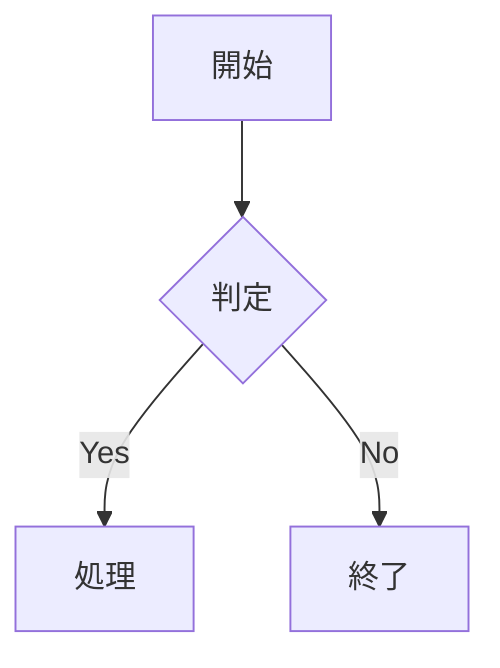

### 4.2 Sequence
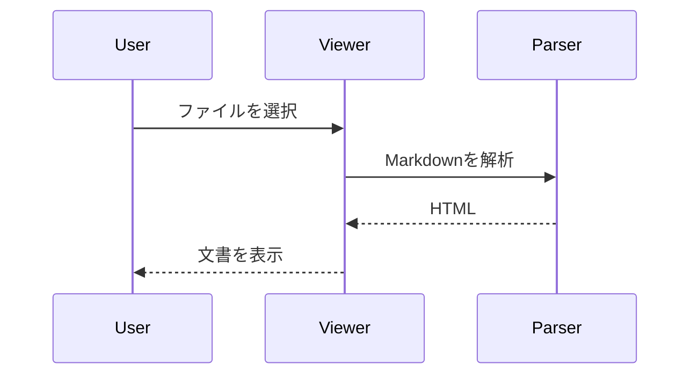

### 4.3 ER
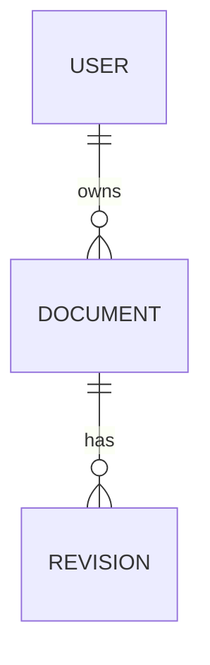

### 4.4 Class
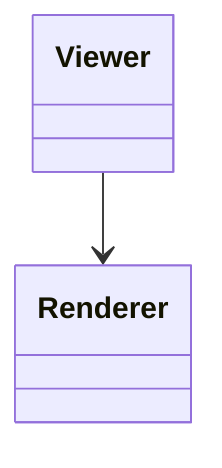

## 5. コード
```javascript
function loadMarkdown(file) {
  return file.text().then(renderMarkdown);
}
```

```python
def hello(name):
    return f"Hello, {name}!"
```

## 6. 危険なHTMLの確認
以下は**実行されてはいけない**サンプルです。

<script>alert('XSS')</script>

<a href="javascript:alert('XSS')">危険なリンク</a>

## 7. 横幅確認用の表
| 列1 | 列2 | 列3 | 列4 | 列5 | 列6 | 列7 | 列8 | 列9 | 列10 |
|---|---|---|---|---|---|---|---|---|---|
| AAAAAAAAAAAAAAAAAAAAA | B | C | D | E | F | G | H | I | J |
| 長いセル | 長いセル | 長いセル | 長いセル | 長いセル | 長いセル | 長いセル | 長いセル | 長いセル | 長いセル |
| 先頭列固定を試す | 100 | 200 | 300 | 400 | 500 | 600 | 700 | 800 | 900 |

## 8. まとめ
表のツールバーから先頭行・先頭列固定、列幅変更、表サイズ変更、CSV出力、コピーを試してください。

# Mermaid テスト

## Flowchart

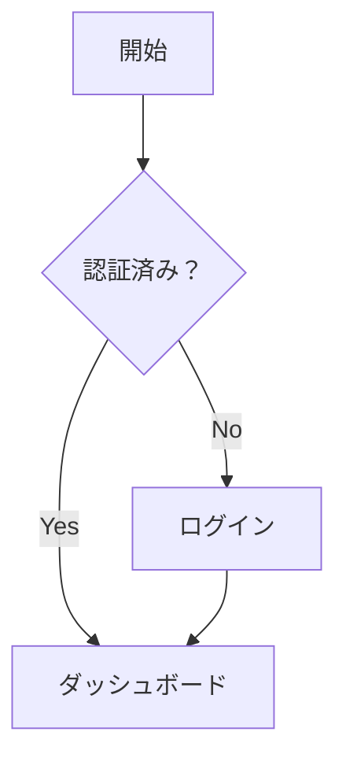

## Graph

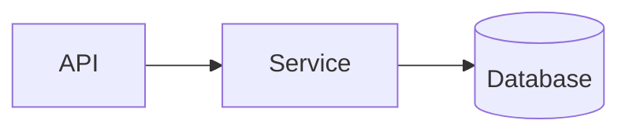

## Wide Flowchart

横方向に長い図。拡大しても横スクロールバーを使わず、図を掴んで移動して確認できます。

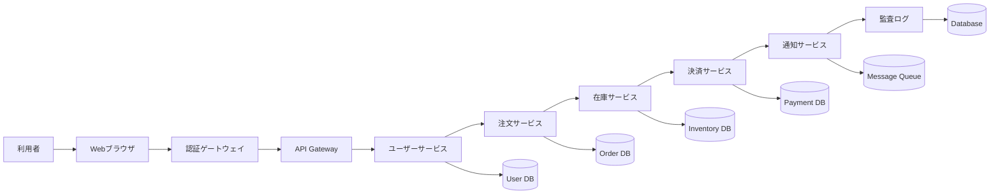

## Long Sequence Diagram

横にも縦にも長いシーケンス図。枠をリサイズし、図をドラッグして各部分を確認するテスト用です。

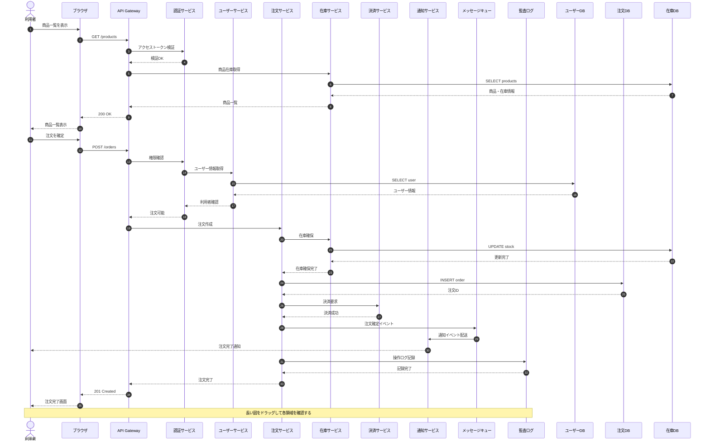

## ER Diagram

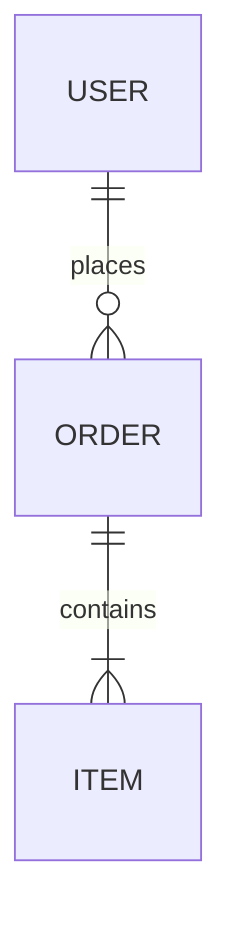

## Class Diagram


## State Diagram


# Markdown Viewer 表・レイアウト総合テスト

このファイルは、**表の改行・大量行・横幅・固定・リサイズ**を重点的に確認するためのテストデータです。

## 1. 表セル内の改行

Markdown表ではセル内に物理的な改行を入れると次の行として扱われるため、一般的なGFMと同様に `<br>` を使います。

| ID | 項目 | 詳細 |
|---:|---|---|
| 1 | 改行1 | 1行目<br>2行目<br>3行目 |
| 2 | 長文+改行 | 設計上の注意点です。<br>入力値を検証してください。<br>エラー時は画面を停止させず通知します。 |
| 3 | 箇条書き風 | ・認証<br>・認可<br>・監査ログ |
| 4 | コード風 | `foo()` を呼び出す<br>戻り値を確認する<br>失敗なら再試行する |

## 2. 先頭列固定テスト

| ID | サービス名 | 担当 | ステータス | 更新日 | 備考 |
|---:|---|---|---|---|---|
| 001 | 認証サービス | Platform | 稼働中 | 2026-09-01 | OAuth / セッション管理を担当 |
| 002 | API Gateway | Platform | 稼働中 | 2026-09-02 | 外部APIへの入口。レート制限あり |
| 003 | 注文サービス | Commerce | 改修中 | 2026-09-03 | トランザクション境界を整理中 |
| 004 | 決済サービス | Commerce | 稼働中 | 2026-09-04 | 決済プロバイダとの接続を管理 |
| 005 | 通知サービス | Communication | 稼働中 | 2026-09-05 | メール・プッシュ通知を非同期送信 |

## 3. 先頭行固定 + 横幅テスト

| ID | 非常に長い列名：ユーザー要求の背景と技術的制約 | 入力仕様 | 出力仕様 | エラー処理 | 備考 |
|---:|---|---|---|---|---|
| 1 | 横幅の広い列を意図的に作っています。列幅変更ハンドルをドラッグしてください。 | UTF-8 / JSON | JSON | エラーコードを返す | 長い文章でも表外へはみ出さないこと |
| 2 | このセルにはかなり長い説明を書いています。文章が長くなった場合にも横スクロールとセル内折り返しが正しく共存することを確認します。 | 文字列 / 数値 / 配列 | 正常系レスポンス | バリデーションエラー | 画面全体の横スクロールは発生しない想定 |
| 3 | 右端のリサイズ領域を使って表全体の幅を変更できます。 | 任意 | 任意 | ログ記録 | 表単位でサイズが保持されます |
| 4 | 表の右下のハンドルでは縦横を同時に変更できます。 | 任意 | 任意 | 通知表示 | 再読み込み後はサイズを保持しません |

## 4. 大量行テスト（80行）

| No. | 名前 | カテゴリ | 状態 | 説明 | 更新 |
|---:|---|---|---|---|---|
| 001 | テスト項目 1 | Category-2 | 完了 | 大量データ時の縦スクロールと先頭行固定を確認するためのサンプル行 1。長いセルの折り返しも確認します。 | 2026-09-02 |
| 002 | テスト項目 2 | Category-3 | 完了 | 大量データ時の縦スクロールと先頭行固定を確認するためのサンプル行 2。長いセルの折り返しも確認します。 | 2026-09-03 |
| 003 | テスト項目 3 | Category-4 | 確認中 | 大量データ時の縦スクロールと先頭行固定を確認するためのサンプル行 3。長いセルの折り返しも確認します。 | 2026-09-04 |
| 004 | テスト項目 4 | Category-5 | 完了 | 大量データ時の縦スクロールと先頭行固定を確認するためのサンプル行 4。長いセルの折り返しも確認します。 | 2026-09-05 |
| 005 | テスト項目 5 | Category-6 | 完了 | 大量データ時の縦スクロールと先頭行固定を確認するためのサンプル行 5。長いセルの折り返しも確認します。 | 2026-09-06 |
| 006 | テスト項目 6 | Category-7 | 確認中 | 大量データ時の縦スクロールと先頭行固定を確認するためのサンプル行 6。長いセルの折り返しも確認します。 | 2026-09-07 |
| 007 | テスト項目 7 | Category-8 | 完了 | 大量データ時の縦スクロールと先頭行固定を確認するためのサンプル行 7。長いセルの折り返しも確認します。 | 2026-09-08 |
| 008 | テスト項目 8 | Category-1 | 完了 | 大量データ時の縦スクロールと先頭行固定を確認するためのサンプル行 8。長いセルの折り返しも確認します。 | 2026-09-09 |
| 009 | テスト項目 9 | Category-2 | 確認中 | 大量データ時の縦スクロールと先頭行固定を確認するためのサンプル行 9。長いセルの折り返しも確認します。 | 2026-09-10 |
| 010 | テスト項目 10 | Category-3 | 完了 | 大量データ時の縦スクロールと先頭行固定を確認するためのサンプル行 10。長いセルの折り返しも確認します。 | 2026-09-11 |
| 011 | テスト項目 11 | Category-4 | 完了 | 大量データ時の縦スクロールと先頭行固定を確認するためのサンプル行 11。長いセルの折り返しも確認します。 | 2026-09-12 |
| 012 | テスト項目 12 | Category-5 | 確認中 | 大量データ時の縦スクロールと先頭行固定を確認するためのサンプル行 12。長いセルの折り返しも確認します。 | 2026-09-13 |
| 013 | テスト項目 13 | Category-6 | 完了 | 大量データ時の縦スクロールと先頭行固定を確認するためのサンプル行 13。長いセルの折り返しも確認します。 | 2026-09-14 |
| 014 | テスト項目 14 | Category-7 | 完了 | 大量データ時の縦スクロールと先頭行固定を確認するためのサンプル行 14。長いセルの折り返しも確認します。 | 2026-09-15 |
| 015 | テスト項目 15 | Category-8 | 確認中 | 大量データ時の縦スクロールと先頭行固定を確認するためのサンプル行 15。長いセルの折り返しも確認します。 | 2026-09-16 |
| 016 | テスト項目 16 | Category-1 | 完了 | 大量データ時の縦スクロールと先頭行固定を確認するためのサンプル行 16。長いセルの折り返しも確認します。 | 2026-09-17 |
| 017 | テスト項目 17 | Category-2 | 完了 | 大量データ時の縦スクロールと先頭行固定を確認するためのサンプル行 17。長いセルの折り返しも確認します。 | 2026-09-18 |
| 018 | テスト項目 18 | Category-3 | 確認中 | 大量データ時の縦スクロールと先頭行固定を確認するためのサンプル行 18。長いセルの折り返しも確認します。 | 2026-09-19 |
| 019 | テスト項目 19 | Category-4 | 完了 | 大量データ時の縦スクロールと先頭行固定を確認するためのサンプル行 19。長いセルの折り返しも確認します。 | 2026-09-20 |
| 020 | テスト項目 20 | Category-5 | 完了 | 大量データ時の縦スクロールと先頭行固定を確認するためのサンプル行 20。長いセルの折り返しも確認します。 | 2026-09-21 |
| 021 | テスト項目 21 | Category-6 | 確認中 | 大量データ時の縦スクロールと先頭行固定を確認するためのサンプル行 21。長いセルの折り返しも確認します。 | 2026-09-22 |
| 022 | テスト項目 22 | Category-7 | 完了 | 大量データ時の縦スクロールと先頭行固定を確認するためのサンプル行 22。長いセルの折り返しも確認します。 | 2026-09-23 |
| 023 | テスト項目 23 | Category-8 | 完了 | 大量データ時の縦スクロールと先頭行固定を確認するためのサンプル行 23。長いセルの折り返しも確認します。 | 2026-09-24 |
| 024 | テスト項目 24 | Category-1 | 確認中 | 大量データ時の縦スクロールと先頭行固定を確認するためのサンプル行 24。長いセルの折り返しも確認します。 | 2026-09-25 |
| 025 | テスト項目 25 | Category-2 | 完了 | 大量データ時の縦スクロールと先頭行固定を確認するためのサンプル行 25。長いセルの折り返しも確認します。 | 2026-09-26 |
| 026 | テスト項目 26 | Category-3 | 完了 | 大量データ時の縦スクロールと先頭行固定を確認するためのサンプル行 26。長いセルの折り返しも確認します。 | 2026-09-27 |
| 027 | テスト項目 27 | Category-4 | 確認中 | 大量データ時の縦スクロールと先頭行固定を確認するためのサンプル行 27。長いセルの折り返しも確認します。 | 2026-09-28 |
| 028 | テスト項目 28 | Category-5 | 完了 | 大量データ時の縦スクロールと先頭行固定を確認するためのサンプル行 28。長いセルの折り返しも確認します。 | 2026-09-01 |
| 029 | テスト項目 29 | Category-6 | 完了 | 大量データ時の縦スクロールと先頭行固定を確認するためのサンプル行 29。長いセルの折り返しも確認します。 | 2026-09-02 |
| 030 | テスト項目 30 | Category-7 | 確認中 | 大量データ時の縦スクロールと先頭行固定を確認するためのサンプル行 30。長いセルの折り返しも確認します。 | 2026-09-03 |
| 031 | テスト項目 31 | Category-8 | 完了 | 大量データ時の縦スクロールと先頭行固定を確認するためのサンプル行 31。長いセルの折り返しも確認します。 | 2026-09-04 |
| 032 | テスト項目 32 | Category-1 | 完了 | 大量データ時の縦スクロールと先頭行固定を確認するためのサンプル行 32。長いセルの折り返しも確認します。 | 2026-09-05 |
| 033 | テスト項目 33 | Category-2 | 確認中 | 大量データ時の縦スクロールと先頭行固定を確認するためのサンプル行 33。長いセルの折り返しも確認します。 | 2026-09-06 |
| 034 | テスト項目 34 | Category-3 | 完了 | 大量データ時の縦スクロールと先頭行固定を確認するためのサンプル行 34。長いセルの折り返しも確認します。 | 2026-09-07 |
| 035 | テスト項目 35 | Category-4 | 完了 | 大量データ時の縦スクロールと先頭行固定を確認するためのサンプル行 35。長いセルの折り返しも確認します。 | 2026-09-08 |
| 036 | テスト項目 36 | Category-5 | 確認中 | 大量データ時の縦スクロールと先頭行固定を確認するためのサンプル行 36。長いセルの折り返しも確認します。 | 2026-09-09 |
| 037 | テスト項目 37 | Category-6 | 完了 | 大量データ時の縦スクロールと先頭行固定を確認するためのサンプル行 37。長いセルの折り返しも確認します。 | 2026-09-10 |
| 038 | テスト項目 38 | Category-7 | 完了 | 大量データ時の縦スクロールと先頭行固定を確認するためのサンプル行 38。長いセルの折り返しも確認します。 | 2026-09-11 |
| 039 | テスト項目 39 | Category-8 | 確認中 | 大量データ時の縦スクロールと先頭行固定を確認するためのサンプル行 39。長いセルの折り返しも確認します。 | 2026-09-12 |
| 040 | テスト項目 40 | Category-1 | 完了 | 大量データ時の縦スクロールと先頭行固定を確認するためのサンプル行 40。長いセルの折り返しも確認します。 | 2026-09-13 |
| 041 | テスト項目 41 | Category-2 | 完了 | 大量データ時の縦スクロールと先頭行固定を確認するためのサンプル行 41。長いセルの折り返しも確認します。 | 2026-09-14 |
| 042 | テスト項目 42 | Category-3 | 確認中 | 大量データ時の縦スクロールと先頭行固定を確認するためのサンプル行 42。長いセルの折り返しも確認します。 | 2026-09-15 |
| 043 | テスト項目 43 | Category-4 | 完了 | 大量データ時の縦スクロールと先頭行固定を確認するためのサンプル行 43。長いセルの折り返しも確認します。 | 2026-09-16 |
| 044 | テスト項目 44 | Category-5 | 完了 | 大量データ時の縦スクロールと先頭行固定を確認するためのサンプル行 44。長いセルの折り返しも確認します。 | 2026-09-17 |
| 045 | テスト項目 45 | Category-6 | 確認中 | 大量データ時の縦スクロールと先頭行固定を確認するためのサンプル行 45。長いセルの折り返しも確認します。 | 2026-09-18 |
| 046 | テスト項目 46 | Category-7 | 完了 | 大量データ時の縦スクロールと先頭行固定を確認するためのサンプル行 46。長いセルの折り返しも確認します。 | 2026-09-19 |
| 047 | テスト項目 47 | Category-8 | 完了 | 大量データ時の縦スクロールと先頭行固定を確認するためのサンプル行 47。長いセルの折り返しも確認します。 | 2026-09-20 |
| 048 | テスト項目 48 | Category-1 | 確認中 | 大量データ時の縦スクロールと先頭行固定を確認するためのサンプル行 48。長いセルの折り返しも確認します。 | 2026-09-21 |
| 049 | テスト項目 49 | Category-2 | 完了 | 大量データ時の縦スクロールと先頭行固定を確認するためのサンプル行 49。長いセルの折り返しも確認します。 | 2026-09-22 |
| 050 | テスト項目 50 | Category-3 | 完了 | 大量データ時の縦スクロールと先頭行固定を確認するためのサンプル行 50。長いセルの折り返しも確認します。 | 2026-09-23 |
| 051 | テスト項目 51 | Category-4 | 確認中 | 大量データ時の縦スクロールと先頭行固定を確認するためのサンプル行 51。長いセルの折り返しも確認します。 | 2026-09-24 |
| 052 | テスト項目 52 | Category-5 | 完了 | 大量データ時の縦スクロールと先頭行固定を確認するためのサンプル行 52。長いセルの折り返しも確認します。 | 2026-09-25 |
| 053 | テスト項目 53 | Category-6 | 完了 | 大量データ時の縦スクロールと先頭行固定を確認するためのサンプル行 53。長いセルの折り返しも確認します。 | 2026-09-26 |
| 054 | テスト項目 54 | Category-7 | 確認中 | 大量データ時の縦スクロールと先頭行固定を確認するためのサンプル行 54。長いセルの折り返しも確認します。 | 2026-09-27 |
| 055 | テスト項目 55 | Category-8 | 完了 | 大量データ時の縦スクロールと先頭行固定を確認するためのサンプル行 55。長いセルの折り返しも確認します。 | 2026-09-28 |
| 056 | テスト項目 56 | Category-1 | 完了 | 大量データ時の縦スクロールと先頭行固定を確認するためのサンプル行 56。長いセルの折り返しも確認します。 | 2026-09-01 |
| 057 | テスト項目 57 | Category-2 | 確認中 | 大量データ時の縦スクロールと先頭行固定を確認するためのサンプル行 57。長いセルの折り返しも確認します。 | 2026-09-02 |
| 058 | テスト項目 58 | Category-3 | 完了 | 大量データ時の縦スクロールと先頭行固定を確認するためのサンプル行 58。長いセルの折り返しも確認します。 | 2026-09-03 |
| 059 | テスト項目 59 | Category-4 | 完了 | 大量データ時の縦スクロールと先頭行固定を確認するためのサンプル行 59。長いセルの折り返しも確認します。 | 2026-09-04 |
| 060 | テスト項目 60 | Category-5 | 確認中 | 大量データ時の縦スクロールと先頭行固定を確認するためのサンプル行 60。長いセルの折り返しも確認します。 | 2026-09-05 |
| 061 | テスト項目 61 | Category-6 | 完了 | 大量データ時の縦スクロールと先頭行固定を確認するためのサンプル行 61。長いセルの折り返しも確認します。 | 2026-09-06 |
| 062 | テスト項目 62 | Category-7 | 完了 | 大量データ時の縦スクロールと先頭行固定を確認するためのサンプル行 62。長いセルの折り返しも確認します。 | 2026-09-07 |
| 063 | テスト項目 63 | Category-8 | 確認中 | 大量データ時の縦スクロールと先頭行固定を確認するためのサンプル行 63。長いセルの折り返しも確認します。 | 2026-09-08 |
| 064 | テスト項目 64 | Category-1 | 完了 | 大量データ時の縦スクロールと先頭行固定を確認するためのサンプル行 64。長いセルの折り返しも確認します。 | 2026-09-09 |
| 065 | テスト項目 65 | Category-2 | 完了 | 大量データ時の縦スクロールと先頭行固定を確認するためのサンプル行 65。長いセルの折り返しも確認します。 | 2026-09-10 |
| 066 | テスト項目 66 | Category-3 | 確認中 | 大量データ時の縦スクロールと先頭行固定を確認するためのサンプル行 66。長いセルの折り返しも確認します。 | 2026-09-11 |
| 067 | テスト項目 67 | Category-4 | 完了 | 大量データ時の縦スクロールと先頭行固定を確認するためのサンプル行 67。長いセルの折り返しも確認します。 | 2026-09-12 |
| 068 | テスト項目 68 | Category-5 | 完了 | 大量データ時の縦スクロールと先頭行固定を確認するためのサンプル行 68。長いセルの折り返しも確認します。 | 2026-09-13 |
| 069 | テスト項目 69 | Category-6 | 確認中 | 大量データ時の縦スクロールと先頭行固定を確認するためのサンプル行 69。長いセルの折り返しも確認します。 | 2026-09-14 |
| 070 | テスト項目 70 | Category-7 | 完了 | 大量データ時の縦スクロールと先頭行固定を確認するためのサンプル行 70。長いセルの折り返しも確認します。 | 2026-09-15 |
| 071 | テスト項目 71 | Category-8 | 完了 | 大量データ時の縦スクロールと先頭行固定を確認するためのサンプル行 71。長いセルの折り返しも確認します。 | 2026-09-16 |
| 072 | テスト項目 72 | Category-1 | 確認中 | 大量データ時の縦スクロールと先頭行固定を確認するためのサンプル行 72。長いセルの折り返しも確認します。 | 2026-09-17 |
| 073 | テスト項目 73 | Category-2 | 完了 | 大量データ時の縦スクロールと先頭行固定を確認するためのサンプル行 73。長いセルの折り返しも確認します。 | 2026-09-18 |
| 074 | テスト項目 74 | Category-3 | 完了 | 大量データ時の縦スクロールと先頭行固定を確認するためのサンプル行 74。長いセルの折り返しも確認します。 | 2026-09-19 |
| 075 | テスト項目 75 | Category-4 | 確認中 | 大量データ時の縦スクロールと先頭行固定を確認するためのサンプル行 75。長いセルの折り返しも確認します。 | 2026-09-20 |
| 076 | テスト項目 76 | Category-5 | 完了 | 大量データ時の縦スクロールと先頭行固定を確認するためのサンプル行 76。長いセルの折り返しも確認します。 | 2026-09-21 |
| 077 | テスト項目 77 | Category-6 | 完了 | 大量データ時の縦スクロールと先頭行固定を確認するためのサンプル行 77。長いセルの折り返しも確認します。 | 2026-09-22 |
| 078 | テスト項目 78 | Category-7 | 確認中 | 大量データ時の縦スクロールと先頭行固定を確認するためのサンプル行 78。長いセルの折り返しも確認します。 | 2026-09-23 |
| 079 | テスト項目 79 | Category-8 | 完了 | 大量データ時の縦スクロールと先頭行固定を確認するためのサンプル行 79。長いセルの折り返しも確認します。 | 2026-09-24 |
| 080 | テスト項目 80 | Category-1 | 完了 | 大量データ時の縦スクロールと先頭行固定を確認するためのサンプル行 80。長いセルの折り返しも確認します。 | 2026-09-25 |

## 5. 両方固定テスト

| ID | A列 | B列 | C列 | D列 | E列 | F列 | G列 | H列 | I列 | J列 |
|---:|---|---|---|---|---|---|---|---|---|---|
| 01 | 左固定 1 | B-1 | C-1 | D-1 | E-1 | F-1 | G-1 | H-1 | I-1 | J-1 |
| 02 | 左固定 2 | B-2 | C-2 | D-2 | E-2 | F-2 | G-2 | H-2 | I-2 | J-2 |
| 03 | 左固定 3 | B-3 | C-3 | D-3 | E-3 | F-3 | G-3 | H-3 | I-3 | J-3 |
| 04 | 左固定 4 | B-4 | C-4 | D-4 | E-4 | F-4 | G-4 | H-4 | I-4 | J-4 |
| 05 | 左固定 5 | B-5 | C-5 | D-5 | E-5 | F-5 | G-5 | H-5 | I-5 | J-5 |
| 06 | 左固定 6 | B-6 | C-6 | D-6 | E-6 | F-6 | G-6 | H-6 | I-6 | J-6 |
| 07 | 左固定 7 | B-7 | C-7 | D-7 | E-7 | F-7 | G-7 | H-7 | I-7 | J-7 |
| 08 | 左固定 8 | B-8 | C-8 | D-8 | E-8 | F-8 | G-8 | H-8 | I-8 | J-8 |
| 09 | 左固定 9 | B-9 | C-9 | D-9 | E-9 | F-9 | G-9 | H-9 | I-9 | J-9 |
| 10 | 左固定 10 | B-10 | C-10 | D-10 | E-10 | F-10 | G-10 | H-10 | I-10 | J-10 |
| 11 | 左固定 11 | B-11 | C-11 | D-11 | E-11 | F-11 | G-11 | H-11 | I-11 | J-11 |
| 12 | 左固定 12 | B-12 | C-12 | D-12 | E-12 | F-12 | G-12 | H-12 | I-12 | J-12 |
| 13 | 左固定 13 | B-13 | C-13 | D-13 | E-13 | F-13 | G-13 | H-13 | I-13 | J-13 |
| 14 | 左固定 14 | B-14 | C-14 | D-14 | E-14 | F-14 | G-14 | H-14 | I-14 | J-14 |
| 15 | 左固定 15 | B-15 | C-15 | D-15 | E-15 | F-15 | G-15 | H-15 | I-15 | J-15 |
| 16 | 左固定 16 | B-16 | C-16 | D-16 | E-16 | F-16 | G-16 | H-16 | I-16 | J-16 |
| 17 | 左固定 17 | B-17 | C-17 | D-17 | E-17 | F-17 | G-17 | H-17 | I-17 | J-17 |
| 18 | 左固定 18 | B-18 | C-18 | D-18 | E-18 | F-18 | G-18 | H-18 | I-18 | J-18 |
| 19 | 左固定 19 | B-19 | C-19 | D-19 | E-19 | F-19 | G-19 | H-19 | I-19 | J-19 |
| 20 | 左固定 20 | B-20 | C-20 | D-20 | E-20 | F-20 | G-20 | H-20 | I-20 | J-20 |
| 21 | 左固定 21 | B-21 | C-21 | D-21 | E-21 | F-21 | G-21 | H-21 | I-21 | J-21 |
| 22 | 左固定 22 | B-22 | C-22 | D-22 | E-22 | F-22 | G-22 | H-22 | I-22 | J-22 |
| 23 | 左固定 23 | B-23 | C-23 | D-23 | E-23 | F-23 | G-23 | H-23 | I-23 | J-23 |
| 24 | 左固定 24 | B-24 | C-24 | D-24 | E-24 | F-24 | G-24 | H-24 | I-24 | J-24 |
| 25 | 左固定 25 | B-25 | C-25 | D-25 | E-25 | F-25 | G-25 | H-25 | I-25 | J-25 |
| 26 | 左固定 26 | B-26 | C-26 | D-26 | E-26 | F-26 | G-26 | H-26 | I-26 | J-26 |
| 27 | 左固定 27 | B-27 | C-27 | D-27 | E-27 | F-27 | G-27 | H-27 | I-27 | J-27 |
| 28 | 左固定 28 | B-28 | C-28 | D-28 | E-28 | F-28 | G-28 | H-28 | I-28 | J-28 |
| 29 | 左固定 29 | B-29 | C-29 | D-29 | E-29 | F-29 | G-29 | H-29 | I-29 | J-29 |
| 30 | 左固定 30 | B-30 | C-30 | D-30 | E-30 | F-30 | G-30 | H-30 | I-30 | J-30 |
| 31 | 左固定 31 | B-31 | C-31 | D-31 | E-31 | F-31 | G-31 | H-31 | I-31 | J-31 |
| 32 | 左固定 32 | B-32 | C-32 | D-32 | E-32 | F-32 | G-32 | H-32 | I-32 | J-32 |
| 33 | 左固定 33 | B-33 | C-33 | D-33 | E-33 | F-33 | G-33 | H-33 | I-33 | J-33 |
| 34 | 左固定 34 | B-34 | C-34 | D-34 | E-34 | F-34 | G-34 | H-34 | I-34 | J-34 |
| 35 | 左固定 35 | B-35 | C-35 | D-35 | E-35 | F-35 | G-35 | H-35 | I-35 | J-35 |
| 36 | 左固定 36 | B-36 | C-36 | D-36 | E-36 | F-36 | G-36 | H-36 | I-36 | J-36 |
| 37 | 左固定 37 | B-37 | C-37 | D-37 | E-37 | F-37 | G-37 | H-37 | I-37 | J-37 |
| 38 | 左固定 38 | B-38 | C-38 | D-38 | E-38 | F-38 | G-38 | H-38 | I-38 | J-38 |
| 39 | 左固定 39 | B-39 | C-39 | D-39 | E-39 | F-39 | G-39 | H-39 | I-39 | J-39 |
| 40 | 左固定 40 | B-40 | C-40 | D-40 | E-40 | F-40 | G-40 | H-40 | I-40 | J-40 |
| 41 | 左固定 41 | B-41 | C-41 | D-41 | E-41 | F-41 | G-41 | H-41 | I-41 | J-41 |
| 42 | 左固定 42 | B-42 | C-42 | D-42 | E-42 | F-42 | G-42 | H-42 | I-42 | J-42 |
| 43 | 左固定 43 | B-43 | C-43 | D-43 | E-43 | F-43 | G-43 | H-43 | I-43 | J-43 |
| 44 | 左固定 44 | B-44 | C-44 | D-44 | E-44 | F-44 | G-44 | H-44 | I-44 | J-44 |
| 45 | 左固定 45 | B-45 | C-45 | D-45 | E-45 | F-45 | G-45 | H-45 | I-45 | J-45 |
| 46 | 左固定 46 | B-46 | C-46 | D-46 | E-46 | F-46 | G-46 | H-46 | I-46 | J-46 |
| 47 | 左固定 47 | B-47 | C-47 | D-47 | E-47 | F-47 | G-47 | H-47 | I-47 | J-47 |
| 48 | 左固定 48 | B-48 | C-48 | D-48 | E-48 | F-48 | G-48 | H-48 | I-48 | J-48 |
| 49 | 左固定 49 | B-49 | C-49 | D-49 | E-49 | F-49 | G-49 | H-49 | I-49 | J-49 |
| 50 | 左固定 50 | B-50 | C-50 | D-50 | E-50 | F-50 | G-50 | H-50 | I-50 | J-50 |

## 6. Markdown要素との組み合わせ

### タスクリスト

- [x] 表を表示する
- [x] 先頭行を固定する
- [ ] 列幅を変更する
- [ ] 表をCSV出力する

### 引用

> 表のスクロールは表内部だけで完結する必要があります。

### コード

```javascript
function resizeTable(width, height) {
  return { width, height };
}
```

### Mermaid


# 横幅・高さリサイズテスト

右端をドラッグして横幅、右下をドラッグして縦横を変更してください。

| ID | システム名 | 非常に長い説明列 | URL | 担当チーム | ステータス | 備考 |
|---:|---|---|---|---|---|---|
| 1 | Core API | この列は長い文章を意図的に入れています。列幅を変更して、折り返しと横スクロールの挙動を確認してください。<br>2行目もあります。 | https://example.invalid/api/v1/very/long/path | Platform | 稼働 | テスト用 |
| 2 | Worker | 非同期処理を担当します。大量行と組み合わせた場合にも表内部だけがスクロールすることを確認します。 | https://example.invalid/worker | Backend | 確認中 | テスト用 |
| 3 | Frontend | UIからAPIを呼び出します。<br>エラー時には通知を表示します。 | https://example.invalid/front | Web | 稼働 | テスト用 |
# Order Management System - Database Schema Specification

## 1. Overview

This document serves as the database schema design specification for the Order Management System (OMS) of an enterprise e-commerce platform.
The system handles core business domains including order processing, inventory allocation, payment processing, shipping dispatch, and customer support history.

## 2. Table Overview

Below is the list of all 50 database tables managed by this system.

| Table ID | Table Name (Physical) | Logical Name | Category | Est. Record Count | Status | Owner Team | Last Updated |
| ----- | ----- | ----- | ----- | ----- | ----- | ----- | ----- |
| TBL-001 | `t_orders` | Order Header | Transaction | 10,000,000+ | Active | Order Team | 2026-08-15 |
| TBL-002 | `m_users` | User Accounts | Master | 1,000,000+ | Active | User Team | 2026-08-10 |
| TBL-003 | `t_order_items` | Order Items | Transaction | 30,000,000+ | Active | Order Team | 2026-08-15 |
| TBL-004 | `m_products` | Products | Master | 500,000 | Active | Catalog Team | 2026-07-20 |
| TBL-005 | `t_payments` | Payment Transactions | Transaction | 12,000,000+ | Active | Payment Team | 2026-08-18 |
| TBL-006 | `m_payment_methods` | Payment Methods | Master | 20 | Active | Payment Team | 2026-05-11 |
| TBL-007 | `t_shipments` | Shipments | Transaction | 8,000,000+ | In Review | Logistics Team | 2026-09-01 |
| TBL-008 | `m_warehouses` | Warehouses | Master | 50 | Active | Logistics Team | 2026-06-15 |
| TBL-009 | `t_inventory` | Inventory Logs | Transaction | 50,000,000+ | In Review | Logistics Team | 2026-09-02 |
| TBL-010 | `m_categories` | Categories | Master | 1,500 | Active | Catalog Team | 2026-06-01 |
| TBL-011 | `m_brands` | Brands | Master | 800 | Active | Catalog Team | 2026-06-05 |
| TBL-012 | `t_coupons` | Issued Coupons | Transaction | 2,000,000+ | Active | Marketing Team | 2026-07-29 |
| TBL-013 | `m_coupon_templates` | Coupon Templates | Master | 300 | Active | Marketing Team | 2026-07-25 |
| TBL-014 | `m_user_ranks` | User Tier Ranks | Master | 10 | Active | User Team | 2026-04-01 |
| TBL-015 | `t_cart` | Shopping Carts | Temporary | 500,000 | Active | Storefront Team | 2026-08-12 |
| TBL-016 | `t_cart_items` | Shopping Cart Items | Temporary | 1,500,000 | Active | Storefront Team | 2026-08-12 |
| TBL-017 | `m_suppliers` | Suppliers | Master | 3,000 | Active | Vendor Team | 2026-04-10 |
| TBL-018 | `t_purchase_orders` | Purchase Orders | Transaction | 100,000 | Draft | Vendor Team | 2026-09-10 |
| TBL-019 | `m_product_tags` | Product Tags | Master | 5,000 | Active | Catalog Team | 2026-06-18 |
| TBL-020 | `t_returns` | Return Requests | Transaction | 50,000 | Active | CS Team | 2026-08-01 |
| TBL-021 | `m_return_reasons` | Return Reasons | Master | 15 | Active | CS Team | 2026-03-15 |
| TBL-022 | `t_reviews` | Product Reviews | Content | 3,000,000+ | Active | Media Team | 2026-07-11 |
| TBL-023 | `m_review_badges` | Review Badges | Master | 25 | Draft | Media Team | 2026-09-08 |
| TBL-024 | `t_audit_logs` | System Audit Logs | Audit | 100,000,000+ | Active | Core Team | 2026-08-30 |
| TBL-025 | `m_tax_rates` | Tax Rates | Master | 10 | Active | Finance Team | 2026-01-05 |
| TBL-026 | `m_currencies` | Currencies | Master | 50 | Active | Finance Team | 2026-01-10 |
| TBL-027 | `t_invoices` | Invoices | Transaction | 10,000,000+ | Draft | Finance Team | 2026-09-12 |
| TBL-028 | `m_shipping_carriers` | Carriers | Master | 12 | Active | Logistics Team | 2026-05-20 |
| TBL-029 | `m_shipping_rates` | Shipping Rates | Master | 500 | In Review | Logistics Team | 2026-08-28 |
| TBL-030 | `t_user_addresses` | User Address Book | Master | 2,500,000 | Active | User Team | 2026-08-05 |
| TBL-031 | `t_notifications` | User Notifications | Transaction | 20,000,000+ | Deprecated | Core Team | 2026-06-30 |
| TBL-032 | `m_notification_templates` | Notification Templates | Master | 150 | Active | Core Team | 2026-07-02 |
| TBL-033 | `m_campaigns` | Marketing Campaigns | Master | 200 | Active | Marketing Team | 2026-08-22 |
| TBL-034 | `t_points_history` | Reward Points Ledger | Transaction | 40,000,000+ | Active | Marketing Team | 2026-08-19 |
| TBL-035 | `m_point_rules` | Reward Rules | Master | 30 | Active | Marketing Team | 2026-05-14 |
| TBL-036 | `t_api_access_logs` | API Logs | Audit | 500,000,000+ | In Review | Core Team | 2026-09-05 |
| TBL-037 | `m_system_config` | System Configurations | System | 100 | Active | Core Team | 2026-02-01 |
| TBL-038 | `t_temp_registrations` | Pending User Signups | Temporary | 10,000 | Active | User Team | 2026-07-01 |
| TBL-039 | `m_regions` | Regions & States | Master | 47 | Active | Core Team | 2025-11-01 |
| TBL-040 | `m_zip_codes` | Postal Codes | Master | 150,000 | Active | Core Team | 2026-03-01 |
| TBL-041 | `m_store_locations` | Retail Stores | Master | 120 | In Review | Omnichannel Team | 2026-08-30 |
| TBL-042 | `t_store_stock` | Retail Store Stock | Transaction | 5,000,000 | Draft | Omnichannel Team | 2026-09-11 |
| TBL-043 | `m_gift_wrappings` | Gift Wrapping Options | Master | 20 | Active | Logistics Team | 2026-04-18 |
| TBL-044 | `t_gift_messages` | Gift Messages | Transaction | 300,000 | Active | Order Team | 2026-07-15 |
| TBL-045 | `m_promotions` | Discounts & Promotions | Master | 80 | Draft | Marketing Team | 2026-09-01 |
| TBL-046 | `m_vendors` | External Vendors | Master | 40 | Active | Vendor Team | 2026-02-20 |
| TBL-047 | `t_vendor_payouts` | Vendor Payouts | Transaction | 15,000 | In Review | Finance Team | 2026-09-03 |
| TBL-048 | `m_blacklists` | Fraud Blacklists | Master | 1,200 | Active | Security Team | 2026-08-11 |
| TBL-049 | `t_security_alerts` | Security Alerts | Audit | 2,000,000 | Active | Security Team | 2026-08-29 |
| TBL-050 | `m_faq_categories` | Help Desk Categories | Master | 30 | Active | CS Team | 2026-05-01 |

## 3. Detailed Schema Specification

### 3.1 Order Header (`t_orders`)

Stores primary order details placed by users.

* **Table Name**: `t_orders`
* **Primary Key**: `order_id`
* **Charset**: UTF-8MB4

| Column ID | Field Name | Logical Name | Data Type | Nullable | Default | Constraints / Description |
| ----- | ----- | ----- | ----- | ----- | ----- | ----- |
| COL-001 | `order_id` | Order ID | BIGINT | NO | Auto Increment | PK, Primary internal identifier |
| COL-002 | `order_code` | Order Reference Code | VARCHAR(32) | NO | - | UNIQUE, Human-readable reference |
| COL-003 | `user_id` | User ID | BIGINT | NO | - | FK (`m_users.user_id`) |
| COL-004 | `order_status` | Order Status | VARCHAR(16) | NO | 'PENDING' | Enum: PENDING, PAID, SHIPPED, CANCELED |
| COL-005 | `total_amount` | Total Amount | DECIMAL(12,2) | NO | 0.00 | Total price including tax |
| COL-006 | `tax_amount` | Tax Amount | DECIMAL(10,2) | NO | 0.00 | Total calculated tax |
| COL-007 | `shipping_fee` | Shipping Fee | DECIMAL(8,2) | NO | 0.00 | Delivery charge |
| COL-008 | `discount_amount` | Discount Amount | DECIMAL(10,2) | NO | 0.00 | Discount applied via coupon/points |
| COL-009 | `payment_method_id` | Payment Method ID | INT | NO | - | FK (`m_payment_methods.payment_id`) |
| COL-010 | `shipping_address_id` | Address ID | BIGINT | YES | NULL | FK (`t_user_addresses.address_id`) |
| COL-011 | `ordered_at` | Order Date | DATETIME | NO | CURRENT_TIMESTAMP | Timestamp when order was placed |
| COL-012 | `updated_at` | Last Updated | DATETIME | YES | NULL | ON UPDATE CURRENT_TIMESTAMP |
| COL-013 | `is_deleted` | Soft Delete Flag | TINYINT(1) | NO | 0 | 0: Active, 1: Soft Deleted |

### 3.2 Order Items (`t_order_items`)

Contains individual line items associated with an order.

* **Table Name**: `t_order_items`
* **Primary Key**: `order_item_id`
* **Charset**: UTF-8MB4

| Column ID | Field Name | Logical Name | Data Type | Nullable | Default | Constraints / Description |
| ----- | ----- | ----- | ----- | ----- | ----- | ----- |
| COL-001 | `order_item_id` | Order Item ID | BIGINT | NO | Auto Increment | PK |
| COL-002 | `order_id` | Order ID | BIGINT | NO | - | FK (`t_orders.order_id`) |
| COL-003 | `product_id` | Product ID | BIGINT | NO | - | FK (`m_products.product_id`) |
| COL-004 | `product_sku` | Product SKU | VARCHAR(64) | NO | - | Snapshot of SKU at time of purchase |
| COL-005 | `product_name` | Product Name | VARCHAR(255) | NO | - | Snapshot of Product Name |
| COL-006 | `unit_price` | Unit Price | DECIMAL(10,2) | NO | - | Purchase unit price |
| COL-007 | `quantity` | Quantity | INT | NO | 1 | Item quantity ordered |
| COL-008 | `subtotal_price` | Subtotal | DECIMAL(12,2) | NO | - | `unit_price` * `quantity` |
| COL-009 | `tax_rate_id` | Applied Tax Rate ID | INT | NO | - | FK (`m_tax_rates.tax_rate_id`) |

## 4. Design Standards & Naming Conventions

1. **Table Naming Rules**
   * Master tables: prefixed with `m_` in snake_case (e.g., `m_products`).
   * Transactional tables: prefixed with `t_` in snake_case (e.g., `t_orders`).

2. **Common Fields**
   * All persistent database tables must include `created_at` and `updated_at` timestamp columns.

3. **Soft Delete Policy**
   * Physical deletion of transactional or sensitive data is prohibited; use the `is_deleted` flag for soft deletion instead.

# コードブロック言語テスト

## Python

```python
def calculate_total(items):
    return sum(item["price"] * item["quantity"] for item in items)

print(calculate_total([
    {"price": 1200, "quantity": 2},
    {"price": 800, "quantity": 3},
]))
```

## JavaScript

```javascript
const users = [
  { name: "Alice", active: true },
  { name: "Bob", active: false }
];
console.log(users.filter(user => user.active));
```

## JSON

```json
{
  "name": "Offline Markdown Workbench",
  "offline": true,
  "features": ["table", "mermaid", "search"]
}
```

## SQL

```sql
SELECT id, name, status
FROM users
WHERE status = 'active'
ORDER BY name ASC;
```

## Bash

```bash
#!/usr/bin/env bash
set -euo pipefail
printf '%s\n' "Offline Markdown Workbench"
```

## YAML

```yaml
application:
  name: Offline Markdown Workbench
  offline: true
  language: ja
```

## TypeScript

```typescript
interface User {
  id: number;
  name: string;
}

const user: User = { id: 1, name: "田中" };
```


## Pythonの表示確認

```python
class UserService:
    def __init__(self, repository):
        self.repository = repository

    def find(self, user_id):
        # コメントも色分けされます
        user = self.repository.find(user_id)
        return user if user is not None else None
```

## JavaScriptの表示確認

```javascript
async function loadUser(id) {
  const response = await fetchUser(id);
  return response?.name ?? "unknown";
}
```
# H1 ドキュメント

## H2 大項目

### H3 中項目

#### H4 詳細項目

##### H5 さらに詳細

###### H6 最深部（標準Markdown）

####### H7 拡張見出し

######## H8 拡張見出し

######### H9 拡張見出し

########## H10 拡張見出し

## 使い方

このテストではH1〜H10を連続して確認できます。
H7〜H10はH6と同じ表示サイズですが、目次では階層レベルを維持します。

### 同名見出し

#### 同名見出し

##### 同名見出し

###### 同名見出し

####### 同名見出し

########## 同名見出し
# インデントMarkdown描画テスト

この文書は、見出し・コードブロック・Mermaidの開始/終了フェンスに余分な空白があっても正しく描画できることを確認するテストです。

    ## H2：4スペース

        ### H3：8スペース

  #### H4：2スペース

       ##### H5：7スペース

    ###### H6：4スペース

       ####### H7：拡張見出し

        ######## H8：拡張見出し

   ######### H9：拡張見出し

      ########## H10：拡張見出し

## インデントされたコードフェンス

    ```python
    class UserService:
        def __init__(self, repository):
            self.repository = repository

        def find(self, user_id):
            # インデントされたコードも保持される
            return self.repository.find(user_id)
    ```

## フェンスだけインデントされたコード

       ```javascript
       function greet(name) {
           return `Hello, ${name}`;
       }
       ```

## インデントされたMermaid

      ```mermaid
      flowchart TD
          A[開始] --> B{判定}
          B -->|Yes| C[処理]
          B -->|No| D[終了]
      ```

## Mermaidの別パターン

        ```mermaid
        sequenceDiagram
            participant A as 利用者
            participant B as システム
            A->>B: 開始
            B-->>A: 完了
        ```

## 通常のコードフェンスとの比較

```python
class Normal:
    def run(self):
        return "通常のフェンス"
```

## 確認項目

- [ ] H1〜H10が見出しとして認識される
- [ ] 先頭に空白があるHタグが本文として表示されない
- [ ] インデントされたPythonコードがコードブロックになる
- [ ] インデントされたJavaScriptコードがコードブロックになる
- [ ] インデントされたMermaidが図として描画される
- [ ] コード内部のインデントは維持される
# インライン・改行テスト

1行目  
2行目  
3行目

**太字** / *斜体* / ~~取り消し~~ / `code`

---

> 引用1  
> 引用2

- 一つ目
  - 子要素
    - 孫要素

1. 第一項
2. 第二項

自動リンク: https://example.com/

画像（外部画像を自動取得しないことの確認）：


# Mermaid 総合テスト

## Flowchart


## Sequence
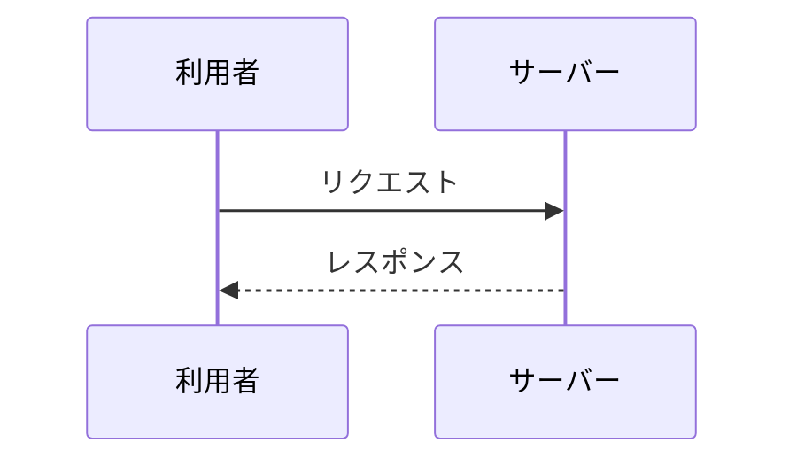

## Class
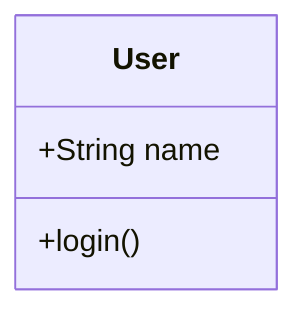

## ER
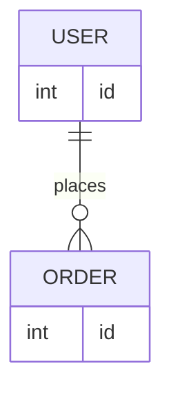
# 総合機能テスト

## 見出し

### h3

###### h6

####### h7

########## h10

## タスクリスト

- [x] Markdown読み込み
- [x] 表操作
- [ ] 追加テスト

## コード

```python
for i in range(5):
    print(f"item={i}")
```

## 表

| 項目 | 値 | 状態 |
|---|---|---|
| A | 100 | OK |
| B | 20 | NG |
| C | 300 | OK |

## Mermaid

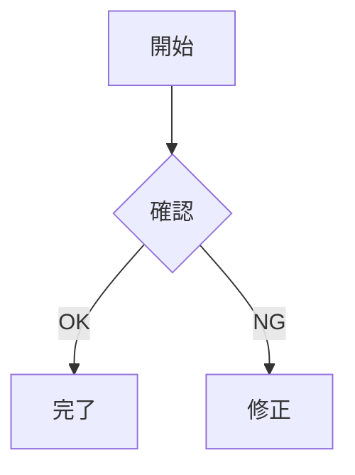

## 引用

> これは長時間閲覧用の技術文書を想定した引用です。

## リンク

[Markdown公式](https://daringfireball.net/projects/markdown/)

## 危険なHTML

<script>alert('実行されてはいけません');</script>


<a href="javascript:alert('実行されてはいけません')">危険なリンク</a>
# 表：コピー・CSV・列コピー総合テスト

## 長い列を含む表

各列の `⧉` ボタンで列単位コピーを試してください。
ソートや絞り込みを行ってからコピーすると、**現在表示されている順序・行だけ**が対象になることを確認してください。

| ID | 製品名 | カテゴリ | 説明 | 価格 | 在庫 | 更新日 |
|---:|---|---|---|---:|---:|---|
| 1 | Alpha Server | Hardware | 高負荷API向けのサーバー。<br>冗長構成に対応しています。 | 128000 | 12 | 2026-01-15 |
| 2 | Beta Gateway | Network | API Gateway製品。<br>認証・レート制限・監査ログを提供します。 | 86000 | 7 | 2026-02-20 |
| 3 | Gamma Console | Software | 管理者向けWebコンソール。<br>日本語UIに対応しています。 | 42000 | 35 | 2026-03-08 |
| 4 | Delta Agent | Software | 各サーバーに配置する監視エージェント。 | 18000 | 100 | 2026-04-10 |
| 5 | Epsilon Storage | Hardware | バックアップ用途の大容量ストレージ。 | 215000 | 4 | 2026-05-21 |
# 大量行テーブルテスト

100行以上の表を扱うケースを想定したテストです。縦スクロール、先頭行固定、絞り込み、ソートを確認してください。

| No | 名前 | 種別 | 数量 | ステータス | メモ |
|---:|---|---|---:|---|---|
| 1 | テスト項目 001 | DB | 7 | 確認中 | 行 1 の確認用データ。長めの説明を入れて折り返しも確認します。 |
| 2 | テスト項目 002 | WEB | 14 | 保留 | 行 2 の確認用データ。長めの説明を入れて折り返しも確認します。 |
| 3 | テスト項目 003 | JOB | 21 | 完了 | 行 3 の確認用データ。長めの説明を入れて折り返しも確認します。 |
| 4 | テスト項目 004 | API | 28 | 正常 | 行 4 の確認用データ。長めの説明を入れて折り返しも確認します。 |
| 5 | テスト項目 005 | DB | 35 | 確認中 | 行 5 の確認用データ。長めの説明を入れて折り返しも確認します。 |
| 6 | テスト項目 006 | WEB | 42 | 保留 | 行 6 の確認用データ。長めの説明を入れて折り返しも確認します。 |
| 7 | テスト項目 007 | JOB | 49 | 完了 | 行 7 の確認用データ。長めの説明を入れて折り返しも確認します。 |
| 8 | テスト項目 008 | API | 56 | 正常 | 行 8 の確認用データ。長めの説明を入れて折り返しも確認します。 |
| 9 | テスト項目 009 | DB | 63 | 確認中 | 行 9 の確認用データ。長めの説明を入れて折り返しも確認します。 |
| 10 | テスト項目 010 | WEB | 70 | 保留 | 行 10 の確認用データ。長めの説明を入れて折り返しも確認します。 |
| 11 | テスト項目 011 | JOB | 77 | 完了 | 行 11 の確認用データ。長めの説明を入れて折り返しも確認します。 |
| 12 | テスト項目 012 | API | 84 | 正常 | 行 12 の確認用データ。長めの説明を入れて折り返しも確認します。 |
| 13 | テスト項目 013 | DB | 91 | 確認中 | 行 13 の確認用データ。長めの説明を入れて折り返しも確認します。 |
| 14 | テスト項目 014 | WEB | 1 | 保留 | 行 14 の確認用データ。長めの説明を入れて折り返しも確認します。 |
| 15 | テスト項目 015 | JOB | 8 | 完了 | 行 15 の確認用データ。長めの説明を入れて折り返しも確認します。 |
| 16 | テスト項目 016 | API | 15 | 正常 | 行 16 の確認用データ。長めの説明を入れて折り返しも確認します。 |
| 17 | テスト項目 017 | DB | 22 | 確認中 | 行 17 の確認用データ。長めの説明を入れて折り返しも確認します。 |
| 18 | テスト項目 018 | WEB | 29 | 保留 | 行 18 の確認用データ。長めの説明を入れて折り返しも確認します。 |
| 19 | テスト項目 019 | JOB | 36 | 完了 | 行 19 の確認用データ。長めの説明を入れて折り返しも確認します。 |
| 20 | テスト項目 020 | API | 43 | 正常 | 行 20 の確認用データ。長めの説明を入れて折り返しも確認します。 |
| 21 | テスト項目 021 | DB | 50 | 確認中 | 行 21 の確認用データ。長めの説明を入れて折り返しも確認します。 |
| 22 | テスト項目 022 | WEB | 57 | 保留 | 行 22 の確認用データ。長めの説明を入れて折り返しも確認します。 |
| 23 | テスト項目 023 | JOB | 64 | 完了 | 行 23 の確認用データ。長めの説明を入れて折り返しも確認します。 |
| 24 | テスト項目 024 | API | 71 | 正常 | 行 24 の確認用データ。長めの説明を入れて折り返しも確認します。 |
| 25 | テスト項目 025 | DB | 78 | 確認中 | 行 25 の確認用データ。長めの説明を入れて折り返しも確認します。 |
| 26 | テスト項目 026 | WEB | 85 | 保留 | 行 26 の確認用データ。長めの説明を入れて折り返しも確認します。 |
| 27 | テスト項目 027 | JOB | 92 | 完了 | 行 27 の確認用データ。長めの説明を入れて折り返しも確認します。 |
| 28 | テスト項目 028 | API | 2 | 正常 | 行 28 の確認用データ。長めの説明を入れて折り返しも確認します。 |
| 29 | テスト項目 029 | DB | 9 | 確認中 | 行 29 の確認用データ。長めの説明を入れて折り返しも確認します。 |
| 30 | テスト項目 030 | WEB | 16 | 保留 | 行 30 の確認用データ。長めの説明を入れて折り返しも確認します。 |
| 31 | テスト項目 031 | JOB | 23 | 完了 | 行 31 の確認用データ。長めの説明を入れて折り返しも確認します。 |
| 32 | テスト項目 032 | API | 30 | 正常 | 行 32 の確認用データ。長めの説明を入れて折り返しも確認します。 |
| 33 | テスト項目 033 | DB | 37 | 確認中 | 行 33 の確認用データ。長めの説明を入れて折り返しも確認します。 |
| 34 | テスト項目 034 | WEB | 44 | 保留 | 行 34 の確認用データ。長めの説明を入れて折り返しも確認します。 |
| 35 | テスト項目 035 | JOB | 51 | 完了 | 行 35 の確認用データ。長めの説明を入れて折り返しも確認します。 |
| 36 | テスト項目 036 | API | 58 | 正常 | 行 36 の確認用データ。長めの説明を入れて折り返しも確認します。 |
| 37 | テスト項目 037 | DB | 65 | 確認中 | 行 37 の確認用データ。長めの説明を入れて折り返しも確認します。 |
| 38 | テスト項目 038 | WEB | 72 | 保留 | 行 38 の確認用データ。長めの説明を入れて折り返しも確認します。 |
| 39 | テスト項目 039 | JOB | 79 | 完了 | 行 39 の確認用データ。長めの説明を入れて折り返しも確認します。 |
| 40 | テスト項目 040 | API | 86 | 正常 | 行 40 の確認用データ。長めの説明を入れて折り返しも確認します。 |
| 41 | テスト項目 041 | DB | 93 | 確認中 | 行 41 の確認用データ。長めの説明を入れて折り返しも確認します。 |
| 42 | テスト項目 042 | WEB | 3 | 保留 | 行 42 の確認用データ。長めの説明を入れて折り返しも確認します。 |
| 43 | テスト項目 043 | JOB | 10 | 完了 | 行 43 の確認用データ。長めの説明を入れて折り返しも確認します。 |
| 44 | テスト項目 044 | API | 17 | 正常 | 行 44 の確認用データ。長めの説明を入れて折り返しも確認します。 |
| 45 | テスト項目 045 | DB | 24 | 確認中 | 行 45 の確認用データ。長めの説明を入れて折り返しも確認します。 |
| 46 | テスト項目 046 | WEB | 31 | 保留 | 行 46 の確認用データ。長めの説明を入れて折り返しも確認します。 |
| 47 | テスト項目 047 | JOB | 38 | 完了 | 行 47 の確認用データ。長めの説明を入れて折り返しも確認します。 |
| 48 | テスト項目 048 | API | 45 | 正常 | 行 48 の確認用データ。長めの説明を入れて折り返しも確認します。 |
| 49 | テスト項目 049 | DB | 52 | 確認中 | 行 49 の確認用データ。長めの説明を入れて折り返しも確認します。 |
| 50 | テスト項目 050 | WEB | 59 | 保留 | 行 50 の確認用データ。長めの説明を入れて折り返しも確認します。 |
| 51 | テスト項目 051 | JOB | 66 | 完了 | 行 51 の確認用データ。長めの説明を入れて折り返しも確認します。 |
| 52 | テスト項目 052 | API | 73 | 正常 | 行 52 の確認用データ。長めの説明を入れて折り返しも確認します。 |
| 53 | テスト項目 053 | DB | 80 | 確認中 | 行 53 の確認用データ。長めの説明を入れて折り返しも確認します。 |
| 54 | テスト項目 054 | WEB | 87 | 保留 | 行 54 の確認用データ。長めの説明を入れて折り返しも確認します。 |
| 55 | テスト項目 055 | JOB | 94 | 完了 | 行 55 の確認用データ。長めの説明を入れて折り返しも確認します。 |
| 56 | テスト項目 056 | API | 4 | 正常 | 行 56 の確認用データ。長めの説明を入れて折り返しも確認します。 |
| 57 | テスト項目 057 | DB | 11 | 確認中 | 行 57 の確認用データ。長めの説明を入れて折り返しも確認します。 |
| 58 | テスト項目 058 | WEB | 18 | 保留 | 行 58 の確認用データ。長めの説明を入れて折り返しも確認します。 |
| 59 | テスト項目 059 | JOB | 25 | 完了 | 行 59 の確認用データ。長めの説明を入れて折り返しも確認します。 |
| 60 | テスト項目 060 | API | 32 | 正常 | 行 60 の確認用データ。長めの説明を入れて折り返しも確認します。 |
| 61 | テスト項目 061 | DB | 39 | 確認中 | 行 61 の確認用データ。長めの説明を入れて折り返しも確認します。 |
| 62 | テスト項目 062 | WEB | 46 | 保留 | 行 62 の確認用データ。長めの説明を入れて折り返しも確認します。 |
| 63 | テスト項目 063 | JOB | 53 | 完了 | 行 63 の確認用データ。長めの説明を入れて折り返しも確認します。 |
| 64 | テスト項目 064 | API | 60 | 正常 | 行 64 の確認用データ。長めの説明を入れて折り返しも確認します。 |
| 65 | テスト項目 065 | DB | 67 | 確認中 | 行 65 の確認用データ。長めの説明を入れて折り返しも確認します。 |
| 66 | テスト項目 066 | WEB | 74 | 保留 | 行 66 の確認用データ。長めの説明を入れて折り返しも確認します。 |
| 67 | テスト項目 067 | JOB | 81 | 完了 | 行 67 の確認用データ。長めの説明を入れて折り返しも確認します。 |
| 68 | テスト項目 068 | API | 88 | 正常 | 行 68 の確認用データ。長めの説明を入れて折り返しも確認します。 |
| 69 | テスト項目 069 | DB | 95 | 確認中 | 行 69 の確認用データ。長めの説明を入れて折り返しも確認します。 |
| 70 | テスト項目 070 | WEB | 5 | 保留 | 行 70 の確認用データ。長めの説明を入れて折り返しも確認します。 |
| 71 | テスト項目 071 | JOB | 12 | 完了 | 行 71 の確認用データ。長めの説明を入れて折り返しも確認します。 |
| 72 | テスト項目 072 | API | 19 | 正常 | 行 72 の確認用データ。長めの説明を入れて折り返しも確認します。 |
| 73 | テスト項目 073 | DB | 26 | 確認中 | 行 73 の確認用データ。長めの説明を入れて折り返しも確認します。 |
| 74 | テスト項目 074 | WEB | 33 | 保留 | 行 74 の確認用データ。長めの説明を入れて折り返しも確認します。 |
| 75 | テスト項目 075 | JOB | 40 | 完了 | 行 75 の確認用データ。長めの説明を入れて折り返しも確認します。 |
| 76 | テスト項目 076 | API | 47 | 正常 | 行 76 の確認用データ。長めの説明を入れて折り返しも確認します。 |
| 77 | テスト項目 077 | DB | 54 | 確認中 | 行 77 の確認用データ。長めの説明を入れて折り返しも確認します。 |
| 78 | テスト項目 078 | WEB | 61 | 保留 | 行 78 の確認用データ。長めの説明を入れて折り返しも確認します。 |
| 79 | テスト項目 079 | JOB | 68 | 完了 | 行 79 の確認用データ。長めの説明を入れて折り返しも確認します。 |
| 80 | テスト項目 080 | API | 75 | 正常 | 行 80 の確認用データ。長めの説明を入れて折り返しも確認します。 |
| 81 | テスト項目 081 | DB | 82 | 確認中 | 行 81 の確認用データ。長めの説明を入れて折り返しも確認します。 |
| 82 | テスト項目 082 | WEB | 89 | 保留 | 行 82 の確認用データ。長めの説明を入れて折り返しも確認します。 |
| 83 | テスト項目 083 | JOB | 96 | 完了 | 行 83 の確認用データ。長めの説明を入れて折り返しも確認します。 |
| 84 | テスト項目 084 | API | 6 | 正常 | 行 84 の確認用データ。長めの説明を入れて折り返しも確認します。 |
| 85 | テスト項目 085 | DB | 13 | 確認中 | 行 85 の確認用データ。長めの説明を入れて折り返しも確認します。 |
| 86 | テスト項目 086 | WEB | 20 | 保留 | 行 86 の確認用データ。長めの説明を入れて折り返しも確認します。 |
| 87 | テスト項目 087 | JOB | 27 | 完了 | 行 87 の確認用データ。長めの説明を入れて折り返しも確認します。 |
| 88 | テスト項目 088 | API | 34 | 正常 | 行 88 の確認用データ。長めの説明を入れて折り返しも確認します。 |
| 89 | テスト項目 089 | DB | 41 | 確認中 | 行 89 の確認用データ。長めの説明を入れて折り返しも確認します。 |
| 90 | テスト項目 090 | WEB | 48 | 保留 | 行 90 の確認用データ。長めの説明を入れて折り返しも確認します。 |
| 91 | テスト項目 091 | JOB | 55 | 完了 | 行 91 の確認用データ。長めの説明を入れて折り返しも確認します。 |
| 92 | テスト項目 092 | API | 62 | 正常 | 行 92 の確認用データ。長めの説明を入れて折り返しも確認します。 |
| 93 | テスト項目 093 | DB | 69 | 確認中 | 行 93 の確認用データ。長めの説明を入れて折り返しも確認します。 |
| 94 | テスト項目 094 | WEB | 76 | 保留 | 行 94 の確認用データ。長めの説明を入れて折り返しも確認します。 |
| 95 | テスト項目 095 | JOB | 83 | 完了 | 行 95 の確認用データ。長めの説明を入れて折り返しも確認します。 |
| 96 | テスト項目 096 | API | 90 | 正常 | 行 96 の確認用データ。長めの説明を入れて折り返しも確認します。 |
| 97 | テスト項目 097 | DB | 0 | 確認中 | 行 97 の確認用データ。長めの説明を入れて折り返しも確認します。 |
| 98 | テスト項目 098 | WEB | 7 | 保留 | 行 98 の確認用データ。長めの説明を入れて折り返しも確認します。 |
| 99 | テスト項目 099 | JOB | 14 | 完了 | 行 99 の確認用データ。長めの説明を入れて折り返しも確認します。 |
| 100 | テスト項目 100 | API | 21 | 正常 | 行 100 の確認用データ。長めの説明を入れて折り返しも確認します。 |
| 101 | テスト項目 101 | DB | 28 | 確認中 | 行 101 の確認用データ。長めの説明を入れて折り返しも確認します。 |
| 102 | テスト項目 102 | WEB | 35 | 保留 | 行 102 の確認用データ。長めの説明を入れて折り返しも確認します。 |
| 103 | テスト項目 103 | JOB | 42 | 完了 | 行 103 の確認用データ。長めの説明を入れて折り返しも確認します。 |
| 104 | テスト項目 104 | API | 49 | 正常 | 行 104 の確認用データ。長めの説明を入れて折り返しも確認します。 |
| 105 | テスト項目 105 | DB | 56 | 確認中 | 行 105 の確認用データ。長めの説明を入れて折り返しも確認します。 |
| 106 | テスト項目 106 | WEB | 63 | 保留 | 行 106 の確認用データ。長めの説明を入れて折り返しも確認します。 |
| 107 | テスト項目 107 | JOB | 70 | 完了 | 行 107 の確認用データ。長めの説明を入れて折り返しも確認します。 |
| 108 | テスト項目 108 | API | 77 | 正常 | 行 108 の確認用データ。長めの説明を入れて折り返しも確認します。 |
| 109 | テスト項目 109 | DB | 84 | 確認中 | 行 109 の確認用データ。長めの説明を入れて折り返しも確認します。 |
| 110 | テスト項目 110 | WEB | 91 | 保留 | 行 110 の確認用データ。長めの説明を入れて折り返しも確認します。 |
| 111 | テスト項目 111 | JOB | 1 | 完了 | 行 111 の確認用データ。長めの説明を入れて折り返しも確認します。 |
| 112 | テスト項目 112 | API | 8 | 正常 | 行 112 の確認用データ。長めの説明を入れて折り返しも確認します。 |
| 113 | テスト項目 113 | DB | 15 | 確認中 | 行 113 の確認用データ。長めの説明を入れて折り返しも確認します。 |
| 114 | テスト項目 114 | WEB | 22 | 保留 | 行 114 の確認用データ。長めの説明を入れて折り返しも確認します。 |
| 115 | テスト項目 115 | JOB | 29 | 完了 | 行 115 の確認用データ。長めの説明を入れて折り返しも確認します。 |
| 116 | テスト項目 116 | API | 36 | 正常 | 行 116 の確認用データ。長めの説明を入れて折り返しも確認します。 |
| 117 | テスト項目 117 | DB | 43 | 確認中 | 行 117 の確認用データ。長めの説明を入れて折り返しも確認します。 |
| 118 | テスト項目 118 | WEB | 50 | 保留 | 行 118 の確認用データ。長めの説明を入れて折り返しも確認します。 |
| 119 | テスト項目 119 | JOB | 57 | 完了 | 行 119 の確認用データ。長めの説明を入れて折り返しも確認します。 |
| 120 | テスト項目 120 | API | 64 | 正常 | 行 120 の確認用データ。長めの説明を入れて折り返しも確認します。 |
# 表：ソート・絞り込みテスト

この表では、**昇順・降順・解除**、絞り込み、列コピーをまとめて確認できます。

- 数値
- 日本語文字列
- 日付
- 同じ値
- 空欄
- 長い文章

| ID | 氏名 | 部門 | 年齢 | スコア | 入社日 | 状態 | 備考 |
|---:|---|---|---:|---:|---|---|---|
| 101 | 佐藤 | 開発 | 28 | 92 | 2024-04-01 | 有効 | API担当。設計レビューも担当します。 |
| 102 | 鈴木 | 営業 | 35 | 76 | 2022-10-15 | 有効 | 顧客との調整を担当。 |
| 103 | 高橋 | 開発 | 31 | 88 | 2023-01-10 | 休止 | フロントエンド担当。 |
| 104 | 田中 | QA | 42 | 95 | 2020-06-01 | 有効 | 自動テスト基盤を管理。 |
| 105 | 伊藤 | 開発 | 24 | 76 | 2025-04-01 | 有効 | 新人研修中。 |
| 106 | 渡辺 | インフラ | 39 | 88 | 2021-09-20 | 有効 | クラウド環境を管理。 |
| 107 | 山本 | 営業 | 45 | 64 | 2019-03-12 | 休止 | 引き継ぎ中。 |
| 108 | 中村 | QA | 29 | 95 | 2024-07-01 | 有効 | テスト設計担当。 |
| 109 | 小林 | 開発 | 33 | 92 | 2022-02-14 | 有効 | バックエンド担当。 |
| 110 | 加藤 | インフラ | 51 | 81 | 2018-11-05 | 有効 | 運用責任者。 |
| 111 | 吉田 | 開発 | 27 | 88 | 2025-01-06 | 有効 | モバイル担当。 |
| 112 | 山田 | QA | 36 | 76 | 2021-05-17 | 有効 | 品質改善担当。 |
| 113 | 井上 | 営業 | 30 | 64 | 2023-09-01 | 有効 | 法人営業。 |
| 114 | 木村 | 開発 | 41 | 99 | 2017-12-11 | 有効 | アーキテクト。 |
| 115 | 林 |  | 26 |  | 2025-05-12 | 保留 | 部門未確定。 |
# 注文管理システム テーブル定義書

## 1. 概要

本ドキュメントは、次世代ECプラットフォームにおける「注文管理システム（OMS）」のデータベーステーブル定義および関連設計をまとめた仕様書です。
本システムは、顧客からの注文受付から決済、在庫引当、出荷手手配、アフターサポートまでのデータ一元管理を担当します。

## 2. テーブル一覧 (Table Overview)

本システムで管理する全50テーブルの一覧です。

| テーブルID | テーブル名 (物理名) | 論理名 | 区分 | レコード件数見込み | ステータス | 担当チーム | 最終更新日 | 
 | ----- | ----- | ----- | ----- | ----- | ----- | ----- | ----- | 
| TBL-001 | `t_orders` | 注文ヘッダ | トランザクション | 10,000,000+ | 確定 | 注文チーム | 2026/08/15 | 
| TBL-002 | `m_users` | 会員基本情報 | マスタ | 1,000,000+ | 確定 | ユーザーチーム | 2026/08/10 | 
| TBL-003 | `t_order_items` | 注文明細 | トランザクション | 30,000,000+ | 確定 | 注文チーム | 2026/08/15 | 
| TBL-004 | `m_products` | 商品基本情報 | マスタ | 500,000 | 確定 | 商品チーム | 2026/07/20 | 
| TBL-005 | `t_payments` | 決済履歴 | トランザクション | 12,000,000+ | 確定 | 決済チーム | 2026/08/18 | 
| TBL-006 | `m_payment_methods` | 決済種別マスタ | マスタ | 20 | 確定 | 決済チーム | 2026/05/11 | 
| TBL-007 | `t_shipments` | 出荷指示データ | トランザクション | 8,000,000+ | レビュー中 | 物流チーム | 2026/09/01 | 
| TBL-008 | `m_warehouses` | 倉庫マスタ | マスタ | 50 | 確定 | 物流チーム | 2026/06/15 | 
| TBL-009 | `t_inventory` | 在庫変動履歴 | トランザクション | 50,000,000+ | レビュー中 | 物流チーム | 2026/09/02 | 
| TBL-010 | `m_categories` | 商品カテゴリ | マスタ | 1,500 | 確定 | 商品チーム | 2026/06/01 | 
| TBL-011 | `m_brands` | ブランドマスタ | マスタ | 800 | 確定 | 商品チーム | 2026/06/05 | 
| TBL-012 | `t_coupons` | クーポン発行履歴 | トランザクション | 2,000,000+ | 確定 | 販促チーム | 2026/07/29 | 
| TBL-013 | `m_coupon_templates` | クーポン原券マスタ | マスタ | 300 | 確定 | 販促チーム | 2026/07/25 | 
| TBL-014 | `m_user_ranks` | 会員ランクマスタ | マスタ | 10 | 確定 | ユーザーチーム | 2026/04/01 | 
| TBL-015 | `t_cart` | カート情報 | 一時データ | 500,000 | 確定 | UI/UXチーム | 2026/08/12 | 
| TBL-016 | `t_cart_items` | カート投入商品 | 一時データ | 1,500,000 | 確定 | UI/UXチーム | 2026/08/12 | 
| TBL-017 | `m_suppliers` | 仕入先マスタ | マスタ | 3,000 | 確定 | 調達チーム | 2026/04/10 | 
| TBL-018 | `t_purchase_orders` | 発注データ | トランザクション | 100,000 | 作成中 | 調達チーム | 2026/09/10 | 
| TBL-019 | `m_product_tags` | 商品タグマスタ | マスタ | 5,000 | 確定 | 商品チーム | 2026/06/18 | 
| TBL-020 | `t_returns` | 返品リクエスト | トランザクション | 50,000 | 確定 | CSチーム | 2026/08/01 | 
| TBL-021 | `m_return_reasons` | 返品理由マスタ | マスタ | 15 | 確定 | CSチーム | 2026/03/15 | 
| TBL-022 | `t_reviews` | 商品レビュー | コンテンツ | 3,000,000+ | 確定 | メディアチーム | 2026/07/11 | 
| TBL-023 | `m_review_badges` | レビューバッジマスタ | マスタ | 25 | 作成中 | メディアチーム | 2026/09/08 | 
| TBL-024 | `t_audit_logs` | システム操作ログ | ログ | 100,000,000+ | 確定 | 基盤チーム | 2026/08/30 | 
| TBL-025 | `m_tax_rates` | 税率マスタ | マスタ | 10 | 確定 | 会計チーム | 2026/01/05 | 
| TBL-026 | `m_currencies` | 通貨マスタ | マスタ | 50 | 確定 | 会計チーム | 2026/01/10 | 
| TBL-027 | `t_invoices` | 請求・領収データ | トランザクション | 10,000,000+ | 作成中 | 会計チーム | 2026/09/12 | 
| TBL-028 | `m_shipping_carriers` | 配送業者マスタ | マスタ | 12 | 確定 | 物流チーム | 2026/05/20 | 
| TBL-029 | `m_shipping_rates` | 送料設定マスタ | マスタ | 500 | レビュー中 | 物流チーム | 2026/08/28 | 
| TBL-030 | `t_user_addresses` | 配送先住所録 | マスタ | 2,500,000 | 確定 | ユーザーチーム | 2026/08/05 | 
| TBL-031 | `t_notifications` | ユーザー通知履歴 | トランザクション | 20,000,000+ | 廃止予定 | 基盤チーム | 2026/06/30 | 
| TBL-032 | `m_notification_templates` | 通知テンプレート | マスタ | 150 | 確定 | 基盤チーム | 2026/07/02 | 
| TBL-033 | `m_campaigns` | キャンペーン設定 | マスタ | 200 | 確定 | 販促チーム | 2026/08/22 | 
| TBL-034 | `t_points_history` | ポイント増減履歴 | トランザクション | 40,000,000+ | 確定 | 販促チーム | 2026/08/19 | 
| TBL-035 | `m_point_rules` | ポイント付与条件マスタ | マスタ | 30 | 確定 | 販促チーム | 2026/05/14 | 
| TBL-036 | `t_api_access_logs` | 外部連携ログ | ログ | 500,000,000+ | レビュー中 | 基盤チーム | 2026/09/05 | 
| TBL-037 | `m_system_config` | システム設定値 | システム | 100 | 確定 | 基盤チーム | 2026/02/01 | 
| TBL-038 | `t_temp_registrations` | 仮会員登録 | 一時データ | 10,000 | 確定 | ユーザーチーム | 2026/07/01 | 
| TBL-039 | `m_regions` | 都道府県・地域マスタ | マスタ | 47 | 確定 | 共通チーム | 2025/11/01 | 
| TBL-040 | `m_zip_codes` | 郵便番号マスタ | マスタ | 150,000 | 確定 | 共通チーム | 2026/03/01 | 
| TBL-041 | `m_store_locations` | 実店舗マスタ | マスタ | 120 | レビュー中 | OMOチーム | 2026/08/30 | 
| TBL-042 | `t_store_stock` | 店舗別在庫 | トランザクション | 5,000,000 | 作成中 | OMOチーム | 2026/09/11 | 
| TBL-043 | `m_gift_wrappings` | ギフト包装マスタ | マスタ | 20 | 確定 | 物流チーム | 2026/04/18 | 
| TBL-044 | `t_gift_messages` | ギフトメッセージデータ | トランザクション | 300,000 | 確定 | 注文チーム | 2026/07/15 | 
| TBL-045 | `m_promotions` | プロモーションマスタ | マスタ | 80 | 作成中 | 販促チーム | 2026/09/01 | 
| TBL-046 | `m_vendors` | 委託先事業者マスタ | マスタ | 40 | 確定 | 調達チーム | 2026/02/20 | 
| TBL-047 | `t_vendor_payouts` | 委託先支払データ | トランザクション | 15,000 | レビュー中 | 会計チーム | 2026/09/03 | 
| TBL-048 | `m_blacklists` | 不正ユーザー判定マスタ | マスタ | 1,200 | 確定 | セキュリティ | 2026/08/11 | 
| TBL-049 | `t_security_alerts` | セキュリティ検知ログ | ログ | 2,000,000 | 確定 | セキュリティ | 2026/08/29 | 
| TBL-050 | `m_faq_categories` | FAQカテゴリマスタ | マスタ | 30 | 確定 | CSチーム | 2026/05/01 | 

## 3. 主要テーブル詳細定義

### 3.1 注文ヘッダ (`t_orders`)

顧客が確定させた注文の基本情報を保持するテーブルです。

* **テーブル名**: `t_orders`

* **主キー**: `order_id`

* **文字コード**: UTF-8MB4

| カラムID | 物理名 | 論理名 | データ型 | NULL許容 | 初期値 | 制約 / 備考 | 
 | ----- | ----- | ----- | ----- | ----- | ----- | ----- | 
| COL-001 | `order_id` | 注文ID | BIGINT | NO | Auto Increment | 主キー, 内部識別子 | 
| COL-002 | `order_code` | 注文番号 | VARCHAR(32) | NO | \- | UNIQUE, 顧客用参照コード | 
| COL-003 | `user_id` | ユーザーID | BIGINT | NO | \- | FK (`m_users.user_id`) | 
| COL-004 | `order_status` | 注文ステータス | VARCHAR(16) | NO | 'PENDING' | PENDING, PAID, SHIPPED, CANCELED | 
| COL-005 | `total_amount` | 注文合計金額 | DECIMAL(12,2) | NO | 0.00 | 税込合計額 | 
| COL-006 | `tax_amount` | 消費税額 | DECIMAL(10,2) | NO | 0.00 | 内消費税額 | 
| COL-007 | `shipping_fee` | 送料 | DECIMAL(8,2) | NO | 0.00 | \- | 
| COL-008 | `discount_amount` | 割引額 | DECIMAL(10,2) | NO | 0.00 | クーポン・ポイント割引適用額 | 
| COL-009 | `payment_method_id` | 決済手段ID | INT | NO | \- | FK (`m_payment_methods.payment_id`) | 
| COL-010 | `shipping_address_id` | 配送先ID | BIGINT | YES | NULL | FK (`t_user_addresses.address_id`) | 
| COL-011 | `ordered_at` | 注文日時 | DATETIME | NO | CURRENT_TIMESTAMP | \- | 
| COL-012 | `updated_at` | 最終更新日時 | DATETIME | YES | NULL | ON UPDATE CURRENT_TIMESTAMP | 
| COL-013 | `is_deleted` | 削除フラグ | TINYINT(1) | NO | 0 | 0:有効, 1:論理削除済み | 

### 3.2 注文明細 (`t_order_items`)

1つの注文に含まれる個々の商品明細データを保持します。

* **テーブル名**: `t_order_items`

* **主キー**: `order_item_id`

* **文字コード**: UTF-8MB4

| カラムID | 物理名 | 論理名 | データ型 | NULL許容 | 初期値 | 制約 / 備考 | 
 | ----- | ----- | ----- | ----- | ----- | ----- | ----- | 
| COL-001 | `order_item_id` | 注文明細ID | BIGINT | NO | Auto Increment | 主キー | 
| COL-002 | `order_id` | 注文ID | BIGINT | NO | \- | FK (`t_orders.order_id`) | 
| COL-003 | `product_id` | 商品ID | BIGINT | NO | \- | FK (`m_products.product_id`) | 
| COL-004 | `product_sku` | 商品SKU | VARCHAR(64) | NO | \- | 購入時点のSKU保持 | 
| COL-005 | `product_name` | 商品名 | VARCHAR(255) | NO | \- | 購入時点の商品名保持 | 
| COL-006 | `unit_price` | 単価 | DECIMAL(10,2) | NO | \- | 購入時点の適用単価 | 
| COL-007 | `quantity` | 数量 | INT | NO | 1 | \- | 
| COL-008 | `subtotal_price` | 小計 | DECIMAL(12,2) | NO | \- | `unit_price` \* `quantity` | 
| COL-009 | `tax_rate_id` | 適用税率ID | INT | NO | \- | FK (`m_tax_rates.tax_rate_id`) | 

## 4. 共通運用ルール・命名規約

1. **テーブル命名規則**

   * マスタテーブル: `m_` から始まるスネークケース (`m_products` 等)

   * トランザクションテーブル: `t_` から始まるスネークケース (`t_orders` 等)

2. **共通カラム**

   * 全ての永続化テーブルは原則として `created_at`（作成日時）および `updated_at`（更新日時）カラムを含めること。

3. **論理削除ポリシー**

   * 個人情報や注文履歴を含むトランザクションデータの物理削除は禁止し、`is_deleted` フラグによる論理削除を実施する。

# 技術詳細設計書：マイクロサービスECプラットフォーム

| メタデータ | 詳細内容 |
| --- | --- |
| **ドキュメントバージョン** | 1.2.0 |
| **ステータス** | 承認済み (Approved) |
| **作成者** | プリンシパル・システムアーキテクト |
| **対象リリース** | 2026年 第4四半期 |

---

## 1. エグゼクティブ・サマリー（概要）

本技術設計書（TDD）は、次世代ECマイクロサービスプラットフォームのシステムアーキテクチャ、統合パターン、およびデータ永続化モデルを定義するものです。本システムは、高トラフィックなトランザクション処理に耐えうる設計となっており、分散システム間における複数パーティのイベントフロー、並びにクラウドネイティブなマイクロサービス間におけるレジリエンス（障害復旧性）の高いリカバリ機構を備えています。

---

## 2. エンドツーエンド・システムシーケンス図

以下のシーケンス図は、システム全体に関わるリクエストのライフサイクルを示しています。ユーザーの新規アカウント登録、商品検索から、分散環境下での複雑な決済トランザクション処理、外部決済ゲートウェイ連携、非同期での在庫ロック、および配送指示（出荷処理）までの一連の流れを網羅しています。


---

## 3. ハイレベル・システムアーキテクチャ概要

本システムは、Elastic Kubernetes Service (EKS) クラスター上で稼働するイベント駆動型マイクロサービスアーキテクチャを採用しています。

```
                                  +-----------------------+
                                  |   API Gateway (Edge)  |
                                  +-----------+-----------+
                                              |
      +-------------------+-------------------+-------------------+-------------------+
      |                   |                   |                   |                   |
+-----+-----+       +-----+-----+       +-----+-----+       +-----+-----+       +-----+-----+
| 認証・認可  |       | カタログ  |       | カート    |       | 注文管理  |       | 在庫・倉庫 |
| サービス  |       | サービス  |       | サービス  |       | (OMS)     |       | サービス  |
+-----------+       +-----------+       +-----------+       +-----------+       +-----------+

```

### 主要コンポーネント

* **API Gateway / 境界ルーティング**: TLS終端、レート制限（Token Bucketアルゴリズム）、認証トークン検証、およびリクエストのルーティングを担当。
* **注文管理サービス (OMS)**: 分散処理における Saga オーケストレーターとして機能し、一連の注文トランザクションを制御。
* **在庫・倉庫管理サービス**: 在庫割り当て、TTL（有効期限）付きロックによる一時保持、および倉庫側システムとの同期を担当。
* **外部連携インターフェース**: 外部決済ゲートウェイ（Stripe / Adyenなど）、通知配信基盤（Twilio / SendGridなど）、および宅配業者APIとの連携。

---

## 4. 主要な非機能要件 (NFRs)

* **性能・レイテンシ (Performance & Latency)**:
* 参照系API：P95レスポンスタイム < 200ms
* 更新系（決済処理）API：P99レスポンスタイム < 1,200ms


* **可用性 (Availability)**:
* マルチリージョン構成（Active-Passive）により、年間 99.99% の稼働率を目標とする。


* **データ整合性 (Data Consistency)**:
* カタログインデックスおよび通知サービスは **結果的整合性 (Eventual Consistency)** を許容。
* 注文・決済・在庫割り当てについては、Sagaパターンの補償トランザクションを用いて **厳密なトランザクション整合性** を保持。


---


# Markdown 基本要素テスト

## 見出し

### 階層

通常の文章、**太字**、*斜体*、~~取り消し~~、`inline code`。

- 箇条書き
  - ネスト
- [x] 完了
- [ ] 未完了

1. 番号付き
2. 2番目

> 引用テキストです。

---

[ローカルビューアー](index.html)


```python
for i in range(5):
    print(i)
```

## 危険なHTML

<script>alert("XSS")</script>


<a href="javascript:alert('XSS')">危険なリンク</a>

# Markdown Viewer サンプル設計書

## 1. 概要
この文書は日本語の技術文書を長時間閲覧するためのサンプルです。表、コード、図、タスク、引用などをまとめています。

### 1.1 深い見出し
#### 1.1.1 設計方針
##### 1.1.1.1 詳細
###### 1.1.1.1.1 最深部

## 2. タスク
- [x] Markdown読み込み
- [x] 目次生成
- [ ] 完全なMermaid構文互換

> 技術文書は「読む」ことが主目的なので、装飾よりも情報密度と視認性を優先します。

[Markdown公式サイト](https://www.markdownguide.org/)

## 3. 長い表
| ID | 項目 | 担当 | 状態 | 説明 | API | 備考 |
|---|---|---|---|---|---|---|
| 001 | 認証基盤 | Backend | 完了 | 利用者の認証とセッション管理を担当するコンポーネントです。長い文章が入ってもセル内で適切に折り返します。 | `/api/v1/auth/login` | 固定列の確認 |
| 002 | 文書管理 | Frontend | 進行中 | Markdown文書を読み込み、目次やコード、表を表示します。 | `/api/v1/documents` | 横幅確認 |
| 003 | 検索 | Platform | 未着手 | 大量の文書を対象に検索し、現在位置を分かりやすく表示する機能です。 | `/api/v1/search` | 表示設定 |
| 004 | 監査ログ | Security | 完了 | 操作履歴を保存し、障害調査や監査に利用します。 | `/api/v1/audit` | 先頭行固定 |
| 005 | エクスポート | Backend | 進行中 | CSVやテキストとして情報を取り出すための機能です。 | `/api/v1/export` | 両方固定 |
| 006 | 設定 | Frontend | 完了 | テーマ、文字サイズ、行間、本文幅などをローカルに保存します。 | `/api/v1/settings` | LocalStorage |
| 007 | 通知 | Platform | 未着手 | エラーや完了状態を短い通知で知らせます。 | `/api/v1/notify` | a11y |

## 4. Mermaid
### 4.1 Flowchart


### 4.2 Sequence
```mermaid
sequenceDiagram
    User->>Viewer: ファイルを選択
    Viewer->>Parser: Markdownを解析
    Parser-->>Viewer: HTML
    Viewer-->>User: 文書を表示
```

### 4.3 ER
```mermaid
erDiagram
    USER ||--o{ DOCUMENT : owns
    DOCUMENT ||--o{ REVISION : has
```

### 4.4 Class
```mermaid
classDiagram
    class Viewer
    class Renderer
    Viewer --> Renderer
```

## 5. コード
```javascript
function loadMarkdown(file) {
  return file.text().then(renderMarkdown);
}
```

```python
def hello(name):
    return f"Hello, {name}!"
```

## 6. 危険なHTMLの確認
以下は**実行されてはいけない**サンプルです。

<script>alert('XSS')</script>

<a href="javascript:alert('XSS')">危険なリンク</a>

## 7. 横幅確認用の表
| 列1 | 列2 | 列3 | 列4 | 列5 | 列6 | 列7 | 列8 | 列9 | 列10 |
|---|---|---|---|---|---|---|---|---|---|
| AAAAAAAAAAAAAAAAAAAAA | B | C | D | E | F | G | H | I | J |
| 長いセル | 長いセル | 長いセル | 長いセル | 長いセル | 長いセル | 長いセル | 長いセル | 長いセル | 長いセル |
| 先頭列固定を試す | 100 | 200 | 300 | 400 | 500 | 600 | 700 | 800 | 900 |

## 8. まとめ
表のツールバーから先頭行・先頭列固定、列幅変更、表サイズ変更、CSV出力、コピーを試してください。

# Mermaid テスト

## Flowchart

```mermaid
flowchart TD
    A[開始] --> B{認証済み？}
    B -->|Yes| C[ダッシュボード]
    B -->|No| D[ログイン]
    D --> C
```

## Graph

```mermaid
graph LR
    A[API] --> B[Service]
    B --> C[(Database)]
```

## Wide Flowchart

横方向に長い図。拡大しても横スクロールバーを使わず、図を掴んで移動して確認できます。

```mermaid
flowchart LR
    A[利用者] --> B[Webブラウザ]
    B --> C[認証ゲートウェイ]
    C --> D[API Gateway]
    D --> E[ユーザーサービス]
    E --> F[注文サービス]
    F --> G[在庫サービス]
    G --> H[決済サービス]
    H --> I[通知サービス]
    I --> J[監査ログ]
    J --> K[(Database)]
    E --> L[(User DB)]
    F --> M[(Order DB)]
    G --> N[(Inventory DB)]
    H --> O[(Payment DB)]
    I --> P[(Message Queue)]
```

## Long Sequence Diagram

横にも縦にも長いシーケンス図。枠をリサイズし、図をドラッグして各部分を確認するテスト用です。

```mermaid
sequenceDiagram
    autonumber
    actor User as 利用者
    participant Browser as ブラウザ
    participant Gateway as API Gateway
    participant Auth as 認証サービス
    participant UserSvc as ユーザーサービス
    participant OrderSvc as 注文サービス
    participant Stock as 在庫サービス
    participant Payment as 決済サービス
    participant Notify as 通知サービス
    participant Queue as メッセージキュー
    participant Audit as 監査ログ
    participant UserDB as ユーザーDB
    participant OrderDB as 注文DB
    participant StockDB as 在庫DB

    User->>Browser: 商品一覧を表示
    Browser->>Gateway: GET /products
    Gateway->>Auth: アクセストークン検証
    Auth-->>Gateway: 検証OK
    Gateway->>Stock: 商品在庫取得
    Stock->>StockDB: SELECT products
    StockDB-->>Stock: 商品・在庫情報
    Stock-->>Gateway: 商品一覧
    Gateway-->>Browser: 200 OK
    Browser-->>User: 商品一覧表示

    User->>Browser: 注文を確定
    Browser->>Gateway: POST /orders
    Gateway->>Auth: 権限確認
    Auth->>UserSvc: ユーザー情報取得
    UserSvc->>UserDB: SELECT user
    UserDB-->>UserSvc: ユーザー情報
    UserSvc-->>Auth: 利用者確認
    Auth-->>Gateway: 注文可能
    Gateway->>OrderSvc: 注文作成
    OrderSvc->>Stock: 在庫確保
    Stock->>StockDB: UPDATE stock
    StockDB-->>Stock: 更新完了
    Stock-->>OrderSvc: 在庫確保完了
    OrderSvc->>OrderDB: INSERT order
    OrderDB-->>OrderSvc: 注文ID
    OrderSvc->>Payment: 決済要求
    Payment-->>OrderSvc: 決済成功
    OrderSvc->>Queue: 注文確定イベント
    Queue->>Notify: 通知イベント配送
    Notify-->>User: 注文完了通知
    OrderSvc->>Audit: 操作ログ記録
    Audit-->>OrderSvc: 記録完了
    OrderSvc-->>Gateway: 注文完了
    Gateway-->>Browser: 201 Created
    Browser-->>User: 注文完了画面

    Note over User,Audit: 長い図をドラッグして各領域を確認する
```

## ER Diagram

```mermaid
erDiagram
    USER ||--o{ ORDER : places
    ORDER ||--|{ ITEM : contains
```

## Class Diagram

```mermaid
classDiagram
    class User
    class Order
    User <|-- Order
```

## State Diagram

```mermaid
stateDiagram-v2
    A --> B
    B --> C
```
# Markdown Viewer 表・レイアウト総合テスト

このファイルは、**表の改行・大量行・横幅・固定・リサイズ**を重点的に確認するためのテストデータです。

## 1. 表セル内の改行

Markdown表ではセル内に物理的な改行を入れると次の行として扱われるため、一般的なGFMと同様に `<br>` を使います。

| ID | 項目 | 詳細 |
|---:|---|---|
| 1 | 改行1 | 1行目<br>2行目<br>3行目 |
| 2 | 長文+改行 | 設計上の注意点です。<br>入力値を検証してください。<br>エラー時は画面を停止させず通知します。 |
| 3 | 箇条書き風 | ・認証<br>・認可<br>・監査ログ |
| 4 | コード風 | `foo()` を呼び出す<br>戻り値を確認する<br>失敗なら再試行する |

## 2. 先頭列固定テスト

| ID | サービス名 | 担当 | ステータス | 更新日 | 備考 |
|---:|---|---|---|---|---|
| 001 | 認証サービス | Platform | 稼働中 | 2026-09-01 | OAuth / セッション管理を担当 |
| 002 | API Gateway | Platform | 稼働中 | 2026-09-02 | 外部APIへの入口。レート制限あり |
| 003 | 注文サービス | Commerce | 改修中 | 2026-09-03 | トランザクション境界を整理中 |
| 004 | 決済サービス | Commerce | 稼働中 | 2026-09-04 | 決済プロバイダとの接続を管理 |
| 005 | 通知サービス | Communication | 稼働中 | 2026-09-05 | メール・プッシュ通知を非同期送信 |

## 3. 先頭行固定 + 横幅テスト

| ID | 非常に長い列名：ユーザー要求の背景と技術的制約 | 入力仕様 | 出力仕様 | エラー処理 | 備考 |
|---:|---|---|---|---|---|
| 1 | 横幅の広い列を意図的に作っています。列幅変更ハンドルをドラッグしてください。 | UTF-8 / JSON | JSON | エラーコードを返す | 長い文章でも表外へはみ出さないこと |
| 2 | このセルにはかなり長い説明を書いています。文章が長くなった場合にも横スクロールとセル内折り返しが正しく共存することを確認します。 | 文字列 / 数値 / 配列 | 正常系レスポンス | バリデーションエラー | 画面全体の横スクロールは発生しない想定 |
| 3 | 右端のリサイズ領域を使って表全体の幅を変更できます。 | 任意 | 任意 | ログ記録 | 表単位でサイズが保持されます |
| 4 | 表の右下のハンドルでは縦横を同時に変更できます。 | 任意 | 任意 | 通知表示 | 再読み込み後はサイズを保持しません |

## 4. 大量行テスト（80行）

| No. | 名前 | カテゴリ | 状態 | 説明 | 更新 |
|---:|---|---|---|---|---|
| 001 | テスト項目 1 | Category-2 | 完了 | 大量データ時の縦スクロールと先頭行固定を確認するためのサンプル行 1。長いセルの折り返しも確認します。 | 2026-09-02 |
| 002 | テスト項目 2 | Category-3 | 完了 | 大量データ時の縦スクロールと先頭行固定を確認するためのサンプル行 2。長いセルの折り返しも確認します。 | 2026-09-03 |
| 003 | テスト項目 3 | Category-4 | 確認中 | 大量データ時の縦スクロールと先頭行固定を確認するためのサンプル行 3。長いセルの折り返しも確認します。 | 2026-09-04 |
| 004 | テスト項目 4 | Category-5 | 完了 | 大量データ時の縦スクロールと先頭行固定を確認するためのサンプル行 4。長いセルの折り返しも確認します。 | 2026-09-05 |
| 005 | テスト項目 5 | Category-6 | 完了 | 大量データ時の縦スクロールと先頭行固定を確認するためのサンプル行 5。長いセルの折り返しも確認します。 | 2026-09-06 |
| 006 | テスト項目 6 | Category-7 | 確認中 | 大量データ時の縦スクロールと先頭行固定を確認するためのサンプル行 6。長いセルの折り返しも確認します。 | 2026-09-07 |
| 007 | テスト項目 7 | Category-8 | 完了 | 大量データ時の縦スクロールと先頭行固定を確認するためのサンプル行 7。長いセルの折り返しも確認します。 | 2026-09-08 |
| 008 | テスト項目 8 | Category-1 | 完了 | 大量データ時の縦スクロールと先頭行固定を確認するためのサンプル行 8。長いセルの折り返しも確認します。 | 2026-09-09 |
| 009 | テスト項目 9 | Category-2 | 確認中 | 大量データ時の縦スクロールと先頭行固定を確認するためのサンプル行 9。長いセルの折り返しも確認します。 | 2026-09-10 |
| 010 | テスト項目 10 | Category-3 | 完了 | 大量データ時の縦スクロールと先頭行固定を確認するためのサンプル行 10。長いセルの折り返しも確認します。 | 2026-09-11 |
| 011 | テスト項目 11 | Category-4 | 完了 | 大量データ時の縦スクロールと先頭行固定を確認するためのサンプル行 11。長いセルの折り返しも確認します。 | 2026-09-12 |
| 012 | テスト項目 12 | Category-5 | 確認中 | 大量データ時の縦スクロールと先頭行固定を確認するためのサンプル行 12。長いセルの折り返しも確認します。 | 2026-09-13 |
| 013 | テスト項目 13 | Category-6 | 完了 | 大量データ時の縦スクロールと先頭行固定を確認するためのサンプル行 13。長いセルの折り返しも確認します。 | 2026-09-14 |
| 014 | テスト項目 14 | Category-7 | 完了 | 大量データ時の縦スクロールと先頭行固定を確認するためのサンプル行 14。長いセルの折り返しも確認します。 | 2026-09-15 |
| 015 | テスト項目 15 | Category-8 | 確認中 | 大量データ時の縦スクロールと先頭行固定を確認するためのサンプル行 15。長いセルの折り返しも確認します。 | 2026-09-16 |
| 016 | テスト項目 16 | Category-1 | 完了 | 大量データ時の縦スクロールと先頭行固定を確認するためのサンプル行 16。長いセルの折り返しも確認します。 | 2026-09-17 |
| 017 | テスト項目 17 | Category-2 | 完了 | 大量データ時の縦スクロールと先頭行固定を確認するためのサンプル行 17。長いセルの折り返しも確認します。 | 2026-09-18 |
| 018 | テスト項目 18 | Category-3 | 確認中 | 大量データ時の縦スクロールと先頭行固定を確認するためのサンプル行 18。長いセルの折り返しも確認します。 | 2026-09-19 |
| 019 | テスト項目 19 | Category-4 | 完了 | 大量データ時の縦スクロールと先頭行固定を確認するためのサンプル行 19。長いセルの折り返しも確認します。 | 2026-09-20 |
| 020 | テスト項目 20 | Category-5 | 完了 | 大量データ時の縦スクロールと先頭行固定を確認するためのサンプル行 20。長いセルの折り返しも確認します。 | 2026-09-21 |
| 021 | テスト項目 21 | Category-6 | 確認中 | 大量データ時の縦スクロールと先頭行固定を確認するためのサンプル行 21。長いセルの折り返しも確認します。 | 2026-09-22 |
| 022 | テスト項目 22 | Category-7 | 完了 | 大量データ時の縦スクロールと先頭行固定を確認するためのサンプル行 22。長いセルの折り返しも確認します。 | 2026-09-23 |
| 023 | テスト項目 23 | Category-8 | 完了 | 大量データ時の縦スクロールと先頭行固定を確認するためのサンプル行 23。長いセルの折り返しも確認します。 | 2026-09-24 |
| 024 | テスト項目 24 | Category-1 | 確認中 | 大量データ時の縦スクロールと先頭行固定を確認するためのサンプル行 24。長いセルの折り返しも確認します。 | 2026-09-25 |
| 025 | テスト項目 25 | Category-2 | 完了 | 大量データ時の縦スクロールと先頭行固定を確認するためのサンプル行 25。長いセルの折り返しも確認します。 | 2026-09-26 |
| 026 | テスト項目 26 | Category-3 | 完了 | 大量データ時の縦スクロールと先頭行固定を確認するためのサンプル行 26。長いセルの折り返しも確認します。 | 2026-09-27 |
| 027 | テスト項目 27 | Category-4 | 確認中 | 大量データ時の縦スクロールと先頭行固定を確認するためのサンプル行 27。長いセルの折り返しも確認します。 | 2026-09-28 |
| 028 | テスト項目 28 | Category-5 | 完了 | 大量データ時の縦スクロールと先頭行固定を確認するためのサンプル行 28。長いセルの折り返しも確認します。 | 2026-09-01 |
| 029 | テスト項目 29 | Category-6 | 完了 | 大量データ時の縦スクロールと先頭行固定を確認するためのサンプル行 29。長いセルの折り返しも確認します。 | 2026-09-02 |
| 030 | テスト項目 30 | Category-7 | 確認中 | 大量データ時の縦スクロールと先頭行固定を確認するためのサンプル行 30。長いセルの折り返しも確認します。 | 2026-09-03 |
| 031 | テスト項目 31 | Category-8 | 完了 | 大量データ時の縦スクロールと先頭行固定を確認するためのサンプル行 31。長いセルの折り返しも確認します。 | 2026-09-04 |
| 032 | テスト項目 32 | Category-1 | 完了 | 大量データ時の縦スクロールと先頭行固定を確認するためのサンプル行 32。長いセルの折り返しも確認します。 | 2026-09-05 |
| 033 | テスト項目 33 | Category-2 | 確認中 | 大量データ時の縦スクロールと先頭行固定を確認するためのサンプル行 33。長いセルの折り返しも確認します。 | 2026-09-06 |
| 034 | テスト項目 34 | Category-3 | 完了 | 大量データ時の縦スクロールと先頭行固定を確認するためのサンプル行 34。長いセルの折り返しも確認します。 | 2026-09-07 |
| 035 | テスト項目 35 | Category-4 | 完了 | 大量データ時の縦スクロールと先頭行固定を確認するためのサンプル行 35。長いセルの折り返しも確認します。 | 2026-09-08 |
| 036 | テスト項目 36 | Category-5 | 確認中 | 大量データ時の縦スクロールと先頭行固定を確認するためのサンプル行 36。長いセルの折り返しも確認します。 | 2026-09-09 |
| 037 | テスト項目 37 | Category-6 | 完了 | 大量データ時の縦スクロールと先頭行固定を確認するためのサンプル行 37。長いセルの折り返しも確認します。 | 2026-09-10 |
| 038 | テスト項目 38 | Category-7 | 完了 | 大量データ時の縦スクロールと先頭行固定を確認するためのサンプル行 38。長いセルの折り返しも確認します。 | 2026-09-11 |
| 039 | テスト項目 39 | Category-8 | 確認中 | 大量データ時の縦スクロールと先頭行固定を確認するためのサンプル行 39。長いセルの折り返しも確認します。 | 2026-09-12 |
| 040 | テスト項目 40 | Category-1 | 完了 | 大量データ時の縦スクロールと先頭行固定を確認するためのサンプル行 40。長いセルの折り返しも確認します。 | 2026-09-13 |
| 041 | テスト項目 41 | Category-2 | 完了 | 大量データ時の縦スクロールと先頭行固定を確認するためのサンプル行 41。長いセルの折り返しも確認します。 | 2026-09-14 |
| 042 | テスト項目 42 | Category-3 | 確認中 | 大量データ時の縦スクロールと先頭行固定を確認するためのサンプル行 42。長いセルの折り返しも確認します。 | 2026-09-15 |
| 043 | テスト項目 43 | Category-4 | 完了 | 大量データ時の縦スクロールと先頭行固定を確認するためのサンプル行 43。長いセルの折り返しも確認します。 | 2026-09-16 |
| 044 | テスト項目 44 | Category-5 | 完了 | 大量データ時の縦スクロールと先頭行固定を確認するためのサンプル行 44。長いセルの折り返しも確認します。 | 2026-09-17 |
| 045 | テスト項目 45 | Category-6 | 確認中 | 大量データ時の縦スクロールと先頭行固定を確認するためのサンプル行 45。長いセルの折り返しも確認します。 | 2026-09-18 |
| 046 | テスト項目 46 | Category-7 | 完了 | 大量データ時の縦スクロールと先頭行固定を確認するためのサンプル行 46。長いセルの折り返しも確認します。 | 2026-09-19 |
| 047 | テスト項目 47 | Category-8 | 完了 | 大量データ時の縦スクロールと先頭行固定を確認するためのサンプル行 47。長いセルの折り返しも確認します。 | 2026-09-20 |
| 048 | テスト項目 48 | Category-1 | 確認中 | 大量データ時の縦スクロールと先頭行固定を確認するためのサンプル行 48。長いセルの折り返しも確認します。 | 2026-09-21 |
| 049 | テスト項目 49 | Category-2 | 完了 | 大量データ時の縦スクロールと先頭行固定を確認するためのサンプル行 49。長いセルの折り返しも確認します。 | 2026-09-22 |
| 050 | テスト項目 50 | Category-3 | 完了 | 大量データ時の縦スクロールと先頭行固定を確認するためのサンプル行 50。長いセルの折り返しも確認します。 | 2026-09-23 |
| 051 | テスト項目 51 | Category-4 | 確認中 | 大量データ時の縦スクロールと先頭行固定を確認するためのサンプル行 51。長いセルの折り返しも確認します。 | 2026-09-24 |
| 052 | テスト項目 52 | Category-5 | 完了 | 大量データ時の縦スクロールと先頭行固定を確認するためのサンプル行 52。長いセルの折り返しも確認します。 | 2026-09-25 |
| 053 | テスト項目 53 | Category-6 | 完了 | 大量データ時の縦スクロールと先頭行固定を確認するためのサンプル行 53。長いセルの折り返しも確認します。 | 2026-09-26 |
| 054 | テスト項目 54 | Category-7 | 確認中 | 大量データ時の縦スクロールと先頭行固定を確認するためのサンプル行 54。長いセルの折り返しも確認します。 | 2026-09-27 |
| 055 | テスト項目 55 | Category-8 | 完了 | 大量データ時の縦スクロールと先頭行固定を確認するためのサンプル行 55。長いセルの折り返しも確認します。 | 2026-09-28 |
| 056 | テスト項目 56 | Category-1 | 完了 | 大量データ時の縦スクロールと先頭行固定を確認するためのサンプル行 56。長いセルの折り返しも確認します。 | 2026-09-01 |
| 057 | テスト項目 57 | Category-2 | 確認中 | 大量データ時の縦スクロールと先頭行固定を確認するためのサンプル行 57。長いセルの折り返しも確認します。 | 2026-09-02 |
| 058 | テスト項目 58 | Category-3 | 完了 | 大量データ時の縦スクロールと先頭行固定を確認するためのサンプル行 58。長いセルの折り返しも確認します。 | 2026-09-03 |
| 059 | テスト項目 59 | Category-4 | 完了 | 大量データ時の縦スクロールと先頭行固定を確認するためのサンプル行 59。長いセルの折り返しも確認します。 | 2026-09-04 |
| 060 | テスト項目 60 | Category-5 | 確認中 | 大量データ時の縦スクロールと先頭行固定を確認するためのサンプル行 60。長いセルの折り返しも確認します。 | 2026-09-05 |
| 061 | テスト項目 61 | Category-6 | 完了 | 大量データ時の縦スクロールと先頭行固定を確認するためのサンプル行 61。長いセルの折り返しも確認します。 | 2026-09-06 |
| 062 | テスト項目 62 | Category-7 | 完了 | 大量データ時の縦スクロールと先頭行固定を確認するためのサンプル行 62。長いセルの折り返しも確認します。 | 2026-09-07 |
| 063 | テスト項目 63 | Category-8 | 確認中 | 大量データ時の縦スクロールと先頭行固定を確認するためのサンプル行 63。長いセルの折り返しも確認します。 | 2026-09-08 |
| 064 | テスト項目 64 | Category-1 | 完了 | 大量データ時の縦スクロールと先頭行固定を確認するためのサンプル行 64。長いセルの折り返しも確認します。 | 2026-09-09 |
| 065 | テスト項目 65 | Category-2 | 完了 | 大量データ時の縦スクロールと先頭行固定を確認するためのサンプル行 65。長いセルの折り返しも確認します。 | 2026-09-10 |
| 066 | テスト項目 66 | Category-3 | 確認中 | 大量データ時の縦スクロールと先頭行固定を確認するためのサンプル行 66。長いセルの折り返しも確認します。 | 2026-09-11 |
| 067 | テスト項目 67 | Category-4 | 完了 | 大量データ時の縦スクロールと先頭行固定を確認するためのサンプル行 67。長いセルの折り返しも確認します。 | 2026-09-12 |
| 068 | テスト項目 68 | Category-5 | 完了 | 大量データ時の縦スクロールと先頭行固定を確認するためのサンプル行 68。長いセルの折り返しも確認します。 | 2026-09-13 |
| 069 | テスト項目 69 | Category-6 | 確認中 | 大量データ時の縦スクロールと先頭行固定を確認するためのサンプル行 69。長いセルの折り返しも確認します。 | 2026-09-14 |
| 070 | テスト項目 70 | Category-7 | 完了 | 大量データ時の縦スクロールと先頭行固定を確認するためのサンプル行 70。長いセルの折り返しも確認します。 | 2026-09-15 |
| 071 | テスト項目 71 | Category-8 | 完了 | 大量データ時の縦スクロールと先頭行固定を確認するためのサンプル行 71。長いセルの折り返しも確認します。 | 2026-09-16 |
| 072 | テスト項目 72 | Category-1 | 確認中 | 大量データ時の縦スクロールと先頭行固定を確認するためのサンプル行 72。長いセルの折り返しも確認します。 | 2026-09-17 |
| 073 | テスト項目 73 | Category-2 | 完了 | 大量データ時の縦スクロールと先頭行固定を確認するためのサンプル行 73。長いセルの折り返しも確認します。 | 2026-09-18 |
| 074 | テスト項目 74 | Category-3 | 完了 | 大量データ時の縦スクロールと先頭行固定を確認するためのサンプル行 74。長いセルの折り返しも確認します。 | 2026-09-19 |
| 075 | テスト項目 75 | Category-4 | 確認中 | 大量データ時の縦スクロールと先頭行固定を確認するためのサンプル行 75。長いセルの折り返しも確認します。 | 2026-09-20 |
| 076 | テスト項目 76 | Category-5 | 完了 | 大量データ時の縦スクロールと先頭行固定を確認するためのサンプル行 76。長いセルの折り返しも確認します。 | 2026-09-21 |
| 077 | テスト項目 77 | Category-6 | 完了 | 大量データ時の縦スクロールと先頭行固定を確認するためのサンプル行 77。長いセルの折り返しも確認します。 | 2026-09-22 |
| 078 | テスト項目 78 | Category-7 | 確認中 | 大量データ時の縦スクロールと先頭行固定を確認するためのサンプル行 78。長いセルの折り返しも確認します。 | 2026-09-23 |
| 079 | テスト項目 79 | Category-8 | 完了 | 大量データ時の縦スクロールと先頭行固定を確認するためのサンプル行 79。長いセルの折り返しも確認します。 | 2026-09-24 |
| 080 | テスト項目 80 | Category-1 | 完了 | 大量データ時の縦スクロールと先頭行固定を確認するためのサンプル行 80。長いセルの折り返しも確認します。 | 2026-09-25 |

## 5. 両方固定テスト

| ID | A列 | B列 | C列 | D列 | E列 | F列 | G列 | H列 | I列 | J列 |
|---:|---|---|---|---|---|---|---|---|---|---|
| 01 | 左固定 1 | B-1 | C-1 | D-1 | E-1 | F-1 | G-1 | H-1 | I-1 | J-1 |
| 02 | 左固定 2 | B-2 | C-2 | D-2 | E-2 | F-2 | G-2 | H-2 | I-2 | J-2 |
| 03 | 左固定 3 | B-3 | C-3 | D-3 | E-3 | F-3 | G-3 | H-3 | I-3 | J-3 |
| 04 | 左固定 4 | B-4 | C-4 | D-4 | E-4 | F-4 | G-4 | H-4 | I-4 | J-4 |
| 05 | 左固定 5 | B-5 | C-5 | D-5 | E-5 | F-5 | G-5 | H-5 | I-5 | J-5 |
| 06 | 左固定 6 | B-6 | C-6 | D-6 | E-6 | F-6 | G-6 | H-6 | I-6 | J-6 |
| 07 | 左固定 7 | B-7 | C-7 | D-7 | E-7 | F-7 | G-7 | H-7 | I-7 | J-7 |
| 08 | 左固定 8 | B-8 | C-8 | D-8 | E-8 | F-8 | G-8 | H-8 | I-8 | J-8 |
| 09 | 左固定 9 | B-9 | C-9 | D-9 | E-9 | F-9 | G-9 | H-9 | I-9 | J-9 |
| 10 | 左固定 10 | B-10 | C-10 | D-10 | E-10 | F-10 | G-10 | H-10 | I-10 | J-10 |
| 11 | 左固定 11 | B-11 | C-11 | D-11 | E-11 | F-11 | G-11 | H-11 | I-11 | J-11 |
| 12 | 左固定 12 | B-12 | C-12 | D-12 | E-12 | F-12 | G-12 | H-12 | I-12 | J-12 |
| 13 | 左固定 13 | B-13 | C-13 | D-13 | E-13 | F-13 | G-13 | H-13 | I-13 | J-13 |
| 14 | 左固定 14 | B-14 | C-14 | D-14 | E-14 | F-14 | G-14 | H-14 | I-14 | J-14 |
| 15 | 左固定 15 | B-15 | C-15 | D-15 | E-15 | F-15 | G-15 | H-15 | I-15 | J-15 |
| 16 | 左固定 16 | B-16 | C-16 | D-16 | E-16 | F-16 | G-16 | H-16 | I-16 | J-16 |
| 17 | 左固定 17 | B-17 | C-17 | D-17 | E-17 | F-17 | G-17 | H-17 | I-17 | J-17 |
| 18 | 左固定 18 | B-18 | C-18 | D-18 | E-18 | F-18 | G-18 | H-18 | I-18 | J-18 |
| 19 | 左固定 19 | B-19 | C-19 | D-19 | E-19 | F-19 | G-19 | H-19 | I-19 | J-19 |
| 20 | 左固定 20 | B-20 | C-20 | D-20 | E-20 | F-20 | G-20 | H-20 | I-20 | J-20 |
| 21 | 左固定 21 | B-21 | C-21 | D-21 | E-21 | F-21 | G-21 | H-21 | I-21 | J-21 |
| 22 | 左固定 22 | B-22 | C-22 | D-22 | E-22 | F-22 | G-22 | H-22 | I-22 | J-22 |
| 23 | 左固定 23 | B-23 | C-23 | D-23 | E-23 | F-23 | G-23 | H-23 | I-23 | J-23 |
| 24 | 左固定 24 | B-24 | C-24 | D-24 | E-24 | F-24 | G-24 | H-24 | I-24 | J-24 |
| 25 | 左固定 25 | B-25 | C-25 | D-25 | E-25 | F-25 | G-25 | H-25 | I-25 | J-25 |
| 26 | 左固定 26 | B-26 | C-26 | D-26 | E-26 | F-26 | G-26 | H-26 | I-26 | J-26 |
| 27 | 左固定 27 | B-27 | C-27 | D-27 | E-27 | F-27 | G-27 | H-27 | I-27 | J-27 |
| 28 | 左固定 28 | B-28 | C-28 | D-28 | E-28 | F-28 | G-28 | H-28 | I-28 | J-28 |
| 29 | 左固定 29 | B-29 | C-29 | D-29 | E-29 | F-29 | G-29 | H-29 | I-29 | J-29 |
| 30 | 左固定 30 | B-30 | C-30 | D-30 | E-30 | F-30 | G-30 | H-30 | I-30 | J-30 |
| 31 | 左固定 31 | B-31 | C-31 | D-31 | E-31 | F-31 | G-31 | H-31 | I-31 | J-31 |
| 32 | 左固定 32 | B-32 | C-32 | D-32 | E-32 | F-32 | G-32 | H-32 | I-32 | J-32 |
| 33 | 左固定 33 | B-33 | C-33 | D-33 | E-33 | F-33 | G-33 | H-33 | I-33 | J-33 |
| 34 | 左固定 34 | B-34 | C-34 | D-34 | E-34 | F-34 | G-34 | H-34 | I-34 | J-34 |
| 35 | 左固定 35 | B-35 | C-35 | D-35 | E-35 | F-35 | G-35 | H-35 | I-35 | J-35 |
| 36 | 左固定 36 | B-36 | C-36 | D-36 | E-36 | F-36 | G-36 | H-36 | I-36 | J-36 |
| 37 | 左固定 37 | B-37 | C-37 | D-37 | E-37 | F-37 | G-37 | H-37 | I-37 | J-37 |
| 38 | 左固定 38 | B-38 | C-38 | D-38 | E-38 | F-38 | G-38 | H-38 | I-38 | J-38 |
| 39 | 左固定 39 | B-39 | C-39 | D-39 | E-39 | F-39 | G-39 | H-39 | I-39 | J-39 |
| 40 | 左固定 40 | B-40 | C-40 | D-40 | E-40 | F-40 | G-40 | H-40 | I-40 | J-40 |
| 41 | 左固定 41 | B-41 | C-41 | D-41 | E-41 | F-41 | G-41 | H-41 | I-41 | J-41 |
| 42 | 左固定 42 | B-42 | C-42 | D-42 | E-42 | F-42 | G-42 | H-42 | I-42 | J-42 |
| 43 | 左固定 43 | B-43 | C-43 | D-43 | E-43 | F-43 | G-43 | H-43 | I-43 | J-43 |
| 44 | 左固定 44 | B-44 | C-44 | D-44 | E-44 | F-44 | G-44 | H-44 | I-44 | J-44 |
| 45 | 左固定 45 | B-45 | C-45 | D-45 | E-45 | F-45 | G-45 | H-45 | I-45 | J-45 |
| 46 | 左固定 46 | B-46 | C-46 | D-46 | E-46 | F-46 | G-46 | H-46 | I-46 | J-46 |
| 47 | 左固定 47 | B-47 | C-47 | D-47 | E-47 | F-47 | G-47 | H-47 | I-47 | J-47 |
| 48 | 左固定 48 | B-48 | C-48 | D-48 | E-48 | F-48 | G-48 | H-48 | I-48 | J-48 |
| 49 | 左固定 49 | B-49 | C-49 | D-49 | E-49 | F-49 | G-49 | H-49 | I-49 | J-49 |
| 50 | 左固定 50 | B-50 | C-50 | D-50 | E-50 | F-50 | G-50 | H-50 | I-50 | J-50 |

## 6. Markdown要素との組み合わせ

### タスクリスト

- [x] 表を表示する
- [x] 先頭行を固定する
- [ ] 列幅を変更する
- [ ] 表をCSV出力する

### 引用

> 表のスクロールは表内部だけで完結する必要があります。

### コード

```javascript
function resizeTable(width, height) {
  return { width, height };
}
```

### Mermaid

```mermaid
flowchart LR
    A[Markdown] --> B[Parser]
    B --> C[Table]
    C --> D[Scroll]
```
# 横幅・高さリサイズテスト

右端をドラッグして横幅、右下をドラッグして縦横を変更してください。

| ID | システム名 | 非常に長い説明列 | URL | 担当チーム | ステータス | 備考 |
|---:|---|---|---|---|---|---|
| 1 | Core API | この列は長い文章を意図的に入れています。列幅を変更して、折り返しと横スクロールの挙動を確認してください。<br>2行目もあります。 | https://example.invalid/api/v1/very/long/path | Platform | 稼働 | テスト用 |
| 2 | Worker | 非同期処理を担当します。大量行と組み合わせた場合にも表内部だけがスクロールすることを確認します。 | https://example.invalid/worker | Backend | 確認中 | テスト用 |
| 3 | Frontend | UIからAPIを呼び出します。<br>エラー時には通知を表示します。 | https://example.invalid/front | Web | 稼働 | テスト用 |
# Order Management System - Database Schema Specification

## 1. Overview

This document serves as the database schema design specification for the Order Management System (OMS) of an enterprise e-commerce platform.
The system handles core business domains including order processing, inventory allocation, payment processing, shipping dispatch, and customer support history.

## 2. Table Overview

Below is the list of all 50 database tables managed by this system.

| Table ID | Table Name (Physical) | Logical Name | Category | Est. Record Count | Status | Owner Team | Last Updated |
| ----- | ----- | ----- | ----- | ----- | ----- | ----- | ----- |
| TBL-001 | `t_orders` | Order Header | Transaction | 10,000,000+ | Active | Order Team | 2026-08-15 |
| TBL-002 | `m_users` | User Accounts | Master | 1,000,000+ | Active | User Team | 2026-08-10 |
| TBL-003 | `t_order_items` | Order Items | Transaction | 30,000,000+ | Active | Order Team | 2026-08-15 |
| TBL-004 | `m_products` | Products | Master | 500,000 | Active | Catalog Team | 2026-07-20 |
| TBL-005 | `t_payments` | Payment Transactions | Transaction | 12,000,000+ | Active | Payment Team | 2026-08-18 |
| TBL-006 | `m_payment_methods` | Payment Methods | Master | 20 | Active | Payment Team | 2026-05-11 |
| TBL-007 | `t_shipments` | Shipments | Transaction | 8,000,000+ | In Review | Logistics Team | 2026-09-01 |
| TBL-008 | `m_warehouses` | Warehouses | Master | 50 | Active | Logistics Team | 2026-06-15 |
| TBL-009 | `t_inventory` | Inventory Logs | Transaction | 50,000,000+ | In Review | Logistics Team | 2026-09-02 |
| TBL-010 | `m_categories` | Categories | Master | 1,500 | Active | Catalog Team | 2026-06-01 |
| TBL-011 | `m_brands` | Brands | Master | 800 | Active | Catalog Team | 2026-06-05 |
| TBL-012 | `t_coupons` | Issued Coupons | Transaction | 2,000,000+ | Active | Marketing Team | 2026-07-29 |
| TBL-013 | `m_coupon_templates` | Coupon Templates | Master | 300 | Active | Marketing Team | 2026-07-25 |
| TBL-014 | `m_user_ranks` | User Tier Ranks | Master | 10 | Active | User Team | 2026-04-01 |
| TBL-015 | `t_cart` | Shopping Carts | Temporary | 500,000 | Active | Storefront Team | 2026-08-12 |
| TBL-016 | `t_cart_items` | Shopping Cart Items | Temporary | 1,500,000 | Active | Storefront Team | 2026-08-12 |
| TBL-017 | `m_suppliers` | Suppliers | Master | 3,000 | Active | Vendor Team | 2026-04-10 |
| TBL-018 | `t_purchase_orders` | Purchase Orders | Transaction | 100,000 | Draft | Vendor Team | 2026-09-10 |
| TBL-019 | `m_product_tags` | Product Tags | Master | 5,000 | Active | Catalog Team | 2026-06-18 |
| TBL-020 | `t_returns` | Return Requests | Transaction | 50,000 | Active | CS Team | 2026-08-01 |
| TBL-021 | `m_return_reasons` | Return Reasons | Master | 15 | Active | CS Team | 2026-03-15 |
| TBL-022 | `t_reviews` | Product Reviews | Content | 3,000,000+ | Active | Media Team | 2026-07-11 |
| TBL-023 | `m_review_badges` | Review Badges | Master | 25 | Draft | Media Team | 2026-09-08 |
| TBL-024 | `t_audit_logs` | System Audit Logs | Audit | 100,000,000+ | Active | Core Team | 2026-08-30 |
| TBL-025 | `m_tax_rates` | Tax Rates | Master | 10 | Active | Finance Team | 2026-01-05 |
| TBL-026 | `m_currencies` | Currencies | Master | 50 | Active | Finance Team | 2026-01-10 |
| TBL-027 | `t_invoices` | Invoices | Transaction | 10,000,000+ | Draft | Finance Team | 2026-09-12 |
| TBL-028 | `m_shipping_carriers` | Carriers | Master | 12 | Active | Logistics Team | 2026-05-20 |
| TBL-029 | `m_shipping_rates` | Shipping Rates | Master | 500 | In Review | Logistics Team | 2026-08-28 |
| TBL-030 | `t_user_addresses` | User Address Book | Master | 2,500,000 | Active | User Team | 2026-08-05 |
| TBL-031 | `t_notifications` | User Notifications | Transaction | 20,000,000+ | Deprecated | Core Team | 2026-06-30 |
| TBL-032 | `m_notification_templates` | Notification Templates | Master | 150 | Active | Core Team | 2026-07-02 |
| TBL-033 | `m_campaigns` | Marketing Campaigns | Master | 200 | Active | Marketing Team | 2026-08-22 |
| TBL-034 | `t_points_history` | Reward Points Ledger | Transaction | 40,000,000+ | Active | Marketing Team | 2026-08-19 |
| TBL-035 | `m_point_rules` | Reward Rules | Master | 30 | Active | Marketing Team | 2026-05-14 |
| TBL-036 | `t_api_access_logs` | API Logs | Audit | 500,000,000+ | In Review | Core Team | 2026-09-05 |
| TBL-037 | `m_system_config` | System Configurations | System | 100 | Active | Core Team | 2026-02-01 |
| TBL-038 | `t_temp_registrations` | Pending User Signups | Temporary | 10,000 | Active | User Team | 2026-07-01 |
| TBL-039 | `m_regions` | Regions & States | Master | 47 | Active | Core Team | 2025-11-01 |
| TBL-040 | `m_zip_codes` | Postal Codes | Master | 150,000 | Active | Core Team | 2026-03-01 |
| TBL-041 | `m_store_locations` | Retail Stores | Master | 120 | In Review | Omnichannel Team | 2026-08-30 |
| TBL-042 | `t_store_stock` | Retail Store Stock | Transaction | 5,000,000 | Draft | Omnichannel Team | 2026-09-11 |
| TBL-043 | `m_gift_wrappings` | Gift Wrapping Options | Master | 20 | Active | Logistics Team | 2026-04-18 |
| TBL-044 | `t_gift_messages` | Gift Messages | Transaction | 300,000 | Active | Order Team | 2026-07-15 |
| TBL-045 | `m_promotions` | Discounts & Promotions | Master | 80 | Draft | Marketing Team | 2026-09-01 |
| TBL-046 | `m_vendors` | External Vendors | Master | 40 | Active | Vendor Team | 2026-02-20 |
| TBL-047 | `t_vendor_payouts` | Vendor Payouts | Transaction | 15,000 | In Review | Finance Team | 2026-09-03 |
| TBL-048 | `m_blacklists` | Fraud Blacklists | Master | 1,200 | Active | Security Team | 2026-08-11 |
| TBL-049 | `t_security_alerts` | Security Alerts | Audit | 2,000,000 | Active | Security Team | 2026-08-29 |
| TBL-050 | `m_faq_categories` | Help Desk Categories | Master | 30 | Active | CS Team | 2026-05-01 |

## 3. Detailed Schema Specification

### 3.1 Order Header (`t_orders`)

Stores primary order details placed by users.

* **Table Name**: `t_orders`
* **Primary Key**: `order_id`
* **Charset**: UTF-8MB4

| Column ID | Field Name | Logical Name | Data Type | Nullable | Default | Constraints / Description |
| ----- | ----- | ----- | ----- | ----- | ----- | ----- |
| COL-001 | `order_id` | Order ID | BIGINT | NO | Auto Increment | PK, Primary internal identifier |
| COL-002 | `order_code` | Order Reference Code | VARCHAR(32) | NO | - | UNIQUE, Human-readable reference |
| COL-003 | `user_id` | User ID | BIGINT | NO | - | FK (`m_users.user_id`) |
| COL-004 | `order_status` | Order Status | VARCHAR(16) | NO | 'PENDING' | Enum: PENDING, PAID, SHIPPED, CANCELED |
| COL-005 | `total_amount` | Total Amount | DECIMAL(12,2) | NO | 0.00 | Total price including tax |
| COL-006 | `tax_amount` | Tax Amount | DECIMAL(10,2) | NO | 0.00 | Total calculated tax |
| COL-007 | `shipping_fee` | Shipping Fee | DECIMAL(8,2) | NO | 0.00 | Delivery charge |
| COL-008 | `discount_amount` | Discount Amount | DECIMAL(10,2) | NO | 0.00 | Discount applied via coupon/points |
| COL-009 | `payment_method_id` | Payment Method ID | INT | NO | - | FK (`m_payment_methods.payment_id`) |
| COL-010 | `shipping_address_id` | Address ID | BIGINT | YES | NULL | FK (`t_user_addresses.address_id`) |
| COL-011 | `ordered_at` | Order Date | DATETIME | NO | CURRENT_TIMESTAMP | Timestamp when order was placed |
| COL-012 | `updated_at` | Last Updated | DATETIME | YES | NULL | ON UPDATE CURRENT_TIMESTAMP |
| COL-013 | `is_deleted` | Soft Delete Flag | TINYINT(1) | NO | 0 | 0: Active, 1: Soft Deleted |

### 3.2 Order Items (`t_order_items`)

Contains individual line items associated with an order.

* **Table Name**: `t_order_items`
* **Primary Key**: `order_item_id`
* **Charset**: UTF-8MB4

| Column ID | Field Name | Logical Name | Data Type | Nullable | Default | Constraints / Description |
| ----- | ----- | ----- | ----- | ----- | ----- | ----- |
| COL-001 | `order_item_id` | Order Item ID | BIGINT | NO | Auto Increment | PK |
| COL-002 | `order_id` | Order ID | BIGINT | NO | - | FK (`t_orders.order_id`) |
| COL-003 | `product_id` | Product ID | BIGINT | NO | - | FK (`m_products.product_id`) |
| COL-004 | `product_sku` | Product SKU | VARCHAR(64) | NO | - | Snapshot of SKU at time of purchase |
| COL-005 | `product_name` | Product Name | VARCHAR(255) | NO | - | Snapshot of Product Name |
| COL-006 | `unit_price` | Unit Price | DECIMAL(10,2) | NO | - | Purchase unit price |
| COL-007 | `quantity` | Quantity | INT | NO | 1 | Item quantity ordered |
| COL-008 | `subtotal_price` | Subtotal | DECIMAL(12,2) | NO | - | `unit_price` * `quantity` |
| COL-009 | `tax_rate_id` | Applied Tax Rate ID | INT | NO | - | FK (`m_tax_rates.tax_rate_id`) |

## 4. Design Standards & Naming Conventions

1. **Table Naming Rules**
   * Master tables: prefixed with `m_` in snake_case (e.g., `m_products`).
   * Transactional tables: prefixed with `t_` in snake_case (e.g., `t_orders`).

2. **Common Fields**
   * All persistent database tables must include `created_at` and `updated_at` timestamp columns.

3. **Soft Delete Policy**
   * Physical deletion of transactional or sensitive data is prohibited; use the `is_deleted` flag for soft deletion instead.

# コードブロック言語テスト

## Python

```python
def calculate_total(items):
    return sum(item["price"] * item["quantity"] for item in items)

print(calculate_total([
    {"price": 1200, "quantity": 2},
    {"price": 800, "quantity": 3},
]))
```

## JavaScript

```javascript
const users = [
  { name: "Alice", active: true },
  { name: "Bob", active: false }
];
console.log(users.filter(user => user.active));
```

## JSON

```json
{
  "name": "Offline Markdown Workbench",
  "offline": true,
  "features": ["table", "mermaid", "search"]
}
```

## SQL

```sql
SELECT id, name, status
FROM users
WHERE status = 'active'
ORDER BY name ASC;
```

## Bash

```bash
#!/usr/bin/env bash
set -euo pipefail
printf '%s\n' "Offline Markdown Workbench"
```

## YAML

```yaml
application:
  name: Offline Markdown Workbench
  offline: true
  language: ja
```

## TypeScript

```typescript
interface User {
  id: number;
  name: string;
}

const user: User = { id: 1, name: "田中" };
```


## Pythonの表示確認

```python
class UserService:
    def __init__(self, repository):
        self.repository = repository

    def find(self, user_id):
        # コメントも色分けされます
        user = self.repository.find(user_id)
        return user if user is not None else None
```

## JavaScriptの表示確認

```javascript
async function loadUser(id) {
  const response = await fetchUser(id);
  return response?.name ?? "unknown";
}
```
# H1 ドキュメント

## H2 大項目

### H3 中項目

#### H4 詳細項目

##### H5 さらに詳細

###### H6 最深部（標準Markdown）

####### H7 拡張見出し

######## H8 拡張見出し

######### H9 拡張見出し

########## H10 拡張見出し

## 使い方

このテストではH1〜H10を連続して確認できます。
H7〜H10はH6と同じ表示サイズですが、目次では階層レベルを維持します。

### 同名見出し

#### 同名見出し

##### 同名見出し

###### 同名見出し

####### 同名見出し

########## 同名見出し
# インデントMarkdown描画テスト

この文書は、見出し・コードブロック・Mermaidの開始/終了フェンスに余分な空白があっても正しく描画できることを確認するテストです。

    ## H2：4スペース

        ### H3：8スペース

  #### H4：2スペース

       ##### H5：7スペース

    ###### H6：4スペース

       ####### H7：拡張見出し

        ######## H8：拡張見出し

   ######### H9：拡張見出し

      ########## H10：拡張見出し

## インデントされたコードフェンス

    ```python
    class UserService:
        def __init__(self, repository):
            self.repository = repository

        def find(self, user_id):
            # インデントされたコードも保持される
            return self.repository.find(user_id)
    ```

## フェンスだけインデントされたコード

       ```javascript
       function greet(name) {
           return `Hello, ${name}`;
       }
       ```

## インデントされたMermaid

      ```mermaid
      flowchart TD
          A[開始] --> B{判定}
          B -->|Yes| C[処理]
          B -->|No| D[終了]
      ```

## Mermaidの別パターン

        ```mermaid
        sequenceDiagram
            participant A as 利用者
            participant B as システム
            A->>B: 開始
            B-->>A: 完了
        ```

## 通常のコードフェンスとの比較

```python
class Normal:
    def run(self):
        return "通常のフェンス"
```

## 確認項目

- [ ] H1〜H10が見出しとして認識される
- [ ] 先頭に空白があるHタグが本文として表示されない
- [ ] インデントされたPythonコードがコードブロックになる
- [ ] インデントされたJavaScriptコードがコードブロックになる
- [ ] インデントされたMermaidが図として描画される
- [ ] コード内部のインデントは維持される
# インライン・改行テスト

1行目  
2行目  
3行目

**太字** / *斜体* / ~~取り消し~~ / `code`

---

> 引用1  
> 引用2

- 一つ目
  - 子要素
    - 孫要素

1. 第一項
2. 第二項

自動リンク: https://example.com/

画像（外部画像を自動取得しないことの確認）：


# Mermaid 総合テスト

## Flowchart
```mermaid
flowchart TD
 A[開始] --> B{判定}
 B -->|Yes| C[処理]
 B -->|No| D[終了]
```

## Sequence
```mermaid
sequenceDiagram
 participant U as 利用者
 participant S as サーバー
 U->>S: リクエスト
 S-->>U: レスポンス
```

## Class
```mermaid
classDiagram
 class User {
   +String name
   +login()
 }
```

## ER
```mermaid
erDiagram
 USER ||--o{ ORDER : places
 USER { int id }
 ORDER { int id }
```
# 総合機能テスト

## 見出し

### h3

###### h6

####### h7

########## h10

## タスクリスト

- [x] Markdown読み込み
- [x] 表操作
- [ ] 追加テスト

## コード

```python
for i in range(5):
    print(f"item={i}")
```

## 表

| 項目 | 値 | 状態 |
|---|---|---|
| A | 100 | OK |
| B | 20 | NG |
| C | 300 | OK |

## Mermaid

```mermaid
flowchart TD
    A[開始] --> B{確認}
    B -->|OK| C[完了]
    B -->|NG| D[修正]
```

## 引用

> これは長時間閲覧用の技術文書を想定した引用です。

## リンク

[Markdown公式](https://daringfireball.net/projects/markdown/)

## 危険なHTML

<script>alert('実行されてはいけません');</script>


<a href="javascript:alert('実行されてはいけません')">危険なリンク</a>
# 表：コピー・CSV・列コピー総合テスト

## 長い列を含む表

各列の `⧉` ボタンで列単位コピーを試してください。
ソートや絞り込みを行ってからコピーすると、**現在表示されている順序・行だけ**が対象になることを確認してください。

| ID | 製品名 | カテゴリ | 説明 | 価格 | 在庫 | 更新日 |
|---:|---|---|---|---:|---:|---|
| 1 | Alpha Server | Hardware | 高負荷API向けのサーバー。<br>冗長構成に対応しています。 | 128000 | 12 | 2026-01-15 |
| 2 | Beta Gateway | Network | API Gateway製品。<br>認証・レート制限・監査ログを提供します。 | 86000 | 7 | 2026-02-20 |
| 3 | Gamma Console | Software | 管理者向けWebコンソール。<br>日本語UIに対応しています。 | 42000 | 35 | 2026-03-08 |
| 4 | Delta Agent | Software | 各サーバーに配置する監視エージェント。 | 18000 | 100 | 2026-04-10 |
| 5 | Epsilon Storage | Hardware | バックアップ用途の大容量ストレージ。 | 215000 | 4 | 2026-05-21 |
# 大量行テーブルテスト

100行以上の表を扱うケースを想定したテストです。縦スクロール、先頭行固定、絞り込み、ソートを確認してください。

| No | 名前 | 種別 | 数量 | ステータス | メモ |
|---:|---|---|---:|---|---|
| 1 | テスト項目 001 | DB | 7 | 確認中 | 行 1 の確認用データ。長めの説明を入れて折り返しも確認します。 |
| 2 | テスト項目 002 | WEB | 14 | 保留 | 行 2 の確認用データ。長めの説明を入れて折り返しも確認します。 |
| 3 | テスト項目 003 | JOB | 21 | 完了 | 行 3 の確認用データ。長めの説明を入れて折り返しも確認します。 |
| 4 | テスト項目 004 | API | 28 | 正常 | 行 4 の確認用データ。長めの説明を入れて折り返しも確認します。 |
| 5 | テスト項目 005 | DB | 35 | 確認中 | 行 5 の確認用データ。長めの説明を入れて折り返しも確認します。 |
| 6 | テスト項目 006 | WEB | 42 | 保留 | 行 6 の確認用データ。長めの説明を入れて折り返しも確認します。 |
| 7 | テスト項目 007 | JOB | 49 | 完了 | 行 7 の確認用データ。長めの説明を入れて折り返しも確認します。 |
| 8 | テスト項目 008 | API | 56 | 正常 | 行 8 の確認用データ。長めの説明を入れて折り返しも確認します。 |
| 9 | テスト項目 009 | DB | 63 | 確認中 | 行 9 の確認用データ。長めの説明を入れて折り返しも確認します。 |
| 10 | テスト項目 010 | WEB | 70 | 保留 | 行 10 の確認用データ。長めの説明を入れて折り返しも確認します。 |
| 11 | テスト項目 011 | JOB | 77 | 完了 | 行 11 の確認用データ。長めの説明を入れて折り返しも確認します。 |
| 12 | テスト項目 012 | API | 84 | 正常 | 行 12 の確認用データ。長めの説明を入れて折り返しも確認します。 |
| 13 | テスト項目 013 | DB | 91 | 確認中 | 行 13 の確認用データ。長めの説明を入れて折り返しも確認します。 |
| 14 | テスト項目 014 | WEB | 1 | 保留 | 行 14 の確認用データ。長めの説明を入れて折り返しも確認します。 |
| 15 | テスト項目 015 | JOB | 8 | 完了 | 行 15 の確認用データ。長めの説明を入れて折り返しも確認します。 |
| 16 | テスト項目 016 | API | 15 | 正常 | 行 16 の確認用データ。長めの説明を入れて折り返しも確認します。 |
| 17 | テスト項目 017 | DB | 22 | 確認中 | 行 17 の確認用データ。長めの説明を入れて折り返しも確認します。 |
| 18 | テスト項目 018 | WEB | 29 | 保留 | 行 18 の確認用データ。長めの説明を入れて折り返しも確認します。 |
| 19 | テスト項目 019 | JOB | 36 | 完了 | 行 19 の確認用データ。長めの説明を入れて折り返しも確認します。 |
| 20 | テスト項目 020 | API | 43 | 正常 | 行 20 の確認用データ。長めの説明を入れて折り返しも確認します。 |
| 21 | テスト項目 021 | DB | 50 | 確認中 | 行 21 の確認用データ。長めの説明を入れて折り返しも確認します。 |
| 22 | テスト項目 022 | WEB | 57 | 保留 | 行 22 の確認用データ。長めの説明を入れて折り返しも確認します。 |
| 23 | テスト項目 023 | JOB | 64 | 完了 | 行 23 の確認用データ。長めの説明を入れて折り返しも確認します。 |
| 24 | テスト項目 024 | API | 71 | 正常 | 行 24 の確認用データ。長めの説明を入れて折り返しも確認します。 |
| 25 | テスト項目 025 | DB | 78 | 確認中 | 行 25 の確認用データ。長めの説明を入れて折り返しも確認します。 |
| 26 | テスト項目 026 | WEB | 85 | 保留 | 行 26 の確認用データ。長めの説明を入れて折り返しも確認します。 |
| 27 | テスト項目 027 | JOB | 92 | 完了 | 行 27 の確認用データ。長めの説明を入れて折り返しも確認します。 |
| 28 | テスト項目 028 | API | 2 | 正常 | 行 28 の確認用データ。長めの説明を入れて折り返しも確認します。 |
| 29 | テスト項目 029 | DB | 9 | 確認中 | 行 29 の確認用データ。長めの説明を入れて折り返しも確認します。 |
| 30 | テスト項目 030 | WEB | 16 | 保留 | 行 30 の確認用データ。長めの説明を入れて折り返しも確認します。 |
| 31 | テスト項目 031 | JOB | 23 | 完了 | 行 31 の確認用データ。長めの説明を入れて折り返しも確認します。 |
| 32 | テスト項目 032 | API | 30 | 正常 | 行 32 の確認用データ。長めの説明を入れて折り返しも確認します。 |
| 33 | テスト項目 033 | DB | 37 | 確認中 | 行 33 の確認用データ。長めの説明を入れて折り返しも確認します。 |
| 34 | テスト項目 034 | WEB | 44 | 保留 | 行 34 の確認用データ。長めの説明を入れて折り返しも確認します。 |
| 35 | テスト項目 035 | JOB | 51 | 完了 | 行 35 の確認用データ。長めの説明を入れて折り返しも確認します。 |
| 36 | テスト項目 036 | API | 58 | 正常 | 行 36 の確認用データ。長めの説明を入れて折り返しも確認します。 |
| 37 | テスト項目 037 | DB | 65 | 確認中 | 行 37 の確認用データ。長めの説明を入れて折り返しも確認します。 |
| 38 | テスト項目 038 | WEB | 72 | 保留 | 行 38 の確認用データ。長めの説明を入れて折り返しも確認します。 |
| 39 | テスト項目 039 | JOB | 79 | 完了 | 行 39 の確認用データ。長めの説明を入れて折り返しも確認します。 |
| 40 | テスト項目 040 | API | 86 | 正常 | 行 40 の確認用データ。長めの説明を入れて折り返しも確認します。 |
| 41 | テスト項目 041 | DB | 93 | 確認中 | 行 41 の確認用データ。長めの説明を入れて折り返しも確認します。 |
| 42 | テスト項目 042 | WEB | 3 | 保留 | 行 42 の確認用データ。長めの説明を入れて折り返しも確認します。 |
| 43 | テスト項目 043 | JOB | 10 | 完了 | 行 43 の確認用データ。長めの説明を入れて折り返しも確認します。 |
| 44 | テスト項目 044 | API | 17 | 正常 | 行 44 の確認用データ。長めの説明を入れて折り返しも確認します。 |
| 45 | テスト項目 045 | DB | 24 | 確認中 | 行 45 の確認用データ。長めの説明を入れて折り返しも確認します。 |
| 46 | テスト項目 046 | WEB | 31 | 保留 | 行 46 の確認用データ。長めの説明を入れて折り返しも確認します。 |
| 47 | テスト項目 047 | JOB | 38 | 完了 | 行 47 の確認用データ。長めの説明を入れて折り返しも確認します。 |
| 48 | テスト項目 048 | API | 45 | 正常 | 行 48 の確認用データ。長めの説明を入れて折り返しも確認します。 |
| 49 | テスト項目 049 | DB | 52 | 確認中 | 行 49 の確認用データ。長めの説明を入れて折り返しも確認します。 |
| 50 | テスト項目 050 | WEB | 59 | 保留 | 行 50 の確認用データ。長めの説明を入れて折り返しも確認します。 |
| 51 | テスト項目 051 | JOB | 66 | 完了 | 行 51 の確認用データ。長めの説明を入れて折り返しも確認します。 |
| 52 | テスト項目 052 | API | 73 | 正常 | 行 52 の確認用データ。長めの説明を入れて折り返しも確認します。 |
| 53 | テスト項目 053 | DB | 80 | 確認中 | 行 53 の確認用データ。長めの説明を入れて折り返しも確認します。 |
| 54 | テスト項目 054 | WEB | 87 | 保留 | 行 54 の確認用データ。長めの説明を入れて折り返しも確認します。 |
| 55 | テスト項目 055 | JOB | 94 | 完了 | 行 55 の確認用データ。長めの説明を入れて折り返しも確認します。 |
| 56 | テスト項目 056 | API | 4 | 正常 | 行 56 の確認用データ。長めの説明を入れて折り返しも確認します。 |
| 57 | テスト項目 057 | DB | 11 | 確認中 | 行 57 の確認用データ。長めの説明を入れて折り返しも確認します。 |
| 58 | テスト項目 058 | WEB | 18 | 保留 | 行 58 の確認用データ。長めの説明を入れて折り返しも確認します。 |
| 59 | テスト項目 059 | JOB | 25 | 完了 | 行 59 の確認用データ。長めの説明を入れて折り返しも確認します。 |
| 60 | テスト項目 060 | API | 32 | 正常 | 行 60 の確認用データ。長めの説明を入れて折り返しも確認します。 |
| 61 | テスト項目 061 | DB | 39 | 確認中 | 行 61 の確認用データ。長めの説明を入れて折り返しも確認します。 |
| 62 | テスト項目 062 | WEB | 46 | 保留 | 行 62 の確認用データ。長めの説明を入れて折り返しも確認します。 |
| 63 | テスト項目 063 | JOB | 53 | 完了 | 行 63 の確認用データ。長めの説明を入れて折り返しも確認します。 |
| 64 | テスト項目 064 | API | 60 | 正常 | 行 64 の確認用データ。長めの説明を入れて折り返しも確認します。 |
| 65 | テスト項目 065 | DB | 67 | 確認中 | 行 65 の確認用データ。長めの説明を入れて折り返しも確認します。 |
| 66 | テスト項目 066 | WEB | 74 | 保留 | 行 66 の確認用データ。長めの説明を入れて折り返しも確認します。 |
| 67 | テスト項目 067 | JOB | 81 | 完了 | 行 67 の確認用データ。長めの説明を入れて折り返しも確認します。 |
| 68 | テスト項目 068 | API | 88 | 正常 | 行 68 の確認用データ。長めの説明を入れて折り返しも確認します。 |
| 69 | テスト項目 069 | DB | 95 | 確認中 | 行 69 の確認用データ。長めの説明を入れて折り返しも確認します。 |
| 70 | テスト項目 070 | WEB | 5 | 保留 | 行 70 の確認用データ。長めの説明を入れて折り返しも確認します。 |
| 71 | テスト項目 071 | JOB | 12 | 完了 | 行 71 の確認用データ。長めの説明を入れて折り返しも確認します。 |
| 72 | テスト項目 072 | API | 19 | 正常 | 行 72 の確認用データ。長めの説明を入れて折り返しも確認します。 |
| 73 | テスト項目 073 | DB | 26 | 確認中 | 行 73 の確認用データ。長めの説明を入れて折り返しも確認します。 |
| 74 | テスト項目 074 | WEB | 33 | 保留 | 行 74 の確認用データ。長めの説明を入れて折り返しも確認します。 |
| 75 | テスト項目 075 | JOB | 40 | 完了 | 行 75 の確認用データ。長めの説明を入れて折り返しも確認します。 |
| 76 | テスト項目 076 | API | 47 | 正常 | 行 76 の確認用データ。長めの説明を入れて折り返しも確認します。 |
| 77 | テスト項目 077 | DB | 54 | 確認中 | 行 77 の確認用データ。長めの説明を入れて折り返しも確認します。 |
| 78 | テスト項目 078 | WEB | 61 | 保留 | 行 78 の確認用データ。長めの説明を入れて折り返しも確認します。 |
| 79 | テスト項目 079 | JOB | 68 | 完了 | 行 79 の確認用データ。長めの説明を入れて折り返しも確認します。 |
| 80 | テスト項目 080 | API | 75 | 正常 | 行 80 の確認用データ。長めの説明を入れて折り返しも確認します。 |
| 81 | テスト項目 081 | DB | 82 | 確認中 | 行 81 の確認用データ。長めの説明を入れて折り返しも確認します。 |
| 82 | テスト項目 082 | WEB | 89 | 保留 | 行 82 の確認用データ。長めの説明を入れて折り返しも確認します。 |
| 83 | テスト項目 083 | JOB | 96 | 完了 | 行 83 の確認用データ。長めの説明を入れて折り返しも確認します。 |
| 84 | テスト項目 084 | API | 6 | 正常 | 行 84 の確認用データ。長めの説明を入れて折り返しも確認します。 |
| 85 | テスト項目 085 | DB | 13 | 確認中 | 行 85 の確認用データ。長めの説明を入れて折り返しも確認します。 |
| 86 | テスト項目 086 | WEB | 20 | 保留 | 行 86 の確認用データ。長めの説明を入れて折り返しも確認します。 |
| 87 | テスト項目 087 | JOB | 27 | 完了 | 行 87 の確認用データ。長めの説明を入れて折り返しも確認します。 |
| 88 | テスト項目 088 | API | 34 | 正常 | 行 88 の確認用データ。長めの説明を入れて折り返しも確認します。 |
| 89 | テスト項目 089 | DB | 41 | 確認中 | 行 89 の確認用データ。長めの説明を入れて折り返しも確認します。 |
| 90 | テスト項目 090 | WEB | 48 | 保留 | 行 90 の確認用データ。長めの説明を入れて折り返しも確認します。 |
| 91 | テスト項目 091 | JOB | 55 | 完了 | 行 91 の確認用データ。長めの説明を入れて折り返しも確認します。 |
| 92 | テスト項目 092 | API | 62 | 正常 | 行 92 の確認用データ。長めの説明を入れて折り返しも確認します。 |
| 93 | テスト項目 093 | DB | 69 | 確認中 | 行 93 の確認用データ。長めの説明を入れて折り返しも確認します。 |
| 94 | テスト項目 094 | WEB | 76 | 保留 | 行 94 の確認用データ。長めの説明を入れて折り返しも確認します。 |
| 95 | テスト項目 095 | JOB | 83 | 完了 | 行 95 の確認用データ。長めの説明を入れて折り返しも確認します。 |
| 96 | テスト項目 096 | API | 90 | 正常 | 行 96 の確認用データ。長めの説明を入れて折り返しも確認します。 |
| 97 | テスト項目 097 | DB | 0 | 確認中 | 行 97 の確認用データ。長めの説明を入れて折り返しも確認します。 |
| 98 | テスト項目 098 | WEB | 7 | 保留 | 行 98 の確認用データ。長めの説明を入れて折り返しも確認します。 |
| 99 | テスト項目 099 | JOB | 14 | 完了 | 行 99 の確認用データ。長めの説明を入れて折り返しも確認します。 |
| 100 | テスト項目 100 | API | 21 | 正常 | 行 100 の確認用データ。長めの説明を入れて折り返しも確認します。 |
| 101 | テスト項目 101 | DB | 28 | 確認中 | 行 101 の確認用データ。長めの説明を入れて折り返しも確認します。 |
| 102 | テスト項目 102 | WEB | 35 | 保留 | 行 102 の確認用データ。長めの説明を入れて折り返しも確認します。 |
| 103 | テスト項目 103 | JOB | 42 | 完了 | 行 103 の確認用データ。長めの説明を入れて折り返しも確認します。 |
| 104 | テスト項目 104 | API | 49 | 正常 | 行 104 の確認用データ。長めの説明を入れて折り返しも確認します。 |
| 105 | テスト項目 105 | DB | 56 | 確認中 | 行 105 の確認用データ。長めの説明を入れて折り返しも確認します。 |
| 106 | テスト項目 106 | WEB | 63 | 保留 | 行 106 の確認用データ。長めの説明を入れて折り返しも確認します。 |
| 107 | テスト項目 107 | JOB | 70 | 完了 | 行 107 の確認用データ。長めの説明を入れて折り返しも確認します。 |
| 108 | テスト項目 108 | API | 77 | 正常 | 行 108 の確認用データ。長めの説明を入れて折り返しも確認します。 |
| 109 | テスト項目 109 | DB | 84 | 確認中 | 行 109 の確認用データ。長めの説明を入れて折り返しも確認します。 |
| 110 | テスト項目 110 | WEB | 91 | 保留 | 行 110 の確認用データ。長めの説明を入れて折り返しも確認します。 |
| 111 | テスト項目 111 | JOB | 1 | 完了 | 行 111 の確認用データ。長めの説明を入れて折り返しも確認します。 |
| 112 | テスト項目 112 | API | 8 | 正常 | 行 112 の確認用データ。長めの説明を入れて折り返しも確認します。 |
| 113 | テスト項目 113 | DB | 15 | 確認中 | 行 113 の確認用データ。長めの説明を入れて折り返しも確認します。 |
| 114 | テスト項目 114 | WEB | 22 | 保留 | 行 114 の確認用データ。長めの説明を入れて折り返しも確認します。 |
| 115 | テスト項目 115 | JOB | 29 | 完了 | 行 115 の確認用データ。長めの説明を入れて折り返しも確認します。 |
| 116 | テスト項目 116 | API | 36 | 正常 | 行 116 の確認用データ。長めの説明を入れて折り返しも確認します。 |
| 117 | テスト項目 117 | DB | 43 | 確認中 | 行 117 の確認用データ。長めの説明を入れて折り返しも確認します。 |
| 118 | テスト項目 118 | WEB | 50 | 保留 | 行 118 の確認用データ。長めの説明を入れて折り返しも確認します。 |
| 119 | テスト項目 119 | JOB | 57 | 完了 | 行 119 の確認用データ。長めの説明を入れて折り返しも確認します。 |
| 120 | テスト項目 120 | API | 64 | 正常 | 行 120 の確認用データ。長めの説明を入れて折り返しも確認します。 |
# 表：ソート・絞り込みテスト

この表では、**昇順・降順・解除**、絞り込み、列コピーをまとめて確認できます。

- 数値
- 日本語文字列
- 日付
- 同じ値
- 空欄
- 長い文章

| ID | 氏名 | 部門 | 年齢 | スコア | 入社日 | 状態 | 備考 |
|---:|---|---|---:|---:|---|---|---|
| 101 | 佐藤 | 開発 | 28 | 92 | 2024-04-01 | 有効 | API担当。設計レビューも担当します。 |
| 102 | 鈴木 | 営業 | 35 | 76 | 2022-10-15 | 有効 | 顧客との調整を担当。 |
| 103 | 高橋 | 開発 | 31 | 88 | 2023-01-10 | 休止 | フロントエンド担当。 |
| 104 | 田中 | QA | 42 | 95 | 2020-06-01 | 有効 | 自動テスト基盤を管理。 |
| 105 | 伊藤 | 開発 | 24 | 76 | 2025-04-01 | 有効 | 新人研修中。 |
| 106 | 渡辺 | インフラ | 39 | 88 | 2021-09-20 | 有効 | クラウド環境を管理。 |
| 107 | 山本 | 営業 | 45 | 64 | 2019-03-12 | 休止 | 引き継ぎ中。 |
| 108 | 中村 | QA | 29 | 95 | 2024-07-01 | 有効 | テスト設計担当。 |
| 109 | 小林 | 開発 | 33 | 92 | 2022-02-14 | 有効 | バックエンド担当。 |
| 110 | 加藤 | インフラ | 51 | 81 | 2018-11-05 | 有効 | 運用責任者。 |
| 111 | 吉田 | 開発 | 27 | 88 | 2025-01-06 | 有効 | モバイル担当。 |
| 112 | 山田 | QA | 36 | 76 | 2021-05-17 | 有効 | 品質改善担当。 |
| 113 | 井上 | 営業 | 30 | 64 | 2023-09-01 | 有効 | 法人営業。 |
| 114 | 木村 | 開発 | 41 | 99 | 2017-12-11 | 有効 | アーキテクト。 |
| 115 | 林 |  | 26 |  | 2025-05-12 | 保留 | 部門未確定。 |
# 注文管理システム テーブル定義書

## 1. 概要

本ドキュメントは、次世代ECプラットフォームにおける「注文管理システム（OMS）」のデータベーステーブル定義および関連設計をまとめた仕様書です。
本システムは、顧客からの注文受付から決済、在庫引当、出荷手手配、アフターサポートまでのデータ一元管理を担当します。

## 2. テーブル一覧 (Table Overview)

本システムで管理する全50テーブルの一覧です。

| テーブルID | テーブル名 (物理名) | 論理名 | 区分 | レコード件数見込み | ステータス | 担当チーム | 最終更新日 | 
 | ----- | ----- | ----- | ----- | ----- | ----- | ----- | ----- | 
| TBL-001 | `t_orders` | 注文ヘッダ | トランザクション | 10,000,000+ | 確定 | 注文チーム | 2026/08/15 | 
| TBL-002 | `m_users` | 会員基本情報 | マスタ | 1,000,000+ | 確定 | ユーザーチーム | 2026/08/10 | 
| TBL-003 | `t_order_items` | 注文明細 | トランザクション | 30,000,000+ | 確定 | 注文チーム | 2026/08/15 | 
| TBL-004 | `m_products` | 商品基本情報 | マスタ | 500,000 | 確定 | 商品チーム | 2026/07/20 | 
| TBL-005 | `t_payments` | 決済履歴 | トランザクション | 12,000,000+ | 確定 | 決済チーム | 2026/08/18 | 
| TBL-006 | `m_payment_methods` | 決済種別マスタ | マスタ | 20 | 確定 | 決済チーム | 2026/05/11 | 
| TBL-007 | `t_shipments` | 出荷指示データ | トランザクション | 8,000,000+ | レビュー中 | 物流チーム | 2026/09/01 | 
| TBL-008 | `m_warehouses` | 倉庫マスタ | マスタ | 50 | 確定 | 物流チーム | 2026/06/15 | 
| TBL-009 | `t_inventory` | 在庫変動履歴 | トランザクション | 50,000,000+ | レビュー中 | 物流チーム | 2026/09/02 | 
| TBL-010 | `m_categories` | 商品カテゴリ | マスタ | 1,500 | 確定 | 商品チーム | 2026/06/01 | 
| TBL-011 | `m_brands` | ブランドマスタ | マスタ | 800 | 確定 | 商品チーム | 2026/06/05 | 
| TBL-012 | `t_coupons` | クーポン発行履歴 | トランザクション | 2,000,000+ | 確定 | 販促チーム | 2026/07/29 | 
| TBL-013 | `m_coupon_templates` | クーポン原券マスタ | マスタ | 300 | 確定 | 販促チーム | 2026/07/25 | 
| TBL-014 | `m_user_ranks` | 会員ランクマスタ | マスタ | 10 | 確定 | ユーザーチーム | 2026/04/01 | 
| TBL-015 | `t_cart` | カート情報 | 一時データ | 500,000 | 確定 | UI/UXチーム | 2026/08/12 | 
| TBL-016 | `t_cart_items` | カート投入商品 | 一時データ | 1,500,000 | 確定 | UI/UXチーム | 2026/08/12 | 
| TBL-017 | `m_suppliers` | 仕入先マスタ | マスタ | 3,000 | 確定 | 調達チーム | 2026/04/10 | 
| TBL-018 | `t_purchase_orders` | 発注データ | トランザクション | 100,000 | 作成中 | 調達チーム | 2026/09/10 | 
| TBL-019 | `m_product_tags` | 商品タグマスタ | マスタ | 5,000 | 確定 | 商品チーム | 2026/06/18 | 
| TBL-020 | `t_returns` | 返品リクエスト | トランザクション | 50,000 | 確定 | CSチーム | 2026/08/01 | 
| TBL-021 | `m_return_reasons` | 返品理由マスタ | マスタ | 15 | 確定 | CSチーム | 2026/03/15 | 
| TBL-022 | `t_reviews` | 商品レビュー | コンテンツ | 3,000,000+ | 確定 | メディアチーム | 2026/07/11 | 
| TBL-023 | `m_review_badges` | レビューバッジマスタ | マスタ | 25 | 作成中 | メディアチーム | 2026/09/08 | 
| TBL-024 | `t_audit_logs` | システム操作ログ | ログ | 100,000,000+ | 確定 | 基盤チーム | 2026/08/30 | 
| TBL-025 | `m_tax_rates` | 税率マスタ | マスタ | 10 | 確定 | 会計チーム | 2026/01/05 | 
| TBL-026 | `m_currencies` | 通貨マスタ | マスタ | 50 | 確定 | 会計チーム | 2026/01/10 | 
| TBL-027 | `t_invoices` | 請求・領収データ | トランザクション | 10,000,000+ | 作成中 | 会計チーム | 2026/09/12 | 
| TBL-028 | `m_shipping_carriers` | 配送業者マスタ | マスタ | 12 | 確定 | 物流チーム | 2026/05/20 | 
| TBL-029 | `m_shipping_rates` | 送料設定マスタ | マスタ | 500 | レビュー中 | 物流チーム | 2026/08/28 | 
| TBL-030 | `t_user_addresses` | 配送先住所録 | マスタ | 2,500,000 | 確定 | ユーザーチーム | 2026/08/05 | 
| TBL-031 | `t_notifications` | ユーザー通知履歴 | トランザクション | 20,000,000+ | 廃止予定 | 基盤チーム | 2026/06/30 | 
| TBL-032 | `m_notification_templates` | 通知テンプレート | マスタ | 150 | 確定 | 基盤チーム | 2026/07/02 | 
| TBL-033 | `m_campaigns` | キャンペーン設定 | マスタ | 200 | 確定 | 販促チーム | 2026/08/22 | 
| TBL-034 | `t_points_history` | ポイント増減履歴 | トランザクション | 40,000,000+ | 確定 | 販促チーム | 2026/08/19 | 
| TBL-035 | `m_point_rules` | ポイント付与条件マスタ | マスタ | 30 | 確定 | 販促チーム | 2026/05/14 | 
| TBL-036 | `t_api_access_logs` | 外部連携ログ | ログ | 500,000,000+ | レビュー中 | 基盤チーム | 2026/09/05 | 
| TBL-037 | `m_system_config` | システム設定値 | システム | 100 | 確定 | 基盤チーム | 2026/02/01 | 
| TBL-038 | `t_temp_registrations` | 仮会員登録 | 一時データ | 10,000 | 確定 | ユーザーチーム | 2026/07/01 | 
| TBL-039 | `m_regions` | 都道府県・地域マスタ | マスタ | 47 | 確定 | 共通チーム | 2025/11/01 | 
| TBL-040 | `m_zip_codes` | 郵便番号マスタ | マスタ | 150,000 | 確定 | 共通チーム | 2026/03/01 | 
| TBL-041 | `m_store_locations` | 実店舗マスタ | マスタ | 120 | レビュー中 | OMOチーム | 2026/08/30 | 
| TBL-042 | `t_store_stock` | 店舗別在庫 | トランザクション | 5,000,000 | 作成中 | OMOチーム | 2026/09/11 | 
| TBL-043 | `m_gift_wrappings` | ギフト包装マスタ | マスタ | 20 | 確定 | 物流チーム | 2026/04/18 | 
| TBL-044 | `t_gift_messages` | ギフトメッセージデータ | トランザクション | 300,000 | 確定 | 注文チーム | 2026/07/15 | 
| TBL-045 | `m_promotions` | プロモーションマスタ | マスタ | 80 | 作成中 | 販促チーム | 2026/09/01 | 
| TBL-046 | `m_vendors` | 委託先事業者マスタ | マスタ | 40 | 確定 | 調達チーム | 2026/02/20 | 
| TBL-047 | `t_vendor_payouts` | 委託先支払データ | トランザクション | 15,000 | レビュー中 | 会計チーム | 2026/09/03 | 
| TBL-048 | `m_blacklists` | 不正ユーザー判定マスタ | マスタ | 1,200 | 確定 | セキュリティ | 2026/08/11 | 
| TBL-049 | `t_security_alerts` | セキュリティ検知ログ | ログ | 2,000,000 | 確定 | セキュリティ | 2026/08/29 | 
| TBL-050 | `m_faq_categories` | FAQカテゴリマスタ | マスタ | 30 | 確定 | CSチーム | 2026/05/01 | 

## 3. 主要テーブル詳細定義

### 3.1 注文ヘッダ (`t_orders`)

顧客が確定させた注文の基本情報を保持するテーブルです。

* **テーブル名**: `t_orders`

* **主キー**: `order_id`

* **文字コード**: UTF-8MB4

| カラムID | 物理名 | 論理名 | データ型 | NULL許容 | 初期値 | 制約 / 備考 | 
 | ----- | ----- | ----- | ----- | ----- | ----- | ----- | 
| COL-001 | `order_id` | 注文ID | BIGINT | NO | Auto Increment | 主キー, 内部識別子 | 
| COL-002 | `order_code` | 注文番号 | VARCHAR(32) | NO | \- | UNIQUE, 顧客用参照コード | 
| COL-003 | `user_id` | ユーザーID | BIGINT | NO | \- | FK (`m_users.user_id`) | 
| COL-004 | `order_status` | 注文ステータス | VARCHAR(16) | NO | 'PENDING' | PENDING, PAID, SHIPPED, CANCELED | 
| COL-005 | `total_amount` | 注文合計金額 | DECIMAL(12,2) | NO | 0.00 | 税込合計額 | 
| COL-006 | `tax_amount` | 消費税額 | DECIMAL(10,2) | NO | 0.00 | 内消費税額 | 
| COL-007 | `shipping_fee` | 送料 | DECIMAL(8,2) | NO | 0.00 | \- | 
| COL-008 | `discount_amount` | 割引額 | DECIMAL(10,2) | NO | 0.00 | クーポン・ポイント割引適用額 | 
| COL-009 | `payment_method_id` | 決済手段ID | INT | NO | \- | FK (`m_payment_methods.payment_id`) | 
| COL-010 | `shipping_address_id` | 配送先ID | BIGINT | YES | NULL | FK (`t_user_addresses.address_id`) | 
| COL-011 | `ordered_at` | 注文日時 | DATETIME | NO | CURRENT_TIMESTAMP | \- | 
| COL-012 | `updated_at` | 最終更新日時 | DATETIME | YES | NULL | ON UPDATE CURRENT_TIMESTAMP | 
| COL-013 | `is_deleted` | 削除フラグ | TINYINT(1) | NO | 0 | 0:有効, 1:論理削除済み | 

### 3.2 注文明細 (`t_order_items`)

1つの注文に含まれる個々の商品明細データを保持します。

* **テーブル名**: `t_order_items`

* **主キー**: `order_item_id`

* **文字コード**: UTF-8MB4

| カラムID | 物理名 | 論理名 | データ型 | NULL許容 | 初期値 | 制約 / 備考 | 
 | ----- | ----- | ----- | ----- | ----- | ----- | ----- | 
| COL-001 | `order_item_id` | 注文明細ID | BIGINT | NO | Auto Increment | 主キー | 
| COL-002 | `order_id` | 注文ID | BIGINT | NO | \- | FK (`t_orders.order_id`) | 
| COL-003 | `product_id` | 商品ID | BIGINT | NO | \- | FK (`m_products.product_id`) | 
| COL-004 | `product_sku` | 商品SKU | VARCHAR(64) | NO | \- | 購入時点のSKU保持 | 
| COL-005 | `product_name` | 商品名 | VARCHAR(255) | NO | \- | 購入時点の商品名保持 | 
| COL-006 | `unit_price` | 単価 | DECIMAL(10,2) | NO | \- | 購入時点の適用単価 | 
| COL-007 | `quantity` | 数量 | INT | NO | 1 | \- | 
| COL-008 | `subtotal_price` | 小計 | DECIMAL(12,2) | NO | \- | `unit_price` \* `quantity` | 
| COL-009 | `tax_rate_id` | 適用税率ID | INT | NO | \- | FK (`m_tax_rates.tax_rate_id`) | 

## 4. 共通運用ルール・命名規約

1. **テーブル命名規則**

   * マスタテーブル: `m_` から始まるスネークケース (`m_products` 等)

   * トランザクションテーブル: `t_` から始まるスネークケース (`t_orders` 等)

2. **共通カラム**

   * 全ての永続化テーブルは原則として `created_at`（作成日時）および `updated_at`（更新日時）カラムを含めること。

3. **論理削除ポリシー**

   * 個人情報や注文履歴を含むトランザクションデータの物理削除は禁止し、`is_deleted` フラグによる論理削除を実施する。

# 技術詳細設計書：マイクロサービスECプラットフォーム

| メタデータ | 詳細内容 |
| --- | --- |
| **ドキュメントバージョン** | 1.2.0 |
| **ステータス** | 承認済み (Approved) |
| **作成者** | プリンシパル・システムアーキテクト |
| **対象リリース** | 2026年 第4四半期 |

---

## 1. エグゼクティブ・サマリー（概要）

本技術設計書（TDD）は、次世代ECマイクロサービスプラットフォームのシステムアーキテクチャ、統合パターン、およびデータ永続化モデルを定義するものです。本システムは、高トラフィックなトランザクション処理に耐えうる設計となっており、分散システム間における複数パーティのイベントフロー、並びにクラウドネイティブなマイクロサービス間におけるレジリエンス（障害復旧性）の高いリカバリ機構を備えています。

---

## 2. エンドツーエンド・システムシーケンス図

以下のシーケンス図は、システム全体に関わるリクエストのライフサイクルを示しています。ユーザーの新規アカウント登録、商品検索から、分散環境下での複雑な決済トランザクション処理、外部決済ゲートウェイ連携、非同期での在庫ロック、および配送指示（出荷処理）までの一連の流れを網羅しています。

```mermaid
sequenceDiagram
    autonumber
    actor Customer as ユーザー (Browser / App)
    participant Edge as API Gateway / 境界ルーティング
    participant Auth as 認証・アイデンティティ基盤
    participant Catalog as 商品カタログサービス
    participant Search as 検索エンジン (Elasticsearch)
    participant Cart as ショッピングカートサービス
    participant Order as 注文管理サービス (OMS)
    participant Stock as 在庫・倉庫管理システム
    participant Payment as 外部決済ゲートウェイ
    participant Loyalty as ポイント・ロイヤリティ基盤
    participant Notification as 非同期通知サービス
    participant Fulfillment as 配送・物流連携サービス

    Note over Customer, Fulfillment: フェーズ 1: ユーザー認証＆セッション初期化

    Customer->>Edge: POST /api/v1/auth/register (会員登録情報)
    Edge->>Auth: 登録リクエストの転送
    Auth->>Auth: 入力値検証 ＆ パスワードハッシュ化
    
    alt アカウントが既に存在する場合
        Auth-->>Edge: HTTP 409 Conflict (重複エラー)
        Edge-->>Customer: 登録エラー画面の表示
    else アカウント作成成功
        Auth->>Auth: JWTベアラートークンの発行
        Auth-->>Edge: HTTP 201 Created (トークン + ユーザーオブジェクト)
        Edge-->>Customer: 安全なHTTP-Only Cookieの設定 ＆ マイページへリダイレクト
    end

    Note over Customer, Fulfillment: フェーズ 2: 商品検索・閲覧 ＆ カート操作

    Customer->>Edge: GET /api/v1/products/search?q=スニーカー
    Edge->>Catalog: 検索クエリの振り分け
    Catalog->>Search: 全文検索インデックスの実行
    Search-->>Catalog: 一致する商品IDリストとスコアの返却
    Catalog->>Catalog: 商品メタデータおよび価格情報の付与
    Catalog-->>Edge: HTTP 200 OK (商品リストJSON)
    Edge-->>Customer: 商品検索結果のレンダリング表示

    Customer->>Edge: POST /api/v1/cart/items (商品ID, 数量: 1)
    Edge->>Cart: アクティブセッションのカートへ追加
    Cart->>Cart: カートルールの検証 ＆ 再計算処理
    Cart-->>Edge: HTTP 200 OK (更新後カートオブジェクト)
    Edge-->>Customer: カートバッジの更新表示

    Note over Customer, Fulfillment: フェーズ 3: 分散チェックアウト ＆ トランザクション処理

    Customer->>Edge: POST /api/v1/checkout/submit (決済情報, 配送先住所)
    Edge->>Order: 分散チェックアウトフローの開始
    
    Order->>Order: 注文ID(OrderID)発行 ＆ ステータス変更: "PENDING_PAYMENT" (決済待ち)

    par 在庫の仮押さえ ＆ ポイント引き落とし準備
        Order->>Stock: POST /api/v1/stock/reserve (商品リスト, 注文ID)
        Stock->>Stock: 在庫ユニットのロック (TTL: 15分間)
        Stock-->>Order: 確保完了レスポンス (在庫ロック完了)
    and
        Order->>Loyalty: POST /api/v1/loyalty/hold (ユーザーID, 利用ポイント)
        Loyalty->>Loyalty: 利用要求ポイントの仮押さえ
        Loyalty-->>Order: ポイント仮押さえ完了レスポンス
    end

    alt 在庫またはポイントの仮押さえ失敗
        Order->>Stock: 在庫仮押さえのキャンセル (ロールバック)
        Order->>Loyalty: 仮押さえポイントの解放 (ロールバック)
        Order->>Order: ステータス変更: "FAILED_CHECKOUT" (購入失敗)
        Order-->>Edge: HTTP 422 Unprocessable Entity
        Edge-->>Customer: 「在庫切れまたはポイント無効」エラーの表示
    else すべての仮押さえ処理が成功
        Order->>Payment: クレジットカード決済の実行 (決済金額, トークン)
        
        opt 3Dセキュア 2.0 (本人認証) が発火した場合
            Payment-->>Order: 3Dセキュア認証用リダイレクトURLの返却
            Order-->>Edge: HTTP 302 Found (3Dセキュアポータル)
            Edge-->>Customer: カード会社の本号認証ページへリダイレクト
            Customer->>Payment: ワンタイムパスワード / 生体認証の入力
            Payment-->>Customer: 認証完了 (コールバック)
            Customer->>Edge: POST /api/v1/checkout/3ds-callback
            Edge->>Order: トランザクション処理の再開
        end

        Payment-->>Order: 決済承認完了 (決済トランザクションID発行)

        Order->>Order: ステータス変更: "PAYMENT_CONFIRMED" (決済完了)
        
        par 分散状態の確定 (本コミット)
            Order->>Stock: 在庫確保の確定 (永久控除)
            Stock-->>Order: 在庫減算完了
        and
            Order->>Loyalty: ポイント引き落としの確定
            Loyalty-->>Order: ポイント減算完了
        end

        Order-->>Edge: HTTP 200 OK (注文確定サマリー)
        Edge-->>Customer: 注文完了画面の表示
    end

    Note over Customer, Fulfillment: フェーズ 4: 非同期での注文後処理

    Order->>Notification: イベント発行: ORDER_PLACED (Kafkaによる非同期イベント)
    Notification->>Notification: メール/SMSテンプレートの生成
    Notification->>Customer: 完了メールの送信 (購入明細 ＆ 追跡用リンク)

    Order->>Fulfillment: イベント発行: FULFILLMENT_REQUESTED (出荷リクエスト)
    Fulfillment->>Fulfillment: ピッキングリスト ＆ 配送ラベルの生成
    Fulfillment-->>Order: 追跡情報の更新 (送り状番号の割り当て)
    
    Note right of Customer: 数日後
    Fulfillment->>Notification: イベント発行: ORDER_DELIVERED (配達完了)
    Notification->>Customer: プッシュ通知の送信 (「お荷物が配達されました」)

```

---

## 3. ハイレベル・システムアーキテクチャ概要

本システムは、Elastic Kubernetes Service (EKS) クラスター上で稼働するイベント駆動型マイクロサービスアーキテクチャを採用しています。

```
                                  +-----------------------+
                                  |   API Gateway (Edge)  |
                                  +-----------+-----------+
                                              |
      +-------------------+-------------------+-------------------+-------------------+
      |                   |                   |                   |                   |
+-----+-----+       +-----+-----+       +-----+-----+       +-----+-----+       +-----+-----+
| 認証・認可  |       | カタログ  |       | カート    |       | 注文管理  |       | 在庫・倉庫 |
| サービス  |       | サービス  |       | サービス  |       | (OMS)     |       | サービス  |
+-----------+       +-----------+       +-----------+       +-----------+       +-----------+

```

### 主要コンポーネント

* **API Gateway / 境界ルーティング**: TLS終端、レート制限（Token Bucketアルゴリズム）、認証トークン検証、およびリクエストのルーティングを担当。
* **注文管理サービス (OMS)**: 分散処理における Saga オーケストレーターとして機能し、一連の注文トランザクションを制御。
* **在庫・倉庫管理サービス**: 在庫割り当て、TTL（有効期限）付きロックによる一時保持、および倉庫側システムとの同期を担当。
* **外部連携インターフェース**: 外部決済ゲートウェイ（Stripe / Adyenなど）、通知配信基盤（Twilio / SendGridなど）、および宅配業者APIとの連携。

---

## 4. 主要な非機能要件 (NFRs)

* **性能・レイテンシ (Performance & Latency)**:
* 参照系API：P95レスポンスタイム < 200ms
* 更新系（決済処理）API：P99レスポンスタイム < 1,200ms


* **可用性 (Availability)**:
* マルチリージョン構成（Active-Passive）により、年間 99.99% の稼働率を目標とする。


* **データ整合性 (Data Consistency)**:
* カタログインデックスおよび通知サービスは **結果的整合性 (Eventual Consistency)** を許容。
* 注文・決済・在庫割り当てについては、Sagaパターンの補償トランザクションを用いて **厳密なトランザクション整合性** を保持。


---


# Markdown 基本要素テスト

## 見出し

### 階層

通常の文章、**太字**、*斜体*、~~取り消し~~、`inline code`。

- 箇条書き
  - ネスト
- [x] 完了
- [ ] 未完了

1. 番号付き
2. 2番目

> 引用テキストです。

---

[ローカルビューアー](index.html)


```python
for i in range(5):
    print(i)
```

## 危険なHTML

<script>alert("XSS")</script>


<a href="javascript:alert('XSS')">危険なリンク</a>

# Markdown Viewer サンプル設計書

## 1. 概要
この文書は日本語の技術文書を長時間閲覧するためのサンプルです。表、コード、図、タスク、引用などをまとめています。

### 1.1 深い見出し
#### 1.1.1 設計方針
##### 1.1.1.1 詳細
###### 1.1.1.1.1 最深部

## 2. タスク
- [x] Markdown読み込み
- [x] 目次生成
- [ ] 完全なMermaid構文互換

> 技術文書は「読む」ことが主目的なので、装飾よりも情報密度と視認性を優先します。

[Markdown公式サイト](https://www.markdownguide.org/)

## 3. 長い表
| ID | 項目 | 担当 | 状態 | 説明 | API | 備考 |
|---|---|---|---|---|---|---|
| 001 | 認証基盤 | Backend | 完了 | 利用者の認証とセッション管理を担当するコンポーネントです。長い文章が入ってもセル内で適切に折り返します。 | `/api/v1/auth/login` | 固定列の確認 |
| 002 | 文書管理 | Frontend | 進行中 | Markdown文書を読み込み、目次やコード、表を表示します。 | `/api/v1/documents` | 横幅確認 |
| 003 | 検索 | Platform | 未着手 | 大量の文書を対象に検索し、現在位置を分かりやすく表示する機能です。 | `/api/v1/search` | 表示設定 |
| 004 | 監査ログ | Security | 完了 | 操作履歴を保存し、障害調査や監査に利用します。 | `/api/v1/audit` | 先頭行固定 |
| 005 | エクスポート | Backend | 進行中 | CSVやテキストとして情報を取り出すための機能です。 | `/api/v1/export` | 両方固定 |
| 006 | 設定 | Frontend | 完了 | テーマ、文字サイズ、行間、本文幅などをローカルに保存します。 | `/api/v1/settings` | LocalStorage |
| 007 | 通知 | Platform | 未着手 | エラーや完了状態を短い通知で知らせます。 | `/api/v1/notify` | a11y |

## 4. Mermaid
### 4.1 Flowchart
```mermaid
flowchart TD
    A[開始] --> B{判定}
    B -->|Yes| C[処理]
    B -->|No| D[終了]
```

### 4.2 Sequence
```mermaid
sequenceDiagram
    User->>Viewer: ファイルを選択
    Viewer->>Parser: Markdownを解析
    Parser-->>Viewer: HTML
    Viewer-->>User: 文書を表示
```

### 4.3 ER
```mermaid
erDiagram
    USER ||--o{ DOCUMENT : owns
    DOCUMENT ||--o{ REVISION : has
```

### 4.4 Class
```mermaid
classDiagram
    class Viewer
    class Renderer
    Viewer --> Renderer
```

## 5. コード
```javascript
function loadMarkdown(file) {
  return file.text().then(renderMarkdown);
}
```

```python
def hello(name):
    return f"Hello, {name}!"
```

## 6. 危険なHTMLの確認
以下は**実行されてはいけない**サンプルです。

<script>alert('XSS')</script>

<a href="javascript:alert('XSS')">危険なリンク</a>

## 7. 横幅確認用の表
| 列1 | 列2 | 列3 | 列4 | 列5 | 列6 | 列7 | 列8 | 列9 | 列10 |
|---|---|---|---|---|---|---|---|---|---|
| AAAAAAAAAAAAAAAAAAAAA | B | C | D | E | F | G | H | I | J |
| 長いセル | 長いセル | 長いセル | 長いセル | 長いセル | 長いセル | 長いセル | 長いセル | 長いセル | 長いセル |
| 先頭列固定を試す | 100 | 200 | 300 | 400 | 500 | 600 | 700 | 800 | 900 |

## 8. まとめ
表のツールバーから先頭行・先頭列固定、列幅変更、表サイズ変更、CSV出力、コピーを試してください。

# Mermaid テスト

## Flowchart

```mermaid
flowchart TD
    A[開始] --> B{認証済み？}
    B -->|Yes| C[ダッシュボード]
    B -->|No| D[ログイン]
    D --> C
```

## Graph

```mermaid
graph LR
    A[API] --> B[Service]
    B --> C[(Database)]
```

## Wide Flowchart

横方向に長い図。拡大しても横スクロールバーを使わず、図を掴んで移動して確認できます。

```mermaid
flowchart LR
    A[利用者] --> B[Webブラウザ]
    B --> C[認証ゲートウェイ]
    C --> D[API Gateway]
    D --> E[ユーザーサービス]
    E --> F[注文サービス]
    F --> G[在庫サービス]
    G --> H[決済サービス]
    H --> I[通知サービス]
    I --> J[監査ログ]
    J --> K[(Database)]
    E --> L[(User DB)]
    F --> M[(Order DB)]
    G --> N[(Inventory DB)]
    H --> O[(Payment DB)]
    I --> P[(Message Queue)]
```

## Long Sequence Diagram

横にも縦にも長いシーケンス図。枠をリサイズし、図をドラッグして各部分を確認するテスト用です。

```mermaid
sequenceDiagram
    autonumber
    actor User as 利用者
    participant Browser as ブラウザ
    participant Gateway as API Gateway
    participant Auth as 認証サービス
    participant UserSvc as ユーザーサービス
    participant OrderSvc as 注文サービス
    participant Stock as 在庫サービス
    participant Payment as 決済サービス
    participant Notify as 通知サービス
    participant Queue as メッセージキュー
    participant Audit as 監査ログ
    participant UserDB as ユーザーDB
    participant OrderDB as 注文DB
    participant StockDB as 在庫DB

    User->>Browser: 商品一覧を表示
    Browser->>Gateway: GET /products
    Gateway->>Auth: アクセストークン検証
    Auth-->>Gateway: 検証OK
    Gateway->>Stock: 商品在庫取得
    Stock->>StockDB: SELECT products
    StockDB-->>Stock: 商品・在庫情報
    Stock-->>Gateway: 商品一覧
    Gateway-->>Browser: 200 OK
    Browser-->>User: 商品一覧表示

    User->>Browser: 注文を確定
    Browser->>Gateway: POST /orders
    Gateway->>Auth: 権限確認
    Auth->>UserSvc: ユーザー情報取得
    UserSvc->>UserDB: SELECT user
    UserDB-->>UserSvc: ユーザー情報
    UserSvc-->>Auth: 利用者確認
    Auth-->>Gateway: 注文可能
    Gateway->>OrderSvc: 注文作成
    OrderSvc->>Stock: 在庫確保
    Stock->>StockDB: UPDATE stock
    StockDB-->>Stock: 更新完了
    Stock-->>OrderSvc: 在庫確保完了
    OrderSvc->>OrderDB: INSERT order
    OrderDB-->>OrderSvc: 注文ID
    OrderSvc->>Payment: 決済要求
    Payment-->>OrderSvc: 決済成功
    OrderSvc->>Queue: 注文確定イベント
    Queue->>Notify: 通知イベント配送
    Notify-->>User: 注文完了通知
    OrderSvc->>Audit: 操作ログ記録
    Audit-->>OrderSvc: 記録完了
    OrderSvc-->>Gateway: 注文完了
    Gateway-->>Browser: 201 Created
    Browser-->>User: 注文完了画面

    Note over User,Audit: 長い図をドラッグして各領域を確認する
```

## ER Diagram

```mermaid
erDiagram
    USER ||--o{ ORDER : places
    ORDER ||--|{ ITEM : contains
```

## Class Diagram

```mermaid
classDiagram
    class User
    class Order
    User <|-- Order
```

## State Diagram

```mermaid
stateDiagram-v2
    A --> B
    B --> C
```
# Markdown Viewer 表・レイアウト総合テスト

このファイルは、**表の改行・大量行・横幅・固定・リサイズ**を重点的に確認するためのテストデータです。

## 1. 表セル内の改行

Markdown表ではセル内に物理的な改行を入れると次の行として扱われるため、一般的なGFMと同様に `<br>` を使います。

| ID | 項目 | 詳細 |
|---:|---|---|
| 1 | 改行1 | 1行目<br>2行目<br>3行目 |
| 2 | 長文+改行 | 設計上の注意点です。<br>入力値を検証してください。<br>エラー時は画面を停止させず通知します。 |
| 3 | 箇条書き風 | ・認証<br>・認可<br>・監査ログ |
| 4 | コード風 | `foo()` を呼び出す<br>戻り値を確認する<br>失敗なら再試行する |

## 2. 先頭列固定テスト

| ID | サービス名 | 担当 | ステータス | 更新日 | 備考 |
|---:|---|---|---|---|---|
| 001 | 認証サービス | Platform | 稼働中 | 2026-09-01 | OAuth / セッション管理を担当 |
| 002 | API Gateway | Platform | 稼働中 | 2026-09-02 | 外部APIへの入口。レート制限あり |
| 003 | 注文サービス | Commerce | 改修中 | 2026-09-03 | トランザクション境界を整理中 |
| 004 | 決済サービス | Commerce | 稼働中 | 2026-09-04 | 決済プロバイダとの接続を管理 |
| 005 | 通知サービス | Communication | 稼働中 | 2026-09-05 | メール・プッシュ通知を非同期送信 |

## 3. 先頭行固定 + 横幅テスト

| ID | 非常に長い列名：ユーザー要求の背景と技術的制約 | 入力仕様 | 出力仕様 | エラー処理 | 備考 |
|---:|---|---|---|---|---|
| 1 | 横幅の広い列を意図的に作っています。列幅変更ハンドルをドラッグしてください。 | UTF-8 / JSON | JSON | エラーコードを返す | 長い文章でも表外へはみ出さないこと |
| 2 | このセルにはかなり長い説明を書いています。文章が長くなった場合にも横スクロールとセル内折り返しが正しく共存することを確認します。 | 文字列 / 数値 / 配列 | 正常系レスポンス | バリデーションエラー | 画面全体の横スクロールは発生しない想定 |
| 3 | 右端のリサイズ領域を使って表全体の幅を変更できます。 | 任意 | 任意 | ログ記録 | 表単位でサイズが保持されます |
| 4 | 表の右下のハンドルでは縦横を同時に変更できます。 | 任意 | 任意 | 通知表示 | 再読み込み後はサイズを保持しません |

## 4. 大量行テスト（80行）

| No. | 名前 | カテゴリ | 状態 | 説明 | 更新 |
|---:|---|---|---|---|---|
| 001 | テスト項目 1 | Category-2 | 完了 | 大量データ時の縦スクロールと先頭行固定を確認するためのサンプル行 1。長いセルの折り返しも確認します。 | 2026-09-02 |
| 002 | テスト項目 2 | Category-3 | 完了 | 大量データ時の縦スクロールと先頭行固定を確認するためのサンプル行 2。長いセルの折り返しも確認します。 | 2026-09-03 |
| 003 | テスト項目 3 | Category-4 | 確認中 | 大量データ時の縦スクロールと先頭行固定を確認するためのサンプル行 3。長いセルの折り返しも確認します。 | 2026-09-04 |
| 004 | テスト項目 4 | Category-5 | 完了 | 大量データ時の縦スクロールと先頭行固定を確認するためのサンプル行 4。長いセルの折り返しも確認します。 | 2026-09-05 |
| 005 | テスト項目 5 | Category-6 | 完了 | 大量データ時の縦スクロールと先頭行固定を確認するためのサンプル行 5。長いセルの折り返しも確認します。 | 2026-09-06 |
| 006 | テスト項目 6 | Category-7 | 確認中 | 大量データ時の縦スクロールと先頭行固定を確認するためのサンプル行 6。長いセルの折り返しも確認します。 | 2026-09-07 |
| 007 | テスト項目 7 | Category-8 | 完了 | 大量データ時の縦スクロールと先頭行固定を確認するためのサンプル行 7。長いセルの折り返しも確認します。 | 2026-09-08 |
| 008 | テスト項目 8 | Category-1 | 完了 | 大量データ時の縦スクロールと先頭行固定を確認するためのサンプル行 8。長いセルの折り返しも確認します。 | 2026-09-09 |
| 009 | テスト項目 9 | Category-2 | 確認中 | 大量データ時の縦スクロールと先頭行固定を確認するためのサンプル行 9。長いセルの折り返しも確認します。 | 2026-09-10 |
| 010 | テスト項目 10 | Category-3 | 完了 | 大量データ時の縦スクロールと先頭行固定を確認するためのサンプル行 10。長いセルの折り返しも確認します。 | 2026-09-11 |
| 011 | テスト項目 11 | Category-4 | 完了 | 大量データ時の縦スクロールと先頭行固定を確認するためのサンプル行 11。長いセルの折り返しも確認します。 | 2026-09-12 |
| 012 | テスト項目 12 | Category-5 | 確認中 | 大量データ時の縦スクロールと先頭行固定を確認するためのサンプル行 12。長いセルの折り返しも確認します。 | 2026-09-13 |
| 013 | テスト項目 13 | Category-6 | 完了 | 大量データ時の縦スクロールと先頭行固定を確認するためのサンプル行 13。長いセルの折り返しも確認します。 | 2026-09-14 |
| 014 | テスト項目 14 | Category-7 | 完了 | 大量データ時の縦スクロールと先頭行固定を確認するためのサンプル行 14。長いセルの折り返しも確認します。 | 2026-09-15 |
| 015 | テスト項目 15 | Category-8 | 確認中 | 大量データ時の縦スクロールと先頭行固定を確認するためのサンプル行 15。長いセルの折り返しも確認します。 | 2026-09-16 |
| 016 | テスト項目 16 | Category-1 | 完了 | 大量データ時の縦スクロールと先頭行固定を確認するためのサンプル行 16。長いセルの折り返しも確認します。 | 2026-09-17 |
| 017 | テスト項目 17 | Category-2 | 完了 | 大量データ時の縦スクロールと先頭行固定を確認するためのサンプル行 17。長いセルの折り返しも確認します。 | 2026-09-18 |
| 018 | テスト項目 18 | Category-3 | 確認中 | 大量データ時の縦スクロールと先頭行固定を確認するためのサンプル行 18。長いセルの折り返しも確認します。 | 2026-09-19 |
| 019 | テスト項目 19 | Category-4 | 完了 | 大量データ時の縦スクロールと先頭行固定を確認するためのサンプル行 19。長いセルの折り返しも確認します。 | 2026-09-20 |
| 020 | テスト項目 20 | Category-5 | 完了 | 大量データ時の縦スクロールと先頭行固定を確認するためのサンプル行 20。長いセルの折り返しも確認します。 | 2026-09-21 |
| 021 | テスト項目 21 | Category-6 | 確認中 | 大量データ時の縦スクロールと先頭行固定を確認するためのサンプル行 21。長いセルの折り返しも確認します。 | 2026-09-22 |
| 022 | テスト項目 22 | Category-7 | 完了 | 大量データ時の縦スクロールと先頭行固定を確認するためのサンプル行 22。長いセルの折り返しも確認します。 | 2026-09-23 |
| 023 | テスト項目 23 | Category-8 | 完了 | 大量データ時の縦スクロールと先頭行固定を確認するためのサンプル行 23。長いセルの折り返しも確認します。 | 2026-09-24 |
| 024 | テスト項目 24 | Category-1 | 確認中 | 大量データ時の縦スクロールと先頭行固定を確認するためのサンプル行 24。長いセルの折り返しも確認します。 | 2026-09-25 |
| 025 | テスト項目 25 | Category-2 | 完了 | 大量データ時の縦スクロールと先頭行固定を確認するためのサンプル行 25。長いセルの折り返しも確認します。 | 2026-09-26 |
| 026 | テスト項目 26 | Category-3 | 完了 | 大量データ時の縦スクロールと先頭行固定を確認するためのサンプル行 26。長いセルの折り返しも確認します。 | 2026-09-27 |
| 027 | テスト項目 27 | Category-4 | 確認中 | 大量データ時の縦スクロールと先頭行固定を確認するためのサンプル行 27。長いセルの折り返しも確認します。 | 2026-09-28 |
| 028 | テスト項目 28 | Category-5 | 完了 | 大量データ時の縦スクロールと先頭行固定を確認するためのサンプル行 28。長いセルの折り返しも確認します。 | 2026-09-01 |
| 029 | テスト項目 29 | Category-6 | 完了 | 大量データ時の縦スクロールと先頭行固定を確認するためのサンプル行 29。長いセルの折り返しも確認します。 | 2026-09-02 |
| 030 | テスト項目 30 | Category-7 | 確認中 | 大量データ時の縦スクロールと先頭行固定を確認するためのサンプル行 30。長いセルの折り返しも確認します。 | 2026-09-03 |
| 031 | テスト項目 31 | Category-8 | 完了 | 大量データ時の縦スクロールと先頭行固定を確認するためのサンプル行 31。長いセルの折り返しも確認します。 | 2026-09-04 |
| 032 | テスト項目 32 | Category-1 | 完了 | 大量データ時の縦スクロールと先頭行固定を確認するためのサンプル行 32。長いセルの折り返しも確認します。 | 2026-09-05 |
| 033 | テスト項目 33 | Category-2 | 確認中 | 大量データ時の縦スクロールと先頭行固定を確認するためのサンプル行 33。長いセルの折り返しも確認します。 | 2026-09-06 |
| 034 | テスト項目 34 | Category-3 | 完了 | 大量データ時の縦スクロールと先頭行固定を確認するためのサンプル行 34。長いセルの折り返しも確認します。 | 2026-09-07 |
| 035 | テスト項目 35 | Category-4 | 完了 | 大量データ時の縦スクロールと先頭行固定を確認するためのサンプル行 35。長いセルの折り返しも確認します。 | 2026-09-08 |
| 036 | テスト項目 36 | Category-5 | 確認中 | 大量データ時の縦スクロールと先頭行固定を確認するためのサンプル行 36。長いセルの折り返しも確認します。 | 2026-09-09 |
| 037 | テスト項目 37 | Category-6 | 完了 | 大量データ時の縦スクロールと先頭行固定を確認するためのサンプル行 37。長いセルの折り返しも確認します。 | 2026-09-10 |
| 038 | テスト項目 38 | Category-7 | 完了 | 大量データ時の縦スクロールと先頭行固定を確認するためのサンプル行 38。長いセルの折り返しも確認します。 | 2026-09-11 |
| 039 | テスト項目 39 | Category-8 | 確認中 | 大量データ時の縦スクロールと先頭行固定を確認するためのサンプル行 39。長いセルの折り返しも確認します。 | 2026-09-12 |
| 040 | テスト項目 40 | Category-1 | 完了 | 大量データ時の縦スクロールと先頭行固定を確認するためのサンプル行 40。長いセルの折り返しも確認します。 | 2026-09-13 |
| 041 | テスト項目 41 | Category-2 | 完了 | 大量データ時の縦スクロールと先頭行固定を確認するためのサンプル行 41。長いセルの折り返しも確認します。 | 2026-09-14 |
| 042 | テスト項目 42 | Category-3 | 確認中 | 大量データ時の縦スクロールと先頭行固定を確認するためのサンプル行 42。長いセルの折り返しも確認します。 | 2026-09-15 |
| 043 | テスト項目 43 | Category-4 | 完了 | 大量データ時の縦スクロールと先頭行固定を確認するためのサンプル行 43。長いセルの折り返しも確認します。 | 2026-09-16 |
| 044 | テスト項目 44 | Category-5 | 完了 | 大量データ時の縦スクロールと先頭行固定を確認するためのサンプル行 44。長いセルの折り返しも確認します。 | 2026-09-17 |
| 045 | テスト項目 45 | Category-6 | 確認中 | 大量データ時の縦スクロールと先頭行固定を確認するためのサンプル行 45。長いセルの折り返しも確認します。 | 2026-09-18 |
| 046 | テスト項目 46 | Category-7 | 完了 | 大量データ時の縦スクロールと先頭行固定を確認するためのサンプル行 46。長いセルの折り返しも確認します。 | 2026-09-19 |
| 047 | テスト項目 47 | Category-8 | 完了 | 大量データ時の縦スクロールと先頭行固定を確認するためのサンプル行 47。長いセルの折り返しも確認します。 | 2026-09-20 |
| 048 | テスト項目 48 | Category-1 | 確認中 | 大量データ時の縦スクロールと先頭行固定を確認するためのサンプル行 48。長いセルの折り返しも確認します。 | 2026-09-21 |
| 049 | テスト項目 49 | Category-2 | 完了 | 大量データ時の縦スクロールと先頭行固定を確認するためのサンプル行 49。長いセルの折り返しも確認します。 | 2026-09-22 |
| 050 | テスト項目 50 | Category-3 | 完了 | 大量データ時の縦スクロールと先頭行固定を確認するためのサンプル行 50。長いセルの折り返しも確認します。 | 2026-09-23 |
| 051 | テスト項目 51 | Category-4 | 確認中 | 大量データ時の縦スクロールと先頭行固定を確認するためのサンプル行 51。長いセルの折り返しも確認します。 | 2026-09-24 |
| 052 | テスト項目 52 | Category-5 | 完了 | 大量データ時の縦スクロールと先頭行固定を確認するためのサンプル行 52。長いセルの折り返しも確認します。 | 2026-09-25 |
| 053 | テスト項目 53 | Category-6 | 完了 | 大量データ時の縦スクロールと先頭行固定を確認するためのサンプル行 53。長いセルの折り返しも確認します。 | 2026-09-26 |
| 054 | テスト項目 54 | Category-7 | 確認中 | 大量データ時の縦スクロールと先頭行固定を確認するためのサンプル行 54。長いセルの折り返しも確認します。 | 2026-09-27 |
| 055 | テスト項目 55 | Category-8 | 完了 | 大量データ時の縦スクロールと先頭行固定を確認するためのサンプル行 55。長いセルの折り返しも確認します。 | 2026-09-28 |
| 056 | テスト項目 56 | Category-1 | 完了 | 大量データ時の縦スクロールと先頭行固定を確認するためのサンプル行 56。長いセルの折り返しも確認します。 | 2026-09-01 |
| 057 | テスト項目 57 | Category-2 | 確認中 | 大量データ時の縦スクロールと先頭行固定を確認するためのサンプル行 57。長いセルの折り返しも確認します。 | 2026-09-02 |
| 058 | テスト項目 58 | Category-3 | 完了 | 大量データ時の縦スクロールと先頭行固定を確認するためのサンプル行 58。長いセルの折り返しも確認します。 | 2026-09-03 |
| 059 | テスト項目 59 | Category-4 | 完了 | 大量データ時の縦スクロールと先頭行固定を確認するためのサンプル行 59。長いセルの折り返しも確認します。 | 2026-09-04 |
| 060 | テスト項目 60 | Category-5 | 確認中 | 大量データ時の縦スクロールと先頭行固定を確認するためのサンプル行 60。長いセルの折り返しも確認します。 | 2026-09-05 |
| 061 | テスト項目 61 | Category-6 | 完了 | 大量データ時の縦スクロールと先頭行固定を確認するためのサンプル行 61。長いセルの折り返しも確認します。 | 2026-09-06 |
| 062 | テスト項目 62 | Category-7 | 完了 | 大量データ時の縦スクロールと先頭行固定を確認するためのサンプル行 62。長いセルの折り返しも確認します。 | 2026-09-07 |
| 063 | テスト項目 63 | Category-8 | 確認中 | 大量データ時の縦スクロールと先頭行固定を確認するためのサンプル行 63。長いセルの折り返しも確認します。 | 2026-09-08 |
| 064 | テスト項目 64 | Category-1 | 完了 | 大量データ時の縦スクロールと先頭行固定を確認するためのサンプル行 64。長いセルの折り返しも確認します。 | 2026-09-09 |
| 065 | テスト項目 65 | Category-2 | 完了 | 大量データ時の縦スクロールと先頭行固定を確認するためのサンプル行 65。長いセルの折り返しも確認します。 | 2026-09-10 |
| 066 | テスト項目 66 | Category-3 | 確認中 | 大量データ時の縦スクロールと先頭行固定を確認するためのサンプル行 66。長いセルの折り返しも確認します。 | 2026-09-11 |
| 067 | テスト項目 67 | Category-4 | 完了 | 大量データ時の縦スクロールと先頭行固定を確認するためのサンプル行 67。長いセルの折り返しも確認します。 | 2026-09-12 |
| 068 | テスト項目 68 | Category-5 | 完了 | 大量データ時の縦スクロールと先頭行固定を確認するためのサンプル行 68。長いセルの折り返しも確認します。 | 2026-09-13 |
| 069 | テスト項目 69 | Category-6 | 確認中 | 大量データ時の縦スクロールと先頭行固定を確認するためのサンプル行 69。長いセルの折り返しも確認します。 | 2026-09-14 |
| 070 | テスト項目 70 | Category-7 | 完了 | 大量データ時の縦スクロールと先頭行固定を確認するためのサンプル行 70。長いセルの折り返しも確認します。 | 2026-09-15 |
| 071 | テスト項目 71 | Category-8 | 完了 | 大量データ時の縦スクロールと先頭行固定を確認するためのサンプル行 71。長いセルの折り返しも確認します。 | 2026-09-16 |
| 072 | テスト項目 72 | Category-1 | 確認中 | 大量データ時の縦スクロールと先頭行固定を確認するためのサンプル行 72。長いセルの折り返しも確認します。 | 2026-09-17 |
| 073 | テスト項目 73 | Category-2 | 完了 | 大量データ時の縦スクロールと先頭行固定を確認するためのサンプル行 73。長いセルの折り返しも確認します。 | 2026-09-18 |
| 074 | テスト項目 74 | Category-3 | 完了 | 大量データ時の縦スクロールと先頭行固定を確認するためのサンプル行 74。長いセルの折り返しも確認します。 | 2026-09-19 |
| 075 | テスト項目 75 | Category-4 | 確認中 | 大量データ時の縦スクロールと先頭行固定を確認するためのサンプル行 75。長いセルの折り返しも確認します。 | 2026-09-20 |
| 076 | テスト項目 76 | Category-5 | 完了 | 大量データ時の縦スクロールと先頭行固定を確認するためのサンプル行 76。長いセルの折り返しも確認します。 | 2026-09-21 |
| 077 | テスト項目 77 | Category-6 | 完了 | 大量データ時の縦スクロールと先頭行固定を確認するためのサンプル行 77。長いセルの折り返しも確認します。 | 2026-09-22 |
| 078 | テスト項目 78 | Category-7 | 確認中 | 大量データ時の縦スクロールと先頭行固定を確認するためのサンプル行 78。長いセルの折り返しも確認します。 | 2026-09-23 |
| 079 | テスト項目 79 | Category-8 | 完了 | 大量データ時の縦スクロールと先頭行固定を確認するためのサンプル行 79。長いセルの折り返しも確認します。 | 2026-09-24 |
| 080 | テスト項目 80 | Category-1 | 完了 | 大量データ時の縦スクロールと先頭行固定を確認するためのサンプル行 80。長いセルの折り返しも確認します。 | 2026-09-25 |

## 5. 両方固定テスト

| ID | A列 | B列 | C列 | D列 | E列 | F列 | G列 | H列 | I列 | J列 |
|---:|---|---|---|---|---|---|---|---|---|---|
| 01 | 左固定 1 | B-1 | C-1 | D-1 | E-1 | F-1 | G-1 | H-1 | I-1 | J-1 |
| 02 | 左固定 2 | B-2 | C-2 | D-2 | E-2 | F-2 | G-2 | H-2 | I-2 | J-2 |
| 03 | 左固定 3 | B-3 | C-3 | D-3 | E-3 | F-3 | G-3 | H-3 | I-3 | J-3 |
| 04 | 左固定 4 | B-4 | C-4 | D-4 | E-4 | F-4 | G-4 | H-4 | I-4 | J-4 |
| 05 | 左固定 5 | B-5 | C-5 | D-5 | E-5 | F-5 | G-5 | H-5 | I-5 | J-5 |
| 06 | 左固定 6 | B-6 | C-6 | D-6 | E-6 | F-6 | G-6 | H-6 | I-6 | J-6 |
| 07 | 左固定 7 | B-7 | C-7 | D-7 | E-7 | F-7 | G-7 | H-7 | I-7 | J-7 |
| 08 | 左固定 8 | B-8 | C-8 | D-8 | E-8 | F-8 | G-8 | H-8 | I-8 | J-8 |
| 09 | 左固定 9 | B-9 | C-9 | D-9 | E-9 | F-9 | G-9 | H-9 | I-9 | J-9 |
| 10 | 左固定 10 | B-10 | C-10 | D-10 | E-10 | F-10 | G-10 | H-10 | I-10 | J-10 |
| 11 | 左固定 11 | B-11 | C-11 | D-11 | E-11 | F-11 | G-11 | H-11 | I-11 | J-11 |
| 12 | 左固定 12 | B-12 | C-12 | D-12 | E-12 | F-12 | G-12 | H-12 | I-12 | J-12 |
| 13 | 左固定 13 | B-13 | C-13 | D-13 | E-13 | F-13 | G-13 | H-13 | I-13 | J-13 |
| 14 | 左固定 14 | B-14 | C-14 | D-14 | E-14 | F-14 | G-14 | H-14 | I-14 | J-14 |
| 15 | 左固定 15 | B-15 | C-15 | D-15 | E-15 | F-15 | G-15 | H-15 | I-15 | J-15 |
| 16 | 左固定 16 | B-16 | C-16 | D-16 | E-16 | F-16 | G-16 | H-16 | I-16 | J-16 |
| 17 | 左固定 17 | B-17 | C-17 | D-17 | E-17 | F-17 | G-17 | H-17 | I-17 | J-17 |
| 18 | 左固定 18 | B-18 | C-18 | D-18 | E-18 | F-18 | G-18 | H-18 | I-18 | J-18 |
| 19 | 左固定 19 | B-19 | C-19 | D-19 | E-19 | F-19 | G-19 | H-19 | I-19 | J-19 |
| 20 | 左固定 20 | B-20 | C-20 | D-20 | E-20 | F-20 | G-20 | H-20 | I-20 | J-20 |
| 21 | 左固定 21 | B-21 | C-21 | D-21 | E-21 | F-21 | G-21 | H-21 | I-21 | J-21 |
| 22 | 左固定 22 | B-22 | C-22 | D-22 | E-22 | F-22 | G-22 | H-22 | I-22 | J-22 |
| 23 | 左固定 23 | B-23 | C-23 | D-23 | E-23 | F-23 | G-23 | H-23 | I-23 | J-23 |
| 24 | 左固定 24 | B-24 | C-24 | D-24 | E-24 | F-24 | G-24 | H-24 | I-24 | J-24 |
| 25 | 左固定 25 | B-25 | C-25 | D-25 | E-25 | F-25 | G-25 | H-25 | I-25 | J-25 |
| 26 | 左固定 26 | B-26 | C-26 | D-26 | E-26 | F-26 | G-26 | H-26 | I-26 | J-26 |
| 27 | 左固定 27 | B-27 | C-27 | D-27 | E-27 | F-27 | G-27 | H-27 | I-27 | J-27 |
| 28 | 左固定 28 | B-28 | C-28 | D-28 | E-28 | F-28 | G-28 | H-28 | I-28 | J-28 |
| 29 | 左固定 29 | B-29 | C-29 | D-29 | E-29 | F-29 | G-29 | H-29 | I-29 | J-29 |
| 30 | 左固定 30 | B-30 | C-30 | D-30 | E-30 | F-30 | G-30 | H-30 | I-30 | J-30 |
| 31 | 左固定 31 | B-31 | C-31 | D-31 | E-31 | F-31 | G-31 | H-31 | I-31 | J-31 |
| 32 | 左固定 32 | B-32 | C-32 | D-32 | E-32 | F-32 | G-32 | H-32 | I-32 | J-32 |
| 33 | 左固定 33 | B-33 | C-33 | D-33 | E-33 | F-33 | G-33 | H-33 | I-33 | J-33 |
| 34 | 左固定 34 | B-34 | C-34 | D-34 | E-34 | F-34 | G-34 | H-34 | I-34 | J-34 |
| 35 | 左固定 35 | B-35 | C-35 | D-35 | E-35 | F-35 | G-35 | H-35 | I-35 | J-35 |
| 36 | 左固定 36 | B-36 | C-36 | D-36 | E-36 | F-36 | G-36 | H-36 | I-36 | J-36 |
| 37 | 左固定 37 | B-37 | C-37 | D-37 | E-37 | F-37 | G-37 | H-37 | I-37 | J-37 |
| 38 | 左固定 38 | B-38 | C-38 | D-38 | E-38 | F-38 | G-38 | H-38 | I-38 | J-38 |
| 39 | 左固定 39 | B-39 | C-39 | D-39 | E-39 | F-39 | G-39 | H-39 | I-39 | J-39 |
| 40 | 左固定 40 | B-40 | C-40 | D-40 | E-40 | F-40 | G-40 | H-40 | I-40 | J-40 |
| 41 | 左固定 41 | B-41 | C-41 | D-41 | E-41 | F-41 | G-41 | H-41 | I-41 | J-41 |
| 42 | 左固定 42 | B-42 | C-42 | D-42 | E-42 | F-42 | G-42 | H-42 | I-42 | J-42 |
| 43 | 左固定 43 | B-43 | C-43 | D-43 | E-43 | F-43 | G-43 | H-43 | I-43 | J-43 |
| 44 | 左固定 44 | B-44 | C-44 | D-44 | E-44 | F-44 | G-44 | H-44 | I-44 | J-44 |
| 45 | 左固定 45 | B-45 | C-45 | D-45 | E-45 | F-45 | G-45 | H-45 | I-45 | J-45 |
| 46 | 左固定 46 | B-46 | C-46 | D-46 | E-46 | F-46 | G-46 | H-46 | I-46 | J-46 |
| 47 | 左固定 47 | B-47 | C-47 | D-47 | E-47 | F-47 | G-47 | H-47 | I-47 | J-47 |
| 48 | 左固定 48 | B-48 | C-48 | D-48 | E-48 | F-48 | G-48 | H-48 | I-48 | J-48 |
| 49 | 左固定 49 | B-49 | C-49 | D-49 | E-49 | F-49 | G-49 | H-49 | I-49 | J-49 |
| 50 | 左固定 50 | B-50 | C-50 | D-50 | E-50 | F-50 | G-50 | H-50 | I-50 | J-50 |

## 6. Markdown要素との組み合わせ

### タスクリスト

- [x] 表を表示する
- [x] 先頭行を固定する
- [ ] 列幅を変更する
- [ ] 表をCSV出力する

### 引用

> 表のスクロールは表内部だけで完結する必要があります。

### コード

```javascript
function resizeTable(width, height) {
  return { width, height };
}
```

### Mermaid

```mermaid
flowchart LR
    A[Markdown] --> B[Parser]
    B --> C[Table]
    C --> D[Scroll]
```
# 横幅・高さリサイズテスト

右端をドラッグして横幅、右下をドラッグして縦横を変更してください。

| ID | システム名 | 非常に長い説明列 | URL | 担当チーム | ステータス | 備考 |
|---:|---|---|---|---|---|---|
| 1 | Core API | この列は長い文章を意図的に入れています。列幅を変更して、折り返しと横スクロールの挙動を確認してください。<br>2行目もあります。 | https://example.invalid/api/v1/very/long/path | Platform | 稼働 | テスト用 |
| 2 | Worker | 非同期処理を担当します。大量行と組み合わせた場合にも表内部だけがスクロールすることを確認します。 | https://example.invalid/worker | Backend | 確認中 | テスト用 |
| 3 | Frontend | UIからAPIを呼び出します。<br>エラー時には通知を表示します。 | https://example.invalid/front | Web | 稼働 | テスト用 |
# Order Management System - Database Schema Specification

## 1. Overview

This document serves as the database schema design specification for the Order Management System (OMS) of an enterprise e-commerce platform.
The system handles core business domains including order processing, inventory allocation, payment processing, shipping dispatch, and customer support history.

## 2. Table Overview

Below is the list of all 50 database tables managed by this system.

| Table ID | Table Name (Physical) | Logical Name | Category | Est. Record Count | Status | Owner Team | Last Updated |
| ----- | ----- | ----- | ----- | ----- | ----- | ----- | ----- |
| TBL-001 | `t_orders` | Order Header | Transaction | 10,000,000+ | Active | Order Team | 2026-08-15 |
| TBL-002 | `m_users` | User Accounts | Master | 1,000,000+ | Active | User Team | 2026-08-10 |
| TBL-003 | `t_order_items` | Order Items | Transaction | 30,000,000+ | Active | Order Team | 2026-08-15 |
| TBL-004 | `m_products` | Products | Master | 500,000 | Active | Catalog Team | 2026-07-20 |
| TBL-005 | `t_payments` | Payment Transactions | Transaction | 12,000,000+ | Active | Payment Team | 2026-08-18 |
| TBL-006 | `m_payment_methods` | Payment Methods | Master | 20 | Active | Payment Team | 2026-05-11 |
| TBL-007 | `t_shipments` | Shipments | Transaction | 8,000,000+ | In Review | Logistics Team | 2026-09-01 |
| TBL-008 | `m_warehouses` | Warehouses | Master | 50 | Active | Logistics Team | 2026-06-15 |
| TBL-009 | `t_inventory` | Inventory Logs | Transaction | 50,000,000+ | In Review | Logistics Team | 2026-09-02 |
| TBL-010 | `m_categories` | Categories | Master | 1,500 | Active | Catalog Team | 2026-06-01 |
| TBL-011 | `m_brands` | Brands | Master | 800 | Active | Catalog Team | 2026-06-05 |
| TBL-012 | `t_coupons` | Issued Coupons | Transaction | 2,000,000+ | Active | Marketing Team | 2026-07-29 |
| TBL-013 | `m_coupon_templates` | Coupon Templates | Master | 300 | Active | Marketing Team | 2026-07-25 |
| TBL-014 | `m_user_ranks` | User Tier Ranks | Master | 10 | Active | User Team | 2026-04-01 |
| TBL-015 | `t_cart` | Shopping Carts | Temporary | 500,000 | Active | Storefront Team | 2026-08-12 |
| TBL-016 | `t_cart_items` | Shopping Cart Items | Temporary | 1,500,000 | Active | Storefront Team | 2026-08-12 |
| TBL-017 | `m_suppliers` | Suppliers | Master | 3,000 | Active | Vendor Team | 2026-04-10 |
| TBL-018 | `t_purchase_orders` | Purchase Orders | Transaction | 100,000 | Draft | Vendor Team | 2026-09-10 |
| TBL-019 | `m_product_tags` | Product Tags | Master | 5,000 | Active | Catalog Team | 2026-06-18 |
| TBL-020 | `t_returns` | Return Requests | Transaction | 50,000 | Active | CS Team | 2026-08-01 |
| TBL-021 | `m_return_reasons` | Return Reasons | Master | 15 | Active | CS Team | 2026-03-15 |
| TBL-022 | `t_reviews` | Product Reviews | Content | 3,000,000+ | Active | Media Team | 2026-07-11 |
| TBL-023 | `m_review_badges` | Review Badges | Master | 25 | Draft | Media Team | 2026-09-08 |
| TBL-024 | `t_audit_logs` | System Audit Logs | Audit | 100,000,000+ | Active | Core Team | 2026-08-30 |
| TBL-025 | `m_tax_rates` | Tax Rates | Master | 10 | Active | Finance Team | 2026-01-05 |
| TBL-026 | `m_currencies` | Currencies | Master | 50 | Active | Finance Team | 2026-01-10 |
| TBL-027 | `t_invoices` | Invoices | Transaction | 10,000,000+ | Draft | Finance Team | 2026-09-12 |
| TBL-028 | `m_shipping_carriers` | Carriers | Master | 12 | Active | Logistics Team | 2026-05-20 |
| TBL-029 | `m_shipping_rates` | Shipping Rates | Master | 500 | In Review | Logistics Team | 2026-08-28 |
| TBL-030 | `t_user_addresses` | User Address Book | Master | 2,500,000 | Active | User Team | 2026-08-05 |
| TBL-031 | `t_notifications` | User Notifications | Transaction | 20,000,000+ | Deprecated | Core Team | 2026-06-30 |
| TBL-032 | `m_notification_templates` | Notification Templates | Master | 150 | Active | Core Team | 2026-07-02 |
| TBL-033 | `m_campaigns` | Marketing Campaigns | Master | 200 | Active | Marketing Team | 2026-08-22 |
| TBL-034 | `t_points_history` | Reward Points Ledger | Transaction | 40,000,000+ | Active | Marketing Team | 2026-08-19 |
| TBL-035 | `m_point_rules` | Reward Rules | Master | 30 | Active | Marketing Team | 2026-05-14 |
| TBL-036 | `t_api_access_logs` | API Logs | Audit | 500,000,000+ | In Review | Core Team | 2026-09-05 |
| TBL-037 | `m_system_config` | System Configurations | System | 100 | Active | Core Team | 2026-02-01 |
| TBL-038 | `t_temp_registrations` | Pending User Signups | Temporary | 10,000 | Active | User Team | 2026-07-01 |
| TBL-039 | `m_regions` | Regions & States | Master | 47 | Active | Core Team | 2025-11-01 |
| TBL-040 | `m_zip_codes` | Postal Codes | Master | 150,000 | Active | Core Team | 2026-03-01 |
| TBL-041 | `m_store_locations` | Retail Stores | Master | 120 | In Review | Omnichannel Team | 2026-08-30 |
| TBL-042 | `t_store_stock` | Retail Store Stock | Transaction | 5,000,000 | Draft | Omnichannel Team | 2026-09-11 |
| TBL-043 | `m_gift_wrappings` | Gift Wrapping Options | Master | 20 | Active | Logistics Team | 2026-04-18 |
| TBL-044 | `t_gift_messages` | Gift Messages | Transaction | 300,000 | Active | Order Team | 2026-07-15 |
| TBL-045 | `m_promotions` | Discounts & Promotions | Master | 80 | Draft | Marketing Team | 2026-09-01 |
| TBL-046 | `m_vendors` | External Vendors | Master | 40 | Active | Vendor Team | 2026-02-20 |
| TBL-047 | `t_vendor_payouts` | Vendor Payouts | Transaction | 15,000 | In Review | Finance Team | 2026-09-03 |
| TBL-048 | `m_blacklists` | Fraud Blacklists | Master | 1,200 | Active | Security Team | 2026-08-11 |
| TBL-049 | `t_security_alerts` | Security Alerts | Audit | 2,000,000 | Active | Security Team | 2026-08-29 |
| TBL-050 | `m_faq_categories` | Help Desk Categories | Master | 30 | Active | CS Team | 2026-05-01 |

## 3. Detailed Schema Specification

### 3.1 Order Header (`t_orders`)

Stores primary order details placed by users.

* **Table Name**: `t_orders`
* **Primary Key**: `order_id`
* **Charset**: UTF-8MB4

| Column ID | Field Name | Logical Name | Data Type | Nullable | Default | Constraints / Description |
| ----- | ----- | ----- | ----- | ----- | ----- | ----- |
| COL-001 | `order_id` | Order ID | BIGINT | NO | Auto Increment | PK, Primary internal identifier |
| COL-002 | `order_code` | Order Reference Code | VARCHAR(32) | NO | - | UNIQUE, Human-readable reference |
| COL-003 | `user_id` | User ID | BIGINT | NO | - | FK (`m_users.user_id`) |
| COL-004 | `order_status` | Order Status | VARCHAR(16) | NO | 'PENDING' | Enum: PENDING, PAID, SHIPPED, CANCELED |
| COL-005 | `total_amount` | Total Amount | DECIMAL(12,2) | NO | 0.00 | Total price including tax |
| COL-006 | `tax_amount` | Tax Amount | DECIMAL(10,2) | NO | 0.00 | Total calculated tax |
| COL-007 | `shipping_fee` | Shipping Fee | DECIMAL(8,2) | NO | 0.00 | Delivery charge |
| COL-008 | `discount_amount` | Discount Amount | DECIMAL(10,2) | NO | 0.00 | Discount applied via coupon/points |
| COL-009 | `payment_method_id` | Payment Method ID | INT | NO | - | FK (`m_payment_methods.payment_id`) |
| COL-010 | `shipping_address_id` | Address ID | BIGINT | YES | NULL | FK (`t_user_addresses.address_id`) |
| COL-011 | `ordered_at` | Order Date | DATETIME | NO | CURRENT_TIMESTAMP | Timestamp when order was placed |
| COL-012 | `updated_at` | Last Updated | DATETIME | YES | NULL | ON UPDATE CURRENT_TIMESTAMP |
| COL-013 | `is_deleted` | Soft Delete Flag | TINYINT(1) | NO | 0 | 0: Active, 1: Soft Deleted |

### 3.2 Order Items (`t_order_items`)

Contains individual line items associated with an order.

* **Table Name**: `t_order_items`
* **Primary Key**: `order_item_id`
* **Charset**: UTF-8MB4

| Column ID | Field Name | Logical Name | Data Type | Nullable | Default | Constraints / Description |
| ----- | ----- | ----- | ----- | ----- | ----- | ----- |
| COL-001 | `order_item_id` | Order Item ID | BIGINT | NO | Auto Increment | PK |
| COL-002 | `order_id` | Order ID | BIGINT | NO | - | FK (`t_orders.order_id`) |
| COL-003 | `product_id` | Product ID | BIGINT | NO | - | FK (`m_products.product_id`) |
| COL-004 | `product_sku` | Product SKU | VARCHAR(64) | NO | - | Snapshot of SKU at time of purchase |
| COL-005 | `product_name` | Product Name | VARCHAR(255) | NO | - | Snapshot of Product Name |
| COL-006 | `unit_price` | Unit Price | DECIMAL(10,2) | NO | - | Purchase unit price |
| COL-007 | `quantity` | Quantity | INT | NO | 1 | Item quantity ordered |
| COL-008 | `subtotal_price` | Subtotal | DECIMAL(12,2) | NO | - | `unit_price` * `quantity` |
| COL-009 | `tax_rate_id` | Applied Tax Rate ID | INT | NO | - | FK (`m_tax_rates.tax_rate_id`) |

## 4. Design Standards & Naming Conventions

1. **Table Naming Rules**
   * Master tables: prefixed with `m_` in snake_case (e.g., `m_products`).
   * Transactional tables: prefixed with `t_` in snake_case (e.g., `t_orders`).

2. **Common Fields**
   * All persistent database tables must include `created_at` and `updated_at` timestamp columns.

3. **Soft Delete Policy**
   * Physical deletion of transactional or sensitive data is prohibited; use the `is_deleted` flag for soft deletion instead.

# コードブロック言語テスト

## Python

```python
def calculate_total(items):
    return sum(item["price"] * item["quantity"] for item in items)

print(calculate_total([
    {"price": 1200, "quantity": 2},
    {"price": 800, "quantity": 3},
]))
```

## JavaScript

```javascript
const users = [
  { name: "Alice", active: true },
  { name: "Bob", active: false }
];
console.log(users.filter(user => user.active));
```

## JSON

```json
{
  "name": "Offline Markdown Workbench",
  "offline": true,
  "features": ["table", "mermaid", "search"]
}
```

## SQL

```sql
SELECT id, name, status
FROM users
WHERE status = 'active'
ORDER BY name ASC;
```

## Bash

```bash
#!/usr/bin/env bash
set -euo pipefail
printf '%s\n' "Offline Markdown Workbench"
```

## YAML

```yaml
application:
  name: Offline Markdown Workbench
  offline: true
  language: ja
```

## TypeScript

```typescript
interface User {
  id: number;
  name: string;
}

const user: User = { id: 1, name: "田中" };
```


## Pythonの表示確認

```python
class UserService:
    def __init__(self, repository):
        self.repository = repository

    def find(self, user_id):
        # コメントも色分けされます
        user = self.repository.find(user_id)
        return user if user is not None else None
```

## JavaScriptの表示確認

```javascript
async function loadUser(id) {
  const response = await fetchUser(id);
  return response?.name ?? "unknown";
}
```
# H1 ドキュメント

## H2 大項目

### H3 中項目

#### H4 詳細項目

##### H5 さらに詳細

###### H6 最深部（標準Markdown）

####### H7 拡張見出し

######## H8 拡張見出し

######### H9 拡張見出し

########## H10 拡張見出し

## 使い方

このテストではH1〜H10を連続して確認できます。
H7〜H10はH6と同じ表示サイズですが、目次では階層レベルを維持します。

### 同名見出し

#### 同名見出し

##### 同名見出し

###### 同名見出し

####### 同名見出し

########## 同名見出し
# インデントMarkdown描画テスト

この文書は、見出し・コードブロック・Mermaidの開始/終了フェンスに余分な空白があっても正しく描画できることを確認するテストです。

    ## H2：4スペース

        ### H3：8スペース

  #### H4：2スペース

       ##### H5：7スペース

    ###### H6：4スペース

       ####### H7：拡張見出し

        ######## H8：拡張見出し

   ######### H9：拡張見出し

      ########## H10：拡張見出し

## インデントされたコードフェンス

    ```python
    class UserService:
        def __init__(self, repository):
            self.repository = repository

        def find(self, user_id):
            # インデントされたコードも保持される
            return self.repository.find(user_id)
    ```

## フェンスだけインデントされたコード

       ```javascript
       function greet(name) {
           return `Hello, ${name}`;
       }
       ```

## インデントされたMermaid

      ```mermaid
      flowchart TD
          A[開始] --> B{判定}
          B -->|Yes| C[処理]
          B -->|No| D[終了]
      ```

## Mermaidの別パターン

        ```mermaid
        sequenceDiagram
            participant A as 利用者
            participant B as システム
            A->>B: 開始
            B-->>A: 完了
        ```

## 通常のコードフェンスとの比較

```python
class Normal:
    def run(self):
        return "通常のフェンス"
```

## 確認項目

- [ ] H1〜H10が見出しとして認識される
- [ ] 先頭に空白があるHタグが本文として表示されない
- [ ] インデントされたPythonコードがコードブロックになる
- [ ] インデントされたJavaScriptコードがコードブロックになる
- [ ] インデントされたMermaidが図として描画される
- [ ] コード内部のインデントは維持される
# インライン・改行テスト

1行目  
2行目  
3行目

**太字** / *斜体* / ~~取り消し~~ / `code`

---

> 引用1  
> 引用2

- 一つ目
  - 子要素
    - 孫要素

1. 第一項
2. 第二項

自動リンク: https://example.com/

画像（外部画像を自動取得しないことの確認）：


# Mermaid 総合テスト

## Flowchart
```mermaid
flowchart TD
 A[開始] --> B{判定}
 B -->|Yes| C[処理]
 B -->|No| D[終了]
```

## Sequence
```mermaid
sequenceDiagram
 participant U as 利用者
 participant S as サーバー
 U->>S: リクエスト
 S-->>U: レスポンス
```

## Class
```mermaid
classDiagram
 class User {
   +String name
   +login()
 }
```

## ER
```mermaid
erDiagram
 USER ||--o{ ORDER : places
 USER { int id }
 ORDER { int id }
```
# 総合機能テスト

## 見出し

### h3

###### h6

####### h7

########## h10

## タスクリスト

- [x] Markdown読み込み
- [x] 表操作
- [ ] 追加テスト

## コード

```python
for i in range(5):
    print(f"item={i}")
```

## 表

| 項目 | 値 | 状態 |
|---|---|---|
| A | 100 | OK |
| B | 20 | NG |
| C | 300 | OK |

## Mermaid

```mermaid
flowchart TD
    A[開始] --> B{確認}
    B -->|OK| C[完了]
    B -->|NG| D[修正]
```

## 引用

> これは長時間閲覧用の技術文書を想定した引用です。

## リンク

[Markdown公式](https://daringfireball.net/projects/markdown/)

## 危険なHTML

<script>alert('実行されてはいけません');</script>


<a href="javascript:alert('実行されてはいけません')">危険なリンク</a>
# 表：コピー・CSV・列コピー総合テスト

## 長い列を含む表

各列の `⧉` ボタンで列単位コピーを試してください。
ソートや絞り込みを行ってからコピーすると、**現在表示されている順序・行だけ**が対象になることを確認してください。

| ID | 製品名 | カテゴリ | 説明 | 価格 | 在庫 | 更新日 |
|---:|---|---|---|---:|---:|---|
| 1 | Alpha Server | Hardware | 高負荷API向けのサーバー。<br>冗長構成に対応しています。 | 128000 | 12 | 2026-01-15 |
| 2 | Beta Gateway | Network | API Gateway製品。<br>認証・レート制限・監査ログを提供します。 | 86000 | 7 | 2026-02-20 |
| 3 | Gamma Console | Software | 管理者向けWebコンソール。<br>日本語UIに対応しています。 | 42000 | 35 | 2026-03-08 |
| 4 | Delta Agent | Software | 各サーバーに配置する監視エージェント。 | 18000 | 100 | 2026-04-10 |
| 5 | Epsilon Storage | Hardware | バックアップ用途の大容量ストレージ。 | 215000 | 4 | 2026-05-21 |
# 大量行テーブルテスト

100行以上の表を扱うケースを想定したテストです。縦スクロール、先頭行固定、絞り込み、ソートを確認してください。

| No | 名前 | 種別 | 数量 | ステータス | メモ |
|---:|---|---|---:|---|---|
| 1 | テスト項目 001 | DB | 7 | 確認中 | 行 1 の確認用データ。長めの説明を入れて折り返しも確認します。 |
| 2 | テスト項目 002 | WEB | 14 | 保留 | 行 2 の確認用データ。長めの説明を入れて折り返しも確認します。 |
| 3 | テスト項目 003 | JOB | 21 | 完了 | 行 3 の確認用データ。長めの説明を入れて折り返しも確認します。 |
| 4 | テスト項目 004 | API | 28 | 正常 | 行 4 の確認用データ。長めの説明を入れて折り返しも確認します。 |
| 5 | テスト項目 005 | DB | 35 | 確認中 | 行 5 の確認用データ。長めの説明を入れて折り返しも確認します。 |
| 6 | テスト項目 006 | WEB | 42 | 保留 | 行 6 の確認用データ。長めの説明を入れて折り返しも確認します。 |
| 7 | テスト項目 007 | JOB | 49 | 完了 | 行 7 の確認用データ。長めの説明を入れて折り返しも確認します。 |
| 8 | テスト項目 008 | API | 56 | 正常 | 行 8 の確認用データ。長めの説明を入れて折り返しも確認します。 |
| 9 | テスト項目 009 | DB | 63 | 確認中 | 行 9 の確認用データ。長めの説明を入れて折り返しも確認します。 |
| 10 | テスト項目 010 | WEB | 70 | 保留 | 行 10 の確認用データ。長めの説明を入れて折り返しも確認します。 |
| 11 | テスト項目 011 | JOB | 77 | 完了 | 行 11 の確認用データ。長めの説明を入れて折り返しも確認します。 |
| 12 | テスト項目 012 | API | 84 | 正常 | 行 12 の確認用データ。長めの説明を入れて折り返しも確認します。 |
| 13 | テスト項目 013 | DB | 91 | 確認中 | 行 13 の確認用データ。長めの説明を入れて折り返しも確認します。 |
| 14 | テスト項目 014 | WEB | 1 | 保留 | 行 14 の確認用データ。長めの説明を入れて折り返しも確認します。 |
| 15 | テスト項目 015 | JOB | 8 | 完了 | 行 15 の確認用データ。長めの説明を入れて折り返しも確認します。 |
| 16 | テスト項目 016 | API | 15 | 正常 | 行 16 の確認用データ。長めの説明を入れて折り返しも確認します。 |
| 17 | テスト項目 017 | DB | 22 | 確認中 | 行 17 の確認用データ。長めの説明を入れて折り返しも確認します。 |
| 18 | テスト項目 018 | WEB | 29 | 保留 | 行 18 の確認用データ。長めの説明を入れて折り返しも確認します。 |
| 19 | テスト項目 019 | JOB | 36 | 完了 | 行 19 の確認用データ。長めの説明を入れて折り返しも確認します。 |
| 20 | テスト項目 020 | API | 43 | 正常 | 行 20 の確認用データ。長めの説明を入れて折り返しも確認します。 |
| 21 | テスト項目 021 | DB | 50 | 確認中 | 行 21 の確認用データ。長めの説明を入れて折り返しも確認します。 |
| 22 | テスト項目 022 | WEB | 57 | 保留 | 行 22 の確認用データ。長めの説明を入れて折り返しも確認します。 |
| 23 | テスト項目 023 | JOB | 64 | 完了 | 行 23 の確認用データ。長めの説明を入れて折り返しも確認します。 |
| 24 | テスト項目 024 | API | 71 | 正常 | 行 24 の確認用データ。長めの説明を入れて折り返しも確認します。 |
| 25 | テスト項目 025 | DB | 78 | 確認中 | 行 25 の確認用データ。長めの説明を入れて折り返しも確認します。 |
| 26 | テスト項目 026 | WEB | 85 | 保留 | 行 26 の確認用データ。長めの説明を入れて折り返しも確認します。 |
| 27 | テスト項目 027 | JOB | 92 | 完了 | 行 27 の確認用データ。長めの説明を入れて折り返しも確認します。 |
| 28 | テスト項目 028 | API | 2 | 正常 | 行 28 の確認用データ。長めの説明を入れて折り返しも確認します。 |
| 29 | テスト項目 029 | DB | 9 | 確認中 | 行 29 の確認用データ。長めの説明を入れて折り返しも確認します。 |
| 30 | テスト項目 030 | WEB | 16 | 保留 | 行 30 の確認用データ。長めの説明を入れて折り返しも確認します。 |
| 31 | テスト項目 031 | JOB | 23 | 完了 | 行 31 の確認用データ。長めの説明を入れて折り返しも確認します。 |
| 32 | テスト項目 032 | API | 30 | 正常 | 行 32 の確認用データ。長めの説明を入れて折り返しも確認します。 |
| 33 | テスト項目 033 | DB | 37 | 確認中 | 行 33 の確認用データ。長めの説明を入れて折り返しも確認します。 |
| 34 | テスト項目 034 | WEB | 44 | 保留 | 行 34 の確認用データ。長めの説明を入れて折り返しも確認します。 |
| 35 | テスト項目 035 | JOB | 51 | 完了 | 行 35 の確認用データ。長めの説明を入れて折り返しも確認します。 |
| 36 | テスト項目 036 | API | 58 | 正常 | 行 36 の確認用データ。長めの説明を入れて折り返しも確認します。 |
| 37 | テスト項目 037 | DB | 65 | 確認中 | 行 37 の確認用データ。長めの説明を入れて折り返しも確認します。 |
| 38 | テスト項目 038 | WEB | 72 | 保留 | 行 38 の確認用データ。長めの説明を入れて折り返しも確認します。 |
| 39 | テスト項目 039 | JOB | 79 | 完了 | 行 39 の確認用データ。長めの説明を入れて折り返しも確認します。 |
| 40 | テスト項目 040 | API | 86 | 正常 | 行 40 の確認用データ。長めの説明を入れて折り返しも確認します。 |
| 41 | テスト項目 041 | DB | 93 | 確認中 | 行 41 の確認用データ。長めの説明を入れて折り返しも確認します。 |
| 42 | テスト項目 042 | WEB | 3 | 保留 | 行 42 の確認用データ。長めの説明を入れて折り返しも確認します。 |
| 43 | テスト項目 043 | JOB | 10 | 完了 | 行 43 の確認用データ。長めの説明を入れて折り返しも確認します。 |
| 44 | テスト項目 044 | API | 17 | 正常 | 行 44 の確認用データ。長めの説明を入れて折り返しも確認します。 |
| 45 | テスト項目 045 | DB | 24 | 確認中 | 行 45 の確認用データ。長めの説明を入れて折り返しも確認します。 |
| 46 | テスト項目 046 | WEB | 31 | 保留 | 行 46 の確認用データ。長めの説明を入れて折り返しも確認します。 |
| 47 | テスト項目 047 | JOB | 38 | 完了 | 行 47 の確認用データ。長めの説明を入れて折り返しも確認します。 |
| 48 | テスト項目 048 | API | 45 | 正常 | 行 48 の確認用データ。長めの説明を入れて折り返しも確認します。 |
| 49 | テスト項目 049 | DB | 52 | 確認中 | 行 49 の確認用データ。長めの説明を入れて折り返しも確認します。 |
| 50 | テスト項目 050 | WEB | 59 | 保留 | 行 50 の確認用データ。長めの説明を入れて折り返しも確認します。 |
| 51 | テスト項目 051 | JOB | 66 | 完了 | 行 51 の確認用データ。長めの説明を入れて折り返しも確認します。 |
| 52 | テスト項目 052 | API | 73 | 正常 | 行 52 の確認用データ。長めの説明を入れて折り返しも確認します。 |
| 53 | テスト項目 053 | DB | 80 | 確認中 | 行 53 の確認用データ。長めの説明を入れて折り返しも確認します。 |
| 54 | テスト項目 054 | WEB | 87 | 保留 | 行 54 の確認用データ。長めの説明を入れて折り返しも確認します。 |
| 55 | テスト項目 055 | JOB | 94 | 完了 | 行 55 の確認用データ。長めの説明を入れて折り返しも確認します。 |
| 56 | テスト項目 056 | API | 4 | 正常 | 行 56 の確認用データ。長めの説明を入れて折り返しも確認します。 |
| 57 | テスト項目 057 | DB | 11 | 確認中 | 行 57 の確認用データ。長めの説明を入れて折り返しも確認します。 |
| 58 | テスト項目 058 | WEB | 18 | 保留 | 行 58 の確認用データ。長めの説明を入れて折り返しも確認します。 |
| 59 | テスト項目 059 | JOB | 25 | 完了 | 行 59 の確認用データ。長めの説明を入れて折り返しも確認します。 |
| 60 | テスト項目 060 | API | 32 | 正常 | 行 60 の確認用データ。長めの説明を入れて折り返しも確認します。 |
| 61 | テスト項目 061 | DB | 39 | 確認中 | 行 61 の確認用データ。長めの説明を入れて折り返しも確認します。 |
| 62 | テスト項目 062 | WEB | 46 | 保留 | 行 62 の確認用データ。長めの説明を入れて折り返しも確認します。 |
| 63 | テスト項目 063 | JOB | 53 | 完了 | 行 63 の確認用データ。長めの説明を入れて折り返しも確認します。 |
| 64 | テスト項目 064 | API | 60 | 正常 | 行 64 の確認用データ。長めの説明を入れて折り返しも確認します。 |
| 65 | テスト項目 065 | DB | 67 | 確認中 | 行 65 の確認用データ。長めの説明を入れて折り返しも確認します。 |
| 66 | テスト項目 066 | WEB | 74 | 保留 | 行 66 の確認用データ。長めの説明を入れて折り返しも確認します。 |
| 67 | テスト項目 067 | JOB | 81 | 完了 | 行 67 の確認用データ。長めの説明を入れて折り返しも確認します。 |
| 68 | テスト項目 068 | API | 88 | 正常 | 行 68 の確認用データ。長めの説明を入れて折り返しも確認します。 |
| 69 | テスト項目 069 | DB | 95 | 確認中 | 行 69 の確認用データ。長めの説明を入れて折り返しも確認します。 |
| 70 | テスト項目 070 | WEB | 5 | 保留 | 行 70 の確認用データ。長めの説明を入れて折り返しも確認します。 |
| 71 | テスト項目 071 | JOB | 12 | 完了 | 行 71 の確認用データ。長めの説明を入れて折り返しも確認します。 |
| 72 | テスト項目 072 | API | 19 | 正常 | 行 72 の確認用データ。長めの説明を入れて折り返しも確認します。 |
| 73 | テスト項目 073 | DB | 26 | 確認中 | 行 73 の確認用データ。長めの説明を入れて折り返しも確認します。 |
| 74 | テスト項目 074 | WEB | 33 | 保留 | 行 74 の確認用データ。長めの説明を入れて折り返しも確認します。 |
| 75 | テスト項目 075 | JOB | 40 | 完了 | 行 75 の確認用データ。長めの説明を入れて折り返しも確認します。 |
| 76 | テスト項目 076 | API | 47 | 正常 | 行 76 の確認用データ。長めの説明を入れて折り返しも確認します。 |
| 77 | テスト項目 077 | DB | 54 | 確認中 | 行 77 の確認用データ。長めの説明を入れて折り返しも確認します。 |
| 78 | テスト項目 078 | WEB | 61 | 保留 | 行 78 の確認用データ。長めの説明を入れて折り返しも確認します。 |
| 79 | テスト項目 079 | JOB | 68 | 完了 | 行 79 の確認用データ。長めの説明を入れて折り返しも確認します。 |
| 80 | テスト項目 080 | API | 75 | 正常 | 行 80 の確認用データ。長めの説明を入れて折り返しも確認します。 |
| 81 | テスト項目 081 | DB | 82 | 確認中 | 行 81 の確認用データ。長めの説明を入れて折り返しも確認します。 |
| 82 | テスト項目 082 | WEB | 89 | 保留 | 行 82 の確認用データ。長めの説明を入れて折り返しも確認します。 |
| 83 | テスト項目 083 | JOB | 96 | 完了 | 行 83 の確認用データ。長めの説明を入れて折り返しも確認します。 |
| 84 | テスト項目 084 | API | 6 | 正常 | 行 84 の確認用データ。長めの説明を入れて折り返しも確認します。 |
| 85 | テスト項目 085 | DB | 13 | 確認中 | 行 85 の確認用データ。長めの説明を入れて折り返しも確認します。 |
| 86 | テスト項目 086 | WEB | 20 | 保留 | 行 86 の確認用データ。長めの説明を入れて折り返しも確認します。 |
| 87 | テスト項目 087 | JOB | 27 | 完了 | 行 87 の確認用データ。長めの説明を入れて折り返しも確認します。 |
| 88 | テスト項目 088 | API | 34 | 正常 | 行 88 の確認用データ。長めの説明を入れて折り返しも確認します。 |
| 89 | テスト項目 089 | DB | 41 | 確認中 | 行 89 の確認用データ。長めの説明を入れて折り返しも確認します。 |
| 90 | テスト項目 090 | WEB | 48 | 保留 | 行 90 の確認用データ。長めの説明を入れて折り返しも確認します。 |
| 91 | テスト項目 091 | JOB | 55 | 完了 | 行 91 の確認用データ。長めの説明を入れて折り返しも確認します。 |
| 92 | テスト項目 092 | API | 62 | 正常 | 行 92 の確認用データ。長めの説明を入れて折り返しも確認します。 |
| 93 | テスト項目 093 | DB | 69 | 確認中 | 行 93 の確認用データ。長めの説明を入れて折り返しも確認します。 |
| 94 | テスト項目 094 | WEB | 76 | 保留 | 行 94 の確認用データ。長めの説明を入れて折り返しも確認します。 |
| 95 | テスト項目 095 | JOB | 83 | 完了 | 行 95 の確認用データ。長めの説明を入れて折り返しも確認します。 |
| 96 | テスト項目 096 | API | 90 | 正常 | 行 96 の確認用データ。長めの説明を入れて折り返しも確認します。 |
| 97 | テスト項目 097 | DB | 0 | 確認中 | 行 97 の確認用データ。長めの説明を入れて折り返しも確認します。 |
| 98 | テスト項目 098 | WEB | 7 | 保留 | 行 98 の確認用データ。長めの説明を入れて折り返しも確認します。 |
| 99 | テスト項目 099 | JOB | 14 | 完了 | 行 99 の確認用データ。長めの説明を入れて折り返しも確認します。 |
| 100 | テスト項目 100 | API | 21 | 正常 | 行 100 の確認用データ。長めの説明を入れて折り返しも確認します。 |
| 101 | テスト項目 101 | DB | 28 | 確認中 | 行 101 の確認用データ。長めの説明を入れて折り返しも確認します。 |
| 102 | テスト項目 102 | WEB | 35 | 保留 | 行 102 の確認用データ。長めの説明を入れて折り返しも確認します。 |
| 103 | テスト項目 103 | JOB | 42 | 完了 | 行 103 の確認用データ。長めの説明を入れて折り返しも確認します。 |
| 104 | テスト項目 104 | API | 49 | 正常 | 行 104 の確認用データ。長めの説明を入れて折り返しも確認します。 |
| 105 | テスト項目 105 | DB | 56 | 確認中 | 行 105 の確認用データ。長めの説明を入れて折り返しも確認します。 |
| 106 | テスト項目 106 | WEB | 63 | 保留 | 行 106 の確認用データ。長めの説明を入れて折り返しも確認します。 |
| 107 | テスト項目 107 | JOB | 70 | 完了 | 行 107 の確認用データ。長めの説明を入れて折り返しも確認します。 |
| 108 | テスト項目 108 | API | 77 | 正常 | 行 108 の確認用データ。長めの説明を入れて折り返しも確認します。 |
| 109 | テスト項目 109 | DB | 84 | 確認中 | 行 109 の確認用データ。長めの説明を入れて折り返しも確認します。 |
| 110 | テスト項目 110 | WEB | 91 | 保留 | 行 110 の確認用データ。長めの説明を入れて折り返しも確認します。 |
| 111 | テスト項目 111 | JOB | 1 | 完了 | 行 111 の確認用データ。長めの説明を入れて折り返しも確認します。 |
| 112 | テスト項目 112 | API | 8 | 正常 | 行 112 の確認用データ。長めの説明を入れて折り返しも確認します。 |
| 113 | テスト項目 113 | DB | 15 | 確認中 | 行 113 の確認用データ。長めの説明を入れて折り返しも確認します。 |
| 114 | テスト項目 114 | WEB | 22 | 保留 | 行 114 の確認用データ。長めの説明を入れて折り返しも確認します。 |
| 115 | テスト項目 115 | JOB | 29 | 完了 | 行 115 の確認用データ。長めの説明を入れて折り返しも確認します。 |
| 116 | テスト項目 116 | API | 36 | 正常 | 行 116 の確認用データ。長めの説明を入れて折り返しも確認します。 |
| 117 | テスト項目 117 | DB | 43 | 確認中 | 行 117 の確認用データ。長めの説明を入れて折り返しも確認します。 |
| 118 | テスト項目 118 | WEB | 50 | 保留 | 行 118 の確認用データ。長めの説明を入れて折り返しも確認します。 |
| 119 | テスト項目 119 | JOB | 57 | 完了 | 行 119 の確認用データ。長めの説明を入れて折り返しも確認します。 |
| 120 | テスト項目 120 | API | 64 | 正常 | 行 120 の確認用データ。長めの説明を入れて折り返しも確認します。 |
# 表：ソート・絞り込みテスト

この表では、**昇順・降順・解除**、絞り込み、列コピーをまとめて確認できます。

- 数値
- 日本語文字列
- 日付
- 同じ値
- 空欄
- 長い文章

| ID | 氏名 | 部門 | 年齢 | スコア | 入社日 | 状態 | 備考 |
|---:|---|---|---:|---:|---|---|---|
| 101 | 佐藤 | 開発 | 28 | 92 | 2024-04-01 | 有効 | API担当。設計レビューも担当します。 |
| 102 | 鈴木 | 営業 | 35 | 76 | 2022-10-15 | 有効 | 顧客との調整を担当。 |
| 103 | 高橋 | 開発 | 31 | 88 | 2023-01-10 | 休止 | フロントエンド担当。 |
| 104 | 田中 | QA | 42 | 95 | 2020-06-01 | 有効 | 自動テスト基盤を管理。 |
| 105 | 伊藤 | 開発 | 24 | 76 | 2025-04-01 | 有効 | 新人研修中。 |
| 106 | 渡辺 | インフラ | 39 | 88 | 2021-09-20 | 有効 | クラウド環境を管理。 |
| 107 | 山本 | 営業 | 45 | 64 | 2019-03-12 | 休止 | 引き継ぎ中。 |
| 108 | 中村 | QA | 29 | 95 | 2024-07-01 | 有効 | テスト設計担当。 |
| 109 | 小林 | 開発 | 33 | 92 | 2022-02-14 | 有効 | バックエンド担当。 |
| 110 | 加藤 | インフラ | 51 | 81 | 2018-11-05 | 有効 | 運用責任者。 |
| 111 | 吉田 | 開発 | 27 | 88 | 2025-01-06 | 有効 | モバイル担当。 |
| 112 | 山田 | QA | 36 | 76 | 2021-05-17 | 有効 | 品質改善担当。 |
| 113 | 井上 | 営業 | 30 | 64 | 2023-09-01 | 有効 | 法人営業。 |
| 114 | 木村 | 開発 | 41 | 99 | 2017-12-11 | 有効 | アーキテクト。 |
| 115 | 林 |  | 26 |  | 2025-05-12 | 保留 | 部門未確定。 |
# 注文管理システム テーブル定義書

## 1. 概要

本ドキュメントは、次世代ECプラットフォームにおける「注文管理システム（OMS）」のデータベーステーブル定義および関連設計をまとめた仕様書です。
本システムは、顧客からの注文受付から決済、在庫引当、出荷手手配、アフターサポートまでのデータ一元管理を担当します。

## 2. テーブル一覧 (Table Overview)

本システムで管理する全50テーブルの一覧です。

| テーブルID | テーブル名 (物理名) | 論理名 | 区分 | レコード件数見込み | ステータス | 担当チーム | 最終更新日 | 
 | ----- | ----- | ----- | ----- | ----- | ----- | ----- | ----- | 
| TBL-001 | `t_orders` | 注文ヘッダ | トランザクション | 10,000,000+ | 確定 | 注文チーム | 2026/08/15 | 
| TBL-002 | `m_users` | 会員基本情報 | マスタ | 1,000,000+ | 確定 | ユーザーチーム | 2026/08/10 | 
| TBL-003 | `t_order_items` | 注文明細 | トランザクション | 30,000,000+ | 確定 | 注文チーム | 2026/08/15 | 
| TBL-004 | `m_products` | 商品基本情報 | マスタ | 500,000 | 確定 | 商品チーム | 2026/07/20 | 
| TBL-005 | `t_payments` | 決済履歴 | トランザクション | 12,000,000+ | 確定 | 決済チーム | 2026/08/18 | 
| TBL-006 | `m_payment_methods` | 決済種別マスタ | マスタ | 20 | 確定 | 決済チーム | 2026/05/11 | 
| TBL-007 | `t_shipments` | 出荷指示データ | トランザクション | 8,000,000+ | レビュー中 | 物流チーム | 2026/09/01 | 
| TBL-008 | `m_warehouses` | 倉庫マスタ | マスタ | 50 | 確定 | 物流チーム | 2026/06/15 | 
| TBL-009 | `t_inventory` | 在庫変動履歴 | トランザクション | 50,000,000+ | レビュー中 | 物流チーム | 2026/09/02 | 
| TBL-010 | `m_categories` | 商品カテゴリ | マスタ | 1,500 | 確定 | 商品チーム | 2026/06/01 | 
| TBL-011 | `m_brands` | ブランドマスタ | マスタ | 800 | 確定 | 商品チーム | 2026/06/05 | 
| TBL-012 | `t_coupons` | クーポン発行履歴 | トランザクション | 2,000,000+ | 確定 | 販促チーム | 2026/07/29 | 
| TBL-013 | `m_coupon_templates` | クーポン原券マスタ | マスタ | 300 | 確定 | 販促チーム | 2026/07/25 | 
| TBL-014 | `m_user_ranks` | 会員ランクマスタ | マスタ | 10 | 確定 | ユーザーチーム | 2026/04/01 | 
| TBL-015 | `t_cart` | カート情報 | 一時データ | 500,000 | 確定 | UI/UXチーム | 2026/08/12 | 
| TBL-016 | `t_cart_items` | カート投入商品 | 一時データ | 1,500,000 | 確定 | UI/UXチーム | 2026/08/12 | 
| TBL-017 | `m_suppliers` | 仕入先マスタ | マスタ | 3,000 | 確定 | 調達チーム | 2026/04/10 | 
| TBL-018 | `t_purchase_orders` | 発注データ | トランザクション | 100,000 | 作成中 | 調達チーム | 2026/09/10 | 
| TBL-019 | `m_product_tags` | 商品タグマスタ | マスタ | 5,000 | 確定 | 商品チーム | 2026/06/18 | 
| TBL-020 | `t_returns` | 返品リクエスト | トランザクション | 50,000 | 確定 | CSチーム | 2026/08/01 | 
| TBL-021 | `m_return_reasons` | 返品理由マスタ | マスタ | 15 | 確定 | CSチーム | 2026/03/15 | 
| TBL-022 | `t_reviews` | 商品レビュー | コンテンツ | 3,000,000+ | 確定 | メディアチーム | 2026/07/11 | 
| TBL-023 | `m_review_badges` | レビューバッジマスタ | マスタ | 25 | 作成中 | メディアチーム | 2026/09/08 | 
| TBL-024 | `t_audit_logs` | システム操作ログ | ログ | 100,000,000+ | 確定 | 基盤チーム | 2026/08/30 | 
| TBL-025 | `m_tax_rates` | 税率マスタ | マスタ | 10 | 確定 | 会計チーム | 2026/01/05 | 
| TBL-026 | `m_currencies` | 通貨マスタ | マスタ | 50 | 確定 | 会計チーム | 2026/01/10 | 
| TBL-027 | `t_invoices` | 請求・領収データ | トランザクション | 10,000,000+ | 作成中 | 会計チーム | 2026/09/12 | 
| TBL-028 | `m_shipping_carriers` | 配送業者マスタ | マスタ | 12 | 確定 | 物流チーム | 2026/05/20 | 
| TBL-029 | `m_shipping_rates` | 送料設定マスタ | マスタ | 500 | レビュー中 | 物流チーム | 2026/08/28 | 
| TBL-030 | `t_user_addresses` | 配送先住所録 | マスタ | 2,500,000 | 確定 | ユーザーチーム | 2026/08/05 | 
| TBL-031 | `t_notifications` | ユーザー通知履歴 | トランザクション | 20,000,000+ | 廃止予定 | 基盤チーム | 2026/06/30 | 
| TBL-032 | `m_notification_templates` | 通知テンプレート | マスタ | 150 | 確定 | 基盤チーム | 2026/07/02 | 
| TBL-033 | `m_campaigns` | キャンペーン設定 | マスタ | 200 | 確定 | 販促チーム | 2026/08/22 | 
| TBL-034 | `t_points_history` | ポイント増減履歴 | トランザクション | 40,000,000+ | 確定 | 販促チーム | 2026/08/19 | 
| TBL-035 | `m_point_rules` | ポイント付与条件マスタ | マスタ | 30 | 確定 | 販促チーム | 2026/05/14 | 
| TBL-036 | `t_api_access_logs` | 外部連携ログ | ログ | 500,000,000+ | レビュー中 | 基盤チーム | 2026/09/05 | 
| TBL-037 | `m_system_config` | システム設定値 | システム | 100 | 確定 | 基盤チーム | 2026/02/01 | 
| TBL-038 | `t_temp_registrations` | 仮会員登録 | 一時データ | 10,000 | 確定 | ユーザーチーム | 2026/07/01 | 
| TBL-039 | `m_regions` | 都道府県・地域マスタ | マスタ | 47 | 確定 | 共通チーム | 2025/11/01 | 
| TBL-040 | `m_zip_codes` | 郵便番号マスタ | マスタ | 150,000 | 確定 | 共通チーム | 2026/03/01 | 
| TBL-041 | `m_store_locations` | 実店舗マスタ | マスタ | 120 | レビュー中 | OMOチーム | 2026/08/30 | 
| TBL-042 | `t_store_stock` | 店舗別在庫 | トランザクション | 5,000,000 | 作成中 | OMOチーム | 2026/09/11 | 
| TBL-043 | `m_gift_wrappings` | ギフト包装マスタ | マスタ | 20 | 確定 | 物流チーム | 2026/04/18 | 
| TBL-044 | `t_gift_messages` | ギフトメッセージデータ | トランザクション | 300,000 | 確定 | 注文チーム | 2026/07/15 | 
| TBL-045 | `m_promotions` | プロモーションマスタ | マスタ | 80 | 作成中 | 販促チーム | 2026/09/01 | 
| TBL-046 | `m_vendors` | 委託先事業者マスタ | マスタ | 40 | 確定 | 調達チーム | 2026/02/20 | 
| TBL-047 | `t_vendor_payouts` | 委託先支払データ | トランザクション | 15,000 | レビュー中 | 会計チーム | 2026/09/03 | 
| TBL-048 | `m_blacklists` | 不正ユーザー判定マスタ | マスタ | 1,200 | 確定 | セキュリティ | 2026/08/11 | 
| TBL-049 | `t_security_alerts` | セキュリティ検知ログ | ログ | 2,000,000 | 確定 | セキュリティ | 2026/08/29 | 
| TBL-050 | `m_faq_categories` | FAQカテゴリマスタ | マスタ | 30 | 確定 | CSチーム | 2026/05/01 | 

## 3. 主要テーブル詳細定義

### 3.1 注文ヘッダ (`t_orders`)

顧客が確定させた注文の基本情報を保持するテーブルです。

* **テーブル名**: `t_orders`

* **主キー**: `order_id`

* **文字コード**: UTF-8MB4

| カラムID | 物理名 | 論理名 | データ型 | NULL許容 | 初期値 | 制約 / 備考 | 
 | ----- | ----- | ----- | ----- | ----- | ----- | ----- | 
| COL-001 | `order_id` | 注文ID | BIGINT | NO | Auto Increment | 主キー, 内部識別子 | 
| COL-002 | `order_code` | 注文番号 | VARCHAR(32) | NO | \- | UNIQUE, 顧客用参照コード | 
| COL-003 | `user_id` | ユーザーID | BIGINT | NO | \- | FK (`m_users.user_id`) | 
| COL-004 | `order_status` | 注文ステータス | VARCHAR(16) | NO | 'PENDING' | PENDING, PAID, SHIPPED, CANCELED | 
| COL-005 | `total_amount` | 注文合計金額 | DECIMAL(12,2) | NO | 0.00 | 税込合計額 | 
| COL-006 | `tax_amount` | 消費税額 | DECIMAL(10,2) | NO | 0.00 | 内消費税額 | 
| COL-007 | `shipping_fee` | 送料 | DECIMAL(8,2) | NO | 0.00 | \- | 
| COL-008 | `discount_amount` | 割引額 | DECIMAL(10,2) | NO | 0.00 | クーポン・ポイント割引適用額 | 
| COL-009 | `payment_method_id` | 決済手段ID | INT | NO | \- | FK (`m_payment_methods.payment_id`) | 
| COL-010 | `shipping_address_id` | 配送先ID | BIGINT | YES | NULL | FK (`t_user_addresses.address_id`) | 
| COL-011 | `ordered_at` | 注文日時 | DATETIME | NO | CURRENT_TIMESTAMP | \- | 
| COL-012 | `updated_at` | 最終更新日時 | DATETIME | YES | NULL | ON UPDATE CURRENT_TIMESTAMP | 
| COL-013 | `is_deleted` | 削除フラグ | TINYINT(1) | NO | 0 | 0:有効, 1:論理削除済み | 

### 3.2 注文明細 (`t_order_items`)

1つの注文に含まれる個々の商品明細データを保持します。

* **テーブル名**: `t_order_items`

* **主キー**: `order_item_id`

* **文字コード**: UTF-8MB4

| カラムID | 物理名 | 論理名 | データ型 | NULL許容 | 初期値 | 制約 / 備考 | 
 | ----- | ----- | ----- | ----- | ----- | ----- | ----- | 
| COL-001 | `order_item_id` | 注文明細ID | BIGINT | NO | Auto Increment | 主キー | 
| COL-002 | `order_id` | 注文ID | BIGINT | NO | \- | FK (`t_orders.order_id`) | 
| COL-003 | `product_id` | 商品ID | BIGINT | NO | \- | FK (`m_products.product_id`) | 
| COL-004 | `product_sku` | 商品SKU | VARCHAR(64) | NO | \- | 購入時点のSKU保持 | 
| COL-005 | `product_name` | 商品名 | VARCHAR(255) | NO | \- | 購入時点の商品名保持 | 
| COL-006 | `unit_price` | 単価 | DECIMAL(10,2) | NO | \- | 購入時点の適用単価 | 
| COL-007 | `quantity` | 数量 | INT | NO | 1 | \- | 
| COL-008 | `subtotal_price` | 小計 | DECIMAL(12,2) | NO | \- | `unit_price` \* `quantity` | 
| COL-009 | `tax_rate_id` | 適用税率ID | INT | NO | \- | FK (`m_tax_rates.tax_rate_id`) | 

## 4. 共通運用ルール・命名規約

1. **テーブル命名規則**

   * マスタテーブル: `m_` から始まるスネークケース (`m_products` 等)

   * トランザクションテーブル: `t_` から始まるスネークケース (`t_orders` 等)

2. **共通カラム**

   * 全ての永続化テーブルは原則として `created_at`（作成日時）および `updated_at`（更新日時）カラムを含めること。

3. **論理削除ポリシー**

   * 個人情報や注文履歴を含むトランザクションデータの物理削除は禁止し、`is_deleted` フラグによる論理削除を実施する。

# 技術詳細設計書：マイクロサービスECプラットフォーム

| メタデータ | 詳細内容 |
| --- | --- |
| **ドキュメントバージョン** | 1.2.0 |
| **ステータス** | 承認済み (Approved) |
| **作成者** | プリンシパル・システムアーキテクト |
| **対象リリース** | 2026年 第4四半期 |

---

## 1. エグゼクティブ・サマリー（概要）

本技術設計書（TDD）は、次世代ECマイクロサービスプラットフォームのシステムアーキテクチャ、統合パターン、およびデータ永続化モデルを定義するものです。本システムは、高トラフィックなトランザクション処理に耐えうる設計となっており、分散システム間における複数パーティのイベントフロー、並びにクラウドネイティブなマイクロサービス間におけるレジリエンス（障害復旧性）の高いリカバリ機構を備えています。

---

## 2. エンドツーエンド・システムシーケンス図

以下のシーケンス図は、システム全体に関わるリクエストのライフサイクルを示しています。ユーザーの新規アカウント登録、商品検索から、分散環境下での複雑な決済トランザクション処理、外部決済ゲートウェイ連携、非同期での在庫ロック、および配送指示（出荷処理）までの一連の流れを網羅しています。

```mermaid
sequenceDiagram
    autonumber
    actor Customer as ユーザー (Browser / App)
    participant Edge as API Gateway / 境界ルーティング
    participant Auth as 認証・アイデンティティ基盤
    participant Catalog as 商品カタログサービス
    participant Search as 検索エンジン (Elasticsearch)
    participant Cart as ショッピングカートサービス
    participant Order as 注文管理サービス (OMS)
    participant Stock as 在庫・倉庫管理システム
    participant Payment as 外部決済ゲートウェイ
    participant Loyalty as ポイント・ロイヤリティ基盤
    participant Notification as 非同期通知サービス
    participant Fulfillment as 配送・物流連携サービス

    Note over Customer, Fulfillment: フェーズ 1: ユーザー認証＆セッション初期化

    Customer->>Edge: POST /api/v1/auth/register (会員登録情報)
    Edge->>Auth: 登録リクエストの転送
    Auth->>Auth: 入力値検証 ＆ パスワードハッシュ化
    
    alt アカウントが既に存在する場合
        Auth-->>Edge: HTTP 409 Conflict (重複エラー)
        Edge-->>Customer: 登録エラー画面の表示
    else アカウント作成成功
        Auth->>Auth: JWTベアラートークンの発行
        Auth-->>Edge: HTTP 201 Created (トークン + ユーザーオブジェクト)
        Edge-->>Customer: 安全なHTTP-Only Cookieの設定 ＆ マイページへリダイレクト
    end

    Note over Customer, Fulfillment: フェーズ 2: 商品検索・閲覧 ＆ カート操作

    Customer->>Edge: GET /api/v1/products/search?q=スニーカー
    Edge->>Catalog: 検索クエリの振り分け
    Catalog->>Search: 全文検索インデックスの実行
    Search-->>Catalog: 一致する商品IDリストとスコアの返却
    Catalog->>Catalog: 商品メタデータおよび価格情報の付与
    Catalog-->>Edge: HTTP 200 OK (商品リストJSON)
    Edge-->>Customer: 商品検索結果のレンダリング表示

    Customer->>Edge: POST /api/v1/cart/items (商品ID, 数量: 1)
    Edge->>Cart: アクティブセッションのカートへ追加
    Cart->>Cart: カートルールの検証 ＆ 再計算処理
    Cart-->>Edge: HTTP 200 OK (更新後カートオブジェクト)
    Edge-->>Customer: カートバッジの更新表示

    Note over Customer, Fulfillment: フェーズ 3: 分散チェックアウト ＆ トランザクション処理

    Customer->>Edge: POST /api/v1/checkout/submit (決済情報, 配送先住所)
    Edge->>Order: 分散チェックアウトフローの開始
    
    Order->>Order: 注文ID(OrderID)発行 ＆ ステータス変更: "PENDING_PAYMENT" (決済待ち)

    par 在庫の仮押さえ ＆ ポイント引き落とし準備
        Order->>Stock: POST /api/v1/stock/reserve (商品リスト, 注文ID)
        Stock->>Stock: 在庫ユニットのロック (TTL: 15分間)
        Stock-->>Order: 確保完了レスポンス (在庫ロック完了)
    and
        Order->>Loyalty: POST /api/v1/loyalty/hold (ユーザーID, 利用ポイント)
        Loyalty->>Loyalty: 利用要求ポイントの仮押さえ
        Loyalty-->>Order: ポイント仮押さえ完了レスポンス
    end

    alt 在庫またはポイントの仮押さえ失敗
        Order->>Stock: 在庫仮押さえのキャンセル (ロールバック)
        Order->>Loyalty: 仮押さえポイントの解放 (ロールバック)
        Order->>Order: ステータス変更: "FAILED_CHECKOUT" (購入失敗)
        Order-->>Edge: HTTP 422 Unprocessable Entity
        Edge-->>Customer: 「在庫切れまたはポイント無効」エラーの表示
    else すべての仮押さえ処理が成功
        Order->>Payment: クレジットカード決済の実行 (決済金額, トークン)
        
        opt 3Dセキュア 2.0 (本人認証) が発火した場合
            Payment-->>Order: 3Dセキュア認証用リダイレクトURLの返却
            Order-->>Edge: HTTP 302 Found (3Dセキュアポータル)
            Edge-->>Customer: カード会社の本号認証ページへリダイレクト
            Customer->>Payment: ワンタイムパスワード / 生体認証の入力
            Payment-->>Customer: 認証完了 (コールバック)
            Customer->>Edge: POST /api/v1/checkout/3ds-callback
            Edge->>Order: トランザクション処理の再開
        end

        Payment-->>Order: 決済承認完了 (決済トランザクションID発行)

        Order->>Order: ステータス変更: "PAYMENT_CONFIRMED" (決済完了)
        
        par 分散状態の確定 (本コミット)
            Order->>Stock: 在庫確保の確定 (永久控除)
            Stock-->>Order: 在庫減算完了
        and
            Order->>Loyalty: ポイント引き落としの確定
            Loyalty-->>Order: ポイント減算完了
        end

        Order-->>Edge: HTTP 200 OK (注文確定サマリー)
        Edge-->>Customer: 注文完了画面の表示
    end

    Note over Customer, Fulfillment: フェーズ 4: 非同期での注文後処理

    Order->>Notification: イベント発行: ORDER_PLACED (Kafkaによる非同期イベント)
    Notification->>Notification: メール/SMSテンプレートの生成
    Notification->>Customer: 完了メールの送信 (購入明細 ＆ 追跡用リンク)

    Order->>Fulfillment: イベント発行: FULFILLMENT_REQUESTED (出荷リクエスト)
    Fulfillment->>Fulfillment: ピッキングリスト ＆ 配送ラベルの生成
    Fulfillment-->>Order: 追跡情報の更新 (送り状番号の割り当て)
    
    Note right of Customer: 数日後
    Fulfillment->>Notification: イベント発行: ORDER_DELIVERED (配達完了)
    Notification->>Customer: プッシュ通知の送信 (「お荷物が配達されました」)

```

---

## 3. ハイレベル・システムアーキテクチャ概要

本システムは、Elastic Kubernetes Service (EKS) クラスター上で稼働するイベント駆動型マイクロサービスアーキテクチャを採用しています。

```
                                  +-----------------------+
                                  |   API Gateway (Edge)  |
                                  +-----------+-----------+
                                              |
      +-------------------+-------------------+-------------------+-------------------+
      |                   |                   |                   |                   |
+-----+-----+       +-----+-----+       +-----+-----+       +-----+-----+       +-----+-----+
| 認証・認可  |       | カタログ  |       | カート    |       | 注文管理  |       | 在庫・倉庫 |
| サービス  |       | サービス  |       | サービス  |       | (OMS)     |       | サービス  |
+-----------+       +-----------+       +-----------+       +-----------+       +-----------+

```

### 主要コンポーネント

* **API Gateway / 境界ルーティング**: TLS終端、レート制限（Token Bucketアルゴリズム）、認証トークン検証、およびリクエストのルーティングを担当。
* **注文管理サービス (OMS)**: 分散処理における Saga オーケストレーターとして機能し、一連の注文トランザクションを制御。
* **在庫・倉庫管理サービス**: 在庫割り当て、TTL（有効期限）付きロックによる一時保持、および倉庫側システムとの同期を担当。
* **外部連携インターフェース**: 外部決済ゲートウェイ（Stripe / Adyenなど）、通知配信基盤（Twilio / SendGridなど）、および宅配業者APIとの連携。

---

## 4. 主要な非機能要件 (NFRs)

* **性能・レイテンシ (Performance & Latency)**:
* 参照系API：P95レスポンスタイム < 200ms
* 更新系（決済処理）API：P99レスポンスタイム < 1,200ms


* **可用性 (Availability)**:
* マルチリージョン構成（Active-Passive）により、年間 99.99% の稼働率を目標とする。


* **データ整合性 (Data Consistency)**:
* カタログインデックスおよび通知サービスは **結果的整合性 (Eventual Consistency)** を許容。
* 注文・決済・在庫割り当てについては、Sagaパターンの補償トランザクションを用いて **厳密なトランザクション整合性** を保持。


---


# Markdown 基本要素テスト

## 見出し

### 階層

通常の文章、**太字**、*斜体*、~~取り消し~~、`inline code`。

- 箇条書き
  - ネスト
- [x] 完了
- [ ] 未完了

1. 番号付き
2. 2番目

> 引用テキストです。

---

[ローカルビューアー](index.html)


```python
for i in range(5):
    print(i)
```

## 危険なHTML

<script>alert("XSS")</script>


<a href="javascript:alert('XSS')">危険なリンク</a>

# Markdown Viewer サンプル設計書

## 1. 概要
この文書は日本語の技術文書を長時間閲覧するためのサンプルです。表、コード、図、タスク、引用などをまとめています。

### 1.1 深い見出し
#### 1.1.1 設計方針
##### 1.1.1.1 詳細
###### 1.1.1.1.1 最深部

## 2. タスク
- [x] Markdown読み込み
- [x] 目次生成
- [ ] 完全なMermaid構文互換

> 技術文書は「読む」ことが主目的なので、装飾よりも情報密度と視認性を優先します。

[Markdown公式サイト](https://www.markdownguide.org/)

## 3. 長い表
| ID | 項目 | 担当 | 状態 | 説明 | API | 備考 |
|---|---|---|---|---|---|---|
| 001 | 認証基盤 | Backend | 完了 | 利用者の認証とセッション管理を担当するコンポーネントです。長い文章が入ってもセル内で適切に折り返します。 | `/api/v1/auth/login` | 固定列の確認 |
| 002 | 文書管理 | Frontend | 進行中 | Markdown文書を読み込み、目次やコード、表を表示します。 | `/api/v1/documents` | 横幅確認 |
| 003 | 検索 | Platform | 未着手 | 大量の文書を対象に検索し、現在位置を分かりやすく表示する機能です。 | `/api/v1/search` | 表示設定 |
| 004 | 監査ログ | Security | 完了 | 操作履歴を保存し、障害調査や監査に利用します。 | `/api/v1/audit` | 先頭行固定 |
| 005 | エクスポート | Backend | 進行中 | CSVやテキストとして情報を取り出すための機能です。 | `/api/v1/export` | 両方固定 |
| 006 | 設定 | Frontend | 完了 | テーマ、文字サイズ、行間、本文幅などをローカルに保存します。 | `/api/v1/settings` | LocalStorage |
| 007 | 通知 | Platform | 未着手 | エラーや完了状態を短い通知で知らせます。 | `/api/v1/notify` | a11y |

## 4. Mermaid
### 4.1 Flowchart
```mermaid
flowchart TD
    A[開始] --> B{判定}
    B -->|Yes| C[処理]
    B -->|No| D[終了]
```

### 4.2 Sequence
```mermaid
sequenceDiagram
    User->>Viewer: ファイルを選択
    Viewer->>Parser: Markdownを解析
    Parser-->>Viewer: HTML
    Viewer-->>User: 文書を表示
```

### 4.3 ER
```mermaid
erDiagram
    USER ||--o{ DOCUMENT : owns
    DOCUMENT ||--o{ REVISION : has
```

### 4.4 Class
```mermaid
classDiagram
    class Viewer
    class Renderer
    Viewer --> Renderer
```

## 5. コード
```javascript
function loadMarkdown(file) {
  return file.text().then(renderMarkdown);
}
```

```python
def hello(name):
    return f"Hello, {name}!"
```

## 6. 危険なHTMLの確認
以下は**実行されてはいけない**サンプルです。

<script>alert('XSS')</script>

<a href="javascript:alert('XSS')">危険なリンク</a>

## 7. 横幅確認用の表
| 列1 | 列2 | 列3 | 列4 | 列5 | 列6 | 列7 | 列8 | 列9 | 列10 |
|---|---|---|---|---|---|---|---|---|---|
| AAAAAAAAAAAAAAAAAAAAA | B | C | D | E | F | G | H | I | J |
| 長いセル | 長いセル | 長いセル | 長いセル | 長いセル | 長いセル | 長いセル | 長いセル | 長いセル | 長いセル |
| 先頭列固定を試す | 100 | 200 | 300 | 400 | 500 | 600 | 700 | 800 | 900 |

## 8. まとめ
表のツールバーから先頭行・先頭列固定、列幅変更、表サイズ変更、CSV出力、コピーを試してください。

# Mermaid テスト

## Flowchart

```mermaid
flowchart TD
    A[開始] --> B{認証済み？}
    B -->|Yes| C[ダッシュボード]
    B -->|No| D[ログイン]
    D --> C
```

## Graph

```mermaid
graph LR
    A[API] --> B[Service]
    B --> C[(Database)]
```

## Wide Flowchart

横方向に長い図。拡大しても横スクロールバーを使わず、図を掴んで移動して確認できます。

```mermaid
flowchart LR
    A[利用者] --> B[Webブラウザ]
    B --> C[認証ゲートウェイ]
    C --> D[API Gateway]
    D --> E[ユーザーサービス]
    E --> F[注文サービス]
    F --> G[在庫サービス]
    G --> H[決済サービス]
    H --> I[通知サービス]
    I --> J[監査ログ]
    J --> K[(Database)]
    E --> L[(User DB)]
    F --> M[(Order DB)]
    G --> N[(Inventory DB)]
    H --> O[(Payment DB)]
    I --> P[(Message Queue)]
```

## Long Sequence Diagram

横にも縦にも長いシーケンス図。枠をリサイズし、図をドラッグして各部分を確認するテスト用です。

```mermaid
sequenceDiagram
    autonumber
    actor User as 利用者
    participant Browser as ブラウザ
    participant Gateway as API Gateway
    participant Auth as 認証サービス
    participant UserSvc as ユーザーサービス
    participant OrderSvc as 注文サービス
    participant Stock as 在庫サービス
    participant Payment as 決済サービス
    participant Notify as 通知サービス
    participant Queue as メッセージキュー
    participant Audit as 監査ログ
    participant UserDB as ユーザーDB
    participant OrderDB as 注文DB
    participant StockDB as 在庫DB

    User->>Browser: 商品一覧を表示
    Browser->>Gateway: GET /products
    Gateway->>Auth: アクセストークン検証
    Auth-->>Gateway: 検証OK
    Gateway->>Stock: 商品在庫取得
    Stock->>StockDB: SELECT products
    StockDB-->>Stock: 商品・在庫情報
    Stock-->>Gateway: 商品一覧
    Gateway-->>Browser: 200 OK
    Browser-->>User: 商品一覧表示

    User->>Browser: 注文を確定
    Browser->>Gateway: POST /orders
    Gateway->>Auth: 権限確認
    Auth->>UserSvc: ユーザー情報取得
    UserSvc->>UserDB: SELECT user
    UserDB-->>UserSvc: ユーザー情報
    UserSvc-->>Auth: 利用者確認
    Auth-->>Gateway: 注文可能
    Gateway->>OrderSvc: 注文作成
    OrderSvc->>Stock: 在庫確保
    Stock->>StockDB: UPDATE stock
    StockDB-->>Stock: 更新完了
    Stock-->>OrderSvc: 在庫確保完了
    OrderSvc->>OrderDB: INSERT order
    OrderDB-->>OrderSvc: 注文ID
    OrderSvc->>Payment: 決済要求
    Payment-->>OrderSvc: 決済成功
    OrderSvc->>Queue: 注文確定イベント
    Queue->>Notify: 通知イベント配送
    Notify-->>User: 注文完了通知
    OrderSvc->>Audit: 操作ログ記録
    Audit-->>OrderSvc: 記録完了
    OrderSvc-->>Gateway: 注文完了
    Gateway-->>Browser: 201 Created
    Browser-->>User: 注文完了画面

    Note over User,Audit: 長い図をドラッグして各領域を確認する
```

## ER Diagram

```mermaid
erDiagram
    USER ||--o{ ORDER : places
    ORDER ||--|{ ITEM : contains
```

## Class Diagram

```mermaid
classDiagram
    class User
    class Order
    User <|-- Order
```

## State Diagram

```mermaid
stateDiagram-v2
    A --> B
    B --> C
```
# Markdown Viewer 表・レイアウト総合テスト

このファイルは、**表の改行・大量行・横幅・固定・リサイズ**を重点的に確認するためのテストデータです。

## 1. 表セル内の改行

Markdown表ではセル内に物理的な改行を入れると次の行として扱われるため、一般的なGFMと同様に `<br>` を使います。

| ID | 項目 | 詳細 |
|---:|---|---|
| 1 | 改行1 | 1行目<br>2行目<br>3行目 |
| 2 | 長文+改行 | 設計上の注意点です。<br>入力値を検証してください。<br>エラー時は画面を停止させず通知します。 |
| 3 | 箇条書き風 | ・認証<br>・認可<br>・監査ログ |
| 4 | コード風 | `foo()` を呼び出す<br>戻り値を確認する<br>失敗なら再試行する |

## 2. 先頭列固定テスト

| ID | サービス名 | 担当 | ステータス | 更新日 | 備考 |
|---:|---|---|---|---|---|
| 001 | 認証サービス | Platform | 稼働中 | 2026-09-01 | OAuth / セッション管理を担当 |
| 002 | API Gateway | Platform | 稼働中 | 2026-09-02 | 外部APIへの入口。レート制限あり |
| 003 | 注文サービス | Commerce | 改修中 | 2026-09-03 | トランザクション境界を整理中 |
| 004 | 決済サービス | Commerce | 稼働中 | 2026-09-04 | 決済プロバイダとの接続を管理 |
| 005 | 通知サービス | Communication | 稼働中 | 2026-09-05 | メール・プッシュ通知を非同期送信 |

## 3. 先頭行固定 + 横幅テスト

| ID | 非常に長い列名：ユーザー要求の背景と技術的制約 | 入力仕様 | 出力仕様 | エラー処理 | 備考 |
|---:|---|---|---|---|---|
| 1 | 横幅の広い列を意図的に作っています。列幅変更ハンドルをドラッグしてください。 | UTF-8 / JSON | JSON | エラーコードを返す | 長い文章でも表外へはみ出さないこと |
| 2 | このセルにはかなり長い説明を書いています。文章が長くなった場合にも横スクロールとセル内折り返しが正しく共存することを確認します。 | 文字列 / 数値 / 配列 | 正常系レスポンス | バリデーションエラー | 画面全体の横スクロールは発生しない想定 |
| 3 | 右端のリサイズ領域を使って表全体の幅を変更できます。 | 任意 | 任意 | ログ記録 | 表単位でサイズが保持されます |
| 4 | 表の右下のハンドルでは縦横を同時に変更できます。 | 任意 | 任意 | 通知表示 | 再読み込み後はサイズを保持しません |

## 4. 大量行テスト（80行）

| No. | 名前 | カテゴリ | 状態 | 説明 | 更新 |
|---:|---|---|---|---|---|
| 001 | テスト項目 1 | Category-2 | 完了 | 大量データ時の縦スクロールと先頭行固定を確認するためのサンプル行 1。長いセルの折り返しも確認します。 | 2026-09-02 |
| 002 | テスト項目 2 | Category-3 | 完了 | 大量データ時の縦スクロールと先頭行固定を確認するためのサンプル行 2。長いセルの折り返しも確認します。 | 2026-09-03 |
| 003 | テスト項目 3 | Category-4 | 確認中 | 大量データ時の縦スクロールと先頭行固定を確認するためのサンプル行 3。長いセルの折り返しも確認します。 | 2026-09-04 |
| 004 | テスト項目 4 | Category-5 | 完了 | 大量データ時の縦スクロールと先頭行固定を確認するためのサンプル行 4。長いセルの折り返しも確認します。 | 2026-09-05 |
| 005 | テスト項目 5 | Category-6 | 完了 | 大量データ時の縦スクロールと先頭行固定を確認するためのサンプル行 5。長いセルの折り返しも確認します。 | 2026-09-06 |
| 006 | テスト項目 6 | Category-7 | 確認中 | 大量データ時の縦スクロールと先頭行固定を確認するためのサンプル行 6。長いセルの折り返しも確認します。 | 2026-09-07 |
| 007 | テスト項目 7 | Category-8 | 完了 | 大量データ時の縦スクロールと先頭行固定を確認するためのサンプル行 7。長いセルの折り返しも確認します。 | 2026-09-08 |
| 008 | テスト項目 8 | Category-1 | 完了 | 大量データ時の縦スクロールと先頭行固定を確認するためのサンプル行 8。長いセルの折り返しも確認します。 | 2026-09-09 |
| 009 | テスト項目 9 | Category-2 | 確認中 | 大量データ時の縦スクロールと先頭行固定を確認するためのサンプル行 9。長いセルの折り返しも確認します。 | 2026-09-10 |
| 010 | テスト項目 10 | Category-3 | 完了 | 大量データ時の縦スクロールと先頭行固定を確認するためのサンプル行 10。長いセルの折り返しも確認します。 | 2026-09-11 |
| 011 | テスト項目 11 | Category-4 | 完了 | 大量データ時の縦スクロールと先頭行固定を確認するためのサンプル行 11。長いセルの折り返しも確認します。 | 2026-09-12 |
| 012 | テスト項目 12 | Category-5 | 確認中 | 大量データ時の縦スクロールと先頭行固定を確認するためのサンプル行 12。長いセルの折り返しも確認します。 | 2026-09-13 |
| 013 | テスト項目 13 | Category-6 | 完了 | 大量データ時の縦スクロールと先頭行固定を確認するためのサンプル行 13。長いセルの折り返しも確認します。 | 2026-09-14 |
| 014 | テスト項目 14 | Category-7 | 完了 | 大量データ時の縦スクロールと先頭行固定を確認するためのサンプル行 14。長いセルの折り返しも確認します。 | 2026-09-15 |
| 015 | テスト項目 15 | Category-8 | 確認中 | 大量データ時の縦スクロールと先頭行固定を確認するためのサンプル行 15。長いセルの折り返しも確認します。 | 2026-09-16 |
| 016 | テスト項目 16 | Category-1 | 完了 | 大量データ時の縦スクロールと先頭行固定を確認するためのサンプル行 16。長いセルの折り返しも確認します。 | 2026-09-17 |
| 017 | テスト項目 17 | Category-2 | 完了 | 大量データ時の縦スクロールと先頭行固定を確認するためのサンプル行 17。長いセルの折り返しも確認します。 | 2026-09-18 |
| 018 | テスト項目 18 | Category-3 | 確認中 | 大量データ時の縦スクロールと先頭行固定を確認するためのサンプル行 18。長いセルの折り返しも確認します。 | 2026-09-19 |
| 019 | テスト項目 19 | Category-4 | 完了 | 大量データ時の縦スクロールと先頭行固定を確認するためのサンプル行 19。長いセルの折り返しも確認します。 | 2026-09-20 |
| 020 | テスト項目 20 | Category-5 | 完了 | 大量データ時の縦スクロールと先頭行固定を確認するためのサンプル行 20。長いセルの折り返しも確認します。 | 2026-09-21 |
| 021 | テスト項目 21 | Category-6 | 確認中 | 大量データ時の縦スクロールと先頭行固定を確認するためのサンプル行 21。長いセルの折り返しも確認します。 | 2026-09-22 |
| 022 | テスト項目 22 | Category-7 | 完了 | 大量データ時の縦スクロールと先頭行固定を確認するためのサンプル行 22。長いセルの折り返しも確認します。 | 2026-09-23 |
| 023 | テスト項目 23 | Category-8 | 完了 | 大量データ時の縦スクロールと先頭行固定を確認するためのサンプル行 23。長いセルの折り返しも確認します。 | 2026-09-24 |
| 024 | テスト項目 24 | Category-1 | 確認中 | 大量データ時の縦スクロールと先頭行固定を確認するためのサンプル行 24。長いセルの折り返しも確認します。 | 2026-09-25 |
| 025 | テスト項目 25 | Category-2 | 完了 | 大量データ時の縦スクロールと先頭行固定を確認するためのサンプル行 25。長いセルの折り返しも確認します。 | 2026-09-26 |
| 026 | テスト項目 26 | Category-3 | 完了 | 大量データ時の縦スクロールと先頭行固定を確認するためのサンプル行 26。長いセルの折り返しも確認します。 | 2026-09-27 |
| 027 | テスト項目 27 | Category-4 | 確認中 | 大量データ時の縦スクロールと先頭行固定を確認するためのサンプル行 27。長いセルの折り返しも確認します。 | 2026-09-28 |
| 028 | テスト項目 28 | Category-5 | 完了 | 大量データ時の縦スクロールと先頭行固定を確認するためのサンプル行 28。長いセルの折り返しも確認します。 | 2026-09-01 |
| 029 | テスト項目 29 | Category-6 | 完了 | 大量データ時の縦スクロールと先頭行固定を確認するためのサンプル行 29。長いセルの折り返しも確認します。 | 2026-09-02 |
| 030 | テスト項目 30 | Category-7 | 確認中 | 大量データ時の縦スクロールと先頭行固定を確認するためのサンプル行 30。長いセルの折り返しも確認します。 | 2026-09-03 |
| 031 | テスト項目 31 | Category-8 | 完了 | 大量データ時の縦スクロールと先頭行固定を確認するためのサンプル行 31。長いセルの折り返しも確認します。 | 2026-09-04 |
| 032 | テスト項目 32 | Category-1 | 完了 | 大量データ時の縦スクロールと先頭行固定を確認するためのサンプル行 32。長いセルの折り返しも確認します。 | 2026-09-05 |
| 033 | テスト項目 33 | Category-2 | 確認中 | 大量データ時の縦スクロールと先頭行固定を確認するためのサンプル行 33。長いセルの折り返しも確認します。 | 2026-09-06 |
| 034 | テスト項目 34 | Category-3 | 完了 | 大量データ時の縦スクロールと先頭行固定を確認するためのサンプル行 34。長いセルの折り返しも確認します。 | 2026-09-07 |
| 035 | テスト項目 35 | Category-4 | 完了 | 大量データ時の縦スクロールと先頭行固定を確認するためのサンプル行 35。長いセルの折り返しも確認します。 | 2026-09-08 |
| 036 | テスト項目 36 | Category-5 | 確認中 | 大量データ時の縦スクロールと先頭行固定を確認するためのサンプル行 36。長いセルの折り返しも確認します。 | 2026-09-09 |
| 037 | テスト項目 37 | Category-6 | 完了 | 大量データ時の縦スクロールと先頭行固定を確認するためのサンプル行 37。長いセルの折り返しも確認します。 | 2026-09-10 |
| 038 | テスト項目 38 | Category-7 | 完了 | 大量データ時の縦スクロールと先頭行固定を確認するためのサンプル行 38。長いセルの折り返しも確認します。 | 2026-09-11 |
| 039 | テスト項目 39 | Category-8 | 確認中 | 大量データ時の縦スクロールと先頭行固定を確認するためのサンプル行 39。長いセルの折り返しも確認します。 | 2026-09-12 |
| 040 | テスト項目 40 | Category-1 | 完了 | 大量データ時の縦スクロールと先頭行固定を確認するためのサンプル行 40。長いセルの折り返しも確認します。 | 2026-09-13 |
| 041 | テスト項目 41 | Category-2 | 完了 | 大量データ時の縦スクロールと先頭行固定を確認するためのサンプル行 41。長いセルの折り返しも確認します。 | 2026-09-14 |
| 042 | テスト項目 42 | Category-3 | 確認中 | 大量データ時の縦スクロールと先頭行固定を確認するためのサンプル行 42。長いセルの折り返しも確認します。 | 2026-09-15 |
| 043 | テスト項目 43 | Category-4 | 完了 | 大量データ時の縦スクロールと先頭行固定を確認するためのサンプル行 43。長いセルの折り返しも確認します。 | 2026-09-16 |
| 044 | テスト項目 44 | Category-5 | 完了 | 大量データ時の縦スクロールと先頭行固定を確認するためのサンプル行 44。長いセルの折り返しも確認します。 | 2026-09-17 |
| 045 | テスト項目 45 | Category-6 | 確認中 | 大量データ時の縦スクロールと先頭行固定を確認するためのサンプル行 45。長いセルの折り返しも確認します。 | 2026-09-18 |
| 046 | テスト項目 46 | Category-7 | 完了 | 大量データ時の縦スクロールと先頭行固定を確認するためのサンプル行 46。長いセルの折り返しも確認します。 | 2026-09-19 |
| 047 | テスト項目 47 | Category-8 | 完了 | 大量データ時の縦スクロールと先頭行固定を確認するためのサンプル行 47。長いセルの折り返しも確認します。 | 2026-09-20 |
| 048 | テスト項目 48 | Category-1 | 確認中 | 大量データ時の縦スクロールと先頭行固定を確認するためのサンプル行 48。長いセルの折り返しも確認します。 | 2026-09-21 |
| 049 | テスト項目 49 | Category-2 | 完了 | 大量データ時の縦スクロールと先頭行固定を確認するためのサンプル行 49。長いセルの折り返しも確認します。 | 2026-09-22 |
| 050 | テスト項目 50 | Category-3 | 完了 | 大量データ時の縦スクロールと先頭行固定を確認するためのサンプル行 50。長いセルの折り返しも確認します。 | 2026-09-23 |
| 051 | テスト項目 51 | Category-4 | 確認中 | 大量データ時の縦スクロールと先頭行固定を確認するためのサンプル行 51。長いセルの折り返しも確認します。 | 2026-09-24 |
| 052 | テスト項目 52 | Category-5 | 完了 | 大量データ時の縦スクロールと先頭行固定を確認するためのサンプル行 52。長いセルの折り返しも確認します。 | 2026-09-25 |
| 053 | テスト項目 53 | Category-6 | 完了 | 大量データ時の縦スクロールと先頭行固定を確認するためのサンプル行 53。長いセルの折り返しも確認します。 | 2026-09-26 |
| 054 | テスト項目 54 | Category-7 | 確認中 | 大量データ時の縦スクロールと先頭行固定を確認するためのサンプル行 54。長いセルの折り返しも確認します。 | 2026-09-27 |
| 055 | テスト項目 55 | Category-8 | 完了 | 大量データ時の縦スクロールと先頭行固定を確認するためのサンプル行 55。長いセルの折り返しも確認します。 | 2026-09-28 |
| 056 | テスト項目 56 | Category-1 | 完了 | 大量データ時の縦スクロールと先頭行固定を確認するためのサンプル行 56。長いセルの折り返しも確認します。 | 2026-09-01 |
| 057 | テスト項目 57 | Category-2 | 確認中 | 大量データ時の縦スクロールと先頭行固定を確認するためのサンプル行 57。長いセルの折り返しも確認します。 | 2026-09-02 |
| 058 | テスト項目 58 | Category-3 | 完了 | 大量データ時の縦スクロールと先頭行固定を確認するためのサンプル行 58。長いセルの折り返しも確認します。 | 2026-09-03 |
| 059 | テスト項目 59 | Category-4 | 完了 | 大量データ時の縦スクロールと先頭行固定を確認するためのサンプル行 59。長いセルの折り返しも確認します。 | 2026-09-04 |
| 060 | テスト項目 60 | Category-5 | 確認中 | 大量データ時の縦スクロールと先頭行固定を確認するためのサンプル行 60。長いセルの折り返しも確認します。 | 2026-09-05 |
| 061 | テスト項目 61 | Category-6 | 完了 | 大量データ時の縦スクロールと先頭行固定を確認するためのサンプル行 61。長いセルの折り返しも確認します。 | 2026-09-06 |
| 062 | テスト項目 62 | Category-7 | 完了 | 大量データ時の縦スクロールと先頭行固定を確認するためのサンプル行 62。長いセルの折り返しも確認します。 | 2026-09-07 |
| 063 | テスト項目 63 | Category-8 | 確認中 | 大量データ時の縦スクロールと先頭行固定を確認するためのサンプル行 63。長いセルの折り返しも確認します。 | 2026-09-08 |
| 064 | テスト項目 64 | Category-1 | 完了 | 大量データ時の縦スクロールと先頭行固定を確認するためのサンプル行 64。長いセルの折り返しも確認します。 | 2026-09-09 |
| 065 | テスト項目 65 | Category-2 | 完了 | 大量データ時の縦スクロールと先頭行固定を確認するためのサンプル行 65。長いセルの折り返しも確認します。 | 2026-09-10 |
| 066 | テスト項目 66 | Category-3 | 確認中 | 大量データ時の縦スクロールと先頭行固定を確認するためのサンプル行 66。長いセルの折り返しも確認します。 | 2026-09-11 |
| 067 | テスト項目 67 | Category-4 | 完了 | 大量データ時の縦スクロールと先頭行固定を確認するためのサンプル行 67。長いセルの折り返しも確認します。 | 2026-09-12 |
| 068 | テスト項目 68 | Category-5 | 完了 | 大量データ時の縦スクロールと先頭行固定を確認するためのサンプル行 68。長いセルの折り返しも確認します。 | 2026-09-13 |
| 069 | テスト項目 69 | Category-6 | 確認中 | 大量データ時の縦スクロールと先頭行固定を確認するためのサンプル行 69。長いセルの折り返しも確認します。 | 2026-09-14 |
| 070 | テスト項目 70 | Category-7 | 完了 | 大量データ時の縦スクロールと先頭行固定を確認するためのサンプル行 70。長いセルの折り返しも確認します。 | 2026-09-15 |
| 071 | テスト項目 71 | Category-8 | 完了 | 大量データ時の縦スクロールと先頭行固定を確認するためのサンプル行 71。長いセルの折り返しも確認します。 | 2026-09-16 |
| 072 | テスト項目 72 | Category-1 | 確認中 | 大量データ時の縦スクロールと先頭行固定を確認するためのサンプル行 72。長いセルの折り返しも確認します。 | 2026-09-17 |
| 073 | テスト項目 73 | Category-2 | 完了 | 大量データ時の縦スクロールと先頭行固定を確認するためのサンプル行 73。長いセルの折り返しも確認します。 | 2026-09-18 |
| 074 | テスト項目 74 | Category-3 | 完了 | 大量データ時の縦スクロールと先頭行固定を確認するためのサンプル行 74。長いセルの折り返しも確認します。 | 2026-09-19 |
| 075 | テスト項目 75 | Category-4 | 確認中 | 大量データ時の縦スクロールと先頭行固定を確認するためのサンプル行 75。長いセルの折り返しも確認します。 | 2026-09-20 |
| 076 | テスト項目 76 | Category-5 | 完了 | 大量データ時の縦スクロールと先頭行固定を確認するためのサンプル行 76。長いセルの折り返しも確認します。 | 2026-09-21 |
| 077 | テスト項目 77 | Category-6 | 完了 | 大量データ時の縦スクロールと先頭行固定を確認するためのサンプル行 77。長いセルの折り返しも確認します。 | 2026-09-22 |
| 078 | テスト項目 78 | Category-7 | 確認中 | 大量データ時の縦スクロールと先頭行固定を確認するためのサンプル行 78。長いセルの折り返しも確認します。 | 2026-09-23 |
| 079 | テスト項目 79 | Category-8 | 完了 | 大量データ時の縦スクロールと先頭行固定を確認するためのサンプル行 79。長いセルの折り返しも確認します。 | 2026-09-24 |
| 080 | テスト項目 80 | Category-1 | 完了 | 大量データ時の縦スクロールと先頭行固定を確認するためのサンプル行 80。長いセルの折り返しも確認します。 | 2026-09-25 |

## 5. 両方固定テスト

| ID | A列 | B列 | C列 | D列 | E列 | F列 | G列 | H列 | I列 | J列 |
|---:|---|---|---|---|---|---|---|---|---|---|
| 01 | 左固定 1 | B-1 | C-1 | D-1 | E-1 | F-1 | G-1 | H-1 | I-1 | J-1 |
| 02 | 左固定 2 | B-2 | C-2 | D-2 | E-2 | F-2 | G-2 | H-2 | I-2 | J-2 |
| 03 | 左固定 3 | B-3 | C-3 | D-3 | E-3 | F-3 | G-3 | H-3 | I-3 | J-3 |
| 04 | 左固定 4 | B-4 | C-4 | D-4 | E-4 | F-4 | G-4 | H-4 | I-4 | J-4 |
| 05 | 左固定 5 | B-5 | C-5 | D-5 | E-5 | F-5 | G-5 | H-5 | I-5 | J-5 |
| 06 | 左固定 6 | B-6 | C-6 | D-6 | E-6 | F-6 | G-6 | H-6 | I-6 | J-6 |
| 07 | 左固定 7 | B-7 | C-7 | D-7 | E-7 | F-7 | G-7 | H-7 | I-7 | J-7 |
| 08 | 左固定 8 | B-8 | C-8 | D-8 | E-8 | F-8 | G-8 | H-8 | I-8 | J-8 |
| 09 | 左固定 9 | B-9 | C-9 | D-9 | E-9 | F-9 | G-9 | H-9 | I-9 | J-9 |
| 10 | 左固定 10 | B-10 | C-10 | D-10 | E-10 | F-10 | G-10 | H-10 | I-10 | J-10 |
| 11 | 左固定 11 | B-11 | C-11 | D-11 | E-11 | F-11 | G-11 | H-11 | I-11 | J-11 |
| 12 | 左固定 12 | B-12 | C-12 | D-12 | E-12 | F-12 | G-12 | H-12 | I-12 | J-12 |
| 13 | 左固定 13 | B-13 | C-13 | D-13 | E-13 | F-13 | G-13 | H-13 | I-13 | J-13 |
| 14 | 左固定 14 | B-14 | C-14 | D-14 | E-14 | F-14 | G-14 | H-14 | I-14 | J-14 |
| 15 | 左固定 15 | B-15 | C-15 | D-15 | E-15 | F-15 | G-15 | H-15 | I-15 | J-15 |
| 16 | 左固定 16 | B-16 | C-16 | D-16 | E-16 | F-16 | G-16 | H-16 | I-16 | J-16 |
| 17 | 左固定 17 | B-17 | C-17 | D-17 | E-17 | F-17 | G-17 | H-17 | I-17 | J-17 |
| 18 | 左固定 18 | B-18 | C-18 | D-18 | E-18 | F-18 | G-18 | H-18 | I-18 | J-18 |
| 19 | 左固定 19 | B-19 | C-19 | D-19 | E-19 | F-19 | G-19 | H-19 | I-19 | J-19 |
| 20 | 左固定 20 | B-20 | C-20 | D-20 | E-20 | F-20 | G-20 | H-20 | I-20 | J-20 |
| 21 | 左固定 21 | B-21 | C-21 | D-21 | E-21 | F-21 | G-21 | H-21 | I-21 | J-21 |
| 22 | 左固定 22 | B-22 | C-22 | D-22 | E-22 | F-22 | G-22 | H-22 | I-22 | J-22 |
| 23 | 左固定 23 | B-23 | C-23 | D-23 | E-23 | F-23 | G-23 | H-23 | I-23 | J-23 |
| 24 | 左固定 24 | B-24 | C-24 | D-24 | E-24 | F-24 | G-24 | H-24 | I-24 | J-24 |
| 25 | 左固定 25 | B-25 | C-25 | D-25 | E-25 | F-25 | G-25 | H-25 | I-25 | J-25 |
| 26 | 左固定 26 | B-26 | C-26 | D-26 | E-26 | F-26 | G-26 | H-26 | I-26 | J-26 |
| 27 | 左固定 27 | B-27 | C-27 | D-27 | E-27 | F-27 | G-27 | H-27 | I-27 | J-27 |
| 28 | 左固定 28 | B-28 | C-28 | D-28 | E-28 | F-28 | G-28 | H-28 | I-28 | J-28 |
| 29 | 左固定 29 | B-29 | C-29 | D-29 | E-29 | F-29 | G-29 | H-29 | I-29 | J-29 |
| 30 | 左固定 30 | B-30 | C-30 | D-30 | E-30 | F-30 | G-30 | H-30 | I-30 | J-30 |
| 31 | 左固定 31 | B-31 | C-31 | D-31 | E-31 | F-31 | G-31 | H-31 | I-31 | J-31 |
| 32 | 左固定 32 | B-32 | C-32 | D-32 | E-32 | F-32 | G-32 | H-32 | I-32 | J-32 |
| 33 | 左固定 33 | B-33 | C-33 | D-33 | E-33 | F-33 | G-33 | H-33 | I-33 | J-33 |
| 34 | 左固定 34 | B-34 | C-34 | D-34 | E-34 | F-34 | G-34 | H-34 | I-34 | J-34 |
| 35 | 左固定 35 | B-35 | C-35 | D-35 | E-35 | F-35 | G-35 | H-35 | I-35 | J-35 |
| 36 | 左固定 36 | B-36 | C-36 | D-36 | E-36 | F-36 | G-36 | H-36 | I-36 | J-36 |
| 37 | 左固定 37 | B-37 | C-37 | D-37 | E-37 | F-37 | G-37 | H-37 | I-37 | J-37 |
| 38 | 左固定 38 | B-38 | C-38 | D-38 | E-38 | F-38 | G-38 | H-38 | I-38 | J-38 |
| 39 | 左固定 39 | B-39 | C-39 | D-39 | E-39 | F-39 | G-39 | H-39 | I-39 | J-39 |
| 40 | 左固定 40 | B-40 | C-40 | D-40 | E-40 | F-40 | G-40 | H-40 | I-40 | J-40 |
| 41 | 左固定 41 | B-41 | C-41 | D-41 | E-41 | F-41 | G-41 | H-41 | I-41 | J-41 |
| 42 | 左固定 42 | B-42 | C-42 | D-42 | E-42 | F-42 | G-42 | H-42 | I-42 | J-42 |
| 43 | 左固定 43 | B-43 | C-43 | D-43 | E-43 | F-43 | G-43 | H-43 | I-43 | J-43 |
| 44 | 左固定 44 | B-44 | C-44 | D-44 | E-44 | F-44 | G-44 | H-44 | I-44 | J-44 |
| 45 | 左固定 45 | B-45 | C-45 | D-45 | E-45 | F-45 | G-45 | H-45 | I-45 | J-45 |
| 46 | 左固定 46 | B-46 | C-46 | D-46 | E-46 | F-46 | G-46 | H-46 | I-46 | J-46 |
| 47 | 左固定 47 | B-47 | C-47 | D-47 | E-47 | F-47 | G-47 | H-47 | I-47 | J-47 |
| 48 | 左固定 48 | B-48 | C-48 | D-48 | E-48 | F-48 | G-48 | H-48 | I-48 | J-48 |
| 49 | 左固定 49 | B-49 | C-49 | D-49 | E-49 | F-49 | G-49 | H-49 | I-49 | J-49 |
| 50 | 左固定 50 | B-50 | C-50 | D-50 | E-50 | F-50 | G-50 | H-50 | I-50 | J-50 |

## 6. Markdown要素との組み合わせ

### タスクリスト

- [x] 表を表示する
- [x] 先頭行を固定する
- [ ] 列幅を変更する
- [ ] 表をCSV出力する

### 引用

> 表のスクロールは表内部だけで完結する必要があります。

### コード

```javascript
function resizeTable(width, height) {
  return { width, height };
}
```

### Mermaid

```mermaid
flowchart LR
    A[Markdown] --> B[Parser]
    B --> C[Table]
    C --> D[Scroll]
```
# 横幅・高さリサイズテスト

右端をドラッグして横幅、右下をドラッグして縦横を変更してください。

| ID | システム名 | 非常に長い説明列 | URL | 担当チーム | ステータス | 備考 |
|---:|---|---|---|---|---|---|
| 1 | Core API | この列は長い文章を意図的に入れています。列幅を変更して、折り返しと横スクロールの挙動を確認してください。<br>2行目もあります。 | https://example.invalid/api/v1/very/long/path | Platform | 稼働 | テスト用 |
| 2 | Worker | 非同期処理を担当します。大量行と組み合わせた場合にも表内部だけがスクロールすることを確認します。 | https://example.invalid/worker | Backend | 確認中 | テスト用 |
| 3 | Frontend | UIからAPIを呼び出します。<br>エラー時には通知を表示します。 | https://example.invalid/front | Web | 稼働 | テスト用 |
# Order Management System - Database Schema Specification

## 1. Overview

This document serves as the database schema design specification for the Order Management System (OMS) of an enterprise e-commerce platform.
The system handles core business domains including order processing, inventory allocation, payment processing, shipping dispatch, and customer support history.

## 2. Table Overview

Below is the list of all 50 database tables managed by this system.

| Table ID | Table Name (Physical) | Logical Name | Category | Est. Record Count | Status | Owner Team | Last Updated |
| ----- | ----- | ----- | ----- | ----- | ----- | ----- | ----- |
| TBL-001 | `t_orders` | Order Header | Transaction | 10,000,000+ | Active | Order Team | 2026-08-15 |
| TBL-002 | `m_users` | User Accounts | Master | 1,000,000+ | Active | User Team | 2026-08-10 |
| TBL-003 | `t_order_items` | Order Items | Transaction | 30,000,000+ | Active | Order Team | 2026-08-15 |
| TBL-004 | `m_products` | Products | Master | 500,000 | Active | Catalog Team | 2026-07-20 |
| TBL-005 | `t_payments` | Payment Transactions | Transaction | 12,000,000+ | Active | Payment Team | 2026-08-18 |
| TBL-006 | `m_payment_methods` | Payment Methods | Master | 20 | Active | Payment Team | 2026-05-11 |
| TBL-007 | `t_shipments` | Shipments | Transaction | 8,000,000+ | In Review | Logistics Team | 2026-09-01 |
| TBL-008 | `m_warehouses` | Warehouses | Master | 50 | Active | Logistics Team | 2026-06-15 |
| TBL-009 | `t_inventory` | Inventory Logs | Transaction | 50,000,000+ | In Review | Logistics Team | 2026-09-02 |
| TBL-010 | `m_categories` | Categories | Master | 1,500 | Active | Catalog Team | 2026-06-01 |
| TBL-011 | `m_brands` | Brands | Master | 800 | Active | Catalog Team | 2026-06-05 |
| TBL-012 | `t_coupons` | Issued Coupons | Transaction | 2,000,000+ | Active | Marketing Team | 2026-07-29 |
| TBL-013 | `m_coupon_templates` | Coupon Templates | Master | 300 | Active | Marketing Team | 2026-07-25 |
| TBL-014 | `m_user_ranks` | User Tier Ranks | Master | 10 | Active | User Team | 2026-04-01 |
| TBL-015 | `t_cart` | Shopping Carts | Temporary | 500,000 | Active | Storefront Team | 2026-08-12 |
| TBL-016 | `t_cart_items` | Shopping Cart Items | Temporary | 1,500,000 | Active | Storefront Team | 2026-08-12 |
| TBL-017 | `m_suppliers` | Suppliers | Master | 3,000 | Active | Vendor Team | 2026-04-10 |
| TBL-018 | `t_purchase_orders` | Purchase Orders | Transaction | 100,000 | Draft | Vendor Team | 2026-09-10 |
| TBL-019 | `m_product_tags` | Product Tags | Master | 5,000 | Active | Catalog Team | 2026-06-18 |
| TBL-020 | `t_returns` | Return Requests | Transaction | 50,000 | Active | CS Team | 2026-08-01 |
| TBL-021 | `m_return_reasons` | Return Reasons | Master | 15 | Active | CS Team | 2026-03-15 |
| TBL-022 | `t_reviews` | Product Reviews | Content | 3,000,000+ | Active | Media Team | 2026-07-11 |
| TBL-023 | `m_review_badges` | Review Badges | Master | 25 | Draft | Media Team | 2026-09-08 |
| TBL-024 | `t_audit_logs` | System Audit Logs | Audit | 100,000,000+ | Active | Core Team | 2026-08-30 |
| TBL-025 | `m_tax_rates` | Tax Rates | Master | 10 | Active | Finance Team | 2026-01-05 |
| TBL-026 | `m_currencies` | Currencies | Master | 50 | Active | Finance Team | 2026-01-10 |
| TBL-027 | `t_invoices` | Invoices | Transaction | 10,000,000+ | Draft | Finance Team | 2026-09-12 |
| TBL-028 | `m_shipping_carriers` | Carriers | Master | 12 | Active | Logistics Team | 2026-05-20 |
| TBL-029 | `m_shipping_rates` | Shipping Rates | Master | 500 | In Review | Logistics Team | 2026-08-28 |
| TBL-030 | `t_user_addresses` | User Address Book | Master | 2,500,000 | Active | User Team | 2026-08-05 |
| TBL-031 | `t_notifications` | User Notifications | Transaction | 20,000,000+ | Deprecated | Core Team | 2026-06-30 |
| TBL-032 | `m_notification_templates` | Notification Templates | Master | 150 | Active | Core Team | 2026-07-02 |
| TBL-033 | `m_campaigns` | Marketing Campaigns | Master | 200 | Active | Marketing Team | 2026-08-22 |
| TBL-034 | `t_points_history` | Reward Points Ledger | Transaction | 40,000,000+ | Active | Marketing Team | 2026-08-19 |
| TBL-035 | `m_point_rules` | Reward Rules | Master | 30 | Active | Marketing Team | 2026-05-14 |
| TBL-036 | `t_api_access_logs` | API Logs | Audit | 500,000,000+ | In Review | Core Team | 2026-09-05 |
| TBL-037 | `m_system_config` | System Configurations | System | 100 | Active | Core Team | 2026-02-01 |
| TBL-038 | `t_temp_registrations` | Pending User Signups | Temporary | 10,000 | Active | User Team | 2026-07-01 |
| TBL-039 | `m_regions` | Regions & States | Master | 47 | Active | Core Team | 2025-11-01 |
| TBL-040 | `m_zip_codes` | Postal Codes | Master | 150,000 | Active | Core Team | 2026-03-01 |
| TBL-041 | `m_store_locations` | Retail Stores | Master | 120 | In Review | Omnichannel Team | 2026-08-30 |
| TBL-042 | `t_store_stock` | Retail Store Stock | Transaction | 5,000,000 | Draft | Omnichannel Team | 2026-09-11 |
| TBL-043 | `m_gift_wrappings` | Gift Wrapping Options | Master | 20 | Active | Logistics Team | 2026-04-18 |
| TBL-044 | `t_gift_messages` | Gift Messages | Transaction | 300,000 | Active | Order Team | 2026-07-15 |
| TBL-045 | `m_promotions` | Discounts & Promotions | Master | 80 | Draft | Marketing Team | 2026-09-01 |
| TBL-046 | `m_vendors` | External Vendors | Master | 40 | Active | Vendor Team | 2026-02-20 |
| TBL-047 | `t_vendor_payouts` | Vendor Payouts | Transaction | 15,000 | In Review | Finance Team | 2026-09-03 |
| TBL-048 | `m_blacklists` | Fraud Blacklists | Master | 1,200 | Active | Security Team | 2026-08-11 |
| TBL-049 | `t_security_alerts` | Security Alerts | Audit | 2,000,000 | Active | Security Team | 2026-08-29 |
| TBL-050 | `m_faq_categories` | Help Desk Categories | Master | 30 | Active | CS Team | 2026-05-01 |

## 3. Detailed Schema Specification

### 3.1 Order Header (`t_orders`)

Stores primary order details placed by users.

* **Table Name**: `t_orders`
* **Primary Key**: `order_id`
* **Charset**: UTF-8MB4

| Column ID | Field Name | Logical Name | Data Type | Nullable | Default | Constraints / Description |
| ----- | ----- | ----- | ----- | ----- | ----- | ----- |
| COL-001 | `order_id` | Order ID | BIGINT | NO | Auto Increment | PK, Primary internal identifier |
| COL-002 | `order_code` | Order Reference Code | VARCHAR(32) | NO | - | UNIQUE, Human-readable reference |
| COL-003 | `user_id` | User ID | BIGINT | NO | - | FK (`m_users.user_id`) |
| COL-004 | `order_status` | Order Status | VARCHAR(16) | NO | 'PENDING' | Enum: PENDING, PAID, SHIPPED, CANCELED |
| COL-005 | `total_amount` | Total Amount | DECIMAL(12,2) | NO | 0.00 | Total price including tax |
| COL-006 | `tax_amount` | Tax Amount | DECIMAL(10,2) | NO | 0.00 | Total calculated tax |
| COL-007 | `shipping_fee` | Shipping Fee | DECIMAL(8,2) | NO | 0.00 | Delivery charge |
| COL-008 | `discount_amount` | Discount Amount | DECIMAL(10,2) | NO | 0.00 | Discount applied via coupon/points |
| COL-009 | `payment_method_id` | Payment Method ID | INT | NO | - | FK (`m_payment_methods.payment_id`) |
| COL-010 | `shipping_address_id` | Address ID | BIGINT | YES | NULL | FK (`t_user_addresses.address_id`) |
| COL-011 | `ordered_at` | Order Date | DATETIME | NO | CURRENT_TIMESTAMP | Timestamp when order was placed |
| COL-012 | `updated_at` | Last Updated | DATETIME | YES | NULL | ON UPDATE CURRENT_TIMESTAMP |
| COL-013 | `is_deleted` | Soft Delete Flag | TINYINT(1) | NO | 0 | 0: Active, 1: Soft Deleted |

### 3.2 Order Items (`t_order_items`)

Contains individual line items associated with an order.

* **Table Name**: `t_order_items`
* **Primary Key**: `order_item_id`
* **Charset**: UTF-8MB4

| Column ID | Field Name | Logical Name | Data Type | Nullable | Default | Constraints / Description |
| ----- | ----- | ----- | ----- | ----- | ----- | ----- |
| COL-001 | `order_item_id` | Order Item ID | BIGINT | NO | Auto Increment | PK |
| COL-002 | `order_id` | Order ID | BIGINT | NO | - | FK (`t_orders.order_id`) |
| COL-003 | `product_id` | Product ID | BIGINT | NO | - | FK (`m_products.product_id`) |
| COL-004 | `product_sku` | Product SKU | VARCHAR(64) | NO | - | Snapshot of SKU at time of purchase |
| COL-005 | `product_name` | Product Name | VARCHAR(255) | NO | - | Snapshot of Product Name |
| COL-006 | `unit_price` | Unit Price | DECIMAL(10,2) | NO | - | Purchase unit price |
| COL-007 | `quantity` | Quantity | INT | NO | 1 | Item quantity ordered |
| COL-008 | `subtotal_price` | Subtotal | DECIMAL(12,2) | NO | - | `unit_price` * `quantity` |
| COL-009 | `tax_rate_id` | Applied Tax Rate ID | INT | NO | - | FK (`m_tax_rates.tax_rate_id`) |

## 4. Design Standards & Naming Conventions

1. **Table Naming Rules**
   * Master tables: prefixed with `m_` in snake_case (e.g., `m_products`).
   * Transactional tables: prefixed with `t_` in snake_case (e.g., `t_orders`).

2. **Common Fields**
   * All persistent database tables must include `created_at` and `updated_at` timestamp columns.

3. **Soft Delete Policy**
   * Physical deletion of transactional or sensitive data is prohibited; use the `is_deleted` flag for soft deletion instead.

# コードブロック言語テスト

## Python

```python
def calculate_total(items):
    return sum(item["price"] * item["quantity"] for item in items)

print(calculate_total([
    {"price": 1200, "quantity": 2},
    {"price": 800, "quantity": 3},
]))
```

## JavaScript

```javascript
const users = [
  { name: "Alice", active: true },
  { name: "Bob", active: false }
];
console.log(users.filter(user => user.active));
```

## JSON

```json
{
  "name": "Offline Markdown Workbench",
  "offline": true,
  "features": ["table", "mermaid", "search"]
}
```

## SQL

```sql
SELECT id, name, status
FROM users
WHERE status = 'active'
ORDER BY name ASC;
```

## Bash

```bash
#!/usr/bin/env bash
set -euo pipefail
printf '%s\n' "Offline Markdown Workbench"
```

## YAML

```yaml
application:
  name: Offline Markdown Workbench
  offline: true
  language: ja
```

## TypeScript

```typescript
interface User {
  id: number;
  name: string;
}

const user: User = { id: 1, name: "田中" };
```


## Pythonの表示確認

```python
class UserService:
    def __init__(self, repository):
        self.repository = repository

    def find(self, user_id):
        # コメントも色分けされます
        user = self.repository.find(user_id)
        return user if user is not None else None
```

## JavaScriptの表示確認

```javascript
async function loadUser(id) {
  const response = await fetchUser(id);
  return response?.name ?? "unknown";
}
```
# H1 ドキュメント

## H2 大項目

### H3 中項目

#### H4 詳細項目

##### H5 さらに詳細

###### H6 最深部（標準Markdown）

####### H7 拡張見出し

######## H8 拡張見出し

######### H9 拡張見出し

########## H10 拡張見出し

## 使い方

このテストではH1〜H10を連続して確認できます。
H7〜H10はH6と同じ表示サイズですが、目次では階層レベルを維持します。

### 同名見出し

#### 同名見出し

##### 同名見出し

###### 同名見出し

####### 同名見出し

########## 同名見出し
# インデントMarkdown描画テスト

この文書は、見出し・コードブロック・Mermaidの開始/終了フェンスに余分な空白があっても正しく描画できることを確認するテストです。

    ## H2：4スペース

        ### H3：8スペース

  #### H4：2スペース

       ##### H5：7スペース

    ###### H6：4スペース

       ####### H7：拡張見出し

        ######## H8：拡張見出し

   ######### H9：拡張見出し

      ########## H10：拡張見出し

## インデントされたコードフェンス

    ```python
    class UserService:
        def __init__(self, repository):
            self.repository = repository

        def find(self, user_id):
            # インデントされたコードも保持される
            return self.repository.find(user_id)
    ```

## フェンスだけインデントされたコード

       ```javascript
       function greet(name) {
           return `Hello, ${name}`;
       }
       ```

## インデントされたMermaid

      ```mermaid
      flowchart TD
          A[開始] --> B{判定}
          B -->|Yes| C[処理]
          B -->|No| D[終了]
      ```

## Mermaidの別パターン

        ```mermaid
        sequenceDiagram
            participant A as 利用者
            participant B as システム
            A->>B: 開始
            B-->>A: 完了
        ```

## 通常のコードフェンスとの比較

```python
class Normal:
    def run(self):
        return "通常のフェンス"
```

## 確認項目

- [ ] H1〜H10が見出しとして認識される
- [ ] 先頭に空白があるHタグが本文として表示されない
- [ ] インデントされたPythonコードがコードブロックになる
- [ ] インデントされたJavaScriptコードがコードブロックになる
- [ ] インデントされたMermaidが図として描画される
- [ ] コード内部のインデントは維持される
# インライン・改行テスト

1行目  
2行目  
3行目

**太字** / *斜体* / ~~取り消し~~ / `code`

---

> 引用1  
> 引用2

- 一つ目
  - 子要素
    - 孫要素

1. 第一項
2. 第二項

自動リンク: https://example.com/

画像（外部画像を自動取得しないことの確認）：


# Mermaid 総合テスト

## Flowchart
```mermaid
flowchart TD
 A[開始] --> B{判定}
 B -->|Yes| C[処理]
 B -->|No| D[終了]
```

## Sequence
```mermaid
sequenceDiagram
 participant U as 利用者
 participant S as サーバー
 U->>S: リクエスト
 S-->>U: レスポンス
```

## Class
```mermaid
classDiagram
 class User {
   +String name
   +login()
 }
```

## ER
```mermaid
erDiagram
 USER ||--o{ ORDER : places
 USER { int id }
 ORDER { int id }
```
# 総合機能テスト

## 見出し

### h3

###### h6

####### h7

########## h10

## タスクリスト

- [x] Markdown読み込み
- [x] 表操作
- [ ] 追加テスト

## コード

```python
for i in range(5):
    print(f"item={i}")
```

## 表

| 項目 | 値 | 状態 |
|---|---|---|
| A | 100 | OK |
| B | 20 | NG |
| C | 300 | OK |

## Mermaid

```mermaid
flowchart TD
    A[開始] --> B{確認}
    B -->|OK| C[完了]
    B -->|NG| D[修正]
```

## 引用

> これは長時間閲覧用の技術文書を想定した引用です。

## リンク

[Markdown公式](https://daringfireball.net/projects/markdown/)

## 危険なHTML

<script>alert('実行されてはいけません');</script>


<a href="javascript:alert('実行されてはいけません')">危険なリンク</a>
# 表：コピー・CSV・列コピー総合テスト

## 長い列を含む表

各列の `⧉` ボタンで列単位コピーを試してください。
ソートや絞り込みを行ってからコピーすると、**現在表示されている順序・行だけ**が対象になることを確認してください。

| ID | 製品名 | カテゴリ | 説明 | 価格 | 在庫 | 更新日 |
|---:|---|---|---|---:|---:|---|
| 1 | Alpha Server | Hardware | 高負荷API向けのサーバー。<br>冗長構成に対応しています。 | 128000 | 12 | 2026-01-15 |
| 2 | Beta Gateway | Network | API Gateway製品。<br>認証・レート制限・監査ログを提供します。 | 86000 | 7 | 2026-02-20 |
| 3 | Gamma Console | Software | 管理者向けWebコンソール。<br>日本語UIに対応しています。 | 42000 | 35 | 2026-03-08 |
| 4 | Delta Agent | Software | 各サーバーに配置する監視エージェント。 | 18000 | 100 | 2026-04-10 |
| 5 | Epsilon Storage | Hardware | バックアップ用途の大容量ストレージ。 | 215000 | 4 | 2026-05-21 |
# 大量行テーブルテスト

100行以上の表を扱うケースを想定したテストです。縦スクロール、先頭行固定、絞り込み、ソートを確認してください。

| No | 名前 | 種別 | 数量 | ステータス | メモ |
|---:|---|---|---:|---|---|
| 1 | テスト項目 001 | DB | 7 | 確認中 | 行 1 の確認用データ。長めの説明を入れて折り返しも確認します。 |
| 2 | テスト項目 002 | WEB | 14 | 保留 | 行 2 の確認用データ。長めの説明を入れて折り返しも確認します。 |
| 3 | テスト項目 003 | JOB | 21 | 完了 | 行 3 の確認用データ。長めの説明を入れて折り返しも確認します。 |
| 4 | テスト項目 004 | API | 28 | 正常 | 行 4 の確認用データ。長めの説明を入れて折り返しも確認します。 |
| 5 | テスト項目 005 | DB | 35 | 確認中 | 行 5 の確認用データ。長めの説明を入れて折り返しも確認します。 |
| 6 | テスト項目 006 | WEB | 42 | 保留 | 行 6 の確認用データ。長めの説明を入れて折り返しも確認します。 |
| 7 | テスト項目 007 | JOB | 49 | 完了 | 行 7 の確認用データ。長めの説明を入れて折り返しも確認します。 |
| 8 | テスト項目 008 | API | 56 | 正常 | 行 8 の確認用データ。長めの説明を入れて折り返しも確認します。 |
| 9 | テスト項目 009 | DB | 63 | 確認中 | 行 9 の確認用データ。長めの説明を入れて折り返しも確認します。 |
| 10 | テスト項目 010 | WEB | 70 | 保留 | 行 10 の確認用データ。長めの説明を入れて折り返しも確認します。 |
| 11 | テスト項目 011 | JOB | 77 | 完了 | 行 11 の確認用データ。長めの説明を入れて折り返しも確認します。 |
| 12 | テスト項目 012 | API | 84 | 正常 | 行 12 の確認用データ。長めの説明を入れて折り返しも確認します。 |
| 13 | テスト項目 013 | DB | 91 | 確認中 | 行 13 の確認用データ。長めの説明を入れて折り返しも確認します。 |
| 14 | テスト項目 014 | WEB | 1 | 保留 | 行 14 の確認用データ。長めの説明を入れて折り返しも確認します。 |
| 15 | テスト項目 015 | JOB | 8 | 完了 | 行 15 の確認用データ。長めの説明を入れて折り返しも確認します。 |
| 16 | テスト項目 016 | API | 15 | 正常 | 行 16 の確認用データ。長めの説明を入れて折り返しも確認します。 |
| 17 | テスト項目 017 | DB | 22 | 確認中 | 行 17 の確認用データ。長めの説明を入れて折り返しも確認します。 |
| 18 | テスト項目 018 | WEB | 29 | 保留 | 行 18 の確認用データ。長めの説明を入れて折り返しも確認します。 |
| 19 | テスト項目 019 | JOB | 36 | 完了 | 行 19 の確認用データ。長めの説明を入れて折り返しも確認します。 |
| 20 | テスト項目 020 | API | 43 | 正常 | 行 20 の確認用データ。長めの説明を入れて折り返しも確認します。 |
| 21 | テスト項目 021 | DB | 50 | 確認中 | 行 21 の確認用データ。長めの説明を入れて折り返しも確認します。 |
| 22 | テスト項目 022 | WEB | 57 | 保留 | 行 22 の確認用データ。長めの説明を入れて折り返しも確認します。 |
| 23 | テスト項目 023 | JOB | 64 | 完了 | 行 23 の確認用データ。長めの説明を入れて折り返しも確認します。 |
| 24 | テスト項目 024 | API | 71 | 正常 | 行 24 の確認用データ。長めの説明を入れて折り返しも確認します。 |
| 25 | テスト項目 025 | DB | 78 | 確認中 | 行 25 の確認用データ。長めの説明を入れて折り返しも確認します。 |
| 26 | テスト項目 026 | WEB | 85 | 保留 | 行 26 の確認用データ。長めの説明を入れて折り返しも確認します。 |
| 27 | テスト項目 027 | JOB | 92 | 完了 | 行 27 の確認用データ。長めの説明を入れて折り返しも確認します。 |
| 28 | テスト項目 028 | API | 2 | 正常 | 行 28 の確認用データ。長めの説明を入れて折り返しも確認します。 |
| 29 | テスト項目 029 | DB | 9 | 確認中 | 行 29 の確認用データ。長めの説明を入れて折り返しも確認します。 |
| 30 | テスト項目 030 | WEB | 16 | 保留 | 行 30 の確認用データ。長めの説明を入れて折り返しも確認します。 |
| 31 | テスト項目 031 | JOB | 23 | 完了 | 行 31 の確認用データ。長めの説明を入れて折り返しも確認します。 |
| 32 | テスト項目 032 | API | 30 | 正常 | 行 32 の確認用データ。長めの説明を入れて折り返しも確認します。 |
| 33 | テスト項目 033 | DB | 37 | 確認中 | 行 33 の確認用データ。長めの説明を入れて折り返しも確認します。 |
| 34 | テスト項目 034 | WEB | 44 | 保留 | 行 34 の確認用データ。長めの説明を入れて折り返しも確認します。 |
| 35 | テスト項目 035 | JOB | 51 | 完了 | 行 35 の確認用データ。長めの説明を入れて折り返しも確認します。 |
| 36 | テスト項目 036 | API | 58 | 正常 | 行 36 の確認用データ。長めの説明を入れて折り返しも確認します。 |
| 37 | テスト項目 037 | DB | 65 | 確認中 | 行 37 の確認用データ。長めの説明を入れて折り返しも確認します。 |
| 38 | テスト項目 038 | WEB | 72 | 保留 | 行 38 の確認用データ。長めの説明を入れて折り返しも確認します。 |
| 39 | テスト項目 039 | JOB | 79 | 完了 | 行 39 の確認用データ。長めの説明を入れて折り返しも確認します。 |
| 40 | テスト項目 040 | API | 86 | 正常 | 行 40 の確認用データ。長めの説明を入れて折り返しも確認します。 |
| 41 | テスト項目 041 | DB | 93 | 確認中 | 行 41 の確認用データ。長めの説明を入れて折り返しも確認します。 |
| 42 | テスト項目 042 | WEB | 3 | 保留 | 行 42 の確認用データ。長めの説明を入れて折り返しも確認します。 |
| 43 | テスト項目 043 | JOB | 10 | 完了 | 行 43 の確認用データ。長めの説明を入れて折り返しも確認します。 |
| 44 | テスト項目 044 | API | 17 | 正常 | 行 44 の確認用データ。長めの説明を入れて折り返しも確認します。 |
| 45 | テスト項目 045 | DB | 24 | 確認中 | 行 45 の確認用データ。長めの説明を入れて折り返しも確認します。 |
| 46 | テスト項目 046 | WEB | 31 | 保留 | 行 46 の確認用データ。長めの説明を入れて折り返しも確認します。 |
| 47 | テスト項目 047 | JOB | 38 | 完了 | 行 47 の確認用データ。長めの説明を入れて折り返しも確認します。 |
| 48 | テスト項目 048 | API | 45 | 正常 | 行 48 の確認用データ。長めの説明を入れて折り返しも確認します。 |
| 49 | テスト項目 049 | DB | 52 | 確認中 | 行 49 の確認用データ。長めの説明を入れて折り返しも確認します。 |
| 50 | テスト項目 050 | WEB | 59 | 保留 | 行 50 の確認用データ。長めの説明を入れて折り返しも確認します。 |
| 51 | テスト項目 051 | JOB | 66 | 完了 | 行 51 の確認用データ。長めの説明を入れて折り返しも確認します。 |
| 52 | テスト項目 052 | API | 73 | 正常 | 行 52 の確認用データ。長めの説明を入れて折り返しも確認します。 |
| 53 | テスト項目 053 | DB | 80 | 確認中 | 行 53 の確認用データ。長めの説明を入れて折り返しも確認します。 |
| 54 | テスト項目 054 | WEB | 87 | 保留 | 行 54 の確認用データ。長めの説明を入れて折り返しも確認します。 |
| 55 | テスト項目 055 | JOB | 94 | 完了 | 行 55 の確認用データ。長めの説明を入れて折り返しも確認します。 |
| 56 | テスト項目 056 | API | 4 | 正常 | 行 56 の確認用データ。長めの説明を入れて折り返しも確認します。 |
| 57 | テスト項目 057 | DB | 11 | 確認中 | 行 57 の確認用データ。長めの説明を入れて折り返しも確認します。 |
| 58 | テスト項目 058 | WEB | 18 | 保留 | 行 58 の確認用データ。長めの説明を入れて折り返しも確認します。 |
| 59 | テスト項目 059 | JOB | 25 | 完了 | 行 59 の確認用データ。長めの説明を入れて折り返しも確認します。 |
| 60 | テスト項目 060 | API | 32 | 正常 | 行 60 の確認用データ。長めの説明を入れて折り返しも確認します。 |
| 61 | テスト項目 061 | DB | 39 | 確認中 | 行 61 の確認用データ。長めの説明を入れて折り返しも確認します。 |
| 62 | テスト項目 062 | WEB | 46 | 保留 | 行 62 の確認用データ。長めの説明を入れて折り返しも確認します。 |
| 63 | テスト項目 063 | JOB | 53 | 完了 | 行 63 の確認用データ。長めの説明を入れて折り返しも確認します。 |
| 64 | テスト項目 064 | API | 60 | 正常 | 行 64 の確認用データ。長めの説明を入れて折り返しも確認します。 |
| 65 | テスト項目 065 | DB | 67 | 確認中 | 行 65 の確認用データ。長めの説明を入れて折り返しも確認します。 |
| 66 | テスト項目 066 | WEB | 74 | 保留 | 行 66 の確認用データ。長めの説明を入れて折り返しも確認します。 |
| 67 | テスト項目 067 | JOB | 81 | 完了 | 行 67 の確認用データ。長めの説明を入れて折り返しも確認します。 |
| 68 | テスト項目 068 | API | 88 | 正常 | 行 68 の確認用データ。長めの説明を入れて折り返しも確認します。 |
| 69 | テスト項目 069 | DB | 95 | 確認中 | 行 69 の確認用データ。長めの説明を入れて折り返しも確認します。 |
| 70 | テスト項目 070 | WEB | 5 | 保留 | 行 70 の確認用データ。長めの説明を入れて折り返しも確認します。 |
| 71 | テスト項目 071 | JOB | 12 | 完了 | 行 71 の確認用データ。長めの説明を入れて折り返しも確認します。 |
| 72 | テスト項目 072 | API | 19 | 正常 | 行 72 の確認用データ。長めの説明を入れて折り返しも確認します。 |
| 73 | テスト項目 073 | DB | 26 | 確認中 | 行 73 の確認用データ。長めの説明を入れて折り返しも確認します。 |
| 74 | テスト項目 074 | WEB | 33 | 保留 | 行 74 の確認用データ。長めの説明を入れて折り返しも確認します。 |
| 75 | テスト項目 075 | JOB | 40 | 完了 | 行 75 の確認用データ。長めの説明を入れて折り返しも確認します。 |
| 76 | テスト項目 076 | API | 47 | 正常 | 行 76 の確認用データ。長めの説明を入れて折り返しも確認します。 |
| 77 | テスト項目 077 | DB | 54 | 確認中 | 行 77 の確認用データ。長めの説明を入れて折り返しも確認します。 |
| 78 | テスト項目 078 | WEB | 61 | 保留 | 行 78 の確認用データ。長めの説明を入れて折り返しも確認します。 |
| 79 | テスト項目 079 | JOB | 68 | 完了 | 行 79 の確認用データ。長めの説明を入れて折り返しも確認します。 |
| 80 | テスト項目 080 | API | 75 | 正常 | 行 80 の確認用データ。長めの説明を入れて折り返しも確認します。 |
| 81 | テスト項目 081 | DB | 82 | 確認中 | 行 81 の確認用データ。長めの説明を入れて折り返しも確認します。 |
| 82 | テスト項目 082 | WEB | 89 | 保留 | 行 82 の確認用データ。長めの説明を入れて折り返しも確認します。 |
| 83 | テスト項目 083 | JOB | 96 | 完了 | 行 83 の確認用データ。長めの説明を入れて折り返しも確認します。 |
| 84 | テスト項目 084 | API | 6 | 正常 | 行 84 の確認用データ。長めの説明を入れて折り返しも確認します。 |
| 85 | テスト項目 085 | DB | 13 | 確認中 | 行 85 の確認用データ。長めの説明を入れて折り返しも確認します。 |
| 86 | テスト項目 086 | WEB | 20 | 保留 | 行 86 の確認用データ。長めの説明を入れて折り返しも確認します。 |
| 87 | テスト項目 087 | JOB | 27 | 完了 | 行 87 の確認用データ。長めの説明を入れて折り返しも確認します。 |
| 88 | テスト項目 088 | API | 34 | 正常 | 行 88 の確認用データ。長めの説明を入れて折り返しも確認します。 |
| 89 | テスト項目 089 | DB | 41 | 確認中 | 行 89 の確認用データ。長めの説明を入れて折り返しも確認します。 |
| 90 | テスト項目 090 | WEB | 48 | 保留 | 行 90 の確認用データ。長めの説明を入れて折り返しも確認します。 |
| 91 | テスト項目 091 | JOB | 55 | 完了 | 行 91 の確認用データ。長めの説明を入れて折り返しも確認します。 |
| 92 | テスト項目 092 | API | 62 | 正常 | 行 92 の確認用データ。長めの説明を入れて折り返しも確認します。 |
| 93 | テスト項目 093 | DB | 69 | 確認中 | 行 93 の確認用データ。長めの説明を入れて折り返しも確認します。 |
| 94 | テスト項目 094 | WEB | 76 | 保留 | 行 94 の確認用データ。長めの説明を入れて折り返しも確認します。 |
| 95 | テスト項目 095 | JOB | 83 | 完了 | 行 95 の確認用データ。長めの説明を入れて折り返しも確認します。 |
| 96 | テスト項目 096 | API | 90 | 正常 | 行 96 の確認用データ。長めの説明を入れて折り返しも確認します。 |
| 97 | テスト項目 097 | DB | 0 | 確認中 | 行 97 の確認用データ。長めの説明を入れて折り返しも確認します。 |
| 98 | テスト項目 098 | WEB | 7 | 保留 | 行 98 の確認用データ。長めの説明を入れて折り返しも確認します。 |
| 99 | テスト項目 099 | JOB | 14 | 完了 | 行 99 の確認用データ。長めの説明を入れて折り返しも確認します。 |
| 100 | テスト項目 100 | API | 21 | 正常 | 行 100 の確認用データ。長めの説明を入れて折り返しも確認します。 |
| 101 | テスト項目 101 | DB | 28 | 確認中 | 行 101 の確認用データ。長めの説明を入れて折り返しも確認します。 |
| 102 | テスト項目 102 | WEB | 35 | 保留 | 行 102 の確認用データ。長めの説明を入れて折り返しも確認します。 |
| 103 | テスト項目 103 | JOB | 42 | 完了 | 行 103 の確認用データ。長めの説明を入れて折り返しも確認します。 |
| 104 | テスト項目 104 | API | 49 | 正常 | 行 104 の確認用データ。長めの説明を入れて折り返しも確認します。 |
| 105 | テスト項目 105 | DB | 56 | 確認中 | 行 105 の確認用データ。長めの説明を入れて折り返しも確認します。 |
| 106 | テスト項目 106 | WEB | 63 | 保留 | 行 106 の確認用データ。長めの説明を入れて折り返しも確認します。 |
| 107 | テスト項目 107 | JOB | 70 | 完了 | 行 107 の確認用データ。長めの説明を入れて折り返しも確認します。 |
| 108 | テスト項目 108 | API | 77 | 正常 | 行 108 の確認用データ。長めの説明を入れて折り返しも確認します。 |
| 109 | テスト項目 109 | DB | 84 | 確認中 | 行 109 の確認用データ。長めの説明を入れて折り返しも確認します。 |
| 110 | テスト項目 110 | WEB | 91 | 保留 | 行 110 の確認用データ。長めの説明を入れて折り返しも確認します。 |
| 111 | テスト項目 111 | JOB | 1 | 完了 | 行 111 の確認用データ。長めの説明を入れて折り返しも確認します。 |
| 112 | テスト項目 112 | API | 8 | 正常 | 行 112 の確認用データ。長めの説明を入れて折り返しも確認します。 |
| 113 | テスト項目 113 | DB | 15 | 確認中 | 行 113 の確認用データ。長めの説明を入れて折り返しも確認します。 |
| 114 | テスト項目 114 | WEB | 22 | 保留 | 行 114 の確認用データ。長めの説明を入れて折り返しも確認します。 |
| 115 | テスト項目 115 | JOB | 29 | 完了 | 行 115 の確認用データ。長めの説明を入れて折り返しも確認します。 |
| 116 | テスト項目 116 | API | 36 | 正常 | 行 116 の確認用データ。長めの説明を入れて折り返しも確認します。 |
| 117 | テスト項目 117 | DB | 43 | 確認中 | 行 117 の確認用データ。長めの説明を入れて折り返しも確認します。 |
| 118 | テスト項目 118 | WEB | 50 | 保留 | 行 118 の確認用データ。長めの説明を入れて折り返しも確認します。 |
| 119 | テスト項目 119 | JOB | 57 | 完了 | 行 119 の確認用データ。長めの説明を入れて折り返しも確認します。 |
| 120 | テスト項目 120 | API | 64 | 正常 | 行 120 の確認用データ。長めの説明を入れて折り返しも確認します。 |
# 表：ソート・絞り込みテスト

この表では、**昇順・降順・解除**、絞り込み、列コピーをまとめて確認できます。

- 数値
- 日本語文字列
- 日付
- 同じ値
- 空欄
- 長い文章

| ID | 氏名 | 部門 | 年齢 | スコア | 入社日 | 状態 | 備考 |
|---:|---|---|---:|---:|---|---|---|
| 101 | 佐藤 | 開発 | 28 | 92 | 2024-04-01 | 有効 | API担当。設計レビューも担当します。 |
| 102 | 鈴木 | 営業 | 35 | 76 | 2022-10-15 | 有効 | 顧客との調整を担当。 |
| 103 | 高橋 | 開発 | 31 | 88 | 2023-01-10 | 休止 | フロントエンド担当。 |
| 104 | 田中 | QA | 42 | 95 | 2020-06-01 | 有効 | 自動テスト基盤を管理。 |
| 105 | 伊藤 | 開発 | 24 | 76 | 2025-04-01 | 有効 | 新人研修中。 |
| 106 | 渡辺 | インフラ | 39 | 88 | 2021-09-20 | 有効 | クラウド環境を管理。 |
| 107 | 山本 | 営業 | 45 | 64 | 2019-03-12 | 休止 | 引き継ぎ中。 |
| 108 | 中村 | QA | 29 | 95 | 2024-07-01 | 有効 | テスト設計担当。 |
| 109 | 小林 | 開発 | 33 | 92 | 2022-02-14 | 有効 | バックエンド担当。 |
| 110 | 加藤 | インフラ | 51 | 81 | 2018-11-05 | 有効 | 運用責任者。 |
| 111 | 吉田 | 開発 | 27 | 88 | 2025-01-06 | 有効 | モバイル担当。 |
| 112 | 山田 | QA | 36 | 76 | 2021-05-17 | 有効 | 品質改善担当。 |
| 113 | 井上 | 営業 | 30 | 64 | 2023-09-01 | 有効 | 法人営業。 |
| 114 | 木村 | 開発 | 41 | 99 | 2017-12-11 | 有効 | アーキテクト。 |
| 115 | 林 |  | 26 |  | 2025-05-12 | 保留 | 部門未確定。 |
# 注文管理システム テーブル定義書

## 1. 概要

本ドキュメントは、次世代ECプラットフォームにおける「注文管理システム（OMS）」のデータベーステーブル定義および関連設計をまとめた仕様書です。
本システムは、顧客からの注文受付から決済、在庫引当、出荷手手配、アフターサポートまでのデータ一元管理を担当します。

## 2. テーブル一覧 (Table Overview)

本システムで管理する全50テーブルの一覧です。

| テーブルID | テーブル名 (物理名) | 論理名 | 区分 | レコード件数見込み | ステータス | 担当チーム | 最終更新日 | 
 | ----- | ----- | ----- | ----- | ----- | ----- | ----- | ----- | 
| TBL-001 | `t_orders` | 注文ヘッダ | トランザクション | 10,000,000+ | 確定 | 注文チーム | 2026/08/15 | 
| TBL-002 | `m_users` | 会員基本情報 | マスタ | 1,000,000+ | 確定 | ユーザーチーム | 2026/08/10 | 
| TBL-003 | `t_order_items` | 注文明細 | トランザクション | 30,000,000+ | 確定 | 注文チーム | 2026/08/15 | 
| TBL-004 | `m_products` | 商品基本情報 | マスタ | 500,000 | 確定 | 商品チーム | 2026/07/20 | 
| TBL-005 | `t_payments` | 決済履歴 | トランザクション | 12,000,000+ | 確定 | 決済チーム | 2026/08/18 | 
| TBL-006 | `m_payment_methods` | 決済種別マスタ | マスタ | 20 | 確定 | 決済チーム | 2026/05/11 | 
| TBL-007 | `t_shipments` | 出荷指示データ | トランザクション | 8,000,000+ | レビュー中 | 物流チーム | 2026/09/01 | 
| TBL-008 | `m_warehouses` | 倉庫マスタ | マスタ | 50 | 確定 | 物流チーム | 2026/06/15 | 
| TBL-009 | `t_inventory` | 在庫変動履歴 | トランザクション | 50,000,000+ | レビュー中 | 物流チーム | 2026/09/02 | 
| TBL-010 | `m_categories` | 商品カテゴリ | マスタ | 1,500 | 確定 | 商品チーム | 2026/06/01 | 
| TBL-011 | `m_brands` | ブランドマスタ | マスタ | 800 | 確定 | 商品チーム | 2026/06/05 | 
| TBL-012 | `t_coupons` | クーポン発行履歴 | トランザクション | 2,000,000+ | 確定 | 販促チーム | 2026/07/29 | 
| TBL-013 | `m_coupon_templates` | クーポン原券マスタ | マスタ | 300 | 確定 | 販促チーム | 2026/07/25 | 
| TBL-014 | `m_user_ranks` | 会員ランクマスタ | マスタ | 10 | 確定 | ユーザーチーム | 2026/04/01 | 
| TBL-015 | `t_cart` | カート情報 | 一時データ | 500,000 | 確定 | UI/UXチーム | 2026/08/12 | 
| TBL-016 | `t_cart_items` | カート投入商品 | 一時データ | 1,500,000 | 確定 | UI/UXチーム | 2026/08/12 | 
| TBL-017 | `m_suppliers` | 仕入先マスタ | マスタ | 3,000 | 確定 | 調達チーム | 2026/04/10 | 
| TBL-018 | `t_purchase_orders` | 発注データ | トランザクション | 100,000 | 作成中 | 調達チーム | 2026/09/10 | 
| TBL-019 | `m_product_tags` | 商品タグマスタ | マスタ | 5,000 | 確定 | 商品チーム | 2026/06/18 | 
| TBL-020 | `t_returns` | 返品リクエスト | トランザクション | 50,000 | 確定 | CSチーム | 2026/08/01 | 
| TBL-021 | `m_return_reasons` | 返品理由マスタ | マスタ | 15 | 確定 | CSチーム | 2026/03/15 | 
| TBL-022 | `t_reviews` | 商品レビュー | コンテンツ | 3,000,000+ | 確定 | メディアチーム | 2026/07/11 | 
| TBL-023 | `m_review_badges` | レビューバッジマスタ | マスタ | 25 | 作成中 | メディアチーム | 2026/09/08 | 
| TBL-024 | `t_audit_logs` | システム操作ログ | ログ | 100,000,000+ | 確定 | 基盤チーム | 2026/08/30 | 
| TBL-025 | `m_tax_rates` | 税率マスタ | マスタ | 10 | 確定 | 会計チーム | 2026/01/05 | 
| TBL-026 | `m_currencies` | 通貨マスタ | マスタ | 50 | 確定 | 会計チーム | 2026/01/10 | 
| TBL-027 | `t_invoices` | 請求・領収データ | トランザクション | 10,000,000+ | 作成中 | 会計チーム | 2026/09/12 | 
| TBL-028 | `m_shipping_carriers` | 配送業者マスタ | マスタ | 12 | 確定 | 物流チーム | 2026/05/20 | 
| TBL-029 | `m_shipping_rates` | 送料設定マスタ | マスタ | 500 | レビュー中 | 物流チーム | 2026/08/28 | 
| TBL-030 | `t_user_addresses` | 配送先住所録 | マスタ | 2,500,000 | 確定 | ユーザーチーム | 2026/08/05 | 
| TBL-031 | `t_notifications` | ユーザー通知履歴 | トランザクション | 20,000,000+ | 廃止予定 | 基盤チーム | 2026/06/30 | 
| TBL-032 | `m_notification_templates` | 通知テンプレート | マスタ | 150 | 確定 | 基盤チーム | 2026/07/02 | 
| TBL-033 | `m_campaigns` | キャンペーン設定 | マスタ | 200 | 確定 | 販促チーム | 2026/08/22 | 
| TBL-034 | `t_points_history` | ポイント増減履歴 | トランザクション | 40,000,000+ | 確定 | 販促チーム | 2026/08/19 | 
| TBL-035 | `m_point_rules` | ポイント付与条件マスタ | マスタ | 30 | 確定 | 販促チーム | 2026/05/14 | 
| TBL-036 | `t_api_access_logs` | 外部連携ログ | ログ | 500,000,000+ | レビュー中 | 基盤チーム | 2026/09/05 | 
| TBL-037 | `m_system_config` | システム設定値 | システム | 100 | 確定 | 基盤チーム | 2026/02/01 | 
| TBL-038 | `t_temp_registrations` | 仮会員登録 | 一時データ | 10,000 | 確定 | ユーザーチーム | 2026/07/01 | 
| TBL-039 | `m_regions` | 都道府県・地域マスタ | マスタ | 47 | 確定 | 共通チーム | 2025/11/01 | 
| TBL-040 | `m_zip_codes` | 郵便番号マスタ | マスタ | 150,000 | 確定 | 共通チーム | 2026/03/01 | 
| TBL-041 | `m_store_locations` | 実店舗マスタ | マスタ | 120 | レビュー中 | OMOチーム | 2026/08/30 | 
| TBL-042 | `t_store_stock` | 店舗別在庫 | トランザクション | 5,000,000 | 作成中 | OMOチーム | 2026/09/11 | 
| TBL-043 | `m_gift_wrappings` | ギフト包装マスタ | マスタ | 20 | 確定 | 物流チーム | 2026/04/18 | 
| TBL-044 | `t_gift_messages` | ギフトメッセージデータ | トランザクション | 300,000 | 確定 | 注文チーム | 2026/07/15 | 
| TBL-045 | `m_promotions` | プロモーションマスタ | マスタ | 80 | 作成中 | 販促チーム | 2026/09/01 | 
| TBL-046 | `m_vendors` | 委託先事業者マスタ | マスタ | 40 | 確定 | 調達チーム | 2026/02/20 | 
| TBL-047 | `t_vendor_payouts` | 委託先支払データ | トランザクション | 15,000 | レビュー中 | 会計チーム | 2026/09/03 | 
| TBL-048 | `m_blacklists` | 不正ユーザー判定マスタ | マスタ | 1,200 | 確定 | セキュリティ | 2026/08/11 | 
| TBL-049 | `t_security_alerts` | セキュリティ検知ログ | ログ | 2,000,000 | 確定 | セキュリティ | 2026/08/29 | 
| TBL-050 | `m_faq_categories` | FAQカテゴリマスタ | マスタ | 30 | 確定 | CSチーム | 2026/05/01 | 

## 3. 主要テーブル詳細定義

### 3.1 注文ヘッダ (`t_orders`)

顧客が確定させた注文の基本情報を保持するテーブルです。

* **テーブル名**: `t_orders`

* **主キー**: `order_id`

* **文字コード**: UTF-8MB4

| カラムID | 物理名 | 論理名 | データ型 | NULL許容 | 初期値 | 制約 / 備考 | 
 | ----- | ----- | ----- | ----- | ----- | ----- | ----- | 
| COL-001 | `order_id` | 注文ID | BIGINT | NO | Auto Increment | 主キー, 内部識別子 | 
| COL-002 | `order_code` | 注文番号 | VARCHAR(32) | NO | \- | UNIQUE, 顧客用参照コード | 
| COL-003 | `user_id` | ユーザーID | BIGINT | NO | \- | FK (`m_users.user_id`) | 
| COL-004 | `order_status` | 注文ステータス | VARCHAR(16) | NO | 'PENDING' | PENDING, PAID, SHIPPED, CANCELED | 
| COL-005 | `total_amount` | 注文合計金額 | DECIMAL(12,2) | NO | 0.00 | 税込合計額 | 
| COL-006 | `tax_amount` | 消費税額 | DECIMAL(10,2) | NO | 0.00 | 内消費税額 | 
| COL-007 | `shipping_fee` | 送料 | DECIMAL(8,2) | NO | 0.00 | \- | 
| COL-008 | `discount_amount` | 割引額 | DECIMAL(10,2) | NO | 0.00 | クーポン・ポイント割引適用額 | 
| COL-009 | `payment_method_id` | 決済手段ID | INT | NO | \- | FK (`m_payment_methods.payment_id`) | 
| COL-010 | `shipping_address_id` | 配送先ID | BIGINT | YES | NULL | FK (`t_user_addresses.address_id`) | 
| COL-011 | `ordered_at` | 注文日時 | DATETIME | NO | CURRENT_TIMESTAMP | \- | 
| COL-012 | `updated_at` | 最終更新日時 | DATETIME | YES | NULL | ON UPDATE CURRENT_TIMESTAMP | 
| COL-013 | `is_deleted` | 削除フラグ | TINYINT(1) | NO | 0 | 0:有効, 1:論理削除済み | 

### 3.2 注文明細 (`t_order_items`)

1つの注文に含まれる個々の商品明細データを保持します。

* **テーブル名**: `t_order_items`

* **主キー**: `order_item_id`

* **文字コード**: UTF-8MB4

| カラムID | 物理名 | 論理名 | データ型 | NULL許容 | 初期値 | 制約 / 備考 | 
 | ----- | ----- | ----- | ----- | ----- | ----- | ----- | 
| COL-001 | `order_item_id` | 注文明細ID | BIGINT | NO | Auto Increment | 主キー | 
| COL-002 | `order_id` | 注文ID | BIGINT | NO | \- | FK (`t_orders.order_id`) | 
| COL-003 | `product_id` | 商品ID | BIGINT | NO | \- | FK (`m_products.product_id`) | 
| COL-004 | `product_sku` | 商品SKU | VARCHAR(64) | NO | \- | 購入時点のSKU保持 | 
| COL-005 | `product_name` | 商品名 | VARCHAR(255) | NO | \- | 購入時点の商品名保持 | 
| COL-006 | `unit_price` | 単価 | DECIMAL(10,2) | NO | \- | 購入時点の適用単価 | 
| COL-007 | `quantity` | 数量 | INT | NO | 1 | \- | 
| COL-008 | `subtotal_price` | 小計 | DECIMAL(12,2) | NO | \- | `unit_price` \* `quantity` | 
| COL-009 | `tax_rate_id` | 適用税率ID | INT | NO | \- | FK (`m_tax_rates.tax_rate_id`) | 

## 4. 共通運用ルール・命名規約

1. **テーブル命名規則**

   * マスタテーブル: `m_` から始まるスネークケース (`m_products` 等)

   * トランザクションテーブル: `t_` から始まるスネークケース (`t_orders` 等)

2. **共通カラム**

   * 全ての永続化テーブルは原則として `created_at`（作成日時）および `updated_at`（更新日時）カラムを含めること。

3. **論理削除ポリシー**

   * 個人情報や注文履歴を含むトランザクションデータの物理削除は禁止し、`is_deleted` フラグによる論理削除を実施する。

# 技術詳細設計書：マイクロサービスECプラットフォーム

| メタデータ | 詳細内容 |
| --- | --- |
| **ドキュメントバージョン** | 1.2.0 |
| **ステータス** | 承認済み (Approved) |
| **作成者** | プリンシパル・システムアーキテクト |
| **対象リリース** | 2026年 第4四半期 |

---

## 1. エグゼクティブ・サマリー（概要）

本技術設計書（TDD）は、次世代ECマイクロサービスプラットフォームのシステムアーキテクチャ、統合パターン、およびデータ永続化モデルを定義するものです。本システムは、高トラフィックなトランザクション処理に耐えうる設計となっており、分散システム間における複数パーティのイベントフロー、並びにクラウドネイティブなマイクロサービス間におけるレジリエンス（障害復旧性）の高いリカバリ機構を備えています。

---

## 2. エンドツーエンド・システムシーケンス図

以下のシーケンス図は、システム全体に関わるリクエストのライフサイクルを示しています。ユーザーの新規アカウント登録、商品検索から、分散環境下での複雑な決済トランザクション処理、外部決済ゲートウェイ連携、非同期での在庫ロック、および配送指示（出荷処理）までの一連の流れを網羅しています。

```mermaid
sequenceDiagram
    autonumber
    actor Customer as ユーザー (Browser / App)
    participant Edge as API Gateway / 境界ルーティング
    participant Auth as 認証・アイデンティティ基盤
    participant Catalog as 商品カタログサービス
    participant Search as 検索エンジン (Elasticsearch)
    participant Cart as ショッピングカートサービス
    participant Order as 注文管理サービス (OMS)
    participant Stock as 在庫・倉庫管理システム
    participant Payment as 外部決済ゲートウェイ
    participant Loyalty as ポイント・ロイヤリティ基盤
    participant Notification as 非同期通知サービス
    participant Fulfillment as 配送・物流連携サービス

    Note over Customer, Fulfillment: フェーズ 1: ユーザー認証＆セッション初期化

    Customer->>Edge: POST /api/v1/auth/register (会員登録情報)
    Edge->>Auth: 登録リクエストの転送
    Auth->>Auth: 入力値検証 ＆ パスワードハッシュ化
    
    alt アカウントが既に存在する場合
        Auth-->>Edge: HTTP 409 Conflict (重複エラー)
        Edge-->>Customer: 登録エラー画面の表示
    else アカウント作成成功
        Auth->>Auth: JWTベアラートークンの発行
        Auth-->>Edge: HTTP 201 Created (トークン + ユーザーオブジェクト)
        Edge-->>Customer: 安全なHTTP-Only Cookieの設定 ＆ マイページへリダイレクト
    end

    Note over Customer, Fulfillment: フェーズ 2: 商品検索・閲覧 ＆ カート操作

    Customer->>Edge: GET /api/v1/products/search?q=スニーカー
    Edge->>Catalog: 検索クエリの振り分け
    Catalog->>Search: 全文検索インデックスの実行
    Search-->>Catalog: 一致する商品IDリストとスコアの返却
    Catalog->>Catalog: 商品メタデータおよび価格情報の付与
    Catalog-->>Edge: HTTP 200 OK (商品リストJSON)
    Edge-->>Customer: 商品検索結果のレンダリング表示

    Customer->>Edge: POST /api/v1/cart/items (商品ID, 数量: 1)
    Edge->>Cart: アクティブセッションのカートへ追加
    Cart->>Cart: カートルールの検証 ＆ 再計算処理
    Cart-->>Edge: HTTP 200 OK (更新後カートオブジェクト)
    Edge-->>Customer: カートバッジの更新表示

    Note over Customer, Fulfillment: フェーズ 3: 分散チェックアウト ＆ トランザクション処理

    Customer->>Edge: POST /api/v1/checkout/submit (決済情報, 配送先住所)
    Edge->>Order: 分散チェックアウトフローの開始
    
    Order->>Order: 注文ID(OrderID)発行 ＆ ステータス変更: "PENDING_PAYMENT" (決済待ち)

    par 在庫の仮押さえ ＆ ポイント引き落とし準備
        Order->>Stock: POST /api/v1/stock/reserve (商品リスト, 注文ID)
        Stock->>Stock: 在庫ユニットのロック (TTL: 15分間)
        Stock-->>Order: 確保完了レスポンス (在庫ロック完了)
    and
        Order->>Loyalty: POST /api/v1/loyalty/hold (ユーザーID, 利用ポイント)
        Loyalty->>Loyalty: 利用要求ポイントの仮押さえ
        Loyalty-->>Order: ポイント仮押さえ完了レスポンス
    end

    alt 在庫またはポイントの仮押さえ失敗
        Order->>Stock: 在庫仮押さえのキャンセル (ロールバック)
        Order->>Loyalty: 仮押さえポイントの解放 (ロールバック)
        Order->>Order: ステータス変更: "FAILED_CHECKOUT" (購入失敗)
        Order-->>Edge: HTTP 422 Unprocessable Entity
        Edge-->>Customer: 「在庫切れまたはポイント無効」エラーの表示
    else すべての仮押さえ処理が成功
        Order->>Payment: クレジットカード決済の実行 (決済金額, トークン)
        
        opt 3Dセキュア 2.0 (本人認証) が発火した場合
            Payment-->>Order: 3Dセキュア認証用リダイレクトURLの返却
            Order-->>Edge: HTTP 302 Found (3Dセキュアポータル)
            Edge-->>Customer: カード会社の本号認証ページへリダイレクト
            Customer->>Payment: ワンタイムパスワード / 生体認証の入力
            Payment-->>Customer: 認証完了 (コールバック)
            Customer->>Edge: POST /api/v1/checkout/3ds-callback
            Edge->>Order: トランザクション処理の再開
        end

        Payment-->>Order: 決済承認完了 (決済トランザクションID発行)

        Order->>Order: ステータス変更: "PAYMENT_CONFIRMED" (決済完了)
        
        par 分散状態の確定 (本コミット)
            Order->>Stock: 在庫確保の確定 (永久控除)
            Stock-->>Order: 在庫減算完了
        and
            Order->>Loyalty: ポイント引き落としの確定
            Loyalty-->>Order: ポイント減算完了
        end

        Order-->>Edge: HTTP 200 OK (注文確定サマリー)
        Edge-->>Customer: 注文完了画面の表示
    end

    Note over Customer, Fulfillment: フェーズ 4: 非同期での注文後処理

    Order->>Notification: イベント発行: ORDER_PLACED (Kafkaによる非同期イベント)
    Notification->>Notification: メール/SMSテンプレートの生成
    Notification->>Customer: 完了メールの送信 (購入明細 ＆ 追跡用リンク)

    Order->>Fulfillment: イベント発行: FULFILLMENT_REQUESTED (出荷リクエスト)
    Fulfillment->>Fulfillment: ピッキングリスト ＆ 配送ラベルの生成
    Fulfillment-->>Order: 追跡情報の更新 (送り状番号の割り当て)
    
    Note right of Customer: 数日後
    Fulfillment->>Notification: イベント発行: ORDER_DELIVERED (配達完了)
    Notification->>Customer: プッシュ通知の送信 (「お荷物が配達されました」)

```

---

## 3. ハイレベル・システムアーキテクチャ概要

本システムは、Elastic Kubernetes Service (EKS) クラスター上で稼働するイベント駆動型マイクロサービスアーキテクチャを採用しています。

```
                                  +-----------------------+
                                  |   API Gateway (Edge)  |
                                  +-----------+-----------+
                                              |
      +-------------------+-------------------+-------------------+-------------------+
      |                   |                   |                   |                   |
+-----+-----+       +-----+-----+       +-----+-----+       +-----+-----+       +-----+-----+
| 認証・認可  |       | カタログ  |       | カート    |       | 注文管理  |       | 在庫・倉庫 |
| サービス  |       | サービス  |       | サービス  |       | (OMS)     |       | サービス  |
+-----------+       +-----------+       +-----------+       +-----------+       +-----------+

```

### 主要コンポーネント

* **API Gateway / 境界ルーティング**: TLS終端、レート制限（Token Bucketアルゴリズム）、認証トークン検証、およびリクエストのルーティングを担当。
* **注文管理サービス (OMS)**: 分散処理における Saga オーケストレーターとして機能し、一連の注文トランザクションを制御。
* **在庫・倉庫管理サービス**: 在庫割り当て、TTL（有効期限）付きロックによる一時保持、および倉庫側システムとの同期を担当。
* **外部連携インターフェース**: 外部決済ゲートウェイ（Stripe / Adyenなど）、通知配信基盤（Twilio / SendGridなど）、および宅配業者APIとの連携。

---

## 4. 主要な非機能要件 (NFRs)

* **性能・レイテンシ (Performance & Latency)**:
* 参照系API：P95レスポンスタイム < 200ms
* 更新系（決済処理）API：P99レスポンスタイム < 1,200ms


* **可用性 (Availability)**:
* マルチリージョン構成（Active-Passive）により、年間 99.99% の稼働率を目標とする。


* **データ整合性 (Data Consistency)**:
* カタログインデックスおよび通知サービスは **結果的整合性 (Eventual Consistency)** を許容。
* 注文・決済・在庫割り当てについては、Sagaパターンの補償トランザクションを用いて **厳密なトランザクション整合性** を保持。


---


# Markdown 基本要素テスト

## 見出し

### 階層

通常の文章、**太字**、*斜体*、~~取り消し~~、`inline code`。

- 箇条書き
  - ネスト
- [x] 完了
- [ ] 未完了

1. 番号付き
2. 2番目

> 引用テキストです。

---

[ローカルビューアー](index.html)


```python
for i in range(5):
    print(i)
```

## 危険なHTML

<script>alert("XSS")</script>


<a href="javascript:alert('XSS')">危険なリンク</a>

# Markdown Viewer サンプル設計書

## 1. 概要
この文書は日本語の技術文書を長時間閲覧するためのサンプルです。表、コード、図、タスク、引用などをまとめています。

### 1.1 深い見出し
#### 1.1.1 設計方針
##### 1.1.1.1 詳細
###### 1.1.1.1.1 最深部

## 2. タスク
- [x] Markdown読み込み
- [x] 目次生成
- [ ] 完全なMermaid構文互換

> 技術文書は「読む」ことが主目的なので、装飾よりも情報密度と視認性を優先します。

[Markdown公式サイト](https://www.markdownguide.org/)

## 3. 長い表
| ID | 項目 | 担当 | 状態 | 説明 | API | 備考 |
|---|---|---|---|---|---|---|
| 001 | 認証基盤 | Backend | 完了 | 利用者の認証とセッション管理を担当するコンポーネントです。長い文章が入ってもセル内で適切に折り返します。 | `/api/v1/auth/login` | 固定列の確認 |
| 002 | 文書管理 | Frontend | 進行中 | Markdown文書を読み込み、目次やコード、表を表示します。 | `/api/v1/documents` | 横幅確認 |
| 003 | 検索 | Platform | 未着手 | 大量の文書を対象に検索し、現在位置を分かりやすく表示する機能です。 | `/api/v1/search` | 表示設定 |
| 004 | 監査ログ | Security | 完了 | 操作履歴を保存し、障害調査や監査に利用します。 | `/api/v1/audit` | 先頭行固定 |
| 005 | エクスポート | Backend | 進行中 | CSVやテキストとして情報を取り出すための機能です。 | `/api/v1/export` | 両方固定 |
| 006 | 設定 | Frontend | 完了 | テーマ、文字サイズ、行間、本文幅などをローカルに保存します。 | `/api/v1/settings` | LocalStorage |
| 007 | 通知 | Platform | 未着手 | エラーや完了状態を短い通知で知らせます。 | `/api/v1/notify` | a11y |

## 4. Mermaid
### 4.1 Flowchart
```mermaid
flowchart TD
    A[開始] --> B{判定}
    B -->|Yes| C[処理]
    B -->|No| D[終了]
```

### 4.2 Sequence
```mermaid
sequenceDiagram
    User->>Viewer: ファイルを選択
    Viewer->>Parser: Markdownを解析
    Parser-->>Viewer: HTML
    Viewer-->>User: 文書を表示
```

### 4.3 ER
```mermaid
erDiagram
    USER ||--o{ DOCUMENT : owns
    DOCUMENT ||--o{ REVISION : has
```

### 4.4 Class
```mermaid
classDiagram
    class Viewer
    class Renderer
    Viewer --> Renderer
```

## 5. コード
```javascript
function loadMarkdown(file) {
  return file.text().then(renderMarkdown);
}
```

```python
def hello(name):
    return f"Hello, {name}!"
```

## 6. 危険なHTMLの確認
以下は**実行されてはいけない**サンプルです。

<script>alert('XSS')</script>

<a href="javascript:alert('XSS')">危険なリンク</a>

## 7. 横幅確認用の表
| 列1 | 列2 | 列3 | 列4 | 列5 | 列6 | 列7 | 列8 | 列9 | 列10 |
|---|---|---|---|---|---|---|---|---|---|
| AAAAAAAAAAAAAAAAAAAAA | B | C | D | E | F | G | H | I | J |
| 長いセル | 長いセル | 長いセル | 長いセル | 長いセル | 長いセル | 長いセル | 長いセル | 長いセル | 長いセル |
| 先頭列固定を試す | 100 | 200 | 300 | 400 | 500 | 600 | 700 | 800 | 900 |

## 8. まとめ
表のツールバーから先頭行・先頭列固定、列幅変更、表サイズ変更、CSV出力、コピーを試してください。

# Mermaid テスト

## Flowchart

```mermaid
flowchart TD
    A[開始] --> B{認証済み？}
    B -->|Yes| C[ダッシュボード]
    B -->|No| D[ログイン]
    D --> C
```

## Graph

```mermaid
graph LR
    A[API] --> B[Service]
    B --> C[(Database)]
```

## Wide Flowchart

横方向に長い図。拡大しても横スクロールバーを使わず、図を掴んで移動して確認できます。

```mermaid
flowchart LR
    A[利用者] --> B[Webブラウザ]
    B --> C[認証ゲートウェイ]
    C --> D[API Gateway]
    D --> E[ユーザーサービス]
    E --> F[注文サービス]
    F --> G[在庫サービス]
    G --> H[決済サービス]
    H --> I[通知サービス]
    I --> J[監査ログ]
    J --> K[(Database)]
    E --> L[(User DB)]
    F --> M[(Order DB)]
    G --> N[(Inventory DB)]
    H --> O[(Payment DB)]
    I --> P[(Message Queue)]
```

## Long Sequence Diagram

横にも縦にも長いシーケンス図。枠をリサイズし、図をドラッグして各部分を確認するテスト用です。

```mermaid
sequenceDiagram
    autonumber
    actor User as 利用者
    participant Browser as ブラウザ
    participant Gateway as API Gateway
    participant Auth as 認証サービス
    participant UserSvc as ユーザーサービス
    participant OrderSvc as 注文サービス
    participant Stock as 在庫サービス
    participant Payment as 決済サービス
    participant Notify as 通知サービス
    participant Queue as メッセージキュー
    participant Audit as 監査ログ
    participant UserDB as ユーザーDB
    participant OrderDB as 注文DB
    participant StockDB as 在庫DB

    User->>Browser: 商品一覧を表示
    Browser->>Gateway: GET /products
    Gateway->>Auth: アクセストークン検証
    Auth-->>Gateway: 検証OK
    Gateway->>Stock: 商品在庫取得
    Stock->>StockDB: SELECT products
    StockDB-->>Stock: 商品・在庫情報
    Stock-->>Gateway: 商品一覧
    Gateway-->>Browser: 200 OK
    Browser-->>User: 商品一覧表示

    User->>Browser: 注文を確定
    Browser->>Gateway: POST /orders
    Gateway->>Auth: 権限確認
    Auth->>UserSvc: ユーザー情報取得
    UserSvc->>UserDB: SELECT user
    UserDB-->>UserSvc: ユーザー情報
    UserSvc-->>Auth: 利用者確認
    Auth-->>Gateway: 注文可能
    Gateway->>OrderSvc: 注文作成
    OrderSvc->>Stock: 在庫確保
    Stock->>StockDB: UPDATE stock
    StockDB-->>Stock: 更新完了
    Stock-->>OrderSvc: 在庫確保完了
    OrderSvc->>OrderDB: INSERT order
    OrderDB-->>OrderSvc: 注文ID
    OrderSvc->>Payment: 決済要求
    Payment-->>OrderSvc: 決済成功
    OrderSvc->>Queue: 注文確定イベント
    Queue->>Notify: 通知イベント配送
    Notify-->>User: 注文完了通知
    OrderSvc->>Audit: 操作ログ記録
    Audit-->>OrderSvc: 記録完了
    OrderSvc-->>Gateway: 注文完了
    Gateway-->>Browser: 201 Created
    Browser-->>User: 注文完了画面

    Note over User,Audit: 長い図をドラッグして各領域を確認する
```

## ER Diagram

```mermaid
erDiagram
    USER ||--o{ ORDER : places
    ORDER ||--|{ ITEM : contains
```

## Class Diagram

```mermaid
classDiagram
    class User
    class Order
    User <|-- Order
```

## State Diagram

```mermaid
stateDiagram-v2
    A --> B
    B --> C
```
# Markdown Viewer 表・レイアウト総合テスト

このファイルは、**表の改行・大量行・横幅・固定・リサイズ**を重点的に確認するためのテストデータです。

## 1. 表セル内の改行

Markdown表ではセル内に物理的な改行を入れると次の行として扱われるため、一般的なGFMと同様に `<br>` を使います。

| ID | 項目 | 詳細 |
|---:|---|---|
| 1 | 改行1 | 1行目<br>2行目<br>3行目 |
| 2 | 長文+改行 | 設計上の注意点です。<br>入力値を検証してください。<br>エラー時は画面を停止させず通知します。 |
| 3 | 箇条書き風 | ・認証<br>・認可<br>・監査ログ |
| 4 | コード風 | `foo()` を呼び出す<br>戻り値を確認する<br>失敗なら再試行する |

## 2. 先頭列固定テスト

| ID | サービス名 | 担当 | ステータス | 更新日 | 備考 |
|---:|---|---|---|---|---|
| 001 | 認証サービス | Platform | 稼働中 | 2026-09-01 | OAuth / セッション管理を担当 |
| 002 | API Gateway | Platform | 稼働中 | 2026-09-02 | 外部APIへの入口。レート制限あり |
| 003 | 注文サービス | Commerce | 改修中 | 2026-09-03 | トランザクション境界を整理中 |
| 004 | 決済サービス | Commerce | 稼働中 | 2026-09-04 | 決済プロバイダとの接続を管理 |
| 005 | 通知サービス | Communication | 稼働中 | 2026-09-05 | メール・プッシュ通知を非同期送信 |

## 3. 先頭行固定 + 横幅テスト

| ID | 非常に長い列名：ユーザー要求の背景と技術的制約 | 入力仕様 | 出力仕様 | エラー処理 | 備考 |
|---:|---|---|---|---|---|
| 1 | 横幅の広い列を意図的に作っています。列幅変更ハンドルをドラッグしてください。 | UTF-8 / JSON | JSON | エラーコードを返す | 長い文章でも表外へはみ出さないこと |
| 2 | このセルにはかなり長い説明を書いています。文章が長くなった場合にも横スクロールとセル内折り返しが正しく共存することを確認します。 | 文字列 / 数値 / 配列 | 正常系レスポンス | バリデーションエラー | 画面全体の横スクロールは発生しない想定 |
| 3 | 右端のリサイズ領域を使って表全体の幅を変更できます。 | 任意 | 任意 | ログ記録 | 表単位でサイズが保持されます |
| 4 | 表の右下のハンドルでは縦横を同時に変更できます。 | 任意 | 任意 | 通知表示 | 再読み込み後はサイズを保持しません |

## 4. 大量行テスト（80行）

| No. | 名前 | カテゴリ | 状態 | 説明 | 更新 |
|---:|---|---|---|---|---|
| 001 | テスト項目 1 | Category-2 | 完了 | 大量データ時の縦スクロールと先頭行固定を確認するためのサンプル行 1。長いセルの折り返しも確認します。 | 2026-09-02 |
| 002 | テスト項目 2 | Category-3 | 完了 | 大量データ時の縦スクロールと先頭行固定を確認するためのサンプル行 2。長いセルの折り返しも確認します。 | 2026-09-03 |
| 003 | テスト項目 3 | Category-4 | 確認中 | 大量データ時の縦スクロールと先頭行固定を確認するためのサンプル行 3。長いセルの折り返しも確認します。 | 2026-09-04 |
| 004 | テスト項目 4 | Category-5 | 完了 | 大量データ時の縦スクロールと先頭行固定を確認するためのサンプル行 4。長いセルの折り返しも確認します。 | 2026-09-05 |
| 005 | テスト項目 5 | Category-6 | 完了 | 大量データ時の縦スクロールと先頭行固定を確認するためのサンプル行 5。長いセルの折り返しも確認します。 | 2026-09-06 |
| 006 | テスト項目 6 | Category-7 | 確認中 | 大量データ時の縦スクロールと先頭行固定を確認するためのサンプル行 6。長いセルの折り返しも確認します。 | 2026-09-07 |
| 007 | テスト項目 7 | Category-8 | 完了 | 大量データ時の縦スクロールと先頭行固定を確認するためのサンプル行 7。長いセルの折り返しも確認します。 | 2026-09-08 |
| 008 | テスト項目 8 | Category-1 | 完了 | 大量データ時の縦スクロールと先頭行固定を確認するためのサンプル行 8。長いセルの折り返しも確認します。 | 2026-09-09 |
| 009 | テスト項目 9 | Category-2 | 確認中 | 大量データ時の縦スクロールと先頭行固定を確認するためのサンプル行 9。長いセルの折り返しも確認します。 | 2026-09-10 |
| 010 | テスト項目 10 | Category-3 | 完了 | 大量データ時の縦スクロールと先頭行固定を確認するためのサンプル行 10。長いセルの折り返しも確認します。 | 2026-09-11 |
| 011 | テスト項目 11 | Category-4 | 完了 | 大量データ時の縦スクロールと先頭行固定を確認するためのサンプル行 11。長いセルの折り返しも確認します。 | 2026-09-12 |
| 012 | テスト項目 12 | Category-5 | 確認中 | 大量データ時の縦スクロールと先頭行固定を確認するためのサンプル行 12。長いセルの折り返しも確認します。 | 2026-09-13 |
| 013 | テスト項目 13 | Category-6 | 完了 | 大量データ時の縦スクロールと先頭行固定を確認するためのサンプル行 13。長いセルの折り返しも確認します。 | 2026-09-14 |
| 014 | テスト項目 14 | Category-7 | 完了 | 大量データ時の縦スクロールと先頭行固定を確認するためのサンプル行 14。長いセルの折り返しも確認します。 | 2026-09-15 |
| 015 | テスト項目 15 | Category-8 | 確認中 | 大量データ時の縦スクロールと先頭行固定を確認するためのサンプル行 15。長いセルの折り返しも確認します。 | 2026-09-16 |
| 016 | テスト項目 16 | Category-1 | 完了 | 大量データ時の縦スクロールと先頭行固定を確認するためのサンプル行 16。長いセルの折り返しも確認します。 | 2026-09-17 |
| 017 | テスト項目 17 | Category-2 | 完了 | 大量データ時の縦スクロールと先頭行固定を確認するためのサンプル行 17。長いセルの折り返しも確認します。 | 2026-09-18 |
| 018 | テスト項目 18 | Category-3 | 確認中 | 大量データ時の縦スクロールと先頭行固定を確認するためのサンプル行 18。長いセルの折り返しも確認します。 | 2026-09-19 |
| 019 | テスト項目 19 | Category-4 | 完了 | 大量データ時の縦スクロールと先頭行固定を確認するためのサンプル行 19。長いセルの折り返しも確認します。 | 2026-09-20 |
| 020 | テスト項目 20 | Category-5 | 完了 | 大量データ時の縦スクロールと先頭行固定を確認するためのサンプル行 20。長いセルの折り返しも確認します。 | 2026-09-21 |
| 021 | テスト項目 21 | Category-6 | 確認中 | 大量データ時の縦スクロールと先頭行固定を確認するためのサンプル行 21。長いセルの折り返しも確認します。 | 2026-09-22 |
| 022 | テスト項目 22 | Category-7 | 完了 | 大量データ時の縦スクロールと先頭行固定を確認するためのサンプル行 22。長いセルの折り返しも確認します。 | 2026-09-23 |
| 023 | テスト項目 23 | Category-8 | 完了 | 大量データ時の縦スクロールと先頭行固定を確認するためのサンプル行 23。長いセルの折り返しも確認します。 | 2026-09-24 |
| 024 | テスト項目 24 | Category-1 | 確認中 | 大量データ時の縦スクロールと先頭行固定を確認するためのサンプル行 24。長いセルの折り返しも確認します。 | 2026-09-25 |
| 025 | テスト項目 25 | Category-2 | 完了 | 大量データ時の縦スクロールと先頭行固定を確認するためのサンプル行 25。長いセルの折り返しも確認します。 | 2026-09-26 |
| 026 | テスト項目 26 | Category-3 | 完了 | 大量データ時の縦スクロールと先頭行固定を確認するためのサンプル行 26。長いセルの折り返しも確認します。 | 2026-09-27 |
| 027 | テスト項目 27 | Category-4 | 確認中 | 大量データ時の縦スクロールと先頭行固定を確認するためのサンプル行 27。長いセルの折り返しも確認します。 | 2026-09-28 |
| 028 | テスト項目 28 | Category-5 | 完了 | 大量データ時の縦スクロールと先頭行固定を確認するためのサンプル行 28。長いセルの折り返しも確認します。 | 2026-09-01 |
| 029 | テスト項目 29 | Category-6 | 完了 | 大量データ時の縦スクロールと先頭行固定を確認するためのサンプル行 29。長いセルの折り返しも確認します。 | 2026-09-02 |
| 030 | テスト項目 30 | Category-7 | 確認中 | 大量データ時の縦スクロールと先頭行固定を確認するためのサンプル行 30。長いセルの折り返しも確認します。 | 2026-09-03 |
| 031 | テスト項目 31 | Category-8 | 完了 | 大量データ時の縦スクロールと先頭行固定を確認するためのサンプル行 31。長いセルの折り返しも確認します。 | 2026-09-04 |
| 032 | テスト項目 32 | Category-1 | 完了 | 大量データ時の縦スクロールと先頭行固定を確認するためのサンプル行 32。長いセルの折り返しも確認します。 | 2026-09-05 |
| 033 | テスト項目 33 | Category-2 | 確認中 | 大量データ時の縦スクロールと先頭行固定を確認するためのサンプル行 33。長いセルの折り返しも確認します。 | 2026-09-06 |
| 034 | テスト項目 34 | Category-3 | 完了 | 大量データ時の縦スクロールと先頭行固定を確認するためのサンプル行 34。長いセルの折り返しも確認します。 | 2026-09-07 |
| 035 | テスト項目 35 | Category-4 | 完了 | 大量データ時の縦スクロールと先頭行固定を確認するためのサンプル行 35。長いセルの折り返しも確認します。 | 2026-09-08 |
| 036 | テスト項目 36 | Category-5 | 確認中 | 大量データ時の縦スクロールと先頭行固定を確認するためのサンプル行 36。長いセルの折り返しも確認します。 | 2026-09-09 |
| 037 | テスト項目 37 | Category-6 | 完了 | 大量データ時の縦スクロールと先頭行固定を確認するためのサンプル行 37。長いセルの折り返しも確認します。 | 2026-09-10 |
| 038 | テスト項目 38 | Category-7 | 完了 | 大量データ時の縦スクロールと先頭行固定を確認するためのサンプル行 38。長いセルの折り返しも確認します。 | 2026-09-11 |
| 039 | テスト項目 39 | Category-8 | 確認中 | 大量データ時の縦スクロールと先頭行固定を確認するためのサンプル行 39。長いセルの折り返しも確認します。 | 2026-09-12 |
| 040 | テスト項目 40 | Category-1 | 完了 | 大量データ時の縦スクロールと先頭行固定を確認するためのサンプル行 40。長いセルの折り返しも確認します。 | 2026-09-13 |
| 041 | テスト項目 41 | Category-2 | 完了 | 大量データ時の縦スクロールと先頭行固定を確認するためのサンプル行 41。長いセルの折り返しも確認します。 | 2026-09-14 |
| 042 | テスト項目 42 | Category-3 | 確認中 | 大量データ時の縦スクロールと先頭行固定を確認するためのサンプル行 42。長いセルの折り返しも確認します。 | 2026-09-15 |
| 043 | テスト項目 43 | Category-4 | 完了 | 大量データ時の縦スクロールと先頭行固定を確認するためのサンプル行 43。長いセルの折り返しも確認します。 | 2026-09-16 |
| 044 | テスト項目 44 | Category-5 | 完了 | 大量データ時の縦スクロールと先頭行固定を確認するためのサンプル行 44。長いセルの折り返しも確認します。 | 2026-09-17 |
| 045 | テスト項目 45 | Category-6 | 確認中 | 大量データ時の縦スクロールと先頭行固定を確認するためのサンプル行 45。長いセルの折り返しも確認します。 | 2026-09-18 |
| 046 | テスト項目 46 | Category-7 | 完了 | 大量データ時の縦スクロールと先頭行固定を確認するためのサンプル行 46。長いセルの折り返しも確認します。 | 2026-09-19 |
| 047 | テスト項目 47 | Category-8 | 完了 | 大量データ時の縦スクロールと先頭行固定を確認するためのサンプル行 47。長いセルの折り返しも確認します。 | 2026-09-20 |
| 048 | テスト項目 48 | Category-1 | 確認中 | 大量データ時の縦スクロールと先頭行固定を確認するためのサンプル行 48。長いセルの折り返しも確認します。 | 2026-09-21 |
| 049 | テスト項目 49 | Category-2 | 完了 | 大量データ時の縦スクロールと先頭行固定を確認するためのサンプル行 49。長いセルの折り返しも確認します。 | 2026-09-22 |
| 050 | テスト項目 50 | Category-3 | 完了 | 大量データ時の縦スクロールと先頭行固定を確認するためのサンプル行 50。長いセルの折り返しも確認します。 | 2026-09-23 |
| 051 | テスト項目 51 | Category-4 | 確認中 | 大量データ時の縦スクロールと先頭行固定を確認するためのサンプル行 51。長いセルの折り返しも確認します。 | 2026-09-24 |
| 052 | テスト項目 52 | Category-5 | 完了 | 大量データ時の縦スクロールと先頭行固定を確認するためのサンプル行 52。長いセルの折り返しも確認します。 | 2026-09-25 |
| 053 | テスト項目 53 | Category-6 | 完了 | 大量データ時の縦スクロールと先頭行固定を確認するためのサンプル行 53。長いセルの折り返しも確認します。 | 2026-09-26 |
| 054 | テスト項目 54 | Category-7 | 確認中 | 大量データ時の縦スクロールと先頭行固定を確認するためのサンプル行 54。長いセルの折り返しも確認します。 | 2026-09-27 |
| 055 | テスト項目 55 | Category-8 | 完了 | 大量データ時の縦スクロールと先頭行固定を確認するためのサンプル行 55。長いセルの折り返しも確認します。 | 2026-09-28 |
| 056 | テスト項目 56 | Category-1 | 完了 | 大量データ時の縦スクロールと先頭行固定を確認するためのサンプル行 56。長いセルの折り返しも確認します。 | 2026-09-01 |
| 057 | テスト項目 57 | Category-2 | 確認中 | 大量データ時の縦スクロールと先頭行固定を確認するためのサンプル行 57。長いセルの折り返しも確認します。 | 2026-09-02 |
| 058 | テスト項目 58 | Category-3 | 完了 | 大量データ時の縦スクロールと先頭行固定を確認するためのサンプル行 58。長いセルの折り返しも確認します。 | 2026-09-03 |
| 059 | テスト項目 59 | Category-4 | 完了 | 大量データ時の縦スクロールと先頭行固定を確認するためのサンプル行 59。長いセルの折り返しも確認します。 | 2026-09-04 |
| 060 | テスト項目 60 | Category-5 | 確認中 | 大量データ時の縦スクロールと先頭行固定を確認するためのサンプル行 60。長いセルの折り返しも確認します。 | 2026-09-05 |
| 061 | テスト項目 61 | Category-6 | 完了 | 大量データ時の縦スクロールと先頭行固定を確認するためのサンプル行 61。長いセルの折り返しも確認します。 | 2026-09-06 |
| 062 | テスト項目 62 | Category-7 | 完了 | 大量データ時の縦スクロールと先頭行固定を確認するためのサンプル行 62。長いセルの折り返しも確認します。 | 2026-09-07 |
| 063 | テスト項目 63 | Category-8 | 確認中 | 大量データ時の縦スクロールと先頭行固定を確認するためのサンプル行 63。長いセルの折り返しも確認します。 | 2026-09-08 |
| 064 | テスト項目 64 | Category-1 | 完了 | 大量データ時の縦スクロールと先頭行固定を確認するためのサンプル行 64。長いセルの折り返しも確認します。 | 2026-09-09 |
| 065 | テスト項目 65 | Category-2 | 完了 | 大量データ時の縦スクロールと先頭行固定を確認するためのサンプル行 65。長いセルの折り返しも確認します。 | 2026-09-10 |
| 066 | テスト項目 66 | Category-3 | 確認中 | 大量データ時の縦スクロールと先頭行固定を確認するためのサンプル行 66。長いセルの折り返しも確認します。 | 2026-09-11 |
| 067 | テスト項目 67 | Category-4 | 完了 | 大量データ時の縦スクロールと先頭行固定を確認するためのサンプル行 67。長いセルの折り返しも確認します。 | 2026-09-12 |
| 068 | テスト項目 68 | Category-5 | 完了 | 大量データ時の縦スクロールと先頭行固定を確認するためのサンプル行 68。長いセルの折り返しも確認します。 | 2026-09-13 |
| 069 | テスト項目 69 | Category-6 | 確認中 | 大量データ時の縦スクロールと先頭行固定を確認するためのサンプル行 69。長いセルの折り返しも確認します。 | 2026-09-14 |
| 070 | テスト項目 70 | Category-7 | 完了 | 大量データ時の縦スクロールと先頭行固定を確認するためのサンプル行 70。長いセルの折り返しも確認します。 | 2026-09-15 |
| 071 | テスト項目 71 | Category-8 | 完了 | 大量データ時の縦スクロールと先頭行固定を確認するためのサンプル行 71。長いセルの折り返しも確認します。 | 2026-09-16 |
| 072 | テスト項目 72 | Category-1 | 確認中 | 大量データ時の縦スクロールと先頭行固定を確認するためのサンプル行 72。長いセルの折り返しも確認します。 | 2026-09-17 |
| 073 | テスト項目 73 | Category-2 | 完了 | 大量データ時の縦スクロールと先頭行固定を確認するためのサンプル行 73。長いセルの折り返しも確認します。 | 2026-09-18 |
| 074 | テスト項目 74 | Category-3 | 完了 | 大量データ時の縦スクロールと先頭行固定を確認するためのサンプル行 74。長いセルの折り返しも確認します。 | 2026-09-19 |
| 075 | テスト項目 75 | Category-4 | 確認中 | 大量データ時の縦スクロールと先頭行固定を確認するためのサンプル行 75。長いセルの折り返しも確認します。 | 2026-09-20 |
| 076 | テスト項目 76 | Category-5 | 完了 | 大量データ時の縦スクロールと先頭行固定を確認するためのサンプル行 76。長いセルの折り返しも確認します。 | 2026-09-21 |
| 077 | テスト項目 77 | Category-6 | 完了 | 大量データ時の縦スクロールと先頭行固定を確認するためのサンプル行 77。長いセルの折り返しも確認します。 | 2026-09-22 |
| 078 | テスト項目 78 | Category-7 | 確認中 | 大量データ時の縦スクロールと先頭行固定を確認するためのサンプル行 78。長いセルの折り返しも確認します。 | 2026-09-23 |
| 079 | テスト項目 79 | Category-8 | 完了 | 大量データ時の縦スクロールと先頭行固定を確認するためのサンプル行 79。長いセルの折り返しも確認します。 | 2026-09-24 |
| 080 | テスト項目 80 | Category-1 | 完了 | 大量データ時の縦スクロールと先頭行固定を確認するためのサンプル行 80。長いセルの折り返しも確認します。 | 2026-09-25 |

## 5. 両方固定テスト

| ID | A列 | B列 | C列 | D列 | E列 | F列 | G列 | H列 | I列 | J列 |
|---:|---|---|---|---|---|---|---|---|---|---|
| 01 | 左固定 1 | B-1 | C-1 | D-1 | E-1 | F-1 | G-1 | H-1 | I-1 | J-1 |
| 02 | 左固定 2 | B-2 | C-2 | D-2 | E-2 | F-2 | G-2 | H-2 | I-2 | J-2 |
| 03 | 左固定 3 | B-3 | C-3 | D-3 | E-3 | F-3 | G-3 | H-3 | I-3 | J-3 |
| 04 | 左固定 4 | B-4 | C-4 | D-4 | E-4 | F-4 | G-4 | H-4 | I-4 | J-4 |
| 05 | 左固定 5 | B-5 | C-5 | D-5 | E-5 | F-5 | G-5 | H-5 | I-5 | J-5 |
| 06 | 左固定 6 | B-6 | C-6 | D-6 | E-6 | F-6 | G-6 | H-6 | I-6 | J-6 |
| 07 | 左固定 7 | B-7 | C-7 | D-7 | E-7 | F-7 | G-7 | H-7 | I-7 | J-7 |
| 08 | 左固定 8 | B-8 | C-8 | D-8 | E-8 | F-8 | G-8 | H-8 | I-8 | J-8 |
| 09 | 左固定 9 | B-9 | C-9 | D-9 | E-9 | F-9 | G-9 | H-9 | I-9 | J-9 |
| 10 | 左固定 10 | B-10 | C-10 | D-10 | E-10 | F-10 | G-10 | H-10 | I-10 | J-10 |
| 11 | 左固定 11 | B-11 | C-11 | D-11 | E-11 | F-11 | G-11 | H-11 | I-11 | J-11 |
| 12 | 左固定 12 | B-12 | C-12 | D-12 | E-12 | F-12 | G-12 | H-12 | I-12 | J-12 |
| 13 | 左固定 13 | B-13 | C-13 | D-13 | E-13 | F-13 | G-13 | H-13 | I-13 | J-13 |
| 14 | 左固定 14 | B-14 | C-14 | D-14 | E-14 | F-14 | G-14 | H-14 | I-14 | J-14 |
| 15 | 左固定 15 | B-15 | C-15 | D-15 | E-15 | F-15 | G-15 | H-15 | I-15 | J-15 |
| 16 | 左固定 16 | B-16 | C-16 | D-16 | E-16 | F-16 | G-16 | H-16 | I-16 | J-16 |
| 17 | 左固定 17 | B-17 | C-17 | D-17 | E-17 | F-17 | G-17 | H-17 | I-17 | J-17 |
| 18 | 左固定 18 | B-18 | C-18 | D-18 | E-18 | F-18 | G-18 | H-18 | I-18 | J-18 |
| 19 | 左固定 19 | B-19 | C-19 | D-19 | E-19 | F-19 | G-19 | H-19 | I-19 | J-19 |
| 20 | 左固定 20 | B-20 | C-20 | D-20 | E-20 | F-20 | G-20 | H-20 | I-20 | J-20 |
| 21 | 左固定 21 | B-21 | C-21 | D-21 | E-21 | F-21 | G-21 | H-21 | I-21 | J-21 |
| 22 | 左固定 22 | B-22 | C-22 | D-22 | E-22 | F-22 | G-22 | H-22 | I-22 | J-22 |
| 23 | 左固定 23 | B-23 | C-23 | D-23 | E-23 | F-23 | G-23 | H-23 | I-23 | J-23 |
| 24 | 左固定 24 | B-24 | C-24 | D-24 | E-24 | F-24 | G-24 | H-24 | I-24 | J-24 |
| 25 | 左固定 25 | B-25 | C-25 | D-25 | E-25 | F-25 | G-25 | H-25 | I-25 | J-25 |
| 26 | 左固定 26 | B-26 | C-26 | D-26 | E-26 | F-26 | G-26 | H-26 | I-26 | J-26 |
| 27 | 左固定 27 | B-27 | C-27 | D-27 | E-27 | F-27 | G-27 | H-27 | I-27 | J-27 |
| 28 | 左固定 28 | B-28 | C-28 | D-28 | E-28 | F-28 | G-28 | H-28 | I-28 | J-28 |
| 29 | 左固定 29 | B-29 | C-29 | D-29 | E-29 | F-29 | G-29 | H-29 | I-29 | J-29 |
| 30 | 左固定 30 | B-30 | C-30 | D-30 | E-30 | F-30 | G-30 | H-30 | I-30 | J-30 |
| 31 | 左固定 31 | B-31 | C-31 | D-31 | E-31 | F-31 | G-31 | H-31 | I-31 | J-31 |
| 32 | 左固定 32 | B-32 | C-32 | D-32 | E-32 | F-32 | G-32 | H-32 | I-32 | J-32 |
| 33 | 左固定 33 | B-33 | C-33 | D-33 | E-33 | F-33 | G-33 | H-33 | I-33 | J-33 |
| 34 | 左固定 34 | B-34 | C-34 | D-34 | E-34 | F-34 | G-34 | H-34 | I-34 | J-34 |
| 35 | 左固定 35 | B-35 | C-35 | D-35 | E-35 | F-35 | G-35 | H-35 | I-35 | J-35 |
| 36 | 左固定 36 | B-36 | C-36 | D-36 | E-36 | F-36 | G-36 | H-36 | I-36 | J-36 |
| 37 | 左固定 37 | B-37 | C-37 | D-37 | E-37 | F-37 | G-37 | H-37 | I-37 | J-37 |
| 38 | 左固定 38 | B-38 | C-38 | D-38 | E-38 | F-38 | G-38 | H-38 | I-38 | J-38 |
| 39 | 左固定 39 | B-39 | C-39 | D-39 | E-39 | F-39 | G-39 | H-39 | I-39 | J-39 |
| 40 | 左固定 40 | B-40 | C-40 | D-40 | E-40 | F-40 | G-40 | H-40 | I-40 | J-40 |
| 41 | 左固定 41 | B-41 | C-41 | D-41 | E-41 | F-41 | G-41 | H-41 | I-41 | J-41 |
| 42 | 左固定 42 | B-42 | C-42 | D-42 | E-42 | F-42 | G-42 | H-42 | I-42 | J-42 |
| 43 | 左固定 43 | B-43 | C-43 | D-43 | E-43 | F-43 | G-43 | H-43 | I-43 | J-43 |
| 44 | 左固定 44 | B-44 | C-44 | D-44 | E-44 | F-44 | G-44 | H-44 | I-44 | J-44 |
| 45 | 左固定 45 | B-45 | C-45 | D-45 | E-45 | F-45 | G-45 | H-45 | I-45 | J-45 |
| 46 | 左固定 46 | B-46 | C-46 | D-46 | E-46 | F-46 | G-46 | H-46 | I-46 | J-46 |
| 47 | 左固定 47 | B-47 | C-47 | D-47 | E-47 | F-47 | G-47 | H-47 | I-47 | J-47 |
| 48 | 左固定 48 | B-48 | C-48 | D-48 | E-48 | F-48 | G-48 | H-48 | I-48 | J-48 |
| 49 | 左固定 49 | B-49 | C-49 | D-49 | E-49 | F-49 | G-49 | H-49 | I-49 | J-49 |
| 50 | 左固定 50 | B-50 | C-50 | D-50 | E-50 | F-50 | G-50 | H-50 | I-50 | J-50 |

## 6. Markdown要素との組み合わせ

### タスクリスト

- [x] 表を表示する
- [x] 先頭行を固定する
- [ ] 列幅を変更する
- [ ] 表をCSV出力する

### 引用

> 表のスクロールは表内部だけで完結する必要があります。

### コード

```javascript
function resizeTable(width, height) {
  return { width, height };
}
```

### Mermaid

```mermaid
flowchart LR
    A[Markdown] --> B[Parser]
    B --> C[Table]
    C --> D[Scroll]
```
# 横幅・高さリサイズテスト

右端をドラッグして横幅、右下をドラッグして縦横を変更してください。

| ID | システム名 | 非常に長い説明列 | URL | 担当チーム | ステータス | 備考 |
|---:|---|---|---|---|---|---|
| 1 | Core API | この列は長い文章を意図的に入れています。列幅を変更して、折り返しと横スクロールの挙動を確認してください。<br>2行目もあります。 | https://example.invalid/api/v1/very/long/path | Platform | 稼働 | テスト用 |
| 2 | Worker | 非同期処理を担当します。大量行と組み合わせた場合にも表内部だけがスクロールすることを確認します。 | https://example.invalid/worker | Backend | 確認中 | テスト用 |
| 3 | Frontend | UIからAPIを呼び出します。<br>エラー時には通知を表示します。 | https://example.invalid/front | Web | 稼働 | テスト用 |
# Order Management System - Database Schema Specification

## 1. Overview

This document serves as the database schema design specification for the Order Management System (OMS) of an enterprise e-commerce platform.
The system handles core business domains including order processing, inventory allocation, payment processing, shipping dispatch, and customer support history.

## 2. Table Overview

Below is the list of all 50 database tables managed by this system.

| Table ID | Table Name (Physical) | Logical Name | Category | Est. Record Count | Status | Owner Team | Last Updated |
| ----- | ----- | ----- | ----- | ----- | ----- | ----- | ----- |
| TBL-001 | `t_orders` | Order Header | Transaction | 10,000,000+ | Active | Order Team | 2026-08-15 |
| TBL-002 | `m_users` | User Accounts | Master | 1,000,000+ | Active | User Team | 2026-08-10 |
| TBL-003 | `t_order_items` | Order Items | Transaction | 30,000,000+ | Active | Order Team | 2026-08-15 |
| TBL-004 | `m_products` | Products | Master | 500,000 | Active | Catalog Team | 2026-07-20 |
| TBL-005 | `t_payments` | Payment Transactions | Transaction | 12,000,000+ | Active | Payment Team | 2026-08-18 |
| TBL-006 | `m_payment_methods` | Payment Methods | Master | 20 | Active | Payment Team | 2026-05-11 |
| TBL-007 | `t_shipments` | Shipments | Transaction | 8,000,000+ | In Review | Logistics Team | 2026-09-01 |
| TBL-008 | `m_warehouses` | Warehouses | Master | 50 | Active | Logistics Team | 2026-06-15 |
| TBL-009 | `t_inventory` | Inventory Logs | Transaction | 50,000,000+ | In Review | Logistics Team | 2026-09-02 |
| TBL-010 | `m_categories` | Categories | Master | 1,500 | Active | Catalog Team | 2026-06-01 |
| TBL-011 | `m_brands` | Brands | Master | 800 | Active | Catalog Team | 2026-06-05 |
| TBL-012 | `t_coupons` | Issued Coupons | Transaction | 2,000,000+ | Active | Marketing Team | 2026-07-29 |
| TBL-013 | `m_coupon_templates` | Coupon Templates | Master | 300 | Active | Marketing Team | 2026-07-25 |
| TBL-014 | `m_user_ranks` | User Tier Ranks | Master | 10 | Active | User Team | 2026-04-01 |
| TBL-015 | `t_cart` | Shopping Carts | Temporary | 500,000 | Active | Storefront Team | 2026-08-12 |
| TBL-016 | `t_cart_items` | Shopping Cart Items | Temporary | 1,500,000 | Active | Storefront Team | 2026-08-12 |
| TBL-017 | `m_suppliers` | Suppliers | Master | 3,000 | Active | Vendor Team | 2026-04-10 |
| TBL-018 | `t_purchase_orders` | Purchase Orders | Transaction | 100,000 | Draft | Vendor Team | 2026-09-10 |
| TBL-019 | `m_product_tags` | Product Tags | Master | 5,000 | Active | Catalog Team | 2026-06-18 |
| TBL-020 | `t_returns` | Return Requests | Transaction | 50,000 | Active | CS Team | 2026-08-01 |
| TBL-021 | `m_return_reasons` | Return Reasons | Master | 15 | Active | CS Team | 2026-03-15 |
| TBL-022 | `t_reviews` | Product Reviews | Content | 3,000,000+ | Active | Media Team | 2026-07-11 |
| TBL-023 | `m_review_badges` | Review Badges | Master | 25 | Draft | Media Team | 2026-09-08 |
| TBL-024 | `t_audit_logs` | System Audit Logs | Audit | 100,000,000+ | Active | Core Team | 2026-08-30 |
| TBL-025 | `m_tax_rates` | Tax Rates | Master | 10 | Active | Finance Team | 2026-01-05 |
| TBL-026 | `m_currencies` | Currencies | Master | 50 | Active | Finance Team | 2026-01-10 |
| TBL-027 | `t_invoices` | Invoices | Transaction | 10,000,000+ | Draft | Finance Team | 2026-09-12 |
| TBL-028 | `m_shipping_carriers` | Carriers | Master | 12 | Active | Logistics Team | 2026-05-20 |
| TBL-029 | `m_shipping_rates` | Shipping Rates | Master | 500 | In Review | Logistics Team | 2026-08-28 |
| TBL-030 | `t_user_addresses` | User Address Book | Master | 2,500,000 | Active | User Team | 2026-08-05 |
| TBL-031 | `t_notifications` | User Notifications | Transaction | 20,000,000+ | Deprecated | Core Team | 2026-06-30 |
| TBL-032 | `m_notification_templates` | Notification Templates | Master | 150 | Active | Core Team | 2026-07-02 |
| TBL-033 | `m_campaigns` | Marketing Campaigns | Master | 200 | Active | Marketing Team | 2026-08-22 |
| TBL-034 | `t_points_history` | Reward Points Ledger | Transaction | 40,000,000+ | Active | Marketing Team | 2026-08-19 |
| TBL-035 | `m_point_rules` | Reward Rules | Master | 30 | Active | Marketing Team | 2026-05-14 |
| TBL-036 | `t_api_access_logs` | API Logs | Audit | 500,000,000+ | In Review | Core Team | 2026-09-05 |
| TBL-037 | `m_system_config` | System Configurations | System | 100 | Active | Core Team | 2026-02-01 |
| TBL-038 | `t_temp_registrations` | Pending User Signups | Temporary | 10,000 | Active | User Team | 2026-07-01 |
| TBL-039 | `m_regions` | Regions & States | Master | 47 | Active | Core Team | 2025-11-01 |
| TBL-040 | `m_zip_codes` | Postal Codes | Master | 150,000 | Active | Core Team | 2026-03-01 |
| TBL-041 | `m_store_locations` | Retail Stores | Master | 120 | In Review | Omnichannel Team | 2026-08-30 |
| TBL-042 | `t_store_stock` | Retail Store Stock | Transaction | 5,000,000 | Draft | Omnichannel Team | 2026-09-11 |
| TBL-043 | `m_gift_wrappings` | Gift Wrapping Options | Master | 20 | Active | Logistics Team | 2026-04-18 |
| TBL-044 | `t_gift_messages` | Gift Messages | Transaction | 300,000 | Active | Order Team | 2026-07-15 |
| TBL-045 | `m_promotions` | Discounts & Promotions | Master | 80 | Draft | Marketing Team | 2026-09-01 |
| TBL-046 | `m_vendors` | External Vendors | Master | 40 | Active | Vendor Team | 2026-02-20 |
| TBL-047 | `t_vendor_payouts` | Vendor Payouts | Transaction | 15,000 | In Review | Finance Team | 2026-09-03 |
| TBL-048 | `m_blacklists` | Fraud Blacklists | Master | 1,200 | Active | Security Team | 2026-08-11 |
| TBL-049 | `t_security_alerts` | Security Alerts | Audit | 2,000,000 | Active | Security Team | 2026-08-29 |
| TBL-050 | `m_faq_categories` | Help Desk Categories | Master | 30 | Active | CS Team | 2026-05-01 |

## 3. Detailed Schema Specification

### 3.1 Order Header (`t_orders`)

Stores primary order details placed by users.

* **Table Name**: `t_orders`
* **Primary Key**: `order_id`
* **Charset**: UTF-8MB4

| Column ID | Field Name | Logical Name | Data Type | Nullable | Default | Constraints / Description |
| ----- | ----- | ----- | ----- | ----- | ----- | ----- |
| COL-001 | `order_id` | Order ID | BIGINT | NO | Auto Increment | PK, Primary internal identifier |
| COL-002 | `order_code` | Order Reference Code | VARCHAR(32) | NO | - | UNIQUE, Human-readable reference |
| COL-003 | `user_id` | User ID | BIGINT | NO | - | FK (`m_users.user_id`) |
| COL-004 | `order_status` | Order Status | VARCHAR(16) | NO | 'PENDING' | Enum: PENDING, PAID, SHIPPED, CANCELED |
| COL-005 | `total_amount` | Total Amount | DECIMAL(12,2) | NO | 0.00 | Total price including tax |
| COL-006 | `tax_amount` | Tax Amount | DECIMAL(10,2) | NO | 0.00 | Total calculated tax |
| COL-007 | `shipping_fee` | Shipping Fee | DECIMAL(8,2) | NO | 0.00 | Delivery charge |
| COL-008 | `discount_amount` | Discount Amount | DECIMAL(10,2) | NO | 0.00 | Discount applied via coupon/points |
| COL-009 | `payment_method_id` | Payment Method ID | INT | NO | - | FK (`m_payment_methods.payment_id`) |
| COL-010 | `shipping_address_id` | Address ID | BIGINT | YES | NULL | FK (`t_user_addresses.address_id`) |
| COL-011 | `ordered_at` | Order Date | DATETIME | NO | CURRENT_TIMESTAMP | Timestamp when order was placed |
| COL-012 | `updated_at` | Last Updated | DATETIME | YES | NULL | ON UPDATE CURRENT_TIMESTAMP |
| COL-013 | `is_deleted` | Soft Delete Flag | TINYINT(1) | NO | 0 | 0: Active, 1: Soft Deleted |

### 3.2 Order Items (`t_order_items`)

Contains individual line items associated with an order.

* **Table Name**: `t_order_items`
* **Primary Key**: `order_item_id`
* **Charset**: UTF-8MB4

| Column ID | Field Name | Logical Name | Data Type | Nullable | Default | Constraints / Description |
| ----- | ----- | ----- | ----- | ----- | ----- | ----- |
| COL-001 | `order_item_id` | Order Item ID | BIGINT | NO | Auto Increment | PK |
| COL-002 | `order_id` | Order ID | BIGINT | NO | - | FK (`t_orders.order_id`) |
| COL-003 | `product_id` | Product ID | BIGINT | NO | - | FK (`m_products.product_id`) |
| COL-004 | `product_sku` | Product SKU | VARCHAR(64) | NO | - | Snapshot of SKU at time of purchase |
| COL-005 | `product_name` | Product Name | VARCHAR(255) | NO | - | Snapshot of Product Name |
| COL-006 | `unit_price` | Unit Price | DECIMAL(10,2) | NO | - | Purchase unit price |
| COL-007 | `quantity` | Quantity | INT | NO | 1 | Item quantity ordered |
| COL-008 | `subtotal_price` | Subtotal | DECIMAL(12,2) | NO | - | `unit_price` * `quantity` |
| COL-009 | `tax_rate_id` | Applied Tax Rate ID | INT | NO | - | FK (`m_tax_rates.tax_rate_id`) |

## 4. Design Standards & Naming Conventions

1. **Table Naming Rules**
   * Master tables: prefixed with `m_` in snake_case (e.g., `m_products`).
   * Transactional tables: prefixed with `t_` in snake_case (e.g., `t_orders`).

2. **Common Fields**
   * All persistent database tables must include `created_at` and `updated_at` timestamp columns.

3. **Soft Delete Policy**
   * Physical deletion of transactional or sensitive data is prohibited; use the `is_deleted` flag for soft deletion instead.

# コードブロック言語テスト

## Python

```python
def calculate_total(items):
    return sum(item["price"] * item["quantity"] for item in items)

print(calculate_total([
    {"price": 1200, "quantity": 2},
    {"price": 800, "quantity": 3},
]))
```

## JavaScript

```javascript
const users = [
  { name: "Alice", active: true },
  { name: "Bob", active: false }
];
console.log(users.filter(user => user.active));
```

## JSON

```json
{
  "name": "Offline Markdown Workbench",
  "offline": true,
  "features": ["table", "mermaid", "search"]
}
```

## SQL

```sql
SELECT id, name, status
FROM users
WHERE status = 'active'
ORDER BY name ASC;
```

## Bash

```bash
#!/usr/bin/env bash
set -euo pipefail
printf '%s\n' "Offline Markdown Workbench"
```

## YAML

```yaml
application:
  name: Offline Markdown Workbench
  offline: true
  language: ja
```

## TypeScript

```typescript
interface User {
  id: number;
  name: string;
}

const user: User = { id: 1, name: "田中" };
```


## Pythonの表示確認

```python
class UserService:
    def __init__(self, repository):
        self.repository = repository

    def find(self, user_id):
        # コメントも色分けされます
        user = self.repository.find(user_id)
        return user if user is not None else None
```

## JavaScriptの表示確認

```javascript
async function loadUser(id) {
  const response = await fetchUser(id);
  return response?.name ?? "unknown";
}
```
# H1 ドキュメント

## H2 大項目

### H3 中項目

#### H4 詳細項目

##### H5 さらに詳細

###### H6 最深部（標準Markdown）

####### H7 拡張見出し

######## H8 拡張見出し

######### H9 拡張見出し

########## H10 拡張見出し

## 使い方

このテストではH1〜H10を連続して確認できます。
H7〜H10はH6と同じ表示サイズですが、目次では階層レベルを維持します。

### 同名見出し

#### 同名見出し

##### 同名見出し

###### 同名見出し

####### 同名見出し

########## 同名見出し
# インデントMarkdown描画テスト

この文書は、見出し・コードブロック・Mermaidの開始/終了フェンスに余分な空白があっても正しく描画できることを確認するテストです。

    ## H2：4スペース

        ### H3：8スペース

  #### H4：2スペース

       ##### H5：7スペース

    ###### H6：4スペース

       ####### H7：拡張見出し

        ######## H8：拡張見出し

   ######### H9：拡張見出し

      ########## H10：拡張見出し

## インデントされたコードフェンス

    ```python
    class UserService:
        def __init__(self, repository):
            self.repository = repository

        def find(self, user_id):
            # インデントされたコードも保持される
            return self.repository.find(user_id)
    ```

## フェンスだけインデントされたコード

       ```javascript
       function greet(name) {
           return `Hello, ${name}`;
       }
       ```

## インデントされたMermaid

      ```mermaid
      flowchart TD
          A[開始] --> B{判定}
          B -->|Yes| C[処理]
          B -->|No| D[終了]
      ```

## Mermaidの別パターン

        ```mermaid
        sequenceDiagram
            participant A as 利用者
            participant B as システム
            A->>B: 開始
            B-->>A: 完了
        ```

## 通常のコードフェンスとの比較

```python
class Normal:
    def run(self):
        return "通常のフェンス"
```

## 確認項目

- [ ] H1〜H10が見出しとして認識される
- [ ] 先頭に空白があるHタグが本文として表示されない
- [ ] インデントされたPythonコードがコードブロックになる
- [ ] インデントされたJavaScriptコードがコードブロックになる
- [ ] インデントされたMermaidが図として描画される
- [ ] コード内部のインデントは維持される
# インライン・改行テスト

1行目  
2行目  
3行目

**太字** / *斜体* / ~~取り消し~~ / `code`

---

> 引用1  
> 引用2

- 一つ目
  - 子要素
    - 孫要素

1. 第一項
2. 第二項

自動リンク: https://example.com/

画像（外部画像を自動取得しないことの確認）：


# Mermaid 総合テスト

## Flowchart
```mermaid
flowchart TD
 A[開始] --> B{判定}
 B -->|Yes| C[処理]
 B -->|No| D[終了]
```

## Sequence
```mermaid
sequenceDiagram
 participant U as 利用者
 participant S as サーバー
 U->>S: リクエスト
 S-->>U: レスポンス
```

## Class
```mermaid
classDiagram
 class User {
   +String name
   +login()
 }
```

## ER
```mermaid
erDiagram
 USER ||--o{ ORDER : places
 USER { int id }
 ORDER { int id }
```
# 総合機能テスト

## 見出し

### h3

###### h6

####### h7

########## h10

## タスクリスト

- [x] Markdown読み込み
- [x] 表操作
- [ ] 追加テスト

## コード

```python
for i in range(5):
    print(f"item={i}")
```

## 表

| 項目 | 値 | 状態 |
|---|---|---|
| A | 100 | OK |
| B | 20 | NG |
| C | 300 | OK |

## Mermaid

```mermaid
flowchart TD
    A[開始] --> B{確認}
    B -->|OK| C[完了]
    B -->|NG| D[修正]
```

## 引用

> これは長時間閲覧用の技術文書を想定した引用です。

## リンク

[Markdown公式](https://daringfireball.net/projects/markdown/)

## 危険なHTML

<script>alert('実行されてはいけません');</script>


<a href="javascript:alert('実行されてはいけません')">危険なリンク</a>
# 表：コピー・CSV・列コピー総合テスト

## 長い列を含む表

各列の `⧉` ボタンで列単位コピーを試してください。
ソートや絞り込みを行ってからコピーすると、**現在表示されている順序・行だけ**が対象になることを確認してください。

| ID | 製品名 | カテゴリ | 説明 | 価格 | 在庫 | 更新日 |
|---:|---|---|---|---:|---:|---|
| 1 | Alpha Server | Hardware | 高負荷API向けのサーバー。<br>冗長構成に対応しています。 | 128000 | 12 | 2026-01-15 |
| 2 | Beta Gateway | Network | API Gateway製品。<br>認証・レート制限・監査ログを提供します。 | 86000 | 7 | 2026-02-20 |
| 3 | Gamma Console | Software | 管理者向けWebコンソール。<br>日本語UIに対応しています。 | 42000 | 35 | 2026-03-08 |
| 4 | Delta Agent | Software | 各サーバーに配置する監視エージェント。 | 18000 | 100 | 2026-04-10 |
| 5 | Epsilon Storage | Hardware | バックアップ用途の大容量ストレージ。 | 215000 | 4 | 2026-05-21 |
# 大量行テーブルテスト

100行以上の表を扱うケースを想定したテストです。縦スクロール、先頭行固定、絞り込み、ソートを確認してください。

| No | 名前 | 種別 | 数量 | ステータス | メモ |
|---:|---|---|---:|---|---|
| 1 | テスト項目 001 | DB | 7 | 確認中 | 行 1 の確認用データ。長めの説明を入れて折り返しも確認します。 |
| 2 | テスト項目 002 | WEB | 14 | 保留 | 行 2 の確認用データ。長めの説明を入れて折り返しも確認します。 |
| 3 | テスト項目 003 | JOB | 21 | 完了 | 行 3 の確認用データ。長めの説明を入れて折り返しも確認します。 |
| 4 | テスト項目 004 | API | 28 | 正常 | 行 4 の確認用データ。長めの説明を入れて折り返しも確認します。 |
| 5 | テスト項目 005 | DB | 35 | 確認中 | 行 5 の確認用データ。長めの説明を入れて折り返しも確認します。 |
| 6 | テスト項目 006 | WEB | 42 | 保留 | 行 6 の確認用データ。長めの説明を入れて折り返しも確認します。 |
| 7 | テスト項目 007 | JOB | 49 | 完了 | 行 7 の確認用データ。長めの説明を入れて折り返しも確認します。 |
| 8 | テスト項目 008 | API | 56 | 正常 | 行 8 の確認用データ。長めの説明を入れて折り返しも確認します。 |
| 9 | テスト項目 009 | DB | 63 | 確認中 | 行 9 の確認用データ。長めの説明を入れて折り返しも確認します。 |
| 10 | テスト項目 010 | WEB | 70 | 保留 | 行 10 の確認用データ。長めの説明を入れて折り返しも確認します。 |
| 11 | テスト項目 011 | JOB | 77 | 完了 | 行 11 の確認用データ。長めの説明を入れて折り返しも確認します。 |
| 12 | テスト項目 012 | API | 84 | 正常 | 行 12 の確認用データ。長めの説明を入れて折り返しも確認します。 |
| 13 | テスト項目 013 | DB | 91 | 確認中 | 行 13 の確認用データ。長めの説明を入れて折り返しも確認します。 |
| 14 | テスト項目 014 | WEB | 1 | 保留 | 行 14 の確認用データ。長めの説明を入れて折り返しも確認します。 |
| 15 | テスト項目 015 | JOB | 8 | 完了 | 行 15 の確認用データ。長めの説明を入れて折り返しも確認します。 |
| 16 | テスト項目 016 | API | 15 | 正常 | 行 16 の確認用データ。長めの説明を入れて折り返しも確認します。 |
| 17 | テスト項目 017 | DB | 22 | 確認中 | 行 17 の確認用データ。長めの説明を入れて折り返しも確認します。 |
| 18 | テスト項目 018 | WEB | 29 | 保留 | 行 18 の確認用データ。長めの説明を入れて折り返しも確認します。 |
| 19 | テスト項目 019 | JOB | 36 | 完了 | 行 19 の確認用データ。長めの説明を入れて折り返しも確認します。 |
| 20 | テスト項目 020 | API | 43 | 正常 | 行 20 の確認用データ。長めの説明を入れて折り返しも確認します。 |
| 21 | テスト項目 021 | DB | 50 | 確認中 | 行 21 の確認用データ。長めの説明を入れて折り返しも確認します。 |
| 22 | テスト項目 022 | WEB | 57 | 保留 | 行 22 の確認用データ。長めの説明を入れて折り返しも確認します。 |
| 23 | テスト項目 023 | JOB | 64 | 完了 | 行 23 の確認用データ。長めの説明を入れて折り返しも確認します。 |
| 24 | テスト項目 024 | API | 71 | 正常 | 行 24 の確認用データ。長めの説明を入れて折り返しも確認します。 |
| 25 | テスト項目 025 | DB | 78 | 確認中 | 行 25 の確認用データ。長めの説明を入れて折り返しも確認します。 |
| 26 | テスト項目 026 | WEB | 85 | 保留 | 行 26 の確認用データ。長めの説明を入れて折り返しも確認します。 |
| 27 | テスト項目 027 | JOB | 92 | 完了 | 行 27 の確認用データ。長めの説明を入れて折り返しも確認します。 |
| 28 | テスト項目 028 | API | 2 | 正常 | 行 28 の確認用データ。長めの説明を入れて折り返しも確認します。 |
| 29 | テスト項目 029 | DB | 9 | 確認中 | 行 29 の確認用データ。長めの説明を入れて折り返しも確認します。 |
| 30 | テスト項目 030 | WEB | 16 | 保留 | 行 30 の確認用データ。長めの説明を入れて折り返しも確認します。 |
| 31 | テスト項目 031 | JOB | 23 | 完了 | 行 31 の確認用データ。長めの説明を入れて折り返しも確認します。 |
| 32 | テスト項目 032 | API | 30 | 正常 | 行 32 の確認用データ。長めの説明を入れて折り返しも確認します。 |
| 33 | テスト項目 033 | DB | 37 | 確認中 | 行 33 の確認用データ。長めの説明を入れて折り返しも確認します。 |
| 34 | テスト項目 034 | WEB | 44 | 保留 | 行 34 の確認用データ。長めの説明を入れて折り返しも確認します。 |
| 35 | テスト項目 035 | JOB | 51 | 完了 | 行 35 の確認用データ。長めの説明を入れて折り返しも確認します。 |
| 36 | テスト項目 036 | API | 58 | 正常 | 行 36 の確認用データ。長めの説明を入れて折り返しも確認します。 |
| 37 | テスト項目 037 | DB | 65 | 確認中 | 行 37 の確認用データ。長めの説明を入れて折り返しも確認します。 |
| 38 | テスト項目 038 | WEB | 72 | 保留 | 行 38 の確認用データ。長めの説明を入れて折り返しも確認します。 |
| 39 | テスト項目 039 | JOB | 79 | 完了 | 行 39 の確認用データ。長めの説明を入れて折り返しも確認します。 |
| 40 | テスト項目 040 | API | 86 | 正常 | 行 40 の確認用データ。長めの説明を入れて折り返しも確認します。 |
| 41 | テスト項目 041 | DB | 93 | 確認中 | 行 41 の確認用データ。長めの説明を入れて折り返しも確認します。 |
| 42 | テスト項目 042 | WEB | 3 | 保留 | 行 42 の確認用データ。長めの説明を入れて折り返しも確認します。 |
| 43 | テスト項目 043 | JOB | 10 | 完了 | 行 43 の確認用データ。長めの説明を入れて折り返しも確認します。 |
| 44 | テスト項目 044 | API | 17 | 正常 | 行 44 の確認用データ。長めの説明を入れて折り返しも確認します。 |
| 45 | テスト項目 045 | DB | 24 | 確認中 | 行 45 の確認用データ。長めの説明を入れて折り返しも確認します。 |
| 46 | テスト項目 046 | WEB | 31 | 保留 | 行 46 の確認用データ。長めの説明を入れて折り返しも確認します。 |
| 47 | テスト項目 047 | JOB | 38 | 完了 | 行 47 の確認用データ。長めの説明を入れて折り返しも確認します。 |
| 48 | テスト項目 048 | API | 45 | 正常 | 行 48 の確認用データ。長めの説明を入れて折り返しも確認します。 |
| 49 | テスト項目 049 | DB | 52 | 確認中 | 行 49 の確認用データ。長めの説明を入れて折り返しも確認します。 |
| 50 | テスト項目 050 | WEB | 59 | 保留 | 行 50 の確認用データ。長めの説明を入れて折り返しも確認します。 |
| 51 | テスト項目 051 | JOB | 66 | 完了 | 行 51 の確認用データ。長めの説明を入れて折り返しも確認します。 |
| 52 | テスト項目 052 | API | 73 | 正常 | 行 52 の確認用データ。長めの説明を入れて折り返しも確認します。 |
| 53 | テスト項目 053 | DB | 80 | 確認中 | 行 53 の確認用データ。長めの説明を入れて折り返しも確認します。 |
| 54 | テスト項目 054 | WEB | 87 | 保留 | 行 54 の確認用データ。長めの説明を入れて折り返しも確認します。 |
| 55 | テスト項目 055 | JOB | 94 | 完了 | 行 55 の確認用データ。長めの説明を入れて折り返しも確認します。 |
| 56 | テスト項目 056 | API | 4 | 正常 | 行 56 の確認用データ。長めの説明を入れて折り返しも確認します。 |
| 57 | テスト項目 057 | DB | 11 | 確認中 | 行 57 の確認用データ。長めの説明を入れて折り返しも確認します。 |
| 58 | テスト項目 058 | WEB | 18 | 保留 | 行 58 の確認用データ。長めの説明を入れて折り返しも確認します。 |
| 59 | テスト項目 059 | JOB | 25 | 完了 | 行 59 の確認用データ。長めの説明を入れて折り返しも確認します。 |
| 60 | テスト項目 060 | API | 32 | 正常 | 行 60 の確認用データ。長めの説明を入れて折り返しも確認します。 |
| 61 | テスト項目 061 | DB | 39 | 確認中 | 行 61 の確認用データ。長めの説明を入れて折り返しも確認します。 |
| 62 | テスト項目 062 | WEB | 46 | 保留 | 行 62 の確認用データ。長めの説明を入れて折り返しも確認します。 |
| 63 | テスト項目 063 | JOB | 53 | 完了 | 行 63 の確認用データ。長めの説明を入れて折り返しも確認します。 |
| 64 | テスト項目 064 | API | 60 | 正常 | 行 64 の確認用データ。長めの説明を入れて折り返しも確認します。 |
| 65 | テスト項目 065 | DB | 67 | 確認中 | 行 65 の確認用データ。長めの説明を入れて折り返しも確認します。 |
| 66 | テスト項目 066 | WEB | 74 | 保留 | 行 66 の確認用データ。長めの説明を入れて折り返しも確認します。 |
| 67 | テスト項目 067 | JOB | 81 | 完了 | 行 67 の確認用データ。長めの説明を入れて折り返しも確認します。 |
| 68 | テスト項目 068 | API | 88 | 正常 | 行 68 の確認用データ。長めの説明を入れて折り返しも確認します。 |
| 69 | テスト項目 069 | DB | 95 | 確認中 | 行 69 の確認用データ。長めの説明を入れて折り返しも確認します。 |
| 70 | テスト項目 070 | WEB | 5 | 保留 | 行 70 の確認用データ。長めの説明を入れて折り返しも確認します。 |
| 71 | テスト項目 071 | JOB | 12 | 完了 | 行 71 の確認用データ。長めの説明を入れて折り返しも確認します。 |
| 72 | テスト項目 072 | API | 19 | 正常 | 行 72 の確認用データ。長めの説明を入れて折り返しも確認します。 |
| 73 | テスト項目 073 | DB | 26 | 確認中 | 行 73 の確認用データ。長めの説明を入れて折り返しも確認します。 |
| 74 | テスト項目 074 | WEB | 33 | 保留 | 行 74 の確認用データ。長めの説明を入れて折り返しも確認します。 |
| 75 | テスト項目 075 | JOB | 40 | 完了 | 行 75 の確認用データ。長めの説明を入れて折り返しも確認します。 |
| 76 | テスト項目 076 | API | 47 | 正常 | 行 76 の確認用データ。長めの説明を入れて折り返しも確認します。 |
| 77 | テスト項目 077 | DB | 54 | 確認中 | 行 77 の確認用データ。長めの説明を入れて折り返しも確認します。 |
| 78 | テスト項目 078 | WEB | 61 | 保留 | 行 78 の確認用データ。長めの説明を入れて折り返しも確認します。 |
| 79 | テスト項目 079 | JOB | 68 | 完了 | 行 79 の確認用データ。長めの説明を入れて折り返しも確認します。 |
| 80 | テスト項目 080 | API | 75 | 正常 | 行 80 の確認用データ。長めの説明を入れて折り返しも確認します。 |
| 81 | テスト項目 081 | DB | 82 | 確認中 | 行 81 の確認用データ。長めの説明を入れて折り返しも確認します。 |
| 82 | テスト項目 082 | WEB | 89 | 保留 | 行 82 の確認用データ。長めの説明を入れて折り返しも確認します。 |
| 83 | テスト項目 083 | JOB | 96 | 完了 | 行 83 の確認用データ。長めの説明を入れて折り返しも確認します。 |
| 84 | テスト項目 084 | API | 6 | 正常 | 行 84 の確認用データ。長めの説明を入れて折り返しも確認します。 |
| 85 | テスト項目 085 | DB | 13 | 確認中 | 行 85 の確認用データ。長めの説明を入れて折り返しも確認します。 |
| 86 | テスト項目 086 | WEB | 20 | 保留 | 行 86 の確認用データ。長めの説明を入れて折り返しも確認します。 |
| 87 | テスト項目 087 | JOB | 27 | 完了 | 行 87 の確認用データ。長めの説明を入れて折り返しも確認します。 |
| 88 | テスト項目 088 | API | 34 | 正常 | 行 88 の確認用データ。長めの説明を入れて折り返しも確認します。 |
| 89 | テスト項目 089 | DB | 41 | 確認中 | 行 89 の確認用データ。長めの説明を入れて折り返しも確認します。 |
| 90 | テスト項目 090 | WEB | 48 | 保留 | 行 90 の確認用データ。長めの説明を入れて折り返しも確認します。 |
| 91 | テスト項目 091 | JOB | 55 | 完了 | 行 91 の確認用データ。長めの説明を入れて折り返しも確認します。 |
| 92 | テスト項目 092 | API | 62 | 正常 | 行 92 の確認用データ。長めの説明を入れて折り返しも確認します。 |
| 93 | テスト項目 093 | DB | 69 | 確認中 | 行 93 の確認用データ。長めの説明を入れて折り返しも確認します。 |
| 94 | テスト項目 094 | WEB | 76 | 保留 | 行 94 の確認用データ。長めの説明を入れて折り返しも確認します。 |
| 95 | テスト項目 095 | JOB | 83 | 完了 | 行 95 の確認用データ。長めの説明を入れて折り返しも確認します。 |
| 96 | テスト項目 096 | API | 90 | 正常 | 行 96 の確認用データ。長めの説明を入れて折り返しも確認します。 |
| 97 | テスト項目 097 | DB | 0 | 確認中 | 行 97 の確認用データ。長めの説明を入れて折り返しも確認します。 |
| 98 | テスト項目 098 | WEB | 7 | 保留 | 行 98 の確認用データ。長めの説明を入れて折り返しも確認します。 |
| 99 | テスト項目 099 | JOB | 14 | 完了 | 行 99 の確認用データ。長めの説明を入れて折り返しも確認します。 |
| 100 | テスト項目 100 | API | 21 | 正常 | 行 100 の確認用データ。長めの説明を入れて折り返しも確認します。 |
| 101 | テスト項目 101 | DB | 28 | 確認中 | 行 101 の確認用データ。長めの説明を入れて折り返しも確認します。 |
| 102 | テスト項目 102 | WEB | 35 | 保留 | 行 102 の確認用データ。長めの説明を入れて折り返しも確認します。 |
| 103 | テスト項目 103 | JOB | 42 | 完了 | 行 103 の確認用データ。長めの説明を入れて折り返しも確認します。 |
| 104 | テスト項目 104 | API | 49 | 正常 | 行 104 の確認用データ。長めの説明を入れて折り返しも確認します。 |
| 105 | テスト項目 105 | DB | 56 | 確認中 | 行 105 の確認用データ。長めの説明を入れて折り返しも確認します。 |
| 106 | テスト項目 106 | WEB | 63 | 保留 | 行 106 の確認用データ。長めの説明を入れて折り返しも確認します。 |
| 107 | テスト項目 107 | JOB | 70 | 完了 | 行 107 の確認用データ。長めの説明を入れて折り返しも確認します。 |
| 108 | テスト項目 108 | API | 77 | 正常 | 行 108 の確認用データ。長めの説明を入れて折り返しも確認します。 |
| 109 | テスト項目 109 | DB | 84 | 確認中 | 行 109 の確認用データ。長めの説明を入れて折り返しも確認します。 |
| 110 | テスト項目 110 | WEB | 91 | 保留 | 行 110 の確認用データ。長めの説明を入れて折り返しも確認します。 |
| 111 | テスト項目 111 | JOB | 1 | 完了 | 行 111 の確認用データ。長めの説明を入れて折り返しも確認します。 |
| 112 | テスト項目 112 | API | 8 | 正常 | 行 112 の確認用データ。長めの説明を入れて折り返しも確認します。 |
| 113 | テスト項目 113 | DB | 15 | 確認中 | 行 113 の確認用データ。長めの説明を入れて折り返しも確認します。 |
| 114 | テスト項目 114 | WEB | 22 | 保留 | 行 114 の確認用データ。長めの説明を入れて折り返しも確認します。 |
| 115 | テスト項目 115 | JOB | 29 | 完了 | 行 115 の確認用データ。長めの説明を入れて折り返しも確認します。 |
| 116 | テスト項目 116 | API | 36 | 正常 | 行 116 の確認用データ。長めの説明を入れて折り返しも確認します。 |
| 117 | テスト項目 117 | DB | 43 | 確認中 | 行 117 の確認用データ。長めの説明を入れて折り返しも確認します。 |
| 118 | テスト項目 118 | WEB | 50 | 保留 | 行 118 の確認用データ。長めの説明を入れて折り返しも確認します。 |
| 119 | テスト項目 119 | JOB | 57 | 完了 | 行 119 の確認用データ。長めの説明を入れて折り返しも確認します。 |
| 120 | テスト項目 120 | API | 64 | 正常 | 行 120 の確認用データ。長めの説明を入れて折り返しも確認します。 |
# 表：ソート・絞り込みテスト

この表では、**昇順・降順・解除**、絞り込み、列コピーをまとめて確認できます。

- 数値
- 日本語文字列
- 日付
- 同じ値
- 空欄
- 長い文章

| ID | 氏名 | 部門 | 年齢 | スコア | 入社日 | 状態 | 備考 |
|---:|---|---|---:|---:|---|---|---|
| 101 | 佐藤 | 開発 | 28 | 92 | 2024-04-01 | 有効 | API担当。設計レビューも担当します。 |
| 102 | 鈴木 | 営業 | 35 | 76 | 2022-10-15 | 有効 | 顧客との調整を担当。 |
| 103 | 高橋 | 開発 | 31 | 88 | 2023-01-10 | 休止 | フロントエンド担当。 |
| 104 | 田中 | QA | 42 | 95 | 2020-06-01 | 有効 | 自動テスト基盤を管理。 |
| 105 | 伊藤 | 開発 | 24 | 76 | 2025-04-01 | 有効 | 新人研修中。 |
| 106 | 渡辺 | インフラ | 39 | 88 | 2021-09-20 | 有効 | クラウド環境を管理。 |
| 107 | 山本 | 営業 | 45 | 64 | 2019-03-12 | 休止 | 引き継ぎ中。 |
| 108 | 中村 | QA | 29 | 95 | 2024-07-01 | 有効 | テスト設計担当。 |
| 109 | 小林 | 開発 | 33 | 92 | 2022-02-14 | 有効 | バックエンド担当。 |
| 110 | 加藤 | インフラ | 51 | 81 | 2018-11-05 | 有効 | 運用責任者。 |
| 111 | 吉田 | 開発 | 27 | 88 | 2025-01-06 | 有効 | モバイル担当。 |
| 112 | 山田 | QA | 36 | 76 | 2021-05-17 | 有効 | 品質改善担当。 |
| 113 | 井上 | 営業 | 30 | 64 | 2023-09-01 | 有効 | 法人営業。 |
| 114 | 木村 | 開発 | 41 | 99 | 2017-12-11 | 有効 | アーキテクト。 |
| 115 | 林 |  | 26 |  | 2025-05-12 | 保留 | 部門未確定。 |
# 注文管理システム テーブル定義書

## 1. 概要

本ドキュメントは、次世代ECプラットフォームにおける「注文管理システム（OMS）」のデータベーステーブル定義および関連設計をまとめた仕様書です。
本システムは、顧客からの注文受付から決済、在庫引当、出荷手手配、アフターサポートまでのデータ一元管理を担当します。

## 2. テーブル一覧 (Table Overview)

本システムで管理する全50テーブルの一覧です。

| テーブルID | テーブル名 (物理名) | 論理名 | 区分 | レコード件数見込み | ステータス | 担当チーム | 最終更新日 | 
 | ----- | ----- | ----- | ----- | ----- | ----- | ----- | ----- | 
| TBL-001 | `t_orders` | 注文ヘッダ | トランザクション | 10,000,000+ | 確定 | 注文チーム | 2026/08/15 | 
| TBL-002 | `m_users` | 会員基本情報 | マスタ | 1,000,000+ | 確定 | ユーザーチーム | 2026/08/10 | 
| TBL-003 | `t_order_items` | 注文明細 | トランザクション | 30,000,000+ | 確定 | 注文チーム | 2026/08/15 | 
| TBL-004 | `m_products` | 商品基本情報 | マスタ | 500,000 | 確定 | 商品チーム | 2026/07/20 | 
| TBL-005 | `t_payments` | 決済履歴 | トランザクション | 12,000,000+ | 確定 | 決済チーム | 2026/08/18 | 
| TBL-006 | `m_payment_methods` | 決済種別マスタ | マスタ | 20 | 確定 | 決済チーム | 2026/05/11 | 
| TBL-007 | `t_shipments` | 出荷指示データ | トランザクション | 8,000,000+ | レビュー中 | 物流チーム | 2026/09/01 | 
| TBL-008 | `m_warehouses` | 倉庫マスタ | マスタ | 50 | 確定 | 物流チーム | 2026/06/15 | 
| TBL-009 | `t_inventory` | 在庫変動履歴 | トランザクション | 50,000,000+ | レビュー中 | 物流チーム | 2026/09/02 | 
| TBL-010 | `m_categories` | 商品カテゴリ | マスタ | 1,500 | 確定 | 商品チーム | 2026/06/01 | 
| TBL-011 | `m_brands` | ブランドマスタ | マスタ | 800 | 確定 | 商品チーム | 2026/06/05 | 
| TBL-012 | `t_coupons` | クーポン発行履歴 | トランザクション | 2,000,000+ | 確定 | 販促チーム | 2026/07/29 | 
| TBL-013 | `m_coupon_templates` | クーポン原券マスタ | マスタ | 300 | 確定 | 販促チーム | 2026/07/25 | 
| TBL-014 | `m_user_ranks` | 会員ランクマスタ | マスタ | 10 | 確定 | ユーザーチーム | 2026/04/01 | 
| TBL-015 | `t_cart` | カート情報 | 一時データ | 500,000 | 確定 | UI/UXチーム | 2026/08/12 | 
| TBL-016 | `t_cart_items` | カート投入商品 | 一時データ | 1,500,000 | 確定 | UI/UXチーム | 2026/08/12 | 
| TBL-017 | `m_suppliers` | 仕入先マスタ | マスタ | 3,000 | 確定 | 調達チーム | 2026/04/10 | 
| TBL-018 | `t_purchase_orders` | 発注データ | トランザクション | 100,000 | 作成中 | 調達チーム | 2026/09/10 | 
| TBL-019 | `m_product_tags` | 商品タグマスタ | マスタ | 5,000 | 確定 | 商品チーム | 2026/06/18 | 
| TBL-020 | `t_returns` | 返品リクエスト | トランザクション | 50,000 | 確定 | CSチーム | 2026/08/01 | 
| TBL-021 | `m_return_reasons` | 返品理由マスタ | マスタ | 15 | 確定 | CSチーム | 2026/03/15 | 
| TBL-022 | `t_reviews` | 商品レビュー | コンテンツ | 3,000,000+ | 確定 | メディアチーム | 2026/07/11 | 
| TBL-023 | `m_review_badges` | レビューバッジマスタ | マスタ | 25 | 作成中 | メディアチーム | 2026/09/08 | 
| TBL-024 | `t_audit_logs` | システム操作ログ | ログ | 100,000,000+ | 確定 | 基盤チーム | 2026/08/30 | 
| TBL-025 | `m_tax_rates` | 税率マスタ | マスタ | 10 | 確定 | 会計チーム | 2026/01/05 | 
| TBL-026 | `m_currencies` | 通貨マスタ | マスタ | 50 | 確定 | 会計チーム | 2026/01/10 | 
| TBL-027 | `t_invoices` | 請求・領収データ | トランザクション | 10,000,000+ | 作成中 | 会計チーム | 2026/09/12 | 
| TBL-028 | `m_shipping_carriers` | 配送業者マスタ | マスタ | 12 | 確定 | 物流チーム | 2026/05/20 | 
| TBL-029 | `m_shipping_rates` | 送料設定マスタ | マスタ | 500 | レビュー中 | 物流チーム | 2026/08/28 | 
| TBL-030 | `t_user_addresses` | 配送先住所録 | マスタ | 2,500,000 | 確定 | ユーザーチーム | 2026/08/05 | 
| TBL-031 | `t_notifications` | ユーザー通知履歴 | トランザクション | 20,000,000+ | 廃止予定 | 基盤チーム | 2026/06/30 | 
| TBL-032 | `m_notification_templates` | 通知テンプレート | マスタ | 150 | 確定 | 基盤チーム | 2026/07/02 | 
| TBL-033 | `m_campaigns` | キャンペーン設定 | マスタ | 200 | 確定 | 販促チーム | 2026/08/22 | 
| TBL-034 | `t_points_history` | ポイント増減履歴 | トランザクション | 40,000,000+ | 確定 | 販促チーム | 2026/08/19 | 
| TBL-035 | `m_point_rules` | ポイント付与条件マスタ | マスタ | 30 | 確定 | 販促チーム | 2026/05/14 | 
| TBL-036 | `t_api_access_logs` | 外部連携ログ | ログ | 500,000,000+ | レビュー中 | 基盤チーム | 2026/09/05 | 
| TBL-037 | `m_system_config` | システム設定値 | システム | 100 | 確定 | 基盤チーム | 2026/02/01 | 
| TBL-038 | `t_temp_registrations` | 仮会員登録 | 一時データ | 10,000 | 確定 | ユーザーチーム | 2026/07/01 | 
| TBL-039 | `m_regions` | 都道府県・地域マスタ | マスタ | 47 | 確定 | 共通チーム | 2025/11/01 | 
| TBL-040 | `m_zip_codes` | 郵便番号マスタ | マスタ | 150,000 | 確定 | 共通チーム | 2026/03/01 | 
| TBL-041 | `m_store_locations` | 実店舗マスタ | マスタ | 120 | レビュー中 | OMOチーム | 2026/08/30 | 
| TBL-042 | `t_store_stock` | 店舗別在庫 | トランザクション | 5,000,000 | 作成中 | OMOチーム | 2026/09/11 | 
| TBL-043 | `m_gift_wrappings` | ギフト包装マスタ | マスタ | 20 | 確定 | 物流チーム | 2026/04/18 | 
| TBL-044 | `t_gift_messages` | ギフトメッセージデータ | トランザクション | 300,000 | 確定 | 注文チーム | 2026/07/15 | 
| TBL-045 | `m_promotions` | プロモーションマスタ | マスタ | 80 | 作成中 | 販促チーム | 2026/09/01 | 
| TBL-046 | `m_vendors` | 委託先事業者マスタ | マスタ | 40 | 確定 | 調達チーム | 2026/02/20 | 
| TBL-047 | `t_vendor_payouts` | 委託先支払データ | トランザクション | 15,000 | レビュー中 | 会計チーム | 2026/09/03 | 
| TBL-048 | `m_blacklists` | 不正ユーザー判定マスタ | マスタ | 1,200 | 確定 | セキュリティ | 2026/08/11 | 
| TBL-049 | `t_security_alerts` | セキュリティ検知ログ | ログ | 2,000,000 | 確定 | セキュリティ | 2026/08/29 | 
| TBL-050 | `m_faq_categories` | FAQカテゴリマスタ | マスタ | 30 | 確定 | CSチーム | 2026/05/01 | 

## 3. 主要テーブル詳細定義

### 3.1 注文ヘッダ (`t_orders`)

顧客が確定させた注文の基本情報を保持するテーブルです。

* **テーブル名**: `t_orders`

* **主キー**: `order_id`

* **文字コード**: UTF-8MB4

| カラムID | 物理名 | 論理名 | データ型 | NULL許容 | 初期値 | 制約 / 備考 | 
 | ----- | ----- | ----- | ----- | ----- | ----- | ----- | 
| COL-001 | `order_id` | 注文ID | BIGINT | NO | Auto Increment | 主キー, 内部識別子 | 
| COL-002 | `order_code` | 注文番号 | VARCHAR(32) | NO | \- | UNIQUE, 顧客用参照コード | 
| COL-003 | `user_id` | ユーザーID | BIGINT | NO | \- | FK (`m_users.user_id`) | 
| COL-004 | `order_status` | 注文ステータス | VARCHAR(16) | NO | 'PENDING' | PENDING, PAID, SHIPPED, CANCELED | 
| COL-005 | `total_amount` | 注文合計金額 | DECIMAL(12,2) | NO | 0.00 | 税込合計額 | 
| COL-006 | `tax_amount` | 消費税額 | DECIMAL(10,2) | NO | 0.00 | 内消費税額 | 
| COL-007 | `shipping_fee` | 送料 | DECIMAL(8,2) | NO | 0.00 | \- | 
| COL-008 | `discount_amount` | 割引額 | DECIMAL(10,2) | NO | 0.00 | クーポン・ポイント割引適用額 | 
| COL-009 | `payment_method_id` | 決済手段ID | INT | NO | \- | FK (`m_payment_methods.payment_id`) | 
| COL-010 | `shipping_address_id` | 配送先ID | BIGINT | YES | NULL | FK (`t_user_addresses.address_id`) | 
| COL-011 | `ordered_at` | 注文日時 | DATETIME | NO | CURRENT_TIMESTAMP | \- | 
| COL-012 | `updated_at` | 最終更新日時 | DATETIME | YES | NULL | ON UPDATE CURRENT_TIMESTAMP | 
| COL-013 | `is_deleted` | 削除フラグ | TINYINT(1) | NO | 0 | 0:有効, 1:論理削除済み | 

### 3.2 注文明細 (`t_order_items`)

1つの注文に含まれる個々の商品明細データを保持します。

* **テーブル名**: `t_order_items`

* **主キー**: `order_item_id`

* **文字コード**: UTF-8MB4

| カラムID | 物理名 | 論理名 | データ型 | NULL許容 | 初期値 | 制約 / 備考 | 
 | ----- | ----- | ----- | ----- | ----- | ----- | ----- | 
| COL-001 | `order_item_id` | 注文明細ID | BIGINT | NO | Auto Increment | 主キー | 
| COL-002 | `order_id` | 注文ID | BIGINT | NO | \- | FK (`t_orders.order_id`) | 
| COL-003 | `product_id` | 商品ID | BIGINT | NO | \- | FK (`m_products.product_id`) | 
| COL-004 | `product_sku` | 商品SKU | VARCHAR(64) | NO | \- | 購入時点のSKU保持 | 
| COL-005 | `product_name` | 商品名 | VARCHAR(255) | NO | \- | 購入時点の商品名保持 | 
| COL-006 | `unit_price` | 単価 | DECIMAL(10,2) | NO | \- | 購入時点の適用単価 | 
| COL-007 | `quantity` | 数量 | INT | NO | 1 | \- | 
| COL-008 | `subtotal_price` | 小計 | DECIMAL(12,2) | NO | \- | `unit_price` \* `quantity` | 
| COL-009 | `tax_rate_id` | 適用税率ID | INT | NO | \- | FK (`m_tax_rates.tax_rate_id`) | 

## 4. 共通運用ルール・命名規約

1. **テーブル命名規則**

   * マスタテーブル: `m_` から始まるスネークケース (`m_products` 等)

   * トランザクションテーブル: `t_` から始まるスネークケース (`t_orders` 等)

2. **共通カラム**

   * 全ての永続化テーブルは原則として `created_at`（作成日時）および `updated_at`（更新日時）カラムを含めること。

3. **論理削除ポリシー**

   * 個人情報や注文履歴を含むトランザクションデータの物理削除は禁止し、`is_deleted` フラグによる論理削除を実施する。

# 技術詳細設計書：マイクロサービスECプラットフォーム

| メタデータ | 詳細内容 |
| --- | --- |
| **ドキュメントバージョン** | 1.2.0 |
| **ステータス** | 承認済み (Approved) |
| **作成者** | プリンシパル・システムアーキテクト |
| **対象リリース** | 2026年 第4四半期 |

---

## 1. エグゼクティブ・サマリー（概要）

本技術設計書（TDD）は、次世代ECマイクロサービスプラットフォームのシステムアーキテクチャ、統合パターン、およびデータ永続化モデルを定義するものです。本システムは、高トラフィックなトランザクション処理に耐えうる設計となっており、分散システム間における複数パーティのイベントフロー、並びにクラウドネイティブなマイクロサービス間におけるレジリエンス（障害復旧性）の高いリカバリ機構を備えています。

---

## 2. エンドツーエンド・システムシーケンス図

以下のシーケンス図は、システム全体に関わるリクエストのライフサイクルを示しています。ユーザーの新規アカウント登録、商品検索から、分散環境下での複雑な決済トランザクション処理、外部決済ゲートウェイ連携、非同期での在庫ロック、および配送指示（出荷処理）までの一連の流れを網羅しています。

```mermaid
sequenceDiagram
    autonumber
    actor Customer as ユーザー (Browser / App)
    participant Edge as API Gateway / 境界ルーティング
    participant Auth as 認証・アイデンティティ基盤
    participant Catalog as 商品カタログサービス
    participant Search as 検索エンジン (Elasticsearch)
    participant Cart as ショッピングカートサービス
    participant Order as 注文管理サービス (OMS)
    participant Stock as 在庫・倉庫管理システム
    participant Payment as 外部決済ゲートウェイ
    participant Loyalty as ポイント・ロイヤリティ基盤
    participant Notification as 非同期通知サービス
    participant Fulfillment as 配送・物流連携サービス

    Note over Customer, Fulfillment: フェーズ 1: ユーザー認証＆セッション初期化

    Customer->>Edge: POST /api/v1/auth/register (会員登録情報)
    Edge->>Auth: 登録リクエストの転送
    Auth->>Auth: 入力値検証 ＆ パスワードハッシュ化
    
    alt アカウントが既に存在する場合
        Auth-->>Edge: HTTP 409 Conflict (重複エラー)
        Edge-->>Customer: 登録エラー画面の表示
    else アカウント作成成功
        Auth->>Auth: JWTベアラートークンの発行
        Auth-->>Edge: HTTP 201 Created (トークン + ユーザーオブジェクト)
        Edge-->>Customer: 安全なHTTP-Only Cookieの設定 ＆ マイページへリダイレクト
    end

    Note over Customer, Fulfillment: フェーズ 2: 商品検索・閲覧 ＆ カート操作

    Customer->>Edge: GET /api/v1/products/search?q=スニーカー
    Edge->>Catalog: 検索クエリの振り分け
    Catalog->>Search: 全文検索インデックスの実行
    Search-->>Catalog: 一致する商品IDリストとスコアの返却
    Catalog->>Catalog: 商品メタデータおよび価格情報の付与
    Catalog-->>Edge: HTTP 200 OK (商品リストJSON)
    Edge-->>Customer: 商品検索結果のレンダリング表示

    Customer->>Edge: POST /api/v1/cart/items (商品ID, 数量: 1)
    Edge->>Cart: アクティブセッションのカートへ追加
    Cart->>Cart: カートルールの検証 ＆ 再計算処理
    Cart-->>Edge: HTTP 200 OK (更新後カートオブジェクト)
    Edge-->>Customer: カートバッジの更新表示

    Note over Customer, Fulfillment: フェーズ 3: 分散チェックアウト ＆ トランザクション処理

    Customer->>Edge: POST /api/v1/checkout/submit (決済情報, 配送先住所)
    Edge->>Order: 分散チェックアウトフローの開始
    
    Order->>Order: 注文ID(OrderID)発行 ＆ ステータス変更: "PENDING_PAYMENT" (決済待ち)

    par 在庫の仮押さえ ＆ ポイント引き落とし準備
        Order->>Stock: POST /api/v1/stock/reserve (商品リスト, 注文ID)
        Stock->>Stock: 在庫ユニットのロック (TTL: 15分間)
        Stock-->>Order: 確保完了レスポンス (在庫ロック完了)
    and
        Order->>Loyalty: POST /api/v1/loyalty/hold (ユーザーID, 利用ポイント)
        Loyalty->>Loyalty: 利用要求ポイントの仮押さえ
        Loyalty-->>Order: ポイント仮押さえ完了レスポンス
    end

    alt 在庫またはポイントの仮押さえ失敗
        Order->>Stock: 在庫仮押さえのキャンセル (ロールバック)
        Order->>Loyalty: 仮押さえポイントの解放 (ロールバック)
        Order->>Order: ステータス変更: "FAILED_CHECKOUT" (購入失敗)
        Order-->>Edge: HTTP 422 Unprocessable Entity
        Edge-->>Customer: 「在庫切れまたはポイント無効」エラーの表示
    else すべての仮押さえ処理が成功
        Order->>Payment: クレジットカード決済の実行 (決済金額, トークン)
        
        opt 3Dセキュア 2.0 (本人認証) が発火した場合
            Payment-->>Order: 3Dセキュア認証用リダイレクトURLの返却
            Order-->>Edge: HTTP 302 Found (3Dセキュアポータル)
            Edge-->>Customer: カード会社の本号認証ページへリダイレクト
            Customer->>Payment: ワンタイムパスワード / 生体認証の入力
            Payment-->>Customer: 認証完了 (コールバック)
            Customer->>Edge: POST /api/v1/checkout/3ds-callback
            Edge->>Order: トランザクション処理の再開
        end

        Payment-->>Order: 決済承認完了 (決済トランザクションID発行)

        Order->>Order: ステータス変更: "PAYMENT_CONFIRMED" (決済完了)
        
        par 分散状態の確定 (本コミット)
            Order->>Stock: 在庫確保の確定 (永久控除)
            Stock-->>Order: 在庫減算完了
        and
            Order->>Loyalty: ポイント引き落としの確定
            Loyalty-->>Order: ポイント減算完了
        end

        Order-->>Edge: HTTP 200 OK (注文確定サマリー)
        Edge-->>Customer: 注文完了画面の表示
    end

    Note over Customer, Fulfillment: フェーズ 4: 非同期での注文後処理

    Order->>Notification: イベント発行: ORDER_PLACED (Kafkaによる非同期イベント)
    Notification->>Notification: メール/SMSテンプレートの生成
    Notification->>Customer: 完了メールの送信 (購入明細 ＆ 追跡用リンク)

    Order->>Fulfillment: イベント発行: FULFILLMENT_REQUESTED (出荷リクエスト)
    Fulfillment->>Fulfillment: ピッキングリスト ＆ 配送ラベルの生成
    Fulfillment-->>Order: 追跡情報の更新 (送り状番号の割り当て)
    
    Note right of Customer: 数日後
    Fulfillment->>Notification: イベント発行: ORDER_DELIVERED (配達完了)
    Notification->>Customer: プッシュ通知の送信 (「お荷物が配達されました」)

```

---

## 3. ハイレベル・システムアーキテクチャ概要

本システムは、Elastic Kubernetes Service (EKS) クラスター上で稼働するイベント駆動型マイクロサービスアーキテクチャを採用しています。

```
                                  +-----------------------+
                                  |   API Gateway (Edge)  |
                                  +-----------+-----------+
                                              |
      +-------------------+-------------------+-------------------+-------------------+
      |                   |                   |                   |                   |
+-----+-----+       +-----+-----+       +-----+-----+       +-----+-----+       +-----+-----+
| 認証・認可  |       | カタログ  |       | カート    |       | 注文管理  |       | 在庫・倉庫 |
| サービス  |       | サービス  |       | サービス  |       | (OMS)     |       | サービス  |
+-----------+       +-----------+       +-----------+       +-----------+       +-----------+

```

### 主要コンポーネント

* **API Gateway / 境界ルーティング**: TLS終端、レート制限（Token Bucketアルゴリズム）、認証トークン検証、およびリクエストのルーティングを担当。
* **注文管理サービス (OMS)**: 分散処理における Saga オーケストレーターとして機能し、一連の注文トランザクションを制御。
* **在庫・倉庫管理サービス**: 在庫割り当て、TTL（有効期限）付きロックによる一時保持、および倉庫側システムとの同期を担当。
* **外部連携インターフェース**: 外部決済ゲートウェイ（Stripe / Adyenなど）、通知配信基盤（Twilio / SendGridなど）、および宅配業者APIとの連携。

---

## 4. 主要な非機能要件 (NFRs)

* **性能・レイテンシ (Performance & Latency)**:
* 参照系API：P95レスポンスタイム < 200ms
* 更新系（決済処理）API：P99レスポンスタイム < 1,200ms


* **可用性 (Availability)**:
* マルチリージョン構成（Active-Passive）により、年間 99.99% の稼働率を目標とする。


* **データ整合性 (Data Consistency)**:
* カタログインデックスおよび通知サービスは **結果的整合性 (Eventual Consistency)** を許容。
* 注文・決済・在庫割り当てについては、Sagaパターンの補償トランザクションを用いて **厳密なトランザクション整合性** を保持。


---


# Markdown 基本要素テスト

## 見出し

### 階層

通常の文章、**太字**、*斜体*、~~取り消し~~、`inline code`。

- 箇条書き
  - ネスト
- [x] 完了
- [ ] 未完了

1. 番号付き
2. 2番目

> 引用テキストです。

---

[ローカルビューアー](index.html)


```python
for i in range(5):
    print(i)
```

## 危険なHTML

<script>alert("XSS")</script>


<a href="javascript:alert('XSS')">危険なリンク</a>

# Markdown Viewer サンプル設計書

## 1. 概要
この文書は日本語の技術文書を長時間閲覧するためのサンプルです。表、コード、図、タスク、引用などをまとめています。

### 1.1 深い見出し
#### 1.1.1 設計方針
##### 1.1.1.1 詳細
###### 1.1.1.1.1 最深部

## 2. タスク
- [x] Markdown読み込み
- [x] 目次生成
- [ ] 完全なMermaid構文互換

> 技術文書は「読む」ことが主目的なので、装飾よりも情報密度と視認性を優先します。

[Markdown公式サイト](https://www.markdownguide.org/)

## 3. 長い表
| ID | 項目 | 担当 | 状態 | 説明 | API | 備考 |
|---|---|---|---|---|---|---|
| 001 | 認証基盤 | Backend | 完了 | 利用者の認証とセッション管理を担当するコンポーネントです。長い文章が入ってもセル内で適切に折り返します。 | `/api/v1/auth/login` | 固定列の確認 |
| 002 | 文書管理 | Frontend | 進行中 | Markdown文書を読み込み、目次やコード、表を表示します。 | `/api/v1/documents` | 横幅確認 |
| 003 | 検索 | Platform | 未着手 | 大量の文書を対象に検索し、現在位置を分かりやすく表示する機能です。 | `/api/v1/search` | 表示設定 |
| 004 | 監査ログ | Security | 完了 | 操作履歴を保存し、障害調査や監査に利用します。 | `/api/v1/audit` | 先頭行固定 |
| 005 | エクスポート | Backend | 進行中 | CSVやテキストとして情報を取り出すための機能です。 | `/api/v1/export` | 両方固定 |
| 006 | 設定 | Frontend | 完了 | テーマ、文字サイズ、行間、本文幅などをローカルに保存します。 | `/api/v1/settings` | LocalStorage |
| 007 | 通知 | Platform | 未着手 | エラーや完了状態を短い通知で知らせます。 | `/api/v1/notify` | a11y |

## 4. Mermaid
### 4.1 Flowchart
```mermaid
flowchart TD
    A[開始] --> B{判定}
    B -->|Yes| C[処理]
    B -->|No| D[終了]
```

### 4.2 Sequence
```mermaid
sequenceDiagram
    User->>Viewer: ファイルを選択
    Viewer->>Parser: Markdownを解析
    Parser-->>Viewer: HTML
    Viewer-->>User: 文書を表示
```

### 4.3 ER
```mermaid
erDiagram
    USER ||--o{ DOCUMENT : owns
    DOCUMENT ||--o{ REVISION : has
```

### 4.4 Class
```mermaid
classDiagram
    class Viewer
    class Renderer
    Viewer --> Renderer
```

## 5. コード
```javascript
function loadMarkdown(file) {
  return file.text().then(renderMarkdown);
}
```

```python
def hello(name):
    return f"Hello, {name}!"
```

## 6. 危険なHTMLの確認
以下は**実行されてはいけない**サンプルです。

<script>alert('XSS')</script>

<a href="javascript:alert('XSS')">危険なリンク</a>

## 7. 横幅確認用の表
| 列1 | 列2 | 列3 | 列4 | 列5 | 列6 | 列7 | 列8 | 列9 | 列10 |
|---|---|---|---|---|---|---|---|---|---|
| AAAAAAAAAAAAAAAAAAAAA | B | C | D | E | F | G | H | I | J |
| 長いセル | 長いセル | 長いセル | 長いセル | 長いセル | 長いセル | 長いセル | 長いセル | 長いセル | 長いセル |
| 先頭列固定を試す | 100 | 200 | 300 | 400 | 500 | 600 | 700 | 800 | 900 |

## 8. まとめ
表のツールバーから先頭行・先頭列固定、列幅変更、表サイズ変更、CSV出力、コピーを試してください。

# Mermaid テスト

## Flowchart

```mermaid
flowchart TD
    A[開始] --> B{認証済み？}
    B -->|Yes| C[ダッシュボード]
    B -->|No| D[ログイン]
    D --> C
```

## Graph

```mermaid
graph LR
    A[API] --> B[Service]
    B --> C[(Database)]
```

## Wide Flowchart

横方向に長い図。拡大しても横スクロールバーを使わず、図を掴んで移動して確認できます。

```mermaid
flowchart LR
    A[利用者] --> B[Webブラウザ]
    B --> C[認証ゲートウェイ]
    C --> D[API Gateway]
    D --> E[ユーザーサービス]
    E --> F[注文サービス]
    F --> G[在庫サービス]
    G --> H[決済サービス]
    H --> I[通知サービス]
    I --> J[監査ログ]
    J --> K[(Database)]
    E --> L[(User DB)]
    F --> M[(Order DB)]
    G --> N[(Inventory DB)]
    H --> O[(Payment DB)]
    I --> P[(Message Queue)]
```

## Long Sequence Diagram

横にも縦にも長いシーケンス図。枠をリサイズし、図をドラッグして各部分を確認するテスト用です。

```mermaid
sequenceDiagram
    autonumber
    actor User as 利用者
    participant Browser as ブラウザ
    participant Gateway as API Gateway
    participant Auth as 認証サービス
    participant UserSvc as ユーザーサービス
    participant OrderSvc as 注文サービス
    participant Stock as 在庫サービス
    participant Payment as 決済サービス
    participant Notify as 通知サービス
    participant Queue as メッセージキュー
    participant Audit as 監査ログ
    participant UserDB as ユーザーDB
    participant OrderDB as 注文DB
    participant StockDB as 在庫DB

    User->>Browser: 商品一覧を表示
    Browser->>Gateway: GET /products
    Gateway->>Auth: アクセストークン検証
    Auth-->>Gateway: 検証OK
    Gateway->>Stock: 商品在庫取得
    Stock->>StockDB: SELECT products
    StockDB-->>Stock: 商品・在庫情報
    Stock-->>Gateway: 商品一覧
    Gateway-->>Browser: 200 OK
    Browser-->>User: 商品一覧表示

    User->>Browser: 注文を確定
    Browser->>Gateway: POST /orders
    Gateway->>Auth: 権限確認
    Auth->>UserSvc: ユーザー情報取得
    UserSvc->>UserDB: SELECT user
    UserDB-->>UserSvc: ユーザー情報
    UserSvc-->>Auth: 利用者確認
    Auth-->>Gateway: 注文可能
    Gateway->>OrderSvc: 注文作成
    OrderSvc->>Stock: 在庫確保
    Stock->>StockDB: UPDATE stock
    StockDB-->>Stock: 更新完了
    Stock-->>OrderSvc: 在庫確保完了
    OrderSvc->>OrderDB: INSERT order
    OrderDB-->>OrderSvc: 注文ID
    OrderSvc->>Payment: 決済要求
    Payment-->>OrderSvc: 決済成功
    OrderSvc->>Queue: 注文確定イベント
    Queue->>Notify: 通知イベント配送
    Notify-->>User: 注文完了通知
    OrderSvc->>Audit: 操作ログ記録
    Audit-->>OrderSvc: 記録完了
    OrderSvc-->>Gateway: 注文完了
    Gateway-->>Browser: 201 Created
    Browser-->>User: 注文完了画面

    Note over User,Audit: 長い図をドラッグして各領域を確認する
```

## ER Diagram

```mermaid
erDiagram
    USER ||--o{ ORDER : places
    ORDER ||--|{ ITEM : contains
```

## Class Diagram

```mermaid
classDiagram
    class User
    class Order
    User <|-- Order
```

## State Diagram

```mermaid
stateDiagram-v2
    A --> B
    B --> C
```
# Markdown Viewer 表・レイアウト総合テスト

このファイルは、**表の改行・大量行・横幅・固定・リサイズ**を重点的に確認するためのテストデータです。

## 1. 表セル内の改行

Markdown表ではセル内に物理的な改行を入れると次の行として扱われるため、一般的なGFMと同様に `<br>` を使います。

| ID | 項目 | 詳細 |
|---:|---|---|
| 1 | 改行1 | 1行目<br>2行目<br>3行目 |
| 2 | 長文+改行 | 設計上の注意点です。<br>入力値を検証してください。<br>エラー時は画面を停止させず通知します。 |
| 3 | 箇条書き風 | ・認証<br>・認可<br>・監査ログ |
| 4 | コード風 | `foo()` を呼び出す<br>戻り値を確認する<br>失敗なら再試行する |

## 2. 先頭列固定テスト

| ID | サービス名 | 担当 | ステータス | 更新日 | 備考 |
|---:|---|---|---|---|---|
| 001 | 認証サービス | Platform | 稼働中 | 2026-09-01 | OAuth / セッション管理を担当 |
| 002 | API Gateway | Platform | 稼働中 | 2026-09-02 | 外部APIへの入口。レート制限あり |
| 003 | 注文サービス | Commerce | 改修中 | 2026-09-03 | トランザクション境界を整理中 |
| 004 | 決済サービス | Commerce | 稼働中 | 2026-09-04 | 決済プロバイダとの接続を管理 |
| 005 | 通知サービス | Communication | 稼働中 | 2026-09-05 | メール・プッシュ通知を非同期送信 |

## 3. 先頭行固定 + 横幅テスト

| ID | 非常に長い列名：ユーザー要求の背景と技術的制約 | 入力仕様 | 出力仕様 | エラー処理 | 備考 |
|---:|---|---|---|---|---|
| 1 | 横幅の広い列を意図的に作っています。列幅変更ハンドルをドラッグしてください。 | UTF-8 / JSON | JSON | エラーコードを返す | 長い文章でも表外へはみ出さないこと |
| 2 | このセルにはかなり長い説明を書いています。文章が長くなった場合にも横スクロールとセル内折り返しが正しく共存することを確認します。 | 文字列 / 数値 / 配列 | 正常系レスポンス | バリデーションエラー | 画面全体の横スクロールは発生しない想定 |
| 3 | 右端のリサイズ領域を使って表全体の幅を変更できます。 | 任意 | 任意 | ログ記録 | 表単位でサイズが保持されます |
| 4 | 表の右下のハンドルでは縦横を同時に変更できます。 | 任意 | 任意 | 通知表示 | 再読み込み後はサイズを保持しません |

## 4. 大量行テスト（80行）

| No. | 名前 | カテゴリ | 状態 | 説明 | 更新 |
|---:|---|---|---|---|---|
| 001 | テスト項目 1 | Category-2 | 完了 | 大量データ時の縦スクロールと先頭行固定を確認するためのサンプル行 1。長いセルの折り返しも確認します。 | 2026-09-02 |
| 002 | テスト項目 2 | Category-3 | 完了 | 大量データ時の縦スクロールと先頭行固定を確認するためのサンプル行 2。長いセルの折り返しも確認します。 | 2026-09-03 |
| 003 | テスト項目 3 | Category-4 | 確認中 | 大量データ時の縦スクロールと先頭行固定を確認するためのサンプル行 3。長いセルの折り返しも確認します。 | 2026-09-04 |
| 004 | テスト項目 4 | Category-5 | 完了 | 大量データ時の縦スクロールと先頭行固定を確認するためのサンプル行 4。長いセルの折り返しも確認します。 | 2026-09-05 |
| 005 | テスト項目 5 | Category-6 | 完了 | 大量データ時の縦スクロールと先頭行固定を確認するためのサンプル行 5。長いセルの折り返しも確認します。 | 2026-09-06 |
| 006 | テスト項目 6 | Category-7 | 確認中 | 大量データ時の縦スクロールと先頭行固定を確認するためのサンプル行 6。長いセルの折り返しも確認します。 | 2026-09-07 |
| 007 | テスト項目 7 | Category-8 | 完了 | 大量データ時の縦スクロールと先頭行固定を確認するためのサンプル行 7。長いセルの折り返しも確認します。 | 2026-09-08 |
| 008 | テスト項目 8 | Category-1 | 完了 | 大量データ時の縦スクロールと先頭行固定を確認するためのサンプル行 8。長いセルの折り返しも確認します。 | 2026-09-09 |
| 009 | テスト項目 9 | Category-2 | 確認中 | 大量データ時の縦スクロールと先頭行固定を確認するためのサンプル行 9。長いセルの折り返しも確認します。 | 2026-09-10 |
| 010 | テスト項目 10 | Category-3 | 完了 | 大量データ時の縦スクロールと先頭行固定を確認するためのサンプル行 10。長いセルの折り返しも確認します。 | 2026-09-11 |
| 011 | テスト項目 11 | Category-4 | 完了 | 大量データ時の縦スクロールと先頭行固定を確認するためのサンプル行 11。長いセルの折り返しも確認します。 | 2026-09-12 |
| 012 | テスト項目 12 | Category-5 | 確認中 | 大量データ時の縦スクロールと先頭行固定を確認するためのサンプル行 12。長いセルの折り返しも確認します。 | 2026-09-13 |
| 013 | テスト項目 13 | Category-6 | 完了 | 大量データ時の縦スクロールと先頭行固定を確認するためのサンプル行 13。長いセルの折り返しも確認します。 | 2026-09-14 |
| 014 | テスト項目 14 | Category-7 | 完了 | 大量データ時の縦スクロールと先頭行固定を確認するためのサンプル行 14。長いセルの折り返しも確認します。 | 2026-09-15 |
| 015 | テスト項目 15 | Category-8 | 確認中 | 大量データ時の縦スクロールと先頭行固定を確認するためのサンプル行 15。長いセルの折り返しも確認します。 | 2026-09-16 |
| 016 | テスト項目 16 | Category-1 | 完了 | 大量データ時の縦スクロールと先頭行固定を確認するためのサンプル行 16。長いセルの折り返しも確認します。 | 2026-09-17 |
| 017 | テスト項目 17 | Category-2 | 完了 | 大量データ時の縦スクロールと先頭行固定を確認するためのサンプル行 17。長いセルの折り返しも確認します。 | 2026-09-18 |
| 018 | テスト項目 18 | Category-3 | 確認中 | 大量データ時の縦スクロールと先頭行固定を確認するためのサンプル行 18。長いセルの折り返しも確認します。 | 2026-09-19 |
| 019 | テスト項目 19 | Category-4 | 完了 | 大量データ時の縦スクロールと先頭行固定を確認するためのサンプル行 19。長いセルの折り返しも確認します。 | 2026-09-20 |
| 020 | テスト項目 20 | Category-5 | 完了 | 大量データ時の縦スクロールと先頭行固定を確認するためのサンプル行 20。長いセルの折り返しも確認します。 | 2026-09-21 |
| 021 | テスト項目 21 | Category-6 | 確認中 | 大量データ時の縦スクロールと先頭行固定を確認するためのサンプル行 21。長いセルの折り返しも確認します。 | 2026-09-22 |
| 022 | テスト項目 22 | Category-7 | 完了 | 大量データ時の縦スクロールと先頭行固定を確認するためのサンプル行 22。長いセルの折り返しも確認します。 | 2026-09-23 |
| 023 | テスト項目 23 | Category-8 | 完了 | 大量データ時の縦スクロールと先頭行固定を確認するためのサンプル行 23。長いセルの折り返しも確認します。 | 2026-09-24 |
| 024 | テスト項目 24 | Category-1 | 確認中 | 大量データ時の縦スクロールと先頭行固定を確認するためのサンプル行 24。長いセルの折り返しも確認します。 | 2026-09-25 |
| 025 | テスト項目 25 | Category-2 | 完了 | 大量データ時の縦スクロールと先頭行固定を確認するためのサンプル行 25。長いセルの折り返しも確認します。 | 2026-09-26 |
| 026 | テスト項目 26 | Category-3 | 完了 | 大量データ時の縦スクロールと先頭行固定を確認するためのサンプル行 26。長いセルの折り返しも確認します。 | 2026-09-27 |
| 027 | テスト項目 27 | Category-4 | 確認中 | 大量データ時の縦スクロールと先頭行固定を確認するためのサンプル行 27。長いセルの折り返しも確認します。 | 2026-09-28 |
| 028 | テスト項目 28 | Category-5 | 完了 | 大量データ時の縦スクロールと先頭行固定を確認するためのサンプル行 28。長いセルの折り返しも確認します。 | 2026-09-01 |
| 029 | テスト項目 29 | Category-6 | 完了 | 大量データ時の縦スクロールと先頭行固定を確認するためのサンプル行 29。長いセルの折り返しも確認します。 | 2026-09-02 |
| 030 | テスト項目 30 | Category-7 | 確認中 | 大量データ時の縦スクロールと先頭行固定を確認するためのサンプル行 30。長いセルの折り返しも確認します。 | 2026-09-03 |
| 031 | テスト項目 31 | Category-8 | 完了 | 大量データ時の縦スクロールと先頭行固定を確認するためのサンプル行 31。長いセルの折り返しも確認します。 | 2026-09-04 |
| 032 | テスト項目 32 | Category-1 | 完了 | 大量データ時の縦スクロールと先頭行固定を確認するためのサンプル行 32。長いセルの折り返しも確認します。 | 2026-09-05 |
| 033 | テスト項目 33 | Category-2 | 確認中 | 大量データ時の縦スクロールと先頭行固定を確認するためのサンプル行 33。長いセルの折り返しも確認します。 | 2026-09-06 |
| 034 | テスト項目 34 | Category-3 | 完了 | 大量データ時の縦スクロールと先頭行固定を確認するためのサンプル行 34。長いセルの折り返しも確認します。 | 2026-09-07 |
| 035 | テスト項目 35 | Category-4 | 完了 | 大量データ時の縦スクロールと先頭行固定を確認するためのサンプル行 35。長いセルの折り返しも確認します。 | 2026-09-08 |
| 036 | テスト項目 36 | Category-5 | 確認中 | 大量データ時の縦スクロールと先頭行固定を確認するためのサンプル行 36。長いセルの折り返しも確認します。 | 2026-09-09 |
| 037 | テスト項目 37 | Category-6 | 完了 | 大量データ時の縦スクロールと先頭行固定を確認するためのサンプル行 37。長いセルの折り返しも確認します。 | 2026-09-10 |
| 038 | テスト項目 38 | Category-7 | 完了 | 大量データ時の縦スクロールと先頭行固定を確認するためのサンプル行 38。長いセルの折り返しも確認します。 | 2026-09-11 |
| 039 | テスト項目 39 | Category-8 | 確認中 | 大量データ時の縦スクロールと先頭行固定を確認するためのサンプル行 39。長いセルの折り返しも確認します。 | 2026-09-12 |
| 040 | テスト項目 40 | Category-1 | 完了 | 大量データ時の縦スクロールと先頭行固定を確認するためのサンプル行 40。長いセルの折り返しも確認します。 | 2026-09-13 |
| 041 | テスト項目 41 | Category-2 | 完了 | 大量データ時の縦スクロールと先頭行固定を確認するためのサンプル行 41。長いセルの折り返しも確認します。 | 2026-09-14 |
| 042 | テスト項目 42 | Category-3 | 確認中 | 大量データ時の縦スクロールと先頭行固定を確認するためのサンプル行 42。長いセルの折り返しも確認します。 | 2026-09-15 |
| 043 | テスト項目 43 | Category-4 | 完了 | 大量データ時の縦スクロールと先頭行固定を確認するためのサンプル行 43。長いセルの折り返しも確認します。 | 2026-09-16 |
| 044 | テスト項目 44 | Category-5 | 完了 | 大量データ時の縦スクロールと先頭行固定を確認するためのサンプル行 44。長いセルの折り返しも確認します。 | 2026-09-17 |
| 045 | テスト項目 45 | Category-6 | 確認中 | 大量データ時の縦スクロールと先頭行固定を確認するためのサンプル行 45。長いセルの折り返しも確認します。 | 2026-09-18 |
| 046 | テスト項目 46 | Category-7 | 完了 | 大量データ時の縦スクロールと先頭行固定を確認するためのサンプル行 46。長いセルの折り返しも確認します。 | 2026-09-19 |
| 047 | テスト項目 47 | Category-8 | 完了 | 大量データ時の縦スクロールと先頭行固定を確認するためのサンプル行 47。長いセルの折り返しも確認します。 | 2026-09-20 |
| 048 | テスト項目 48 | Category-1 | 確認中 | 大量データ時の縦スクロールと先頭行固定を確認するためのサンプル行 48。長いセルの折り返しも確認します。 | 2026-09-21 |
| 049 | テスト項目 49 | Category-2 | 完了 | 大量データ時の縦スクロールと先頭行固定を確認するためのサンプル行 49。長いセルの折り返しも確認します。 | 2026-09-22 |
| 050 | テスト項目 50 | Category-3 | 完了 | 大量データ時の縦スクロールと先頭行固定を確認するためのサンプル行 50。長いセルの折り返しも確認します。 | 2026-09-23 |
| 051 | テスト項目 51 | Category-4 | 確認中 | 大量データ時の縦スクロールと先頭行固定を確認するためのサンプル行 51。長いセルの折り返しも確認します。 | 2026-09-24 |
| 052 | テスト項目 52 | Category-5 | 完了 | 大量データ時の縦スクロールと先頭行固定を確認するためのサンプル行 52。長いセルの折り返しも確認します。 | 2026-09-25 |
| 053 | テスト項目 53 | Category-6 | 完了 | 大量データ時の縦スクロールと先頭行固定を確認するためのサンプル行 53。長いセルの折り返しも確認します。 | 2026-09-26 |
| 054 | テスト項目 54 | Category-7 | 確認中 | 大量データ時の縦スクロールと先頭行固定を確認するためのサンプル行 54。長いセルの折り返しも確認します。 | 2026-09-27 |
| 055 | テスト項目 55 | Category-8 | 完了 | 大量データ時の縦スクロールと先頭行固定を確認するためのサンプル行 55。長いセルの折り返しも確認します。 | 2026-09-28 |
| 056 | テスト項目 56 | Category-1 | 完了 | 大量データ時の縦スクロールと先頭行固定を確認するためのサンプル行 56。長いセルの折り返しも確認します。 | 2026-09-01 |
| 057 | テスト項目 57 | Category-2 | 確認中 | 大量データ時の縦スクロールと先頭行固定を確認するためのサンプル行 57。長いセルの折り返しも確認します。 | 2026-09-02 |
| 058 | テスト項目 58 | Category-3 | 完了 | 大量データ時の縦スクロールと先頭行固定を確認するためのサンプル行 58。長いセルの折り返しも確認します。 | 2026-09-03 |
| 059 | テスト項目 59 | Category-4 | 完了 | 大量データ時の縦スクロールと先頭行固定を確認するためのサンプル行 59。長いセルの折り返しも確認します。 | 2026-09-04 |
| 060 | テスト項目 60 | Category-5 | 確認中 | 大量データ時の縦スクロールと先頭行固定を確認するためのサンプル行 60。長いセルの折り返しも確認します。 | 2026-09-05 |
| 061 | テスト項目 61 | Category-6 | 完了 | 大量データ時の縦スクロールと先頭行固定を確認するためのサンプル行 61。長いセルの折り返しも確認します。 | 2026-09-06 |
| 062 | テスト項目 62 | Category-7 | 完了 | 大量データ時の縦スクロールと先頭行固定を確認するためのサンプル行 62。長いセルの折り返しも確認します。 | 2026-09-07 |
| 063 | テスト項目 63 | Category-8 | 確認中 | 大量データ時の縦スクロールと先頭行固定を確認するためのサンプル行 63。長いセルの折り返しも確認します。 | 2026-09-08 |
| 064 | テスト項目 64 | Category-1 | 完了 | 大量データ時の縦スクロールと先頭行固定を確認するためのサンプル行 64。長いセルの折り返しも確認します。 | 2026-09-09 |
| 065 | テスト項目 65 | Category-2 | 完了 | 大量データ時の縦スクロールと先頭行固定を確認するためのサンプル行 65。長いセルの折り返しも確認します。 | 2026-09-10 |
| 066 | テスト項目 66 | Category-3 | 確認中 | 大量データ時の縦スクロールと先頭行固定を確認するためのサンプル行 66。長いセルの折り返しも確認します。 | 2026-09-11 |
| 067 | テスト項目 67 | Category-4 | 完了 | 大量データ時の縦スクロールと先頭行固定を確認するためのサンプル行 67。長いセルの折り返しも確認します。 | 2026-09-12 |
| 068 | テスト項目 68 | Category-5 | 完了 | 大量データ時の縦スクロールと先頭行固定を確認するためのサンプル行 68。長いセルの折り返しも確認します。 | 2026-09-13 |
| 069 | テスト項目 69 | Category-6 | 確認中 | 大量データ時の縦スクロールと先頭行固定を確認するためのサンプル行 69。長いセルの折り返しも確認します。 | 2026-09-14 |
| 070 | テスト項目 70 | Category-7 | 完了 | 大量データ時の縦スクロールと先頭行固定を確認するためのサンプル行 70。長いセルの折り返しも確認します。 | 2026-09-15 |
| 071 | テスト項目 71 | Category-8 | 完了 | 大量データ時の縦スクロールと先頭行固定を確認するためのサンプル行 71。長いセルの折り返しも確認します。 | 2026-09-16 |
| 072 | テスト項目 72 | Category-1 | 確認中 | 大量データ時の縦スクロールと先頭行固定を確認するためのサンプル行 72。長いセルの折り返しも確認します。 | 2026-09-17 |
| 073 | テスト項目 73 | Category-2 | 完了 | 大量データ時の縦スクロールと先頭行固定を確認するためのサンプル行 73。長いセルの折り返しも確認します。 | 2026-09-18 |
| 074 | テスト項目 74 | Category-3 | 完了 | 大量データ時の縦スクロールと先頭行固定を確認するためのサンプル行 74。長いセルの折り返しも確認します。 | 2026-09-19 |
| 075 | テスト項目 75 | Category-4 | 確認中 | 大量データ時の縦スクロールと先頭行固定を確認するためのサンプル行 75。長いセルの折り返しも確認します。 | 2026-09-20 |
| 076 | テスト項目 76 | Category-5 | 完了 | 大量データ時の縦スクロールと先頭行固定を確認するためのサンプル行 76。長いセルの折り返しも確認します。 | 2026-09-21 |
| 077 | テスト項目 77 | Category-6 | 完了 | 大量データ時の縦スクロールと先頭行固定を確認するためのサンプル行 77。長いセルの折り返しも確認します。 | 2026-09-22 |
| 078 | テスト項目 78 | Category-7 | 確認中 | 大量データ時の縦スクロールと先頭行固定を確認するためのサンプル行 78。長いセルの折り返しも確認します。 | 2026-09-23 |
| 079 | テスト項目 79 | Category-8 | 完了 | 大量データ時の縦スクロールと先頭行固定を確認するためのサンプル行 79。長いセルの折り返しも確認します。 | 2026-09-24 |
| 080 | テスト項目 80 | Category-1 | 完了 | 大量データ時の縦スクロールと先頭行固定を確認するためのサンプル行 80。長いセルの折り返しも確認します。 | 2026-09-25 |

## 5. 両方固定テスト

| ID | A列 | B列 | C列 | D列 | E列 | F列 | G列 | H列 | I列 | J列 |
|---:|---|---|---|---|---|---|---|---|---|---|
| 01 | 左固定 1 | B-1 | C-1 | D-1 | E-1 | F-1 | G-1 | H-1 | I-1 | J-1 |
| 02 | 左固定 2 | B-2 | C-2 | D-2 | E-2 | F-2 | G-2 | H-2 | I-2 | J-2 |
| 03 | 左固定 3 | B-3 | C-3 | D-3 | E-3 | F-3 | G-3 | H-3 | I-3 | J-3 |
| 04 | 左固定 4 | B-4 | C-4 | D-4 | E-4 | F-4 | G-4 | H-4 | I-4 | J-4 |
| 05 | 左固定 5 | B-5 | C-5 | D-5 | E-5 | F-5 | G-5 | H-5 | I-5 | J-5 |
| 06 | 左固定 6 | B-6 | C-6 | D-6 | E-6 | F-6 | G-6 | H-6 | I-6 | J-6 |
| 07 | 左固定 7 | B-7 | C-7 | D-7 | E-7 | F-7 | G-7 | H-7 | I-7 | J-7 |
| 08 | 左固定 8 | B-8 | C-8 | D-8 | E-8 | F-8 | G-8 | H-8 | I-8 | J-8 |
| 09 | 左固定 9 | B-9 | C-9 | D-9 | E-9 | F-9 | G-9 | H-9 | I-9 | J-9 |
| 10 | 左固定 10 | B-10 | C-10 | D-10 | E-10 | F-10 | G-10 | H-10 | I-10 | J-10 |
| 11 | 左固定 11 | B-11 | C-11 | D-11 | E-11 | F-11 | G-11 | H-11 | I-11 | J-11 |
| 12 | 左固定 12 | B-12 | C-12 | D-12 | E-12 | F-12 | G-12 | H-12 | I-12 | J-12 |
| 13 | 左固定 13 | B-13 | C-13 | D-13 | E-13 | F-13 | G-13 | H-13 | I-13 | J-13 |
| 14 | 左固定 14 | B-14 | C-14 | D-14 | E-14 | F-14 | G-14 | H-14 | I-14 | J-14 |
| 15 | 左固定 15 | B-15 | C-15 | D-15 | E-15 | F-15 | G-15 | H-15 | I-15 | J-15 |
| 16 | 左固定 16 | B-16 | C-16 | D-16 | E-16 | F-16 | G-16 | H-16 | I-16 | J-16 |
| 17 | 左固定 17 | B-17 | C-17 | D-17 | E-17 | F-17 | G-17 | H-17 | I-17 | J-17 |
| 18 | 左固定 18 | B-18 | C-18 | D-18 | E-18 | F-18 | G-18 | H-18 | I-18 | J-18 |
| 19 | 左固定 19 | B-19 | C-19 | D-19 | E-19 | F-19 | G-19 | H-19 | I-19 | J-19 |
| 20 | 左固定 20 | B-20 | C-20 | D-20 | E-20 | F-20 | G-20 | H-20 | I-20 | J-20 |
| 21 | 左固定 21 | B-21 | C-21 | D-21 | E-21 | F-21 | G-21 | H-21 | I-21 | J-21 |
| 22 | 左固定 22 | B-22 | C-22 | D-22 | E-22 | F-22 | G-22 | H-22 | I-22 | J-22 |
| 23 | 左固定 23 | B-23 | C-23 | D-23 | E-23 | F-23 | G-23 | H-23 | I-23 | J-23 |
| 24 | 左固定 24 | B-24 | C-24 | D-24 | E-24 | F-24 | G-24 | H-24 | I-24 | J-24 |
| 25 | 左固定 25 | B-25 | C-25 | D-25 | E-25 | F-25 | G-25 | H-25 | I-25 | J-25 |
| 26 | 左固定 26 | B-26 | C-26 | D-26 | E-26 | F-26 | G-26 | H-26 | I-26 | J-26 |
| 27 | 左固定 27 | B-27 | C-27 | D-27 | E-27 | F-27 | G-27 | H-27 | I-27 | J-27 |
| 28 | 左固定 28 | B-28 | C-28 | D-28 | E-28 | F-28 | G-28 | H-28 | I-28 | J-28 |
| 29 | 左固定 29 | B-29 | C-29 | D-29 | E-29 | F-29 | G-29 | H-29 | I-29 | J-29 |
| 30 | 左固定 30 | B-30 | C-30 | D-30 | E-30 | F-30 | G-30 | H-30 | I-30 | J-30 |
| 31 | 左固定 31 | B-31 | C-31 | D-31 | E-31 | F-31 | G-31 | H-31 | I-31 | J-31 |
| 32 | 左固定 32 | B-32 | C-32 | D-32 | E-32 | F-32 | G-32 | H-32 | I-32 | J-32 |
| 33 | 左固定 33 | B-33 | C-33 | D-33 | E-33 | F-33 | G-33 | H-33 | I-33 | J-33 |
| 34 | 左固定 34 | B-34 | C-34 | D-34 | E-34 | F-34 | G-34 | H-34 | I-34 | J-34 |
| 35 | 左固定 35 | B-35 | C-35 | D-35 | E-35 | F-35 | G-35 | H-35 | I-35 | J-35 |
| 36 | 左固定 36 | B-36 | C-36 | D-36 | E-36 | F-36 | G-36 | H-36 | I-36 | J-36 |
| 37 | 左固定 37 | B-37 | C-37 | D-37 | E-37 | F-37 | G-37 | H-37 | I-37 | J-37 |
| 38 | 左固定 38 | B-38 | C-38 | D-38 | E-38 | F-38 | G-38 | H-38 | I-38 | J-38 |
| 39 | 左固定 39 | B-39 | C-39 | D-39 | E-39 | F-39 | G-39 | H-39 | I-39 | J-39 |
| 40 | 左固定 40 | B-40 | C-40 | D-40 | E-40 | F-40 | G-40 | H-40 | I-40 | J-40 |
| 41 | 左固定 41 | B-41 | C-41 | D-41 | E-41 | F-41 | G-41 | H-41 | I-41 | J-41 |
| 42 | 左固定 42 | B-42 | C-42 | D-42 | E-42 | F-42 | G-42 | H-42 | I-42 | J-42 |
| 43 | 左固定 43 | B-43 | C-43 | D-43 | E-43 | F-43 | G-43 | H-43 | I-43 | J-43 |
| 44 | 左固定 44 | B-44 | C-44 | D-44 | E-44 | F-44 | G-44 | H-44 | I-44 | J-44 |
| 45 | 左固定 45 | B-45 | C-45 | D-45 | E-45 | F-45 | G-45 | H-45 | I-45 | J-45 |
| 46 | 左固定 46 | B-46 | C-46 | D-46 | E-46 | F-46 | G-46 | H-46 | I-46 | J-46 |
| 47 | 左固定 47 | B-47 | C-47 | D-47 | E-47 | F-47 | G-47 | H-47 | I-47 | J-47 |
| 48 | 左固定 48 | B-48 | C-48 | D-48 | E-48 | F-48 | G-48 | H-48 | I-48 | J-48 |
| 49 | 左固定 49 | B-49 | C-49 | D-49 | E-49 | F-49 | G-49 | H-49 | I-49 | J-49 |
| 50 | 左固定 50 | B-50 | C-50 | D-50 | E-50 | F-50 | G-50 | H-50 | I-50 | J-50 |

## 6. Markdown要素との組み合わせ

### タスクリスト

- [x] 表を表示する
- [x] 先頭行を固定する
- [ ] 列幅を変更する
- [ ] 表をCSV出力する

### 引用

> 表のスクロールは表内部だけで完結する必要があります。

### コード

```javascript
function resizeTable(width, height) {
  return { width, height };
}
```

### Mermaid

```mermaid
flowchart LR
    A[Markdown] --> B[Parser]
    B --> C[Table]
    C --> D[Scroll]
```
# 横幅・高さリサイズテスト

右端をドラッグして横幅、右下をドラッグして縦横を変更してください。

| ID | システム名 | 非常に長い説明列 | URL | 担当チーム | ステータス | 備考 |
|---:|---|---|---|---|---|---|
| 1 | Core API | この列は長い文章を意図的に入れています。列幅を変更して、折り返しと横スクロールの挙動を確認してください。<br>2行目もあります。 | https://example.invalid/api/v1/very/long/path | Platform | 稼働 | テスト用 |
| 2 | Worker | 非同期処理を担当します。大量行と組み合わせた場合にも表内部だけがスクロールすることを確認します。 | https://example.invalid/worker | Backend | 確認中 | テスト用 |
| 3 | Frontend | UIからAPIを呼び出します。<br>エラー時には通知を表示します。 | https://example.invalid/front | Web | 稼働 | テスト用 |
# Order Management System - Database Schema Specification

## 1. Overview

This document serves as the database schema design specification for the Order Management System (OMS) of an enterprise e-commerce platform.
The system handles core business domains including order processing, inventory allocation, payment processing, shipping dispatch, and customer support history.

## 2. Table Overview

Below is the list of all 50 database tables managed by this system.

| Table ID | Table Name (Physical) | Logical Name | Category | Est. Record Count | Status | Owner Team | Last Updated |
| ----- | ----- | ----- | ----- | ----- | ----- | ----- | ----- |
| TBL-001 | `t_orders` | Order Header | Transaction | 10,000,000+ | Active | Order Team | 2026-08-15 |
| TBL-002 | `m_users` | User Accounts | Master | 1,000,000+ | Active | User Team | 2026-08-10 |
| TBL-003 | `t_order_items` | Order Items | Transaction | 30,000,000+ | Active | Order Team | 2026-08-15 |
| TBL-004 | `m_products` | Products | Master | 500,000 | Active | Catalog Team | 2026-07-20 |
| TBL-005 | `t_payments` | Payment Transactions | Transaction | 12,000,000+ | Active | Payment Team | 2026-08-18 |
| TBL-006 | `m_payment_methods` | Payment Methods | Master | 20 | Active | Payment Team | 2026-05-11 |
| TBL-007 | `t_shipments` | Shipments | Transaction | 8,000,000+ | In Review | Logistics Team | 2026-09-01 |
| TBL-008 | `m_warehouses` | Warehouses | Master | 50 | Active | Logistics Team | 2026-06-15 |
| TBL-009 | `t_inventory` | Inventory Logs | Transaction | 50,000,000+ | In Review | Logistics Team | 2026-09-02 |
| TBL-010 | `m_categories` | Categories | Master | 1,500 | Active | Catalog Team | 2026-06-01 |
| TBL-011 | `m_brands` | Brands | Master | 800 | Active | Catalog Team | 2026-06-05 |
| TBL-012 | `t_coupons` | Issued Coupons | Transaction | 2,000,000+ | Active | Marketing Team | 2026-07-29 |
| TBL-013 | `m_coupon_templates` | Coupon Templates | Master | 300 | Active | Marketing Team | 2026-07-25 |
| TBL-014 | `m_user_ranks` | User Tier Ranks | Master | 10 | Active | User Team | 2026-04-01 |
| TBL-015 | `t_cart` | Shopping Carts | Temporary | 500,000 | Active | Storefront Team | 2026-08-12 |
| TBL-016 | `t_cart_items` | Shopping Cart Items | Temporary | 1,500,000 | Active | Storefront Team | 2026-08-12 |
| TBL-017 | `m_suppliers` | Suppliers | Master | 3,000 | Active | Vendor Team | 2026-04-10 |
| TBL-018 | `t_purchase_orders` | Purchase Orders | Transaction | 100,000 | Draft | Vendor Team | 2026-09-10 |
| TBL-019 | `m_product_tags` | Product Tags | Master | 5,000 | Active | Catalog Team | 2026-06-18 |
| TBL-020 | `t_returns` | Return Requests | Transaction | 50,000 | Active | CS Team | 2026-08-01 |
| TBL-021 | `m_return_reasons` | Return Reasons | Master | 15 | Active | CS Team | 2026-03-15 |
| TBL-022 | `t_reviews` | Product Reviews | Content | 3,000,000+ | Active | Media Team | 2026-07-11 |
| TBL-023 | `m_review_badges` | Review Badges | Master | 25 | Draft | Media Team | 2026-09-08 |
| TBL-024 | `t_audit_logs` | System Audit Logs | Audit | 100,000,000+ | Active | Core Team | 2026-08-30 |
| TBL-025 | `m_tax_rates` | Tax Rates | Master | 10 | Active | Finance Team | 2026-01-05 |
| TBL-026 | `m_currencies` | Currencies | Master | 50 | Active | Finance Team | 2026-01-10 |
| TBL-027 | `t_invoices` | Invoices | Transaction | 10,000,000+ | Draft | Finance Team | 2026-09-12 |
| TBL-028 | `m_shipping_carriers` | Carriers | Master | 12 | Active | Logistics Team | 2026-05-20 |
| TBL-029 | `m_shipping_rates` | Shipping Rates | Master | 500 | In Review | Logistics Team | 2026-08-28 |
| TBL-030 | `t_user_addresses` | User Address Book | Master | 2,500,000 | Active | User Team | 2026-08-05 |
| TBL-031 | `t_notifications` | User Notifications | Transaction | 20,000,000+ | Deprecated | Core Team | 2026-06-30 |
| TBL-032 | `m_notification_templates` | Notification Templates | Master | 150 | Active | Core Team | 2026-07-02 |
| TBL-033 | `m_campaigns` | Marketing Campaigns | Master | 200 | Active | Marketing Team | 2026-08-22 |
| TBL-034 | `t_points_history` | Reward Points Ledger | Transaction | 40,000,000+ | Active | Marketing Team | 2026-08-19 |
| TBL-035 | `m_point_rules` | Reward Rules | Master | 30 | Active | Marketing Team | 2026-05-14 |
| TBL-036 | `t_api_access_logs` | API Logs | Audit | 500,000,000+ | In Review | Core Team | 2026-09-05 |
| TBL-037 | `m_system_config` | System Configurations | System | 100 | Active | Core Team | 2026-02-01 |
| TBL-038 | `t_temp_registrations` | Pending User Signups | Temporary | 10,000 | Active | User Team | 2026-07-01 |
| TBL-039 | `m_regions` | Regions & States | Master | 47 | Active | Core Team | 2025-11-01 |
| TBL-040 | `m_zip_codes` | Postal Codes | Master | 150,000 | Active | Core Team | 2026-03-01 |
| TBL-041 | `m_store_locations` | Retail Stores | Master | 120 | In Review | Omnichannel Team | 2026-08-30 |
| TBL-042 | `t_store_stock` | Retail Store Stock | Transaction | 5,000,000 | Draft | Omnichannel Team | 2026-09-11 |
| TBL-043 | `m_gift_wrappings` | Gift Wrapping Options | Master | 20 | Active | Logistics Team | 2026-04-18 |
| TBL-044 | `t_gift_messages` | Gift Messages | Transaction | 300,000 | Active | Order Team | 2026-07-15 |
| TBL-045 | `m_promotions` | Discounts & Promotions | Master | 80 | Draft | Marketing Team | 2026-09-01 |
| TBL-046 | `m_vendors` | External Vendors | Master | 40 | Active | Vendor Team | 2026-02-20 |
| TBL-047 | `t_vendor_payouts` | Vendor Payouts | Transaction | 15,000 | In Review | Finance Team | 2026-09-03 |
| TBL-048 | `m_blacklists` | Fraud Blacklists | Master | 1,200 | Active | Security Team | 2026-08-11 |
| TBL-049 | `t_security_alerts` | Security Alerts | Audit | 2,000,000 | Active | Security Team | 2026-08-29 |
| TBL-050 | `m_faq_categories` | Help Desk Categories | Master | 30 | Active | CS Team | 2026-05-01 |

## 3. Detailed Schema Specification

### 3.1 Order Header (`t_orders`)

Stores primary order details placed by users.

* **Table Name**: `t_orders`
* **Primary Key**: `order_id`
* **Charset**: UTF-8MB4

| Column ID | Field Name | Logical Name | Data Type | Nullable | Default | Constraints / Description |
| ----- | ----- | ----- | ----- | ----- | ----- | ----- |
| COL-001 | `order_id` | Order ID | BIGINT | NO | Auto Increment | PK, Primary internal identifier |
| COL-002 | `order_code` | Order Reference Code | VARCHAR(32) | NO | - | UNIQUE, Human-readable reference |
| COL-003 | `user_id` | User ID | BIGINT | NO | - | FK (`m_users.user_id`) |
| COL-004 | `order_status` | Order Status | VARCHAR(16) | NO | 'PENDING' | Enum: PENDING, PAID, SHIPPED, CANCELED |
| COL-005 | `total_amount` | Total Amount | DECIMAL(12,2) | NO | 0.00 | Total price including tax |
| COL-006 | `tax_amount` | Tax Amount | DECIMAL(10,2) | NO | 0.00 | Total calculated tax |
| COL-007 | `shipping_fee` | Shipping Fee | DECIMAL(8,2) | NO | 0.00 | Delivery charge |
| COL-008 | `discount_amount` | Discount Amount | DECIMAL(10,2) | NO | 0.00 | Discount applied via coupon/points |
| COL-009 | `payment_method_id` | Payment Method ID | INT | NO | - | FK (`m_payment_methods.payment_id`) |
| COL-010 | `shipping_address_id` | Address ID | BIGINT | YES | NULL | FK (`t_user_addresses.address_id`) |
| COL-011 | `ordered_at` | Order Date | DATETIME | NO | CURRENT_TIMESTAMP | Timestamp when order was placed |
| COL-012 | `updated_at` | Last Updated | DATETIME | YES | NULL | ON UPDATE CURRENT_TIMESTAMP |
| COL-013 | `is_deleted` | Soft Delete Flag | TINYINT(1) | NO | 0 | 0: Active, 1: Soft Deleted |

### 3.2 Order Items (`t_order_items`)

Contains individual line items associated with an order.

* **Table Name**: `t_order_items`
* **Primary Key**: `order_item_id`
* **Charset**: UTF-8MB4

| Column ID | Field Name | Logical Name | Data Type | Nullable | Default | Constraints / Description |
| ----- | ----- | ----- | ----- | ----- | ----- | ----- |
| COL-001 | `order_item_id` | Order Item ID | BIGINT | NO | Auto Increment | PK |
| COL-002 | `order_id` | Order ID | BIGINT | NO | - | FK (`t_orders.order_id`) |
| COL-003 | `product_id` | Product ID | BIGINT | NO | - | FK (`m_products.product_id`) |
| COL-004 | `product_sku` | Product SKU | VARCHAR(64) | NO | - | Snapshot of SKU at time of purchase |
| COL-005 | `product_name` | Product Name | VARCHAR(255) | NO | - | Snapshot of Product Name |
| COL-006 | `unit_price` | Unit Price | DECIMAL(10,2) | NO | - | Purchase unit price |
| COL-007 | `quantity` | Quantity | INT | NO | 1 | Item quantity ordered |
| COL-008 | `subtotal_price` | Subtotal | DECIMAL(12,2) | NO | - | `unit_price` * `quantity` |
| COL-009 | `tax_rate_id` | Applied Tax Rate ID | INT | NO | - | FK (`m_tax_rates.tax_rate_id`) |

## 4. Design Standards & Naming Conventions

1. **Table Naming Rules**
   * Master tables: prefixed with `m_` in snake_case (e.g., `m_products`).
   * Transactional tables: prefixed with `t_` in snake_case (e.g., `t_orders`).

2. **Common Fields**
   * All persistent database tables must include `created_at` and `updated_at` timestamp columns.

3. **Soft Delete Policy**
   * Physical deletion of transactional or sensitive data is prohibited; use the `is_deleted` flag for soft deletion instead.

# コードブロック言語テスト

## Python

```python
def calculate_total(items):
    return sum(item["price"] * item["quantity"] for item in items)

print(calculate_total([
    {"price": 1200, "quantity": 2},
    {"price": 800, "quantity": 3},
]))
```

## JavaScript

```javascript
const users = [
  { name: "Alice", active: true },
  { name: "Bob", active: false }
];
console.log(users.filter(user => user.active));
```

## JSON

```json
{
  "name": "Offline Markdown Workbench",
  "offline": true,
  "features": ["table", "mermaid", "search"]
}
```

## SQL

```sql
SELECT id, name, status
FROM users
WHERE status = 'active'
ORDER BY name ASC;
```

## Bash

```bash
#!/usr/bin/env bash
set -euo pipefail
printf '%s\n' "Offline Markdown Workbench"
```

## YAML

```yaml
application:
  name: Offline Markdown Workbench
  offline: true
  language: ja
```

## TypeScript

```typescript
interface User {
  id: number;
  name: string;
}

const user: User = { id: 1, name: "田中" };
```


## Pythonの表示確認

```python
class UserService:
    def __init__(self, repository):
        self.repository = repository

    def find(self, user_id):
        # コメントも色分けされます
        user = self.repository.find(user_id)
        return user if user is not None else None
```

## JavaScriptの表示確認

```javascript
async function loadUser(id) {
  const response = await fetchUser(id);
  return response?.name ?? "unknown";
}
```
# H1 ドキュメント

## H2 大項目

### H3 中項目

#### H4 詳細項目

##### H5 さらに詳細

###### H6 最深部（標準Markdown）

####### H7 拡張見出し

######## H8 拡張見出し

######### H9 拡張見出し

########## H10 拡張見出し

## 使い方

このテストではH1〜H10を連続して確認できます。
H7〜H10はH6と同じ表示サイズですが、目次では階層レベルを維持します。

### 同名見出し

#### 同名見出し

##### 同名見出し

###### 同名見出し

####### 同名見出し

########## 同名見出し
# インデントMarkdown描画テスト

この文書は、見出し・コードブロック・Mermaidの開始/終了フェンスに余分な空白があっても正しく描画できることを確認するテストです。

    ## H2：4スペース

        ### H3：8スペース

  #### H4：2スペース

       ##### H5：7スペース

    ###### H6：4スペース

       ####### H7：拡張見出し

        ######## H8：拡張見出し

   ######### H9：拡張見出し

      ########## H10：拡張見出し

## インデントされたコードフェンス

    ```python
    class UserService:
        def __init__(self, repository):
            self.repository = repository

        def find(self, user_id):
            # インデントされたコードも保持される
            return self.repository.find(user_id)
    ```

## フェンスだけインデントされたコード

       ```javascript
       function greet(name) {
           return `Hello, ${name}`;
       }
       ```

## インデントされたMermaid

      ```mermaid
      flowchart TD
          A[開始] --> B{判定}
          B -->|Yes| C[処理]
          B -->|No| D[終了]
      ```

## Mermaidの別パターン

        ```mermaid
        sequenceDiagram
            participant A as 利用者
            participant B as システム
            A->>B: 開始
            B-->>A: 完了
        ```

## 通常のコードフェンスとの比較

```python
class Normal:
    def run(self):
        return "通常のフェンス"
```

## 確認項目

- [ ] H1〜H10が見出しとして認識される
- [ ] 先頭に空白があるHタグが本文として表示されない
- [ ] インデントされたPythonコードがコードブロックになる
- [ ] インデントされたJavaScriptコードがコードブロックになる
- [ ] インデントされたMermaidが図として描画される
- [ ] コード内部のインデントは維持される
# インライン・改行テスト

1行目  
2行目  
3行目

**太字** / *斜体* / ~~取り消し~~ / `code`

---

> 引用1  
> 引用2

- 一つ目
  - 子要素
    - 孫要素

1. 第一項
2. 第二項

自動リンク: https://example.com/

画像（外部画像を自動取得しないことの確認）：


# Mermaid 総合テスト

## Flowchart
```mermaid
flowchart TD
 A[開始] --> B{判定}
 B -->|Yes| C[処理]
 B -->|No| D[終了]
```

## Sequence
```mermaid
sequenceDiagram
 participant U as 利用者
 participant S as サーバー
 U->>S: リクエスト
 S-->>U: レスポンス
```

## Class
```mermaid
classDiagram
 class User {
   +String name
   +login()
 }
```

## ER
```mermaid
erDiagram
 USER ||--o{ ORDER : places
 USER { int id }
 ORDER { int id }
```
# 総合機能テスト

## 見出し

### h3

###### h6

####### h7

########## h10

## タスクリスト

- [x] Markdown読み込み
- [x] 表操作
- [ ] 追加テスト

## コード

```python
for i in range(5):
    print(f"item={i}")
```

## 表

| 項目 | 値 | 状態 |
|---|---|---|
| A | 100 | OK |
| B | 20 | NG |
| C | 300 | OK |

## Mermaid

```mermaid
flowchart TD
    A[開始] --> B{確認}
    B -->|OK| C[完了]
    B -->|NG| D[修正]
```

## 引用

> これは長時間閲覧用の技術文書を想定した引用です。

## リンク

[Markdown公式](https://daringfireball.net/projects/markdown/)

## 危険なHTML

<script>alert('実行されてはいけません');</script>


<a href="javascript:alert('実行されてはいけません')">危険なリンク</a>
# 表：コピー・CSV・列コピー総合テスト

## 長い列を含む表

各列の `⧉` ボタンで列単位コピーを試してください。
ソートや絞り込みを行ってからコピーすると、**現在表示されている順序・行だけ**が対象になることを確認してください。

| ID | 製品名 | カテゴリ | 説明 | 価格 | 在庫 | 更新日 |
|---:|---|---|---|---:|---:|---|
| 1 | Alpha Server | Hardware | 高負荷API向けのサーバー。<br>冗長構成に対応しています。 | 128000 | 12 | 2026-01-15 |
| 2 | Beta Gateway | Network | API Gateway製品。<br>認証・レート制限・監査ログを提供します。 | 86000 | 7 | 2026-02-20 |
| 3 | Gamma Console | Software | 管理者向けWebコンソール。<br>日本語UIに対応しています。 | 42000 | 35 | 2026-03-08 |
| 4 | Delta Agent | Software | 各サーバーに配置する監視エージェント。 | 18000 | 100 | 2026-04-10 |
| 5 | Epsilon Storage | Hardware | バックアップ用途の大容量ストレージ。 | 215000 | 4 | 2026-05-21 |
# 大量行テーブルテスト

100行以上の表を扱うケースを想定したテストです。縦スクロール、先頭行固定、絞り込み、ソートを確認してください。

| No | 名前 | 種別 | 数量 | ステータス | メモ |
|---:|---|---|---:|---|---|
| 1 | テスト項目 001 | DB | 7 | 確認中 | 行 1 の確認用データ。長めの説明を入れて折り返しも確認します。 |
| 2 | テスト項目 002 | WEB | 14 | 保留 | 行 2 の確認用データ。長めの説明を入れて折り返しも確認します。 |
| 3 | テスト項目 003 | JOB | 21 | 完了 | 行 3 の確認用データ。長めの説明を入れて折り返しも確認します。 |
| 4 | テスト項目 004 | API | 28 | 正常 | 行 4 の確認用データ。長めの説明を入れて折り返しも確認します。 |
| 5 | テスト項目 005 | DB | 35 | 確認中 | 行 5 の確認用データ。長めの説明を入れて折り返しも確認します。 |
| 6 | テスト項目 006 | WEB | 42 | 保留 | 行 6 の確認用データ。長めの説明を入れて折り返しも確認します。 |
| 7 | テスト項目 007 | JOB | 49 | 完了 | 行 7 の確認用データ。長めの説明を入れて折り返しも確認します。 |
| 8 | テスト項目 008 | API | 56 | 正常 | 行 8 の確認用データ。長めの説明を入れて折り返しも確認します。 |
| 9 | テスト項目 009 | DB | 63 | 確認中 | 行 9 の確認用データ。長めの説明を入れて折り返しも確認します。 |
| 10 | テスト項目 010 | WEB | 70 | 保留 | 行 10 の確認用データ。長めの説明を入れて折り返しも確認します。 |
| 11 | テスト項目 011 | JOB | 77 | 完了 | 行 11 の確認用データ。長めの説明を入れて折り返しも確認します。 |
| 12 | テスト項目 012 | API | 84 | 正常 | 行 12 の確認用データ。長めの説明を入れて折り返しも確認します。 |
| 13 | テスト項目 013 | DB | 91 | 確認中 | 行 13 の確認用データ。長めの説明を入れて折り返しも確認します。 |
| 14 | テスト項目 014 | WEB | 1 | 保留 | 行 14 の確認用データ。長めの説明を入れて折り返しも確認します。 |
| 15 | テスト項目 015 | JOB | 8 | 完了 | 行 15 の確認用データ。長めの説明を入れて折り返しも確認します。 |
| 16 | テスト項目 016 | API | 15 | 正常 | 行 16 の確認用データ。長めの説明を入れて折り返しも確認します。 |
| 17 | テスト項目 017 | DB | 22 | 確認中 | 行 17 の確認用データ。長めの説明を入れて折り返しも確認します。 |
| 18 | テスト項目 018 | WEB | 29 | 保留 | 行 18 の確認用データ。長めの説明を入れて折り返しも確認します。 |
| 19 | テスト項目 019 | JOB | 36 | 完了 | 行 19 の確認用データ。長めの説明を入れて折り返しも確認します。 |
| 20 | テスト項目 020 | API | 43 | 正常 | 行 20 の確認用データ。長めの説明を入れて折り返しも確認します。 |
| 21 | テスト項目 021 | DB | 50 | 確認中 | 行 21 の確認用データ。長めの説明を入れて折り返しも確認します。 |
| 22 | テスト項目 022 | WEB | 57 | 保留 | 行 22 の確認用データ。長めの説明を入れて折り返しも確認します。 |
| 23 | テスト項目 023 | JOB | 64 | 完了 | 行 23 の確認用データ。長めの説明を入れて折り返しも確認します。 |
| 24 | テスト項目 024 | API | 71 | 正常 | 行 24 の確認用データ。長めの説明を入れて折り返しも確認します。 |
| 25 | テスト項目 025 | DB | 78 | 確認中 | 行 25 の確認用データ。長めの説明を入れて折り返しも確認します。 |
| 26 | テスト項目 026 | WEB | 85 | 保留 | 行 26 の確認用データ。長めの説明を入れて折り返しも確認します。 |
| 27 | テスト項目 027 | JOB | 92 | 完了 | 行 27 の確認用データ。長めの説明を入れて折り返しも確認します。 |
| 28 | テスト項目 028 | API | 2 | 正常 | 行 28 の確認用データ。長めの説明を入れて折り返しも確認します。 |
| 29 | テスト項目 029 | DB | 9 | 確認中 | 行 29 の確認用データ。長めの説明を入れて折り返しも確認します。 |
| 30 | テスト項目 030 | WEB | 16 | 保留 | 行 30 の確認用データ。長めの説明を入れて折り返しも確認します。 |
| 31 | テスト項目 031 | JOB | 23 | 完了 | 行 31 の確認用データ。長めの説明を入れて折り返しも確認します。 |
| 32 | テスト項目 032 | API | 30 | 正常 | 行 32 の確認用データ。長めの説明を入れて折り返しも確認します。 |
| 33 | テスト項目 033 | DB | 37 | 確認中 | 行 33 の確認用データ。長めの説明を入れて折り返しも確認します。 |
| 34 | テスト項目 034 | WEB | 44 | 保留 | 行 34 の確認用データ。長めの説明を入れて折り返しも確認します。 |
| 35 | テスト項目 035 | JOB | 51 | 完了 | 行 35 の確認用データ。長めの説明を入れて折り返しも確認します。 |
| 36 | テスト項目 036 | API | 58 | 正常 | 行 36 の確認用データ。長めの説明を入れて折り返しも確認します。 |
| 37 | テスト項目 037 | DB | 65 | 確認中 | 行 37 の確認用データ。長めの説明を入れて折り返しも確認します。 |
| 38 | テスト項目 038 | WEB | 72 | 保留 | 行 38 の確認用データ。長めの説明を入れて折り返しも確認します。 |
| 39 | テスト項目 039 | JOB | 79 | 完了 | 行 39 の確認用データ。長めの説明を入れて折り返しも確認します。 |
| 40 | テスト項目 040 | API | 86 | 正常 | 行 40 の確認用データ。長めの説明を入れて折り返しも確認します。 |
| 41 | テスト項目 041 | DB | 93 | 確認中 | 行 41 の確認用データ。長めの説明を入れて折り返しも確認します。 |
| 42 | テスト項目 042 | WEB | 3 | 保留 | 行 42 の確認用データ。長めの説明を入れて折り返しも確認します。 |
| 43 | テスト項目 043 | JOB | 10 | 完了 | 行 43 の確認用データ。長めの説明を入れて折り返しも確認します。 |
| 44 | テスト項目 044 | API | 17 | 正常 | 行 44 の確認用データ。長めの説明を入れて折り返しも確認します。 |
| 45 | テスト項目 045 | DB | 24 | 確認中 | 行 45 の確認用データ。長めの説明を入れて折り返しも確認します。 |
| 46 | テスト項目 046 | WEB | 31 | 保留 | 行 46 の確認用データ。長めの説明を入れて折り返しも確認します。 |
| 47 | テスト項目 047 | JOB | 38 | 完了 | 行 47 の確認用データ。長めの説明を入れて折り返しも確認します。 |
| 48 | テスト項目 048 | API | 45 | 正常 | 行 48 の確認用データ。長めの説明を入れて折り返しも確認します。 |
| 49 | テスト項目 049 | DB | 52 | 確認中 | 行 49 の確認用データ。長めの説明を入れて折り返しも確認します。 |
| 50 | テスト項目 050 | WEB | 59 | 保留 | 行 50 の確認用データ。長めの説明を入れて折り返しも確認します。 |
| 51 | テスト項目 051 | JOB | 66 | 完了 | 行 51 の確認用データ。長めの説明を入れて折り返しも確認します。 |
| 52 | テスト項目 052 | API | 73 | 正常 | 行 52 の確認用データ。長めの説明を入れて折り返しも確認します。 |
| 53 | テスト項目 053 | DB | 80 | 確認中 | 行 53 の確認用データ。長めの説明を入れて折り返しも確認します。 |
| 54 | テスト項目 054 | WEB | 87 | 保留 | 行 54 の確認用データ。長めの説明を入れて折り返しも確認します。 |
| 55 | テスト項目 055 | JOB | 94 | 完了 | 行 55 の確認用データ。長めの説明を入れて折り返しも確認します。 |
| 56 | テスト項目 056 | API | 4 | 正常 | 行 56 の確認用データ。長めの説明を入れて折り返しも確認します。 |
| 57 | テスト項目 057 | DB | 11 | 確認中 | 行 57 の確認用データ。長めの説明を入れて折り返しも確認します。 |
| 58 | テスト項目 058 | WEB | 18 | 保留 | 行 58 の確認用データ。長めの説明を入れて折り返しも確認します。 |
| 59 | テスト項目 059 | JOB | 25 | 完了 | 行 59 の確認用データ。長めの説明を入れて折り返しも確認します。 |
| 60 | テスト項目 060 | API | 32 | 正常 | 行 60 の確認用データ。長めの説明を入れて折り返しも確認します。 |
| 61 | テスト項目 061 | DB | 39 | 確認中 | 行 61 の確認用データ。長めの説明を入れて折り返しも確認します。 |
| 62 | テスト項目 062 | WEB | 46 | 保留 | 行 62 の確認用データ。長めの説明を入れて折り返しも確認します。 |
| 63 | テスト項目 063 | JOB | 53 | 完了 | 行 63 の確認用データ。長めの説明を入れて折り返しも確認します。 |
| 64 | テスト項目 064 | API | 60 | 正常 | 行 64 の確認用データ。長めの説明を入れて折り返しも確認します。 |
| 65 | テスト項目 065 | DB | 67 | 確認中 | 行 65 の確認用データ。長めの説明を入れて折り返しも確認します。 |
| 66 | テスト項目 066 | WEB | 74 | 保留 | 行 66 の確認用データ。長めの説明を入れて折り返しも確認します。 |
| 67 | テスト項目 067 | JOB | 81 | 完了 | 行 67 の確認用データ。長めの説明を入れて折り返しも確認します。 |
| 68 | テスト項目 068 | API | 88 | 正常 | 行 68 の確認用データ。長めの説明を入れて折り返しも確認します。 |
| 69 | テスト項目 069 | DB | 95 | 確認中 | 行 69 の確認用データ。長めの説明を入れて折り返しも確認します。 |
| 70 | テスト項目 070 | WEB | 5 | 保留 | 行 70 の確認用データ。長めの説明を入れて折り返しも確認します。 |
| 71 | テスト項目 071 | JOB | 12 | 完了 | 行 71 の確認用データ。長めの説明を入れて折り返しも確認します。 |
| 72 | テスト項目 072 | API | 19 | 正常 | 行 72 の確認用データ。長めの説明を入れて折り返しも確認します。 |
| 73 | テスト項目 073 | DB | 26 | 確認中 | 行 73 の確認用データ。長めの説明を入れて折り返しも確認します。 |
| 74 | テスト項目 074 | WEB | 33 | 保留 | 行 74 の確認用データ。長めの説明を入れて折り返しも確認します。 |
| 75 | テスト項目 075 | JOB | 40 | 完了 | 行 75 の確認用データ。長めの説明を入れて折り返しも確認します。 |
| 76 | テスト項目 076 | API | 47 | 正常 | 行 76 の確認用データ。長めの説明を入れて折り返しも確認します。 |
| 77 | テスト項目 077 | DB | 54 | 確認中 | 行 77 の確認用データ。長めの説明を入れて折り返しも確認します。 |
| 78 | テスト項目 078 | WEB | 61 | 保留 | 行 78 の確認用データ。長めの説明を入れて折り返しも確認します。 |
| 79 | テスト項目 079 | JOB | 68 | 完了 | 行 79 の確認用データ。長めの説明を入れて折り返しも確認します。 |
| 80 | テスト項目 080 | API | 75 | 正常 | 行 80 の確認用データ。長めの説明を入れて折り返しも確認します。 |
| 81 | テスト項目 081 | DB | 82 | 確認中 | 行 81 の確認用データ。長めの説明を入れて折り返しも確認します。 |
| 82 | テスト項目 082 | WEB | 89 | 保留 | 行 82 の確認用データ。長めの説明を入れて折り返しも確認します。 |
| 83 | テスト項目 083 | JOB | 96 | 完了 | 行 83 の確認用データ。長めの説明を入れて折り返しも確認します。 |
| 84 | テスト項目 084 | API | 6 | 正常 | 行 84 の確認用データ。長めの説明を入れて折り返しも確認します。 |
| 85 | テスト項目 085 | DB | 13 | 確認中 | 行 85 の確認用データ。長めの説明を入れて折り返しも確認します。 |
| 86 | テスト項目 086 | WEB | 20 | 保留 | 行 86 の確認用データ。長めの説明を入れて折り返しも確認します。 |
| 87 | テスト項目 087 | JOB | 27 | 完了 | 行 87 の確認用データ。長めの説明を入れて折り返しも確認します。 |
| 88 | テスト項目 088 | API | 34 | 正常 | 行 88 の確認用データ。長めの説明を入れて折り返しも確認します。 |
| 89 | テスト項目 089 | DB | 41 | 確認中 | 行 89 の確認用データ。長めの説明を入れて折り返しも確認します。 |
| 90 | テスト項目 090 | WEB | 48 | 保留 | 行 90 の確認用データ。長めの説明を入れて折り返しも確認します。 |
| 91 | テスト項目 091 | JOB | 55 | 完了 | 行 91 の確認用データ。長めの説明を入れて折り返しも確認します。 |
| 92 | テスト項目 092 | API | 62 | 正常 | 行 92 の確認用データ。長めの説明を入れて折り返しも確認します。 |
| 93 | テスト項目 093 | DB | 69 | 確認中 | 行 93 の確認用データ。長めの説明を入れて折り返しも確認します。 |
| 94 | テスト項目 094 | WEB | 76 | 保留 | 行 94 の確認用データ。長めの説明を入れて折り返しも確認します。 |
| 95 | テスト項目 095 | JOB | 83 | 完了 | 行 95 の確認用データ。長めの説明を入れて折り返しも確認します。 |
| 96 | テスト項目 096 | API | 90 | 正常 | 行 96 の確認用データ。長めの説明を入れて折り返しも確認します。 |
| 97 | テスト項目 097 | DB | 0 | 確認中 | 行 97 の確認用データ。長めの説明を入れて折り返しも確認します。 |
| 98 | テスト項目 098 | WEB | 7 | 保留 | 行 98 の確認用データ。長めの説明を入れて折り返しも確認します。 |
| 99 | テスト項目 099 | JOB | 14 | 完了 | 行 99 の確認用データ。長めの説明を入れて折り返しも確認します。 |
| 100 | テスト項目 100 | API | 21 | 正常 | 行 100 の確認用データ。長めの説明を入れて折り返しも確認します。 |
| 101 | テスト項目 101 | DB | 28 | 確認中 | 行 101 の確認用データ。長めの説明を入れて折り返しも確認します。 |
| 102 | テスト項目 102 | WEB | 35 | 保留 | 行 102 の確認用データ。長めの説明を入れて折り返しも確認します。 |
| 103 | テスト項目 103 | JOB | 42 | 完了 | 行 103 の確認用データ。長めの説明を入れて折り返しも確認します。 |
| 104 | テスト項目 104 | API | 49 | 正常 | 行 104 の確認用データ。長めの説明を入れて折り返しも確認します。 |
| 105 | テスト項目 105 | DB | 56 | 確認中 | 行 105 の確認用データ。長めの説明を入れて折り返しも確認します。 |
| 106 | テスト項目 106 | WEB | 63 | 保留 | 行 106 の確認用データ。長めの説明を入れて折り返しも確認します。 |
| 107 | テスト項目 107 | JOB | 70 | 完了 | 行 107 の確認用データ。長めの説明を入れて折り返しも確認します。 |
| 108 | テスト項目 108 | API | 77 | 正常 | 行 108 の確認用データ。長めの説明を入れて折り返しも確認します。 |
| 109 | テスト項目 109 | DB | 84 | 確認中 | 行 109 の確認用データ。長めの説明を入れて折り返しも確認します。 |
| 110 | テスト項目 110 | WEB | 91 | 保留 | 行 110 の確認用データ。長めの説明を入れて折り返しも確認します。 |
| 111 | テスト項目 111 | JOB | 1 | 完了 | 行 111 の確認用データ。長めの説明を入れて折り返しも確認します。 |
| 112 | テスト項目 112 | API | 8 | 正常 | 行 112 の確認用データ。長めの説明を入れて折り返しも確認します。 |
| 113 | テスト項目 113 | DB | 15 | 確認中 | 行 113 の確認用データ。長めの説明を入れて折り返しも確認します。 |
| 114 | テスト項目 114 | WEB | 22 | 保留 | 行 114 の確認用データ。長めの説明を入れて折り返しも確認します。 |
| 115 | テスト項目 115 | JOB | 29 | 完了 | 行 115 の確認用データ。長めの説明を入れて折り返しも確認します。 |
| 116 | テスト項目 116 | API | 36 | 正常 | 行 116 の確認用データ。長めの説明を入れて折り返しも確認します。 |
| 117 | テスト項目 117 | DB | 43 | 確認中 | 行 117 の確認用データ。長めの説明を入れて折り返しも確認します。 |
| 118 | テスト項目 118 | WEB | 50 | 保留 | 行 118 の確認用データ。長めの説明を入れて折り返しも確認します。 |
| 119 | テスト項目 119 | JOB | 57 | 完了 | 行 119 の確認用データ。長めの説明を入れて折り返しも確認します。 |
| 120 | テスト項目 120 | API | 64 | 正常 | 行 120 の確認用データ。長めの説明を入れて折り返しも確認します。 |
# 表：ソート・絞り込みテスト

この表では、**昇順・降順・解除**、絞り込み、列コピーをまとめて確認できます。

- 数値
- 日本語文字列
- 日付
- 同じ値
- 空欄
- 長い文章

| ID | 氏名 | 部門 | 年齢 | スコア | 入社日 | 状態 | 備考 |
|---:|---|---|---:|---:|---|---|---|
| 101 | 佐藤 | 開発 | 28 | 92 | 2024-04-01 | 有効 | API担当。設計レビューも担当します。 |
| 102 | 鈴木 | 営業 | 35 | 76 | 2022-10-15 | 有効 | 顧客との調整を担当。 |
| 103 | 高橋 | 開発 | 31 | 88 | 2023-01-10 | 休止 | フロントエンド担当。 |
| 104 | 田中 | QA | 42 | 95 | 2020-06-01 | 有効 | 自動テスト基盤を管理。 |
| 105 | 伊藤 | 開発 | 24 | 76 | 2025-04-01 | 有効 | 新人研修中。 |
| 106 | 渡辺 | インフラ | 39 | 88 | 2021-09-20 | 有効 | クラウド環境を管理。 |
| 107 | 山本 | 営業 | 45 | 64 | 2019-03-12 | 休止 | 引き継ぎ中。 |
| 108 | 中村 | QA | 29 | 95 | 2024-07-01 | 有効 | テスト設計担当。 |
| 109 | 小林 | 開発 | 33 | 92 | 2022-02-14 | 有効 | バックエンド担当。 |
| 110 | 加藤 | インフラ | 51 | 81 | 2018-11-05 | 有効 | 運用責任者。 |
| 111 | 吉田 | 開発 | 27 | 88 | 2025-01-06 | 有効 | モバイル担当。 |
| 112 | 山田 | QA | 36 | 76 | 2021-05-17 | 有効 | 品質改善担当。 |
| 113 | 井上 | 営業 | 30 | 64 | 2023-09-01 | 有効 | 法人営業。 |
| 114 | 木村 | 開発 | 41 | 99 | 2017-12-11 | 有効 | アーキテクト。 |
| 115 | 林 |  | 26 |  | 2025-05-12 | 保留 | 部門未確定。 |
# 注文管理システム テーブル定義書

## 1. 概要

本ドキュメントは、次世代ECプラットフォームにおける「注文管理システム（OMS）」のデータベーステーブル定義および関連設計をまとめた仕様書です。
本システムは、顧客からの注文受付から決済、在庫引当、出荷手手配、アフターサポートまでのデータ一元管理を担当します。

## 2. テーブル一覧 (Table Overview)

本システムで管理する全50テーブルの一覧です。

| テーブルID | テーブル名 (物理名) | 論理名 | 区分 | レコード件数見込み | ステータス | 担当チーム | 最終更新日 | 
 | ----- | ----- | ----- | ----- | ----- | ----- | ----- | ----- | 
| TBL-001 | `t_orders` | 注文ヘッダ | トランザクション | 10,000,000+ | 確定 | 注文チーム | 2026/08/15 | 
| TBL-002 | `m_users` | 会員基本情報 | マスタ | 1,000,000+ | 確定 | ユーザーチーム | 2026/08/10 | 
| TBL-003 | `t_order_items` | 注文明細 | トランザクション | 30,000,000+ | 確定 | 注文チーム | 2026/08/15 | 
| TBL-004 | `m_products` | 商品基本情報 | マスタ | 500,000 | 確定 | 商品チーム | 2026/07/20 | 
| TBL-005 | `t_payments` | 決済履歴 | トランザクション | 12,000,000+ | 確定 | 決済チーム | 2026/08/18 | 
| TBL-006 | `m_payment_methods` | 決済種別マスタ | マスタ | 20 | 確定 | 決済チーム | 2026/05/11 | 
| TBL-007 | `t_shipments` | 出荷指示データ | トランザクション | 8,000,000+ | レビュー中 | 物流チーム | 2026/09/01 | 
| TBL-008 | `m_warehouses` | 倉庫マスタ | マスタ | 50 | 確定 | 物流チーム | 2026/06/15 | 
| TBL-009 | `t_inventory` | 在庫変動履歴 | トランザクション | 50,000,000+ | レビュー中 | 物流チーム | 2026/09/02 | 
| TBL-010 | `m_categories` | 商品カテゴリ | マスタ | 1,500 | 確定 | 商品チーム | 2026/06/01 | 
| TBL-011 | `m_brands` | ブランドマスタ | マスタ | 800 | 確定 | 商品チーム | 2026/06/05 | 
| TBL-012 | `t_coupons` | クーポン発行履歴 | トランザクション | 2,000,000+ | 確定 | 販促チーム | 2026/07/29 | 
| TBL-013 | `m_coupon_templates` | クーポン原券マスタ | マスタ | 300 | 確定 | 販促チーム | 2026/07/25 | 
| TBL-014 | `m_user_ranks` | 会員ランクマスタ | マスタ | 10 | 確定 | ユーザーチーム | 2026/04/01 | 
| TBL-015 | `t_cart` | カート情報 | 一時データ | 500,000 | 確定 | UI/UXチーム | 2026/08/12 | 
| TBL-016 | `t_cart_items` | カート投入商品 | 一時データ | 1,500,000 | 確定 | UI/UXチーム | 2026/08/12 | 
| TBL-017 | `m_suppliers` | 仕入先マスタ | マスタ | 3,000 | 確定 | 調達チーム | 2026/04/10 | 
| TBL-018 | `t_purchase_orders` | 発注データ | トランザクション | 100,000 | 作成中 | 調達チーム | 2026/09/10 | 
| TBL-019 | `m_product_tags` | 商品タグマスタ | マスタ | 5,000 | 確定 | 商品チーム | 2026/06/18 | 
| TBL-020 | `t_returns` | 返品リクエスト | トランザクション | 50,000 | 確定 | CSチーム | 2026/08/01 | 
| TBL-021 | `m_return_reasons` | 返品理由マスタ | マスタ | 15 | 確定 | CSチーム | 2026/03/15 | 
| TBL-022 | `t_reviews` | 商品レビュー | コンテンツ | 3,000,000+ | 確定 | メディアチーム | 2026/07/11 | 
| TBL-023 | `m_review_badges` | レビューバッジマスタ | マスタ | 25 | 作成中 | メディアチーム | 2026/09/08 | 
| TBL-024 | `t_audit_logs` | システム操作ログ | ログ | 100,000,000+ | 確定 | 基盤チーム | 2026/08/30 | 
| TBL-025 | `m_tax_rates` | 税率マスタ | マスタ | 10 | 確定 | 会計チーム | 2026/01/05 | 
| TBL-026 | `m_currencies` | 通貨マスタ | マスタ | 50 | 確定 | 会計チーム | 2026/01/10 | 
| TBL-027 | `t_invoices` | 請求・領収データ | トランザクション | 10,000,000+ | 作成中 | 会計チーム | 2026/09/12 | 
| TBL-028 | `m_shipping_carriers` | 配送業者マスタ | マスタ | 12 | 確定 | 物流チーム | 2026/05/20 | 
| TBL-029 | `m_shipping_rates` | 送料設定マスタ | マスタ | 500 | レビュー中 | 物流チーム | 2026/08/28 | 
| TBL-030 | `t_user_addresses` | 配送先住所録 | マスタ | 2,500,000 | 確定 | ユーザーチーム | 2026/08/05 | 
| TBL-031 | `t_notifications` | ユーザー通知履歴 | トランザクション | 20,000,000+ | 廃止予定 | 基盤チーム | 2026/06/30 | 
| TBL-032 | `m_notification_templates` | 通知テンプレート | マスタ | 150 | 確定 | 基盤チーム | 2026/07/02 | 
| TBL-033 | `m_campaigns` | キャンペーン設定 | マスタ | 200 | 確定 | 販促チーム | 2026/08/22 | 
| TBL-034 | `t_points_history` | ポイント増減履歴 | トランザクション | 40,000,000+ | 確定 | 販促チーム | 2026/08/19 | 
| TBL-035 | `m_point_rules` | ポイント付与条件マスタ | マスタ | 30 | 確定 | 販促チーム | 2026/05/14 | 
| TBL-036 | `t_api_access_logs` | 外部連携ログ | ログ | 500,000,000+ | レビュー中 | 基盤チーム | 2026/09/05 | 
| TBL-037 | `m_system_config` | システム設定値 | システム | 100 | 確定 | 基盤チーム | 2026/02/01 | 
| TBL-038 | `t_temp_registrations` | 仮会員登録 | 一時データ | 10,000 | 確定 | ユーザーチーム | 2026/07/01 | 
| TBL-039 | `m_regions` | 都道府県・地域マスタ | マスタ | 47 | 確定 | 共通チーム | 2025/11/01 | 
| TBL-040 | `m_zip_codes` | 郵便番号マスタ | マスタ | 150,000 | 確定 | 共通チーム | 2026/03/01 | 
| TBL-041 | `m_store_locations` | 実店舗マスタ | マスタ | 120 | レビュー中 | OMOチーム | 2026/08/30 | 
| TBL-042 | `t_store_stock` | 店舗別在庫 | トランザクション | 5,000,000 | 作成中 | OMOチーム | 2026/09/11 | 
| TBL-043 | `m_gift_wrappings` | ギフト包装マスタ | マスタ | 20 | 確定 | 物流チーム | 2026/04/18 | 
| TBL-044 | `t_gift_messages` | ギフトメッセージデータ | トランザクション | 300,000 | 確定 | 注文チーム | 2026/07/15 | 
| TBL-045 | `m_promotions` | プロモーションマスタ | マスタ | 80 | 作成中 | 販促チーム | 2026/09/01 | 
| TBL-046 | `m_vendors` | 委託先事業者マスタ | マスタ | 40 | 確定 | 調達チーム | 2026/02/20 | 
| TBL-047 | `t_vendor_payouts` | 委託先支払データ | トランザクション | 15,000 | レビュー中 | 会計チーム | 2026/09/03 | 
| TBL-048 | `m_blacklists` | 不正ユーザー判定マスタ | マスタ | 1,200 | 確定 | セキュリティ | 2026/08/11 | 
| TBL-049 | `t_security_alerts` | セキュリティ検知ログ | ログ | 2,000,000 | 確定 | セキュリティ | 2026/08/29 | 
| TBL-050 | `m_faq_categories` | FAQカテゴリマスタ | マスタ | 30 | 確定 | CSチーム | 2026/05/01 | 

## 3. 主要テーブル詳細定義

### 3.1 注文ヘッダ (`t_orders`)

顧客が確定させた注文の基本情報を保持するテーブルです。

* **テーブル名**: `t_orders`

* **主キー**: `order_id`

* **文字コード**: UTF-8MB4

| カラムID | 物理名 | 論理名 | データ型 | NULL許容 | 初期値 | 制約 / 備考 | 
 | ----- | ----- | ----- | ----- | ----- | ----- | ----- | 
| COL-001 | `order_id` | 注文ID | BIGINT | NO | Auto Increment | 主キー, 内部識別子 | 
| COL-002 | `order_code` | 注文番号 | VARCHAR(32) | NO | \- | UNIQUE, 顧客用参照コード | 
| COL-003 | `user_id` | ユーザーID | BIGINT | NO | \- | FK (`m_users.user_id`) | 
| COL-004 | `order_status` | 注文ステータス | VARCHAR(16) | NO | 'PENDING' | PENDING, PAID, SHIPPED, CANCELED | 
| COL-005 | `total_amount` | 注文合計金額 | DECIMAL(12,2) | NO | 0.00 | 税込合計額 | 
| COL-006 | `tax_amount` | 消費税額 | DECIMAL(10,2) | NO | 0.00 | 内消費税額 | 
| COL-007 | `shipping_fee` | 送料 | DECIMAL(8,2) | NO | 0.00 | \- | 
| COL-008 | `discount_amount` | 割引額 | DECIMAL(10,2) | NO | 0.00 | クーポン・ポイント割引適用額 | 
| COL-009 | `payment_method_id` | 決済手段ID | INT | NO | \- | FK (`m_payment_methods.payment_id`) | 
| COL-010 | `shipping_address_id` | 配送先ID | BIGINT | YES | NULL | FK (`t_user_addresses.address_id`) | 
| COL-011 | `ordered_at` | 注文日時 | DATETIME | NO | CURRENT_TIMESTAMP | \- | 
| COL-012 | `updated_at` | 最終更新日時 | DATETIME | YES | NULL | ON UPDATE CURRENT_TIMESTAMP | 
| COL-013 | `is_deleted` | 削除フラグ | TINYINT(1) | NO | 0 | 0:有効, 1:論理削除済み | 

### 3.2 注文明細 (`t_order_items`)

1つの注文に含まれる個々の商品明細データを保持します。

* **テーブル名**: `t_order_items`

* **主キー**: `order_item_id`

* **文字コード**: UTF-8MB4

| カラムID | 物理名 | 論理名 | データ型 | NULL許容 | 初期値 | 制約 / 備考 | 
 | ----- | ----- | ----- | ----- | ----- | ----- | ----- | 
| COL-001 | `order_item_id` | 注文明細ID | BIGINT | NO | Auto Increment | 主キー | 
| COL-002 | `order_id` | 注文ID | BIGINT | NO | \- | FK (`t_orders.order_id`) | 
| COL-003 | `product_id` | 商品ID | BIGINT | NO | \- | FK (`m_products.product_id`) | 
| COL-004 | `product_sku` | 商品SKU | VARCHAR(64) | NO | \- | 購入時点のSKU保持 | 
| COL-005 | `product_name` | 商品名 | VARCHAR(255) | NO | \- | 購入時点の商品名保持 | 
| COL-006 | `unit_price` | 単価 | DECIMAL(10,2) | NO | \- | 購入時点の適用単価 | 
| COL-007 | `quantity` | 数量 | INT | NO | 1 | \- | 
| COL-008 | `subtotal_price` | 小計 | DECIMAL(12,2) | NO | \- | `unit_price` \* `quantity` | 
| COL-009 | `tax_rate_id` | 適用税率ID | INT | NO | \- | FK (`m_tax_rates.tax_rate_id`) | 

## 4. 共通運用ルール・命名規約

1. **テーブル命名規則**

   * マスタテーブル: `m_` から始まるスネークケース (`m_products` 等)

   * トランザクションテーブル: `t_` から始まるスネークケース (`t_orders` 等)

2. **共通カラム**

   * 全ての永続化テーブルは原則として `created_at`（作成日時）および `updated_at`（更新日時）カラムを含めること。

3. **論理削除ポリシー**

   * 個人情報や注文履歴を含むトランザクションデータの物理削除は禁止し、`is_deleted` フラグによる論理削除を実施する。

# 技術詳細設計書：マイクロサービスECプラットフォーム

| メタデータ | 詳細内容 |
| --- | --- |
| **ドキュメントバージョン** | 1.2.0 |
| **ステータス** | 承認済み (Approved) |
| **作成者** | プリンシパル・システムアーキテクト |
| **対象リリース** | 2026年 第4四半期 |

---

## 1. エグゼクティブ・サマリー（概要）

本技術設計書（TDD）は、次世代ECマイクロサービスプラットフォームのシステムアーキテクチャ、統合パターン、およびデータ永続化モデルを定義するものです。本システムは、高トラフィックなトランザクション処理に耐えうる設計となっており、分散システム間における複数パーティのイベントフロー、並びにクラウドネイティブなマイクロサービス間におけるレジリエンス（障害復旧性）の高いリカバリ機構を備えています。

---

## 2. エンドツーエンド・システムシーケンス図

以下のシーケンス図は、システム全体に関わるリクエストのライフサイクルを示しています。ユーザーの新規アカウント登録、商品検索から、分散環境下での複雑な決済トランザクション処理、外部決済ゲートウェイ連携、非同期での在庫ロック、および配送指示（出荷処理）までの一連の流れを網羅しています。

```mermaid
sequenceDiagram
    autonumber
    actor Customer as ユーザー (Browser / App)
    participant Edge as API Gateway / 境界ルーティング
    participant Auth as 認証・アイデンティティ基盤
    participant Catalog as 商品カタログサービス
    participant Search as 検索エンジン (Elasticsearch)
    participant Cart as ショッピングカートサービス
    participant Order as 注文管理サービス (OMS)
    participant Stock as 在庫・倉庫管理システム
    participant Payment as 外部決済ゲートウェイ
    participant Loyalty as ポイント・ロイヤリティ基盤
    participant Notification as 非同期通知サービス
    participant Fulfillment as 配送・物流連携サービス

    Note over Customer, Fulfillment: フェーズ 1: ユーザー認証＆セッション初期化

    Customer->>Edge: POST /api/v1/auth/register (会員登録情報)
    Edge->>Auth: 登録リクエストの転送
    Auth->>Auth: 入力値検証 ＆ パスワードハッシュ化
    
    alt アカウントが既に存在する場合
        Auth-->>Edge: HTTP 409 Conflict (重複エラー)
        Edge-->>Customer: 登録エラー画面の表示
    else アカウント作成成功
        Auth->>Auth: JWTベアラートークンの発行
        Auth-->>Edge: HTTP 201 Created (トークン + ユーザーオブジェクト)
        Edge-->>Customer: 安全なHTTP-Only Cookieの設定 ＆ マイページへリダイレクト
    end

    Note over Customer, Fulfillment: フェーズ 2: 商品検索・閲覧 ＆ カート操作

    Customer->>Edge: GET /api/v1/products/search?q=スニーカー
    Edge->>Catalog: 検索クエリの振り分け
    Catalog->>Search: 全文検索インデックスの実行
    Search-->>Catalog: 一致する商品IDリストとスコアの返却
    Catalog->>Catalog: 商品メタデータおよび価格情報の付与
    Catalog-->>Edge: HTTP 200 OK (商品リストJSON)
    Edge-->>Customer: 商品検索結果のレンダリング表示

    Customer->>Edge: POST /api/v1/cart/items (商品ID, 数量: 1)
    Edge->>Cart: アクティブセッションのカートへ追加
    Cart->>Cart: カートルールの検証 ＆ 再計算処理
    Cart-->>Edge: HTTP 200 OK (更新後カートオブジェクト)
    Edge-->>Customer: カートバッジの更新表示

    Note over Customer, Fulfillment: フェーズ 3: 分散チェックアウト ＆ トランザクション処理

    Customer->>Edge: POST /api/v1/checkout/submit (決済情報, 配送先住所)
    Edge->>Order: 分散チェックアウトフローの開始
    
    Order->>Order: 注文ID(OrderID)発行 ＆ ステータス変更: "PENDING_PAYMENT" (決済待ち)

    par 在庫の仮押さえ ＆ ポイント引き落とし準備
        Order->>Stock: POST /api/v1/stock/reserve (商品リスト, 注文ID)
        Stock->>Stock: 在庫ユニットのロック (TTL: 15分間)
        Stock-->>Order: 確保完了レスポンス (在庫ロック完了)
    and
        Order->>Loyalty: POST /api/v1/loyalty/hold (ユーザーID, 利用ポイント)
        Loyalty->>Loyalty: 利用要求ポイントの仮押さえ
        Loyalty-->>Order: ポイント仮押さえ完了レスポンス
    end

    alt 在庫またはポイントの仮押さえ失敗
        Order->>Stock: 在庫仮押さえのキャンセル (ロールバック)
        Order->>Loyalty: 仮押さえポイントの解放 (ロールバック)
        Order->>Order: ステータス変更: "FAILED_CHECKOUT" (購入失敗)
        Order-->>Edge: HTTP 422 Unprocessable Entity
        Edge-->>Customer: 「在庫切れまたはポイント無効」エラーの表示
    else すべての仮押さえ処理が成功
        Order->>Payment: クレジットカード決済の実行 (決済金額, トークン)
        
        opt 3Dセキュア 2.0 (本人認証) が発火した場合
            Payment-->>Order: 3Dセキュア認証用リダイレクトURLの返却
            Order-->>Edge: HTTP 302 Found (3Dセキュアポータル)
            Edge-->>Customer: カード会社の本号認証ページへリダイレクト
            Customer->>Payment: ワンタイムパスワード / 生体認証の入力
            Payment-->>Customer: 認証完了 (コールバック)
            Customer->>Edge: POST /api/v1/checkout/3ds-callback
            Edge->>Order: トランザクション処理の再開
        end

        Payment-->>Order: 決済承認完了 (決済トランザクションID発行)

        Order->>Order: ステータス変更: "PAYMENT_CONFIRMED" (決済完了)
        
        par 分散状態の確定 (本コミット)
            Order->>Stock: 在庫確保の確定 (永久控除)
            Stock-->>Order: 在庫減算完了
        and
            Order->>Loyalty: ポイント引き落としの確定
            Loyalty-->>Order: ポイント減算完了
        end

        Order-->>Edge: HTTP 200 OK (注文確定サマリー)
        Edge-->>Customer: 注文完了画面の表示
    end

    Note over Customer, Fulfillment: フェーズ 4: 非同期での注文後処理

    Order->>Notification: イベント発行: ORDER_PLACED (Kafkaによる非同期イベント)
    Notification->>Notification: メール/SMSテンプレートの生成
    Notification->>Customer: 完了メールの送信 (購入明細 ＆ 追跡用リンク)

    Order->>Fulfillment: イベント発行: FULFILLMENT_REQUESTED (出荷リクエスト)
    Fulfillment->>Fulfillment: ピッキングリスト ＆ 配送ラベルの生成
    Fulfillment-->>Order: 追跡情報の更新 (送り状番号の割り当て)
    
    Note right of Customer: 数日後
    Fulfillment->>Notification: イベント発行: ORDER_DELIVERED (配達完了)
    Notification->>Customer: プッシュ通知の送信 (「お荷物が配達されました」)

```

---

## 3. ハイレベル・システムアーキテクチャ概要

本システムは、Elastic Kubernetes Service (EKS) クラスター上で稼働するイベント駆動型マイクロサービスアーキテクチャを採用しています。

```
                                  +-----------------------+
                                  |   API Gateway (Edge)  |
                                  +-----------+-----------+
                                              |
      +-------------------+-------------------+-------------------+-------------------+
      |                   |                   |                   |                   |
+-----+-----+       +-----+-----+       +-----+-----+       +-----+-----+       +-----+-----+
| 認証・認可  |       | カタログ  |       | カート    |       | 注文管理  |       | 在庫・倉庫 |
| サービス  |       | サービス  |       | サービス  |       | (OMS)     |       | サービス  |
+-----------+       +-----------+       +-----------+       +-----------+       +-----------+

```

### 主要コンポーネント

* **API Gateway / 境界ルーティング**: TLS終端、レート制限（Token Bucketアルゴリズム）、認証トークン検証、およびリクエストのルーティングを担当。
* **注文管理サービス (OMS)**: 分散処理における Saga オーケストレーターとして機能し、一連の注文トランザクションを制御。
* **在庫・倉庫管理サービス**: 在庫割り当て、TTL（有効期限）付きロックによる一時保持、および倉庫側システムとの同期を担当。
* **外部連携インターフェース**: 外部決済ゲートウェイ（Stripe / Adyenなど）、通知配信基盤（Twilio / SendGridなど）、および宅配業者APIとの連携。

---

## 4. 主要な非機能要件 (NFRs)

* **性能・レイテンシ (Performance & Latency)**:
* 参照系API：P95レスポンスタイム < 200ms
* 更新系（決済処理）API：P99レスポンスタイム < 1,200ms


* **可用性 (Availability)**:
* マルチリージョン構成（Active-Passive）により、年間 99.99% の稼働率を目標とする。


* **データ整合性 (Data Consistency)**:
* カタログインデックスおよび通知サービスは **結果的整合性 (Eventual Consistency)** を許容。
* 注文・決済・在庫割り当てについては、Sagaパターンの補償トランザクションを用いて **厳密なトランザクション整合性** を保持。


---


# Markdown 基本要素テスト

## 見出し

### 階層

通常の文章、**太字**、*斜体*、~~取り消し~~、`inline code`。

- 箇条書き
  - ネスト
- [x] 完了
- [ ] 未完了

1. 番号付き
2. 2番目

> 引用テキストです。

---

[ローカルビューアー](index.html)


```python
for i in range(5):
    print(i)
```

## 危険なHTML

<script>alert("XSS")</script>


<a href="javascript:alert('XSS')">危険なリンク</a>

# Markdown Viewer サンプル設計書

## 1. 概要
この文書は日本語の技術文書を長時間閲覧するためのサンプルです。表、コード、図、タスク、引用などをまとめています。

### 1.1 深い見出し
#### 1.1.1 設計方針
##### 1.1.1.1 詳細
###### 1.1.1.1.1 最深部

## 2. タスク
- [x] Markdown読み込み
- [x] 目次生成
- [ ] 完全なMermaid構文互換

> 技術文書は「読む」ことが主目的なので、装飾よりも情報密度と視認性を優先します。

[Markdown公式サイト](https://www.markdownguide.org/)

## 3. 長い表
| ID | 項目 | 担当 | 状態 | 説明 | API | 備考 |
|---|---|---|---|---|---|---|
| 001 | 認証基盤 | Backend | 完了 | 利用者の認証とセッション管理を担当するコンポーネントです。長い文章が入ってもセル内で適切に折り返します。 | `/api/v1/auth/login` | 固定列の確認 |
| 002 | 文書管理 | Frontend | 進行中 | Markdown文書を読み込み、目次やコード、表を表示します。 | `/api/v1/documents` | 横幅確認 |
| 003 | 検索 | Platform | 未着手 | 大量の文書を対象に検索し、現在位置を分かりやすく表示する機能です。 | `/api/v1/search` | 表示設定 |
| 004 | 監査ログ | Security | 完了 | 操作履歴を保存し、障害調査や監査に利用します。 | `/api/v1/audit` | 先頭行固定 |
| 005 | エクスポート | Backend | 進行中 | CSVやテキストとして情報を取り出すための機能です。 | `/api/v1/export` | 両方固定 |
| 006 | 設定 | Frontend | 完了 | テーマ、文字サイズ、行間、本文幅などをローカルに保存します。 | `/api/v1/settings` | LocalStorage |
| 007 | 通知 | Platform | 未着手 | エラーや完了状態を短い通知で知らせます。 | `/api/v1/notify` | a11y |

## 4. Mermaid
### 4.1 Flowchart
```mermaid
flowchart TD
    A[開始] --> B{判定}
    B -->|Yes| C[処理]
    B -->|No| D[終了]
```

### 4.2 Sequence
```mermaid
sequenceDiagram
    User->>Viewer: ファイルを選択
    Viewer->>Parser: Markdownを解析
    Parser-->>Viewer: HTML
    Viewer-->>User: 文書を表示
```

### 4.3 ER
```mermaid
erDiagram
    USER ||--o{ DOCUMENT : owns
    DOCUMENT ||--o{ REVISION : has
```

### 4.4 Class
```mermaid
classDiagram
    class Viewer
    class Renderer
    Viewer --> Renderer
```

## 5. コード
```javascript
function loadMarkdown(file) {
  return file.text().then(renderMarkdown);
}
```

```python
def hello(name):
    return f"Hello, {name}!"
```

## 6. 危険なHTMLの確認
以下は**実行されてはいけない**サンプルです。

<script>alert('XSS')</script>

<a href="javascript:alert('XSS')">危険なリンク</a>

## 7. 横幅確認用の表
| 列1 | 列2 | 列3 | 列4 | 列5 | 列6 | 列7 | 列8 | 列9 | 列10 |
|---|---|---|---|---|---|---|---|---|---|
| AAAAAAAAAAAAAAAAAAAAA | B | C | D | E | F | G | H | I | J |
| 長いセル | 長いセル | 長いセル | 長いセル | 長いセル | 長いセル | 長いセル | 長いセル | 長いセル | 長いセル |
| 先頭列固定を試す | 100 | 200 | 300 | 400 | 500 | 600 | 700 | 800 | 900 |

## 8. まとめ
表のツールバーから先頭行・先頭列固定、列幅変更、表サイズ変更、CSV出力、コピーを試してください。

# Mermaid テスト

## Flowchart

```mermaid
flowchart TD
    A[開始] --> B{認証済み？}
    B -->|Yes| C[ダッシュボード]
    B -->|No| D[ログイン]
    D --> C
```

## Graph

```mermaid
graph LR
    A[API] --> B[Service]
    B --> C[(Database)]
```

## Wide Flowchart

横方向に長い図。拡大しても横スクロールバーを使わず、図を掴んで移動して確認できます。

```mermaid
flowchart LR
    A[利用者] --> B[Webブラウザ]
    B --> C[認証ゲートウェイ]
    C --> D[API Gateway]
    D --> E[ユーザーサービス]
    E --> F[注文サービス]
    F --> G[在庫サービス]
    G --> H[決済サービス]
    H --> I[通知サービス]
    I --> J[監査ログ]
    J --> K[(Database)]
    E --> L[(User DB)]
    F --> M[(Order DB)]
    G --> N[(Inventory DB)]
    H --> O[(Payment DB)]
    I --> P[(Message Queue)]
```

## Long Sequence Diagram

横にも縦にも長いシーケンス図。枠をリサイズし、図をドラッグして各部分を確認するテスト用です。

```mermaid
sequenceDiagram
    autonumber
    actor User as 利用者
    participant Browser as ブラウザ
    participant Gateway as API Gateway
    participant Auth as 認証サービス
    participant UserSvc as ユーザーサービス
    participant OrderSvc as 注文サービス
    participant Stock as 在庫サービス
    participant Payment as 決済サービス
    participant Notify as 通知サービス
    participant Queue as メッセージキュー
    participant Audit as 監査ログ
    participant UserDB as ユーザーDB
    participant OrderDB as 注文DB
    participant StockDB as 在庫DB

    User->>Browser: 商品一覧を表示
    Browser->>Gateway: GET /products
    Gateway->>Auth: アクセストークン検証
    Auth-->>Gateway: 検証OK
    Gateway->>Stock: 商品在庫取得
    Stock->>StockDB: SELECT products
    StockDB-->>Stock: 商品・在庫情報
    Stock-->>Gateway: 商品一覧
    Gateway-->>Browser: 200 OK
    Browser-->>User: 商品一覧表示

    User->>Browser: 注文を確定
    Browser->>Gateway: POST /orders
    Gateway->>Auth: 権限確認
    Auth->>UserSvc: ユーザー情報取得
    UserSvc->>UserDB: SELECT user
    UserDB-->>UserSvc: ユーザー情報
    UserSvc-->>Auth: 利用者確認
    Auth-->>Gateway: 注文可能
    Gateway->>OrderSvc: 注文作成
    OrderSvc->>Stock: 在庫確保
    Stock->>StockDB: UPDATE stock
    StockDB-->>Stock: 更新完了
    Stock-->>OrderSvc: 在庫確保完了
    OrderSvc->>OrderDB: INSERT order
    OrderDB-->>OrderSvc: 注文ID
    OrderSvc->>Payment: 決済要求
    Payment-->>OrderSvc: 決済成功
    OrderSvc->>Queue: 注文確定イベント
    Queue->>Notify: 通知イベント配送
    Notify-->>User: 注文完了通知
    OrderSvc->>Audit: 操作ログ記録
    Audit-->>OrderSvc: 記録完了
    OrderSvc-->>Gateway: 注文完了
    Gateway-->>Browser: 201 Created
    Browser-->>User: 注文完了画面

    Note over User,Audit: 長い図をドラッグして各領域を確認する
```

## ER Diagram

```mermaid
erDiagram
    USER ||--o{ ORDER : places
    ORDER ||--|{ ITEM : contains
```

## Class Diagram

```mermaid
classDiagram
    class User
    class Order
    User <|-- Order
```

## State Diagram

```mermaid
stateDiagram-v2
    A --> B
    B --> C
```
# Markdown Viewer 表・レイアウト総合テスト

このファイルは、**表の改行・大量行・横幅・固定・リサイズ**を重点的に確認するためのテストデータです。

## 1. 表セル内の改行

Markdown表ではセル内に物理的な改行を入れると次の行として扱われるため、一般的なGFMと同様に `<br>` を使います。

| ID | 項目 | 詳細 |
|---:|---|---|
| 1 | 改行1 | 1行目<br>2行目<br>3行目 |
| 2 | 長文+改行 | 設計上の注意点です。<br>入力値を検証してください。<br>エラー時は画面を停止させず通知します。 |
| 3 | 箇条書き風 | ・認証<br>・認可<br>・監査ログ |
| 4 | コード風 | `foo()` を呼び出す<br>戻り値を確認する<br>失敗なら再試行する |

## 2. 先頭列固定テスト

| ID | サービス名 | 担当 | ステータス | 更新日 | 備考 |
|---:|---|---|---|---|---|
| 001 | 認証サービス | Platform | 稼働中 | 2026-09-01 | OAuth / セッション管理を担当 |
| 002 | API Gateway | Platform | 稼働中 | 2026-09-02 | 外部APIへの入口。レート制限あり |
| 003 | 注文サービス | Commerce | 改修中 | 2026-09-03 | トランザクション境界を整理中 |
| 004 | 決済サービス | Commerce | 稼働中 | 2026-09-04 | 決済プロバイダとの接続を管理 |
| 005 | 通知サービス | Communication | 稼働中 | 2026-09-05 | メール・プッシュ通知を非同期送信 |

## 3. 先頭行固定 + 横幅テスト

| ID | 非常に長い列名：ユーザー要求の背景と技術的制約 | 入力仕様 | 出力仕様 | エラー処理 | 備考 |
|---:|---|---|---|---|---|
| 1 | 横幅の広い列を意図的に作っています。列幅変更ハンドルをドラッグしてください。 | UTF-8 / JSON | JSON | エラーコードを返す | 長い文章でも表外へはみ出さないこと |
| 2 | このセルにはかなり長い説明を書いています。文章が長くなった場合にも横スクロールとセル内折り返しが正しく共存することを確認します。 | 文字列 / 数値 / 配列 | 正常系レスポンス | バリデーションエラー | 画面全体の横スクロールは発生しない想定 |
| 3 | 右端のリサイズ領域を使って表全体の幅を変更できます。 | 任意 | 任意 | ログ記録 | 表単位でサイズが保持されます |
| 4 | 表の右下のハンドルでは縦横を同時に変更できます。 | 任意 | 任意 | 通知表示 | 再読み込み後はサイズを保持しません |

## 4. 大量行テスト（80行）

| No. | 名前 | カテゴリ | 状態 | 説明 | 更新 |
|---:|---|---|---|---|---|
| 001 | テスト項目 1 | Category-2 | 完了 | 大量データ時の縦スクロールと先頭行固定を確認するためのサンプル行 1。長いセルの折り返しも確認します。 | 2026-09-02 |
| 002 | テスト項目 2 | Category-3 | 完了 | 大量データ時の縦スクロールと先頭行固定を確認するためのサンプル行 2。長いセルの折り返しも確認します。 | 2026-09-03 |
| 003 | テスト項目 3 | Category-4 | 確認中 | 大量データ時の縦スクロールと先頭行固定を確認するためのサンプル行 3。長いセルの折り返しも確認します。 | 2026-09-04 |
| 004 | テスト項目 4 | Category-5 | 完了 | 大量データ時の縦スクロールと先頭行固定を確認するためのサンプル行 4。長いセルの折り返しも確認します。 | 2026-09-05 |
| 005 | テスト項目 5 | Category-6 | 完了 | 大量データ時の縦スクロールと先頭行固定を確認するためのサンプル行 5。長いセルの折り返しも確認します。 | 2026-09-06 |
| 006 | テスト項目 6 | Category-7 | 確認中 | 大量データ時の縦スクロールと先頭行固定を確認するためのサンプル行 6。長いセルの折り返しも確認します。 | 2026-09-07 |
| 007 | テスト項目 7 | Category-8 | 完了 | 大量データ時の縦スクロールと先頭行固定を確認するためのサンプル行 7。長いセルの折り返しも確認します。 | 2026-09-08 |
| 008 | テスト項目 8 | Category-1 | 完了 | 大量データ時の縦スクロールと先頭行固定を確認するためのサンプル行 8。長いセルの折り返しも確認します。 | 2026-09-09 |
| 009 | テスト項目 9 | Category-2 | 確認中 | 大量データ時の縦スクロールと先頭行固定を確認するためのサンプル行 9。長いセルの折り返しも確認します。 | 2026-09-10 |
| 010 | テスト項目 10 | Category-3 | 完了 | 大量データ時の縦スクロールと先頭行固定を確認するためのサンプル行 10。長いセルの折り返しも確認します。 | 2026-09-11 |
| 011 | テスト項目 11 | Category-4 | 完了 | 大量データ時の縦スクロールと先頭行固定を確認するためのサンプル行 11。長いセルの折り返しも確認します。 | 2026-09-12 |
| 012 | テスト項目 12 | Category-5 | 確認中 | 大量データ時の縦スクロールと先頭行固定を確認するためのサンプル行 12。長いセルの折り返しも確認します。 | 2026-09-13 |
| 013 | テスト項目 13 | Category-6 | 完了 | 大量データ時の縦スクロールと先頭行固定を確認するためのサンプル行 13。長いセルの折り返しも確認します。 | 2026-09-14 |
| 014 | テスト項目 14 | Category-7 | 完了 | 大量データ時の縦スクロールと先頭行固定を確認するためのサンプル行 14。長いセルの折り返しも確認します。 | 2026-09-15 |
| 015 | テスト項目 15 | Category-8 | 確認中 | 大量データ時の縦スクロールと先頭行固定を確認するためのサンプル行 15。長いセルの折り返しも確認します。 | 2026-09-16 |
| 016 | テスト項目 16 | Category-1 | 完了 | 大量データ時の縦スクロールと先頭行固定を確認するためのサンプル行 16。長いセルの折り返しも確認します。 | 2026-09-17 |
| 017 | テスト項目 17 | Category-2 | 完了 | 大量データ時の縦スクロールと先頭行固定を確認するためのサンプル行 17。長いセルの折り返しも確認します。 | 2026-09-18 |
| 018 | テスト項目 18 | Category-3 | 確認中 | 大量データ時の縦スクロールと先頭行固定を確認するためのサンプル行 18。長いセルの折り返しも確認します。 | 2026-09-19 |
| 019 | テスト項目 19 | Category-4 | 完了 | 大量データ時の縦スクロールと先頭行固定を確認するためのサンプル行 19。長いセルの折り返しも確認します。 | 2026-09-20 |
| 020 | テスト項目 20 | Category-5 | 完了 | 大量データ時の縦スクロールと先頭行固定を確認するためのサンプル行 20。長いセルの折り返しも確認します。 | 2026-09-21 |
| 021 | テスト項目 21 | Category-6 | 確認中 | 大量データ時の縦スクロールと先頭行固定を確認するためのサンプル行 21。長いセルの折り返しも確認します。 | 2026-09-22 |
| 022 | テスト項目 22 | Category-7 | 完了 | 大量データ時の縦スクロールと先頭行固定を確認するためのサンプル行 22。長いセルの折り返しも確認します。 | 2026-09-23 |
| 023 | テスト項目 23 | Category-8 | 完了 | 大量データ時の縦スクロールと先頭行固定を確認するためのサンプル行 23。長いセルの折り返しも確認します。 | 2026-09-24 |
| 024 | テスト項目 24 | Category-1 | 確認中 | 大量データ時の縦スクロールと先頭行固定を確認するためのサンプル行 24。長いセルの折り返しも確認します。 | 2026-09-25 |
| 025 | テスト項目 25 | Category-2 | 完了 | 大量データ時の縦スクロールと先頭行固定を確認するためのサンプル行 25。長いセルの折り返しも確認します。 | 2026-09-26 |
| 026 | テスト項目 26 | Category-3 | 完了 | 大量データ時の縦スクロールと先頭行固定を確認するためのサンプル行 26。長いセルの折り返しも確認します。 | 2026-09-27 |
| 027 | テスト項目 27 | Category-4 | 確認中 | 大量データ時の縦スクロールと先頭行固定を確認するためのサンプル行 27。長いセルの折り返しも確認します。 | 2026-09-28 |
| 028 | テスト項目 28 | Category-5 | 完了 | 大量データ時の縦スクロールと先頭行固定を確認するためのサンプル行 28。長いセルの折り返しも確認します。 | 2026-09-01 |
| 029 | テスト項目 29 | Category-6 | 完了 | 大量データ時の縦スクロールと先頭行固定を確認するためのサンプル行 29。長いセルの折り返しも確認します。 | 2026-09-02 |
| 030 | テスト項目 30 | Category-7 | 確認中 | 大量データ時の縦スクロールと先頭行固定を確認するためのサンプル行 30。長いセルの折り返しも確認します。 | 2026-09-03 |
| 031 | テスト項目 31 | Category-8 | 完了 | 大量データ時の縦スクロールと先頭行固定を確認するためのサンプル行 31。長いセルの折り返しも確認します。 | 2026-09-04 |
| 032 | テスト項目 32 | Category-1 | 完了 | 大量データ時の縦スクロールと先頭行固定を確認するためのサンプル行 32。長いセルの折り返しも確認します。 | 2026-09-05 |
| 033 | テスト項目 33 | Category-2 | 確認中 | 大量データ時の縦スクロールと先頭行固定を確認するためのサンプル行 33。長いセルの折り返しも確認します。 | 2026-09-06 |
| 034 | テスト項目 34 | Category-3 | 完了 | 大量データ時の縦スクロールと先頭行固定を確認するためのサンプル行 34。長いセルの折り返しも確認します。 | 2026-09-07 |
| 035 | テスト項目 35 | Category-4 | 完了 | 大量データ時の縦スクロールと先頭行固定を確認するためのサンプル行 35。長いセルの折り返しも確認します。 | 2026-09-08 |
| 036 | テスト項目 36 | Category-5 | 確認中 | 大量データ時の縦スクロールと先頭行固定を確認するためのサンプル行 36。長いセルの折り返しも確認します。 | 2026-09-09 |
| 037 | テスト項目 37 | Category-6 | 完了 | 大量データ時の縦スクロールと先頭行固定を確認するためのサンプル行 37。長いセルの折り返しも確認します。 | 2026-09-10 |
| 038 | テスト項目 38 | Category-7 | 完了 | 大量データ時の縦スクロールと先頭行固定を確認するためのサンプル行 38。長いセルの折り返しも確認します。 | 2026-09-11 |
| 039 | テスト項目 39 | Category-8 | 確認中 | 大量データ時の縦スクロールと先頭行固定を確認するためのサンプル行 39。長いセルの折り返しも確認します。 | 2026-09-12 |
| 040 | テスト項目 40 | Category-1 | 完了 | 大量データ時の縦スクロールと先頭行固定を確認するためのサンプル行 40。長いセルの折り返しも確認します。 | 2026-09-13 |
| 041 | テスト項目 41 | Category-2 | 完了 | 大量データ時の縦スクロールと先頭行固定を確認するためのサンプル行 41。長いセルの折り返しも確認します。 | 2026-09-14 |
| 042 | テスト項目 42 | Category-3 | 確認中 | 大量データ時の縦スクロールと先頭行固定を確認するためのサンプル行 42。長いセルの折り返しも確認します。 | 2026-09-15 |
| 043 | テスト項目 43 | Category-4 | 完了 | 大量データ時の縦スクロールと先頭行固定を確認するためのサンプル行 43。長いセルの折り返しも確認します。 | 2026-09-16 |
| 044 | テスト項目 44 | Category-5 | 完了 | 大量データ時の縦スクロールと先頭行固定を確認するためのサンプル行 44。長いセルの折り返しも確認します。 | 2026-09-17 |
| 045 | テスト項目 45 | Category-6 | 確認中 | 大量データ時の縦スクロールと先頭行固定を確認するためのサンプル行 45。長いセルの折り返しも確認します。 | 2026-09-18 |
| 046 | テスト項目 46 | Category-7 | 完了 | 大量データ時の縦スクロールと先頭行固定を確認するためのサンプル行 46。長いセルの折り返しも確認します。 | 2026-09-19 |
| 047 | テスト項目 47 | Category-8 | 完了 | 大量データ時の縦スクロールと先頭行固定を確認するためのサンプル行 47。長いセルの折り返しも確認します。 | 2026-09-20 |
| 048 | テスト項目 48 | Category-1 | 確認中 | 大量データ時の縦スクロールと先頭行固定を確認するためのサンプル行 48。長いセルの折り返しも確認します。 | 2026-09-21 |
| 049 | テスト項目 49 | Category-2 | 完了 | 大量データ時の縦スクロールと先頭行固定を確認するためのサンプル行 49。長いセルの折り返しも確認します。 | 2026-09-22 |
| 050 | テスト項目 50 | Category-3 | 完了 | 大量データ時の縦スクロールと先頭行固定を確認するためのサンプル行 50。長いセルの折り返しも確認します。 | 2026-09-23 |
| 051 | テスト項目 51 | Category-4 | 確認中 | 大量データ時の縦スクロールと先頭行固定を確認するためのサンプル行 51。長いセルの折り返しも確認します。 | 2026-09-24 |
| 052 | テスト項目 52 | Category-5 | 完了 | 大量データ時の縦スクロールと先頭行固定を確認するためのサンプル行 52。長いセルの折り返しも確認します。 | 2026-09-25 |
| 053 | テスト項目 53 | Category-6 | 完了 | 大量データ時の縦スクロールと先頭行固定を確認するためのサンプル行 53。長いセルの折り返しも確認します。 | 2026-09-26 |
| 054 | テスト項目 54 | Category-7 | 確認中 | 大量データ時の縦スクロールと先頭行固定を確認するためのサンプル行 54。長いセルの折り返しも確認します。 | 2026-09-27 |
| 055 | テスト項目 55 | Category-8 | 完了 | 大量データ時の縦スクロールと先頭行固定を確認するためのサンプル行 55。長いセルの折り返しも確認します。 | 2026-09-28 |
| 056 | テスト項目 56 | Category-1 | 完了 | 大量データ時の縦スクロールと先頭行固定を確認するためのサンプル行 56。長いセルの折り返しも確認します。 | 2026-09-01 |
| 057 | テスト項目 57 | Category-2 | 確認中 | 大量データ時の縦スクロールと先頭行固定を確認するためのサンプル行 57。長いセルの折り返しも確認します。 | 2026-09-02 |
| 058 | テスト項目 58 | Category-3 | 完了 | 大量データ時の縦スクロールと先頭行固定を確認するためのサンプル行 58。長いセルの折り返しも確認します。 | 2026-09-03 |
| 059 | テスト項目 59 | Category-4 | 完了 | 大量データ時の縦スクロールと先頭行固定を確認するためのサンプル行 59。長いセルの折り返しも確認します。 | 2026-09-04 |
| 060 | テスト項目 60 | Category-5 | 確認中 | 大量データ時の縦スクロールと先頭行固定を確認するためのサンプル行 60。長いセルの折り返しも確認します。 | 2026-09-05 |
| 061 | テスト項目 61 | Category-6 | 完了 | 大量データ時の縦スクロールと先頭行固定を確認するためのサンプル行 61。長いセルの折り返しも確認します。 | 2026-09-06 |
| 062 | テスト項目 62 | Category-7 | 完了 | 大量データ時の縦スクロールと先頭行固定を確認するためのサンプル行 62。長いセルの折り返しも確認します。 | 2026-09-07 |
| 063 | テスト項目 63 | Category-8 | 確認中 | 大量データ時の縦スクロールと先頭行固定を確認するためのサンプル行 63。長いセルの折り返しも確認します。 | 2026-09-08 |
| 064 | テスト項目 64 | Category-1 | 完了 | 大量データ時の縦スクロールと先頭行固定を確認するためのサンプル行 64。長いセルの折り返しも確認します。 | 2026-09-09 |
| 065 | テスト項目 65 | Category-2 | 完了 | 大量データ時の縦スクロールと先頭行固定を確認するためのサンプル行 65。長いセルの折り返しも確認します。 | 2026-09-10 |
| 066 | テスト項目 66 | Category-3 | 確認中 | 大量データ時の縦スクロールと先頭行固定を確認するためのサンプル行 66。長いセルの折り返しも確認します。 | 2026-09-11 |
| 067 | テスト項目 67 | Category-4 | 完了 | 大量データ時の縦スクロールと先頭行固定を確認するためのサンプル行 67。長いセルの折り返しも確認します。 | 2026-09-12 |
| 068 | テスト項目 68 | Category-5 | 完了 | 大量データ時の縦スクロールと先頭行固定を確認するためのサンプル行 68。長いセルの折り返しも確認します。 | 2026-09-13 |
| 069 | テスト項目 69 | Category-6 | 確認中 | 大量データ時の縦スクロールと先頭行固定を確認するためのサンプル行 69。長いセルの折り返しも確認します。 | 2026-09-14 |
| 070 | テスト項目 70 | Category-7 | 完了 | 大量データ時の縦スクロールと先頭行固定を確認するためのサンプル行 70。長いセルの折り返しも確認します。 | 2026-09-15 |
| 071 | テスト項目 71 | Category-8 | 完了 | 大量データ時の縦スクロールと先頭行固定を確認するためのサンプル行 71。長いセルの折り返しも確認します。 | 2026-09-16 |
| 072 | テスト項目 72 | Category-1 | 確認中 | 大量データ時の縦スクロールと先頭行固定を確認するためのサンプル行 72。長いセルの折り返しも確認します。 | 2026-09-17 |
| 073 | テスト項目 73 | Category-2 | 完了 | 大量データ時の縦スクロールと先頭行固定を確認するためのサンプル行 73。長いセルの折り返しも確認します。 | 2026-09-18 |
| 074 | テスト項目 74 | Category-3 | 完了 | 大量データ時の縦スクロールと先頭行固定を確認するためのサンプル行 74。長いセルの折り返しも確認します。 | 2026-09-19 |
| 075 | テスト項目 75 | Category-4 | 確認中 | 大量データ時の縦スクロールと先頭行固定を確認するためのサンプル行 75。長いセルの折り返しも確認します。 | 2026-09-20 |
| 076 | テスト項目 76 | Category-5 | 完了 | 大量データ時の縦スクロールと先頭行固定を確認するためのサンプル行 76。長いセルの折り返しも確認します。 | 2026-09-21 |
| 077 | テスト項目 77 | Category-6 | 完了 | 大量データ時の縦スクロールと先頭行固定を確認するためのサンプル行 77。長いセルの折り返しも確認します。 | 2026-09-22 |
| 078 | テスト項目 78 | Category-7 | 確認中 | 大量データ時の縦スクロールと先頭行固定を確認するためのサンプル行 78。長いセルの折り返しも確認します。 | 2026-09-23 |
| 079 | テスト項目 79 | Category-8 | 完了 | 大量データ時の縦スクロールと先頭行固定を確認するためのサンプル行 79。長いセルの折り返しも確認します。 | 2026-09-24 |
| 080 | テスト項目 80 | Category-1 | 完了 | 大量データ時の縦スクロールと先頭行固定を確認するためのサンプル行 80。長いセルの折り返しも確認します。 | 2026-09-25 |

## 5. 両方固定テスト

| ID | A列 | B列 | C列 | D列 | E列 | F列 | G列 | H列 | I列 | J列 |
|---:|---|---|---|---|---|---|---|---|---|---|
| 01 | 左固定 1 | B-1 | C-1 | D-1 | E-1 | F-1 | G-1 | H-1 | I-1 | J-1 |
| 02 | 左固定 2 | B-2 | C-2 | D-2 | E-2 | F-2 | G-2 | H-2 | I-2 | J-2 |
| 03 | 左固定 3 | B-3 | C-3 | D-3 | E-3 | F-3 | G-3 | H-3 | I-3 | J-3 |
| 04 | 左固定 4 | B-4 | C-4 | D-4 | E-4 | F-4 | G-4 | H-4 | I-4 | J-4 |
| 05 | 左固定 5 | B-5 | C-5 | D-5 | E-5 | F-5 | G-5 | H-5 | I-5 | J-5 |
| 06 | 左固定 6 | B-6 | C-6 | D-6 | E-6 | F-6 | G-6 | H-6 | I-6 | J-6 |
| 07 | 左固定 7 | B-7 | C-7 | D-7 | E-7 | F-7 | G-7 | H-7 | I-7 | J-7 |
| 08 | 左固定 8 | B-8 | C-8 | D-8 | E-8 | F-8 | G-8 | H-8 | I-8 | J-8 |
| 09 | 左固定 9 | B-9 | C-9 | D-9 | E-9 | F-9 | G-9 | H-9 | I-9 | J-9 |
| 10 | 左固定 10 | B-10 | C-10 | D-10 | E-10 | F-10 | G-10 | H-10 | I-10 | J-10 |
| 11 | 左固定 11 | B-11 | C-11 | D-11 | E-11 | F-11 | G-11 | H-11 | I-11 | J-11 |
| 12 | 左固定 12 | B-12 | C-12 | D-12 | E-12 | F-12 | G-12 | H-12 | I-12 | J-12 |
| 13 | 左固定 13 | B-13 | C-13 | D-13 | E-13 | F-13 | G-13 | H-13 | I-13 | J-13 |
| 14 | 左固定 14 | B-14 | C-14 | D-14 | E-14 | F-14 | G-14 | H-14 | I-14 | J-14 |
| 15 | 左固定 15 | B-15 | C-15 | D-15 | E-15 | F-15 | G-15 | H-15 | I-15 | J-15 |
| 16 | 左固定 16 | B-16 | C-16 | D-16 | E-16 | F-16 | G-16 | H-16 | I-16 | J-16 |
| 17 | 左固定 17 | B-17 | C-17 | D-17 | E-17 | F-17 | G-17 | H-17 | I-17 | J-17 |
| 18 | 左固定 18 | B-18 | C-18 | D-18 | E-18 | F-18 | G-18 | H-18 | I-18 | J-18 |
| 19 | 左固定 19 | B-19 | C-19 | D-19 | E-19 | F-19 | G-19 | H-19 | I-19 | J-19 |
| 20 | 左固定 20 | B-20 | C-20 | D-20 | E-20 | F-20 | G-20 | H-20 | I-20 | J-20 |
| 21 | 左固定 21 | B-21 | C-21 | D-21 | E-21 | F-21 | G-21 | H-21 | I-21 | J-21 |
| 22 | 左固定 22 | B-22 | C-22 | D-22 | E-22 | F-22 | G-22 | H-22 | I-22 | J-22 |
| 23 | 左固定 23 | B-23 | C-23 | D-23 | E-23 | F-23 | G-23 | H-23 | I-23 | J-23 |
| 24 | 左固定 24 | B-24 | C-24 | D-24 | E-24 | F-24 | G-24 | H-24 | I-24 | J-24 |
| 25 | 左固定 25 | B-25 | C-25 | D-25 | E-25 | F-25 | G-25 | H-25 | I-25 | J-25 |
| 26 | 左固定 26 | B-26 | C-26 | D-26 | E-26 | F-26 | G-26 | H-26 | I-26 | J-26 |
| 27 | 左固定 27 | B-27 | C-27 | D-27 | E-27 | F-27 | G-27 | H-27 | I-27 | J-27 |
| 28 | 左固定 28 | B-28 | C-28 | D-28 | E-28 | F-28 | G-28 | H-28 | I-28 | J-28 |
| 29 | 左固定 29 | B-29 | C-29 | D-29 | E-29 | F-29 | G-29 | H-29 | I-29 | J-29 |
| 30 | 左固定 30 | B-30 | C-30 | D-30 | E-30 | F-30 | G-30 | H-30 | I-30 | J-30 |
| 31 | 左固定 31 | B-31 | C-31 | D-31 | E-31 | F-31 | G-31 | H-31 | I-31 | J-31 |
| 32 | 左固定 32 | B-32 | C-32 | D-32 | E-32 | F-32 | G-32 | H-32 | I-32 | J-32 |
| 33 | 左固定 33 | B-33 | C-33 | D-33 | E-33 | F-33 | G-33 | H-33 | I-33 | J-33 |
| 34 | 左固定 34 | B-34 | C-34 | D-34 | E-34 | F-34 | G-34 | H-34 | I-34 | J-34 |
| 35 | 左固定 35 | B-35 | C-35 | D-35 | E-35 | F-35 | G-35 | H-35 | I-35 | J-35 |
| 36 | 左固定 36 | B-36 | C-36 | D-36 | E-36 | F-36 | G-36 | H-36 | I-36 | J-36 |
| 37 | 左固定 37 | B-37 | C-37 | D-37 | E-37 | F-37 | G-37 | H-37 | I-37 | J-37 |
| 38 | 左固定 38 | B-38 | C-38 | D-38 | E-38 | F-38 | G-38 | H-38 | I-38 | J-38 |
| 39 | 左固定 39 | B-39 | C-39 | D-39 | E-39 | F-39 | G-39 | H-39 | I-39 | J-39 |
| 40 | 左固定 40 | B-40 | C-40 | D-40 | E-40 | F-40 | G-40 | H-40 | I-40 | J-40 |
| 41 | 左固定 41 | B-41 | C-41 | D-41 | E-41 | F-41 | G-41 | H-41 | I-41 | J-41 |
| 42 | 左固定 42 | B-42 | C-42 | D-42 | E-42 | F-42 | G-42 | H-42 | I-42 | J-42 |
| 43 | 左固定 43 | B-43 | C-43 | D-43 | E-43 | F-43 | G-43 | H-43 | I-43 | J-43 |
| 44 | 左固定 44 | B-44 | C-44 | D-44 | E-44 | F-44 | G-44 | H-44 | I-44 | J-44 |
| 45 | 左固定 45 | B-45 | C-45 | D-45 | E-45 | F-45 | G-45 | H-45 | I-45 | J-45 |
| 46 | 左固定 46 | B-46 | C-46 | D-46 | E-46 | F-46 | G-46 | H-46 | I-46 | J-46 |
| 47 | 左固定 47 | B-47 | C-47 | D-47 | E-47 | F-47 | G-47 | H-47 | I-47 | J-47 |
| 48 | 左固定 48 | B-48 | C-48 | D-48 | E-48 | F-48 | G-48 | H-48 | I-48 | J-48 |
| 49 | 左固定 49 | B-49 | C-49 | D-49 | E-49 | F-49 | G-49 | H-49 | I-49 | J-49 |
| 50 | 左固定 50 | B-50 | C-50 | D-50 | E-50 | F-50 | G-50 | H-50 | I-50 | J-50 |

## 6. Markdown要素との組み合わせ

### タスクリスト

- [x] 表を表示する
- [x] 先頭行を固定する
- [ ] 列幅を変更する
- [ ] 表をCSV出力する

### 引用

> 表のスクロールは表内部だけで完結する必要があります。

### コード

```javascript
function resizeTable(width, height) {
  return { width, height };
}
```

### Mermaid

```mermaid
flowchart LR
    A[Markdown] --> B[Parser]
    B --> C[Table]
    C --> D[Scroll]
```
# 横幅・高さリサイズテスト

右端をドラッグして横幅、右下をドラッグして縦横を変更してください。

| ID | システム名 | 非常に長い説明列 | URL | 担当チーム | ステータス | 備考 |
|---:|---|---|---|---|---|---|
| 1 | Core API | この列は長い文章を意図的に入れています。列幅を変更して、折り返しと横スクロールの挙動を確認してください。<br>2行目もあります。 | https://example.invalid/api/v1/very/long/path | Platform | 稼働 | テスト用 |
| 2 | Worker | 非同期処理を担当します。大量行と組み合わせた場合にも表内部だけがスクロールすることを確認します。 | https://example.invalid/worker | Backend | 確認中 | テスト用 |
| 3 | Frontend | UIからAPIを呼び出します。<br>エラー時には通知を表示します。 | https://example.invalid/front | Web | 稼働 | テスト用 |
# Order Management System - Database Schema Specification

## 1. Overview

This document serves as the database schema design specification for the Order Management System (OMS) of an enterprise e-commerce platform.
The system handles core business domains including order processing, inventory allocation, payment processing, shipping dispatch, and customer support history.

## 2. Table Overview

Below is the list of all 50 database tables managed by this system.

| Table ID | Table Name (Physical) | Logical Name | Category | Est. Record Count | Status | Owner Team | Last Updated |
| ----- | ----- | ----- | ----- | ----- | ----- | ----- | ----- |
| TBL-001 | `t_orders` | Order Header | Transaction | 10,000,000+ | Active | Order Team | 2026-08-15 |
| TBL-002 | `m_users` | User Accounts | Master | 1,000,000+ | Active | User Team | 2026-08-10 |
| TBL-003 | `t_order_items` | Order Items | Transaction | 30,000,000+ | Active | Order Team | 2026-08-15 |
| TBL-004 | `m_products` | Products | Master | 500,000 | Active | Catalog Team | 2026-07-20 |
| TBL-005 | `t_payments` | Payment Transactions | Transaction | 12,000,000+ | Active | Payment Team | 2026-08-18 |
| TBL-006 | `m_payment_methods` | Payment Methods | Master | 20 | Active | Payment Team | 2026-05-11 |
| TBL-007 | `t_shipments` | Shipments | Transaction | 8,000,000+ | In Review | Logistics Team | 2026-09-01 |
| TBL-008 | `m_warehouses` | Warehouses | Master | 50 | Active | Logistics Team | 2026-06-15 |
| TBL-009 | `t_inventory` | Inventory Logs | Transaction | 50,000,000+ | In Review | Logistics Team | 2026-09-02 |
| TBL-010 | `m_categories` | Categories | Master | 1,500 | Active | Catalog Team | 2026-06-01 |
| TBL-011 | `m_brands` | Brands | Master | 800 | Active | Catalog Team | 2026-06-05 |
| TBL-012 | `t_coupons` | Issued Coupons | Transaction | 2,000,000+ | Active | Marketing Team | 2026-07-29 |
| TBL-013 | `m_coupon_templates` | Coupon Templates | Master | 300 | Active | Marketing Team | 2026-07-25 |
| TBL-014 | `m_user_ranks` | User Tier Ranks | Master | 10 | Active | User Team | 2026-04-01 |
| TBL-015 | `t_cart` | Shopping Carts | Temporary | 500,000 | Active | Storefront Team | 2026-08-12 |
| TBL-016 | `t_cart_items` | Shopping Cart Items | Temporary | 1,500,000 | Active | Storefront Team | 2026-08-12 |
| TBL-017 | `m_suppliers` | Suppliers | Master | 3,000 | Active | Vendor Team | 2026-04-10 |
| TBL-018 | `t_purchase_orders` | Purchase Orders | Transaction | 100,000 | Draft | Vendor Team | 2026-09-10 |
| TBL-019 | `m_product_tags` | Product Tags | Master | 5,000 | Active | Catalog Team | 2026-06-18 |
| TBL-020 | `t_returns` | Return Requests | Transaction | 50,000 | Active | CS Team | 2026-08-01 |
| TBL-021 | `m_return_reasons` | Return Reasons | Master | 15 | Active | CS Team | 2026-03-15 |
| TBL-022 | `t_reviews` | Product Reviews | Content | 3,000,000+ | Active | Media Team | 2026-07-11 |
| TBL-023 | `m_review_badges` | Review Badges | Master | 25 | Draft | Media Team | 2026-09-08 |
| TBL-024 | `t_audit_logs` | System Audit Logs | Audit | 100,000,000+ | Active | Core Team | 2026-08-30 |
| TBL-025 | `m_tax_rates` | Tax Rates | Master | 10 | Active | Finance Team | 2026-01-05 |
| TBL-026 | `m_currencies` | Currencies | Master | 50 | Active | Finance Team | 2026-01-10 |
| TBL-027 | `t_invoices` | Invoices | Transaction | 10,000,000+ | Draft | Finance Team | 2026-09-12 |
| TBL-028 | `m_shipping_carriers` | Carriers | Master | 12 | Active | Logistics Team | 2026-05-20 |
| TBL-029 | `m_shipping_rates` | Shipping Rates | Master | 500 | In Review | Logistics Team | 2026-08-28 |
| TBL-030 | `t_user_addresses` | User Address Book | Master | 2,500,000 | Active | User Team | 2026-08-05 |
| TBL-031 | `t_notifications` | User Notifications | Transaction | 20,000,000+ | Deprecated | Core Team | 2026-06-30 |
| TBL-032 | `m_notification_templates` | Notification Templates | Master | 150 | Active | Core Team | 2026-07-02 |
| TBL-033 | `m_campaigns` | Marketing Campaigns | Master | 200 | Active | Marketing Team | 2026-08-22 |
| TBL-034 | `t_points_history` | Reward Points Ledger | Transaction | 40,000,000+ | Active | Marketing Team | 2026-08-19 |
| TBL-035 | `m_point_rules` | Reward Rules | Master | 30 | Active | Marketing Team | 2026-05-14 |
| TBL-036 | `t_api_access_logs` | API Logs | Audit | 500,000,000+ | In Review | Core Team | 2026-09-05 |
| TBL-037 | `m_system_config` | System Configurations | System | 100 | Active | Core Team | 2026-02-01 |
| TBL-038 | `t_temp_registrations` | Pending User Signups | Temporary | 10,000 | Active | User Team | 2026-07-01 |
| TBL-039 | `m_regions` | Regions & States | Master | 47 | Active | Core Team | 2025-11-01 |
| TBL-040 | `m_zip_codes` | Postal Codes | Master | 150,000 | Active | Core Team | 2026-03-01 |
| TBL-041 | `m_store_locations` | Retail Stores | Master | 120 | In Review | Omnichannel Team | 2026-08-30 |
| TBL-042 | `t_store_stock` | Retail Store Stock | Transaction | 5,000,000 | Draft | Omnichannel Team | 2026-09-11 |
| TBL-043 | `m_gift_wrappings` | Gift Wrapping Options | Master | 20 | Active | Logistics Team | 2026-04-18 |
| TBL-044 | `t_gift_messages` | Gift Messages | Transaction | 300,000 | Active | Order Team | 2026-07-15 |
| TBL-045 | `m_promotions` | Discounts & Promotions | Master | 80 | Draft | Marketing Team | 2026-09-01 |
| TBL-046 | `m_vendors` | External Vendors | Master | 40 | Active | Vendor Team | 2026-02-20 |
| TBL-047 | `t_vendor_payouts` | Vendor Payouts | Transaction | 15,000 | In Review | Finance Team | 2026-09-03 |
| TBL-048 | `m_blacklists` | Fraud Blacklists | Master | 1,200 | Active | Security Team | 2026-08-11 |
| TBL-049 | `t_security_alerts` | Security Alerts | Audit | 2,000,000 | Active | Security Team | 2026-08-29 |
| TBL-050 | `m_faq_categories` | Help Desk Categories | Master | 30 | Active | CS Team | 2026-05-01 |

## 3. Detailed Schema Specification

### 3.1 Order Header (`t_orders`)

Stores primary order details placed by users.

* **Table Name**: `t_orders`
* **Primary Key**: `order_id`
* **Charset**: UTF-8MB4

| Column ID | Field Name | Logical Name | Data Type | Nullable | Default | Constraints / Description |
| ----- | ----- | ----- | ----- | ----- | ----- | ----- |
| COL-001 | `order_id` | Order ID | BIGINT | NO | Auto Increment | PK, Primary internal identifier |
| COL-002 | `order_code` | Order Reference Code | VARCHAR(32) | NO | - | UNIQUE, Human-readable reference |
| COL-003 | `user_id` | User ID | BIGINT | NO | - | FK (`m_users.user_id`) |
| COL-004 | `order_status` | Order Status | VARCHAR(16) | NO | 'PENDING' | Enum: PENDING, PAID, SHIPPED, CANCELED |
| COL-005 | `total_amount` | Total Amount | DECIMAL(12,2) | NO | 0.00 | Total price including tax |
| COL-006 | `tax_amount` | Tax Amount | DECIMAL(10,2) | NO | 0.00 | Total calculated tax |
| COL-007 | `shipping_fee` | Shipping Fee | DECIMAL(8,2) | NO | 0.00 | Delivery charge |
| COL-008 | `discount_amount` | Discount Amount | DECIMAL(10,2) | NO | 0.00 | Discount applied via coupon/points |
| COL-009 | `payment_method_id` | Payment Method ID | INT | NO | - | FK (`m_payment_methods.payment_id`) |
| COL-010 | `shipping_address_id` | Address ID | BIGINT | YES | NULL | FK (`t_user_addresses.address_id`) |
| COL-011 | `ordered_at` | Order Date | DATETIME | NO | CURRENT_TIMESTAMP | Timestamp when order was placed |
| COL-012 | `updated_at` | Last Updated | DATETIME | YES | NULL | ON UPDATE CURRENT_TIMESTAMP |
| COL-013 | `is_deleted` | Soft Delete Flag | TINYINT(1) | NO | 0 | 0: Active, 1: Soft Deleted |

### 3.2 Order Items (`t_order_items`)

Contains individual line items associated with an order.

* **Table Name**: `t_order_items`
* **Primary Key**: `order_item_id`
* **Charset**: UTF-8MB4

| Column ID | Field Name | Logical Name | Data Type | Nullable | Default | Constraints / Description |
| ----- | ----- | ----- | ----- | ----- | ----- | ----- |
| COL-001 | `order_item_id` | Order Item ID | BIGINT | NO | Auto Increment | PK |
| COL-002 | `order_id` | Order ID | BIGINT | NO | - | FK (`t_orders.order_id`) |
| COL-003 | `product_id` | Product ID | BIGINT | NO | - | FK (`m_products.product_id`) |
| COL-004 | `product_sku` | Product SKU | VARCHAR(64) | NO | - | Snapshot of SKU at time of purchase |
| COL-005 | `product_name` | Product Name | VARCHAR(255) | NO | - | Snapshot of Product Name |
| COL-006 | `unit_price` | Unit Price | DECIMAL(10,2) | NO | - | Purchase unit price |
| COL-007 | `quantity` | Quantity | INT | NO | 1 | Item quantity ordered |
| COL-008 | `subtotal_price` | Subtotal | DECIMAL(12,2) | NO | - | `unit_price` * `quantity` |
| COL-009 | `tax_rate_id` | Applied Tax Rate ID | INT | NO | - | FK (`m_tax_rates.tax_rate_id`) |

## 4. Design Standards & Naming Conventions

1. **Table Naming Rules**
   * Master tables: prefixed with `m_` in snake_case (e.g., `m_products`).
   * Transactional tables: prefixed with `t_` in snake_case (e.g., `t_orders`).

2. **Common Fields**
   * All persistent database tables must include `created_at` and `updated_at` timestamp columns.

3. **Soft Delete Policy**
   * Physical deletion of transactional or sensitive data is prohibited; use the `is_deleted` flag for soft deletion instead.

# コードブロック言語テスト

## Python

```python
def calculate_total(items):
    return sum(item["price"] * item["quantity"] for item in items)

print(calculate_total([
    {"price": 1200, "quantity": 2},
    {"price": 800, "quantity": 3},
]))
```

## JavaScript

```javascript
const users = [
  { name: "Alice", active: true },
  { name: "Bob", active: false }
];
console.log(users.filter(user => user.active));
```

## JSON

```json
{
  "name": "Offline Markdown Workbench",
  "offline": true,
  "features": ["table", "mermaid", "search"]
}
```

## SQL

```sql
SELECT id, name, status
FROM users
WHERE status = 'active'
ORDER BY name ASC;
```

## Bash

```bash
#!/usr/bin/env bash
set -euo pipefail
printf '%s\n' "Offline Markdown Workbench"
```

## YAML

```yaml
application:
  name: Offline Markdown Workbench
  offline: true
  language: ja
```

## TypeScript

```typescript
interface User {
  id: number;
  name: string;
}

const user: User = { id: 1, name: "田中" };
```


## Pythonの表示確認

```python
class UserService:
    def __init__(self, repository):
        self.repository = repository

    def find(self, user_id):
        # コメントも色分けされます
        user = self.repository.find(user_id)
        return user if user is not None else None
```

## JavaScriptの表示確認

```javascript
async function loadUser(id) {
  const response = await fetchUser(id);
  return response?.name ?? "unknown";
}
```
# H1 ドキュメント

## H2 大項目

### H3 中項目

#### H4 詳細項目

##### H5 さらに詳細

###### H6 最深部（標準Markdown）

####### H7 拡張見出し

######## H8 拡張見出し

######### H9 拡張見出し

########## H10 拡張見出し

## 使い方

このテストではH1〜H10を連続して確認できます。
H7〜H10はH6と同じ表示サイズですが、目次では階層レベルを維持します。

### 同名見出し

#### 同名見出し

##### 同名見出し

###### 同名見出し

####### 同名見出し

########## 同名見出し
# インデントMarkdown描画テスト

この文書は、見出し・コードブロック・Mermaidの開始/終了フェンスに余分な空白があっても正しく描画できることを確認するテストです。

    ## H2：4スペース

        ### H3：8スペース

  #### H4：2スペース

       ##### H5：7スペース

    ###### H6：4スペース

       ####### H7：拡張見出し

        ######## H8：拡張見出し

   ######### H9：拡張見出し

      ########## H10：拡張見出し

## インデントされたコードフェンス

    ```python
    class UserService:
        def __init__(self, repository):
            self.repository = repository

        def find(self, user_id):
            # インデントされたコードも保持される
            return self.repository.find(user_id)
    ```

## フェンスだけインデントされたコード

       ```javascript
       function greet(name) {
           return `Hello, ${name}`;
       }
       ```

## インデントされたMermaid

      ```mermaid
      flowchart TD
          A[開始] --> B{判定}
          B -->|Yes| C[処理]
          B -->|No| D[終了]
      ```

## Mermaidの別パターン

        ```mermaid
        sequenceDiagram
            participant A as 利用者
            participant B as システム
            A->>B: 開始
            B-->>A: 完了
        ```

## 通常のコードフェンスとの比較

```python
class Normal:
    def run(self):
        return "通常のフェンス"
```

## 確認項目

- [ ] H1〜H10が見出しとして認識される
- [ ] 先頭に空白があるHタグが本文として表示されない
- [ ] インデントされたPythonコードがコードブロックになる
- [ ] インデントされたJavaScriptコードがコードブロックになる
- [ ] インデントされたMermaidが図として描画される
- [ ] コード内部のインデントは維持される
# インライン・改行テスト

1行目  
2行目  
3行目

**太字** / *斜体* / ~~取り消し~~ / `code`

---

> 引用1  
> 引用2

- 一つ目
  - 子要素
    - 孫要素

1. 第一項
2. 第二項

自動リンク: https://example.com/

画像（外部画像を自動取得しないことの確認）：


# Mermaid 総合テスト

## Flowchart
```mermaid
flowchart TD
 A[開始] --> B{判定}
 B -->|Yes| C[処理]
 B -->|No| D[終了]
```

## Sequence
```mermaid
sequenceDiagram
 participant U as 利用者
 participant S as サーバー
 U->>S: リクエスト
 S-->>U: レスポンス
```

## Class
```mermaid
classDiagram
 class User {
   +String name
   +login()
 }
```

## ER
```mermaid
erDiagram
 USER ||--o{ ORDER : places
 USER { int id }
 ORDER { int id }
```
# 総合機能テスト

## 見出し

### h3

###### h6

####### h7

########## h10

## タスクリスト

- [x] Markdown読み込み
- [x] 表操作
- [ ] 追加テスト

## コード

```python
for i in range(5):
    print(f"item={i}")
```

## 表

| 項目 | 値 | 状態 |
|---|---|---|
| A | 100 | OK |
| B | 20 | NG |
| C | 300 | OK |

## Mermaid

```mermaid
flowchart TD
    A[開始] --> B{確認}
    B -->|OK| C[完了]
    B -->|NG| D[修正]
```

## 引用

> これは長時間閲覧用の技術文書を想定した引用です。

## リンク

[Markdown公式](https://daringfireball.net/projects/markdown/)

## 危険なHTML

<script>alert('実行されてはいけません');</script>


<a href="javascript:alert('実行されてはいけません')">危険なリンク</a>
# 表：コピー・CSV・列コピー総合テスト

## 長い列を含む表

各列の `⧉` ボタンで列単位コピーを試してください。
ソートや絞り込みを行ってからコピーすると、**現在表示されている順序・行だけ**が対象になることを確認してください。

| ID | 製品名 | カテゴリ | 説明 | 価格 | 在庫 | 更新日 |
|---:|---|---|---|---:|---:|---|
| 1 | Alpha Server | Hardware | 高負荷API向けのサーバー。<br>冗長構成に対応しています。 | 128000 | 12 | 2026-01-15 |
| 2 | Beta Gateway | Network | API Gateway製品。<br>認証・レート制限・監査ログを提供します。 | 86000 | 7 | 2026-02-20 |
| 3 | Gamma Console | Software | 管理者向けWebコンソール。<br>日本語UIに対応しています。 | 42000 | 35 | 2026-03-08 |
| 4 | Delta Agent | Software | 各サーバーに配置する監視エージェント。 | 18000 | 100 | 2026-04-10 |
| 5 | Epsilon Storage | Hardware | バックアップ用途の大容量ストレージ。 | 215000 | 4 | 2026-05-21 |
# 大量行テーブルテスト

100行以上の表を扱うケースを想定したテストです。縦スクロール、先頭行固定、絞り込み、ソートを確認してください。

| No | 名前 | 種別 | 数量 | ステータス | メモ |
|---:|---|---|---:|---|---|
| 1 | テスト項目 001 | DB | 7 | 確認中 | 行 1 の確認用データ。長めの説明を入れて折り返しも確認します。 |
| 2 | テスト項目 002 | WEB | 14 | 保留 | 行 2 の確認用データ。長めの説明を入れて折り返しも確認します。 |
| 3 | テスト項目 003 | JOB | 21 | 完了 | 行 3 の確認用データ。長めの説明を入れて折り返しも確認します。 |
| 4 | テスト項目 004 | API | 28 | 正常 | 行 4 の確認用データ。長めの説明を入れて折り返しも確認します。 |
| 5 | テスト項目 005 | DB | 35 | 確認中 | 行 5 の確認用データ。長めの説明を入れて折り返しも確認します。 |
| 6 | テスト項目 006 | WEB | 42 | 保留 | 行 6 の確認用データ。長めの説明を入れて折り返しも確認します。 |
| 7 | テスト項目 007 | JOB | 49 | 完了 | 行 7 の確認用データ。長めの説明を入れて折り返しも確認します。 |
| 8 | テスト項目 008 | API | 56 | 正常 | 行 8 の確認用データ。長めの説明を入れて折り返しも確認します。 |
| 9 | テスト項目 009 | DB | 63 | 確認中 | 行 9 の確認用データ。長めの説明を入れて折り返しも確認します。 |
| 10 | テスト項目 010 | WEB | 70 | 保留 | 行 10 の確認用データ。長めの説明を入れて折り返しも確認します。 |
| 11 | テスト項目 011 | JOB | 77 | 完了 | 行 11 の確認用データ。長めの説明を入れて折り返しも確認します。 |
| 12 | テスト項目 012 | API | 84 | 正常 | 行 12 の確認用データ。長めの説明を入れて折り返しも確認します。 |
| 13 | テスト項目 013 | DB | 91 | 確認中 | 行 13 の確認用データ。長めの説明を入れて折り返しも確認します。 |
| 14 | テスト項目 014 | WEB | 1 | 保留 | 行 14 の確認用データ。長めの説明を入れて折り返しも確認します。 |
| 15 | テスト項目 015 | JOB | 8 | 完了 | 行 15 の確認用データ。長めの説明を入れて折り返しも確認します。 |
| 16 | テスト項目 016 | API | 15 | 正常 | 行 16 の確認用データ。長めの説明を入れて折り返しも確認します。 |
| 17 | テスト項目 017 | DB | 22 | 確認中 | 行 17 の確認用データ。長めの説明を入れて折り返しも確認します。 |
| 18 | テスト項目 018 | WEB | 29 | 保留 | 行 18 の確認用データ。長めの説明を入れて折り返しも確認します。 |
| 19 | テスト項目 019 | JOB | 36 | 完了 | 行 19 の確認用データ。長めの説明を入れて折り返しも確認します。 |
| 20 | テスト項目 020 | API | 43 | 正常 | 行 20 の確認用データ。長めの説明を入れて折り返しも確認します。 |
| 21 | テスト項目 021 | DB | 50 | 確認中 | 行 21 の確認用データ。長めの説明を入れて折り返しも確認します。 |
| 22 | テスト項目 022 | WEB | 57 | 保留 | 行 22 の確認用データ。長めの説明を入れて折り返しも確認します。 |
| 23 | テスト項目 023 | JOB | 64 | 完了 | 行 23 の確認用データ。長めの説明を入れて折り返しも確認します。 |
| 24 | テスト項目 024 | API | 71 | 正常 | 行 24 の確認用データ。長めの説明を入れて折り返しも確認します。 |
| 25 | テスト項目 025 | DB | 78 | 確認中 | 行 25 の確認用データ。長めの説明を入れて折り返しも確認します。 |
| 26 | テスト項目 026 | WEB | 85 | 保留 | 行 26 の確認用データ。長めの説明を入れて折り返しも確認します。 |
| 27 | テスト項目 027 | JOB | 92 | 完了 | 行 27 の確認用データ。長めの説明を入れて折り返しも確認します。 |
| 28 | テスト項目 028 | API | 2 | 正常 | 行 28 の確認用データ。長めの説明を入れて折り返しも確認します。 |
| 29 | テスト項目 029 | DB | 9 | 確認中 | 行 29 の確認用データ。長めの説明を入れて折り返しも確認します。 |
| 30 | テスト項目 030 | WEB | 16 | 保留 | 行 30 の確認用データ。長めの説明を入れて折り返しも確認します。 |
| 31 | テスト項目 031 | JOB | 23 | 完了 | 行 31 の確認用データ。長めの説明を入れて折り返しも確認します。 |
| 32 | テスト項目 032 | API | 30 | 正常 | 行 32 の確認用データ。長めの説明を入れて折り返しも確認します。 |
| 33 | テスト項目 033 | DB | 37 | 確認中 | 行 33 の確認用データ。長めの説明を入れて折り返しも確認します。 |
| 34 | テスト項目 034 | WEB | 44 | 保留 | 行 34 の確認用データ。長めの説明を入れて折り返しも確認します。 |
| 35 | テスト項目 035 | JOB | 51 | 完了 | 行 35 の確認用データ。長めの説明を入れて折り返しも確認します。 |
| 36 | テスト項目 036 | API | 58 | 正常 | 行 36 の確認用データ。長めの説明を入れて折り返しも確認します。 |
| 37 | テスト項目 037 | DB | 65 | 確認中 | 行 37 の確認用データ。長めの説明を入れて折り返しも確認します。 |
| 38 | テスト項目 038 | WEB | 72 | 保留 | 行 38 の確認用データ。長めの説明を入れて折り返しも確認します。 |
| 39 | テスト項目 039 | JOB | 79 | 完了 | 行 39 の確認用データ。長めの説明を入れて折り返しも確認します。 |
| 40 | テスト項目 040 | API | 86 | 正常 | 行 40 の確認用データ。長めの説明を入れて折り返しも確認します。 |
| 41 | テスト項目 041 | DB | 93 | 確認中 | 行 41 の確認用データ。長めの説明を入れて折り返しも確認します。 |
| 42 | テスト項目 042 | WEB | 3 | 保留 | 行 42 の確認用データ。長めの説明を入れて折り返しも確認します。 |
| 43 | テスト項目 043 | JOB | 10 | 完了 | 行 43 の確認用データ。長めの説明を入れて折り返しも確認します。 |
| 44 | テスト項目 044 | API | 17 | 正常 | 行 44 の確認用データ。長めの説明を入れて折り返しも確認します。 |
| 45 | テスト項目 045 | DB | 24 | 確認中 | 行 45 の確認用データ。長めの説明を入れて折り返しも確認します。 |
| 46 | テスト項目 046 | WEB | 31 | 保留 | 行 46 の確認用データ。長めの説明を入れて折り返しも確認します。 |
| 47 | テスト項目 047 | JOB | 38 | 完了 | 行 47 の確認用データ。長めの説明を入れて折り返しも確認します。 |
| 48 | テスト項目 048 | API | 45 | 正常 | 行 48 の確認用データ。長めの説明を入れて折り返しも確認します。 |
| 49 | テスト項目 049 | DB | 52 | 確認中 | 行 49 の確認用データ。長めの説明を入れて折り返しも確認します。 |
| 50 | テスト項目 050 | WEB | 59 | 保留 | 行 50 の確認用データ。長めの説明を入れて折り返しも確認します。 |
| 51 | テスト項目 051 | JOB | 66 | 完了 | 行 51 の確認用データ。長めの説明を入れて折り返しも確認します。 |
| 52 | テスト項目 052 | API | 73 | 正常 | 行 52 の確認用データ。長めの説明を入れて折り返しも確認します。 |
| 53 | テスト項目 053 | DB | 80 | 確認中 | 行 53 の確認用データ。長めの説明を入れて折り返しも確認します。 |
| 54 | テスト項目 054 | WEB | 87 | 保留 | 行 54 の確認用データ。長めの説明を入れて折り返しも確認します。 |
| 55 | テスト項目 055 | JOB | 94 | 完了 | 行 55 の確認用データ。長めの説明を入れて折り返しも確認します。 |
| 56 | テスト項目 056 | API | 4 | 正常 | 行 56 の確認用データ。長めの説明を入れて折り返しも確認します。 |
| 57 | テスト項目 057 | DB | 11 | 確認中 | 行 57 の確認用データ。長めの説明を入れて折り返しも確認します。 |
| 58 | テスト項目 058 | WEB | 18 | 保留 | 行 58 の確認用データ。長めの説明を入れて折り返しも確認します。 |
| 59 | テスト項目 059 | JOB | 25 | 完了 | 行 59 の確認用データ。長めの説明を入れて折り返しも確認します。 |
| 60 | テスト項目 060 | API | 32 | 正常 | 行 60 の確認用データ。長めの説明を入れて折り返しも確認します。 |
| 61 | テスト項目 061 | DB | 39 | 確認中 | 行 61 の確認用データ。長めの説明を入れて折り返しも確認します。 |
| 62 | テスト項目 062 | WEB | 46 | 保留 | 行 62 の確認用データ。長めの説明を入れて折り返しも確認します。 |
| 63 | テスト項目 063 | JOB | 53 | 完了 | 行 63 の確認用データ。長めの説明を入れて折り返しも確認します。 |
| 64 | テスト項目 064 | API | 60 | 正常 | 行 64 の確認用データ。長めの説明を入れて折り返しも確認します。 |
| 65 | テスト項目 065 | DB | 67 | 確認中 | 行 65 の確認用データ。長めの説明を入れて折り返しも確認します。 |
| 66 | テスト項目 066 | WEB | 74 | 保留 | 行 66 の確認用データ。長めの説明を入れて折り返しも確認します。 |
| 67 | テスト項目 067 | JOB | 81 | 完了 | 行 67 の確認用データ。長めの説明を入れて折り返しも確認します。 |
| 68 | テスト項目 068 | API | 88 | 正常 | 行 68 の確認用データ。長めの説明を入れて折り返しも確認します。 |
| 69 | テスト項目 069 | DB | 95 | 確認中 | 行 69 の確認用データ。長めの説明を入れて折り返しも確認します。 |
| 70 | テスト項目 070 | WEB | 5 | 保留 | 行 70 の確認用データ。長めの説明を入れて折り返しも確認します。 |
| 71 | テスト項目 071 | JOB | 12 | 完了 | 行 71 の確認用データ。長めの説明を入れて折り返しも確認します。 |
| 72 | テスト項目 072 | API | 19 | 正常 | 行 72 の確認用データ。長めの説明を入れて折り返しも確認します。 |
| 73 | テスト項目 073 | DB | 26 | 確認中 | 行 73 の確認用データ。長めの説明を入れて折り返しも確認します。 |
| 74 | テスト項目 074 | WEB | 33 | 保留 | 行 74 の確認用データ。長めの説明を入れて折り返しも確認します。 |
| 75 | テスト項目 075 | JOB | 40 | 完了 | 行 75 の確認用データ。長めの説明を入れて折り返しも確認します。 |
| 76 | テスト項目 076 | API | 47 | 正常 | 行 76 の確認用データ。長めの説明を入れて折り返しも確認します。 |
| 77 | テスト項目 077 | DB | 54 | 確認中 | 行 77 の確認用データ。長めの説明を入れて折り返しも確認します。 |
| 78 | テスト項目 078 | WEB | 61 | 保留 | 行 78 の確認用データ。長めの説明を入れて折り返しも確認します。 |
| 79 | テスト項目 079 | JOB | 68 | 完了 | 行 79 の確認用データ。長めの説明を入れて折り返しも確認します。 |
| 80 | テスト項目 080 | API | 75 | 正常 | 行 80 の確認用データ。長めの説明を入れて折り返しも確認します。 |
| 81 | テスト項目 081 | DB | 82 | 確認中 | 行 81 の確認用データ。長めの説明を入れて折り返しも確認します。 |
| 82 | テスト項目 082 | WEB | 89 | 保留 | 行 82 の確認用データ。長めの説明を入れて折り返しも確認します。 |
| 83 | テスト項目 083 | JOB | 96 | 完了 | 行 83 の確認用データ。長めの説明を入れて折り返しも確認します。 |
| 84 | テスト項目 084 | API | 6 | 正常 | 行 84 の確認用データ。長めの説明を入れて折り返しも確認します。 |
| 85 | テスト項目 085 | DB | 13 | 確認中 | 行 85 の確認用データ。長めの説明を入れて折り返しも確認します。 |
| 86 | テスト項目 086 | WEB | 20 | 保留 | 行 86 の確認用データ。長めの説明を入れて折り返しも確認します。 |
| 87 | テスト項目 087 | JOB | 27 | 完了 | 行 87 の確認用データ。長めの説明を入れて折り返しも確認します。 |
| 88 | テスト項目 088 | API | 34 | 正常 | 行 88 の確認用データ。長めの説明を入れて折り返しも確認します。 |
| 89 | テスト項目 089 | DB | 41 | 確認中 | 行 89 の確認用データ。長めの説明を入れて折り返しも確認します。 |
| 90 | テスト項目 090 | WEB | 48 | 保留 | 行 90 の確認用データ。長めの説明を入れて折り返しも確認します。 |
| 91 | テスト項目 091 | JOB | 55 | 完了 | 行 91 の確認用データ。長めの説明を入れて折り返しも確認します。 |
| 92 | テスト項目 092 | API | 62 | 正常 | 行 92 の確認用データ。長めの説明を入れて折り返しも確認します。 |
| 93 | テスト項目 093 | DB | 69 | 確認中 | 行 93 の確認用データ。長めの説明を入れて折り返しも確認します。 |
| 94 | テスト項目 094 | WEB | 76 | 保留 | 行 94 の確認用データ。長めの説明を入れて折り返しも確認します。 |
| 95 | テスト項目 095 | JOB | 83 | 完了 | 行 95 の確認用データ。長めの説明を入れて折り返しも確認します。 |
| 96 | テスト項目 096 | API | 90 | 正常 | 行 96 の確認用データ。長めの説明を入れて折り返しも確認します。 |
| 97 | テスト項目 097 | DB | 0 | 確認中 | 行 97 の確認用データ。長めの説明を入れて折り返しも確認します。 |
| 98 | テスト項目 098 | WEB | 7 | 保留 | 行 98 の確認用データ。長めの説明を入れて折り返しも確認します。 |
| 99 | テスト項目 099 | JOB | 14 | 完了 | 行 99 の確認用データ。長めの説明を入れて折り返しも確認します。 |
| 100 | テスト項目 100 | API | 21 | 正常 | 行 100 の確認用データ。長めの説明を入れて折り返しも確認します。 |
| 101 | テスト項目 101 | DB | 28 | 確認中 | 行 101 の確認用データ。長めの説明を入れて折り返しも確認します。 |
| 102 | テスト項目 102 | WEB | 35 | 保留 | 行 102 の確認用データ。長めの説明を入れて折り返しも確認します。 |
| 103 | テスト項目 103 | JOB | 42 | 完了 | 行 103 の確認用データ。長めの説明を入れて折り返しも確認します。 |
| 104 | テスト項目 104 | API | 49 | 正常 | 行 104 の確認用データ。長めの説明を入れて折り返しも確認します。 |
| 105 | テスト項目 105 | DB | 56 | 確認中 | 行 105 の確認用データ。長めの説明を入れて折り返しも確認します。 |
| 106 | テスト項目 106 | WEB | 63 | 保留 | 行 106 の確認用データ。長めの説明を入れて折り返しも確認します。 |
| 107 | テスト項目 107 | JOB | 70 | 完了 | 行 107 の確認用データ。長めの説明を入れて折り返しも確認します。 |
| 108 | テスト項目 108 | API | 77 | 正常 | 行 108 の確認用データ。長めの説明を入れて折り返しも確認します。 |
| 109 | テスト項目 109 | DB | 84 | 確認中 | 行 109 の確認用データ。長めの説明を入れて折り返しも確認します。 |
| 110 | テスト項目 110 | WEB | 91 | 保留 | 行 110 の確認用データ。長めの説明を入れて折り返しも確認します。 |
| 111 | テスト項目 111 | JOB | 1 | 完了 | 行 111 の確認用データ。長めの説明を入れて折り返しも確認します。 |
| 112 | テスト項目 112 | API | 8 | 正常 | 行 112 の確認用データ。長めの説明を入れて折り返しも確認します。 |
| 113 | テスト項目 113 | DB | 15 | 確認中 | 行 113 の確認用データ。長めの説明を入れて折り返しも確認します。 |
| 114 | テスト項目 114 | WEB | 22 | 保留 | 行 114 の確認用データ。長めの説明を入れて折り返しも確認します。 |
| 115 | テスト項目 115 | JOB | 29 | 完了 | 行 115 の確認用データ。長めの説明を入れて折り返しも確認します。 |
| 116 | テスト項目 116 | API | 36 | 正常 | 行 116 の確認用データ。長めの説明を入れて折り返しも確認します。 |
| 117 | テスト項目 117 | DB | 43 | 確認中 | 行 117 の確認用データ。長めの説明を入れて折り返しも確認します。 |
| 118 | テスト項目 118 | WEB | 50 | 保留 | 行 118 の確認用データ。長めの説明を入れて折り返しも確認します。 |
| 119 | テスト項目 119 | JOB | 57 | 完了 | 行 119 の確認用データ。長めの説明を入れて折り返しも確認します。 |
| 120 | テスト項目 120 | API | 64 | 正常 | 行 120 の確認用データ。長めの説明を入れて折り返しも確認します。 |
# 表：ソート・絞り込みテスト

この表では、**昇順・降順・解除**、絞り込み、列コピーをまとめて確認できます。

- 数値
- 日本語文字列
- 日付
- 同じ値
- 空欄
- 長い文章

| ID | 氏名 | 部門 | 年齢 | スコア | 入社日 | 状態 | 備考 |
|---:|---|---|---:|---:|---|---|---|
| 101 | 佐藤 | 開発 | 28 | 92 | 2024-04-01 | 有効 | API担当。設計レビューも担当します。 |
| 102 | 鈴木 | 営業 | 35 | 76 | 2022-10-15 | 有効 | 顧客との調整を担当。 |
| 103 | 高橋 | 開発 | 31 | 88 | 2023-01-10 | 休止 | フロントエンド担当。 |
| 104 | 田中 | QA | 42 | 95 | 2020-06-01 | 有効 | 自動テスト基盤を管理。 |
| 105 | 伊藤 | 開発 | 24 | 76 | 2025-04-01 | 有効 | 新人研修中。 |
| 106 | 渡辺 | インフラ | 39 | 88 | 2021-09-20 | 有効 | クラウド環境を管理。 |
| 107 | 山本 | 営業 | 45 | 64 | 2019-03-12 | 休止 | 引き継ぎ中。 |
| 108 | 中村 | QA | 29 | 95 | 2024-07-01 | 有効 | テスト設計担当。 |
| 109 | 小林 | 開発 | 33 | 92 | 2022-02-14 | 有効 | バックエンド担当。 |
| 110 | 加藤 | インフラ | 51 | 81 | 2018-11-05 | 有効 | 運用責任者。 |
| 111 | 吉田 | 開発 | 27 | 88 | 2025-01-06 | 有効 | モバイル担当。 |
| 112 | 山田 | QA | 36 | 76 | 2021-05-17 | 有効 | 品質改善担当。 |
| 113 | 井上 | 営業 | 30 | 64 | 2023-09-01 | 有効 | 法人営業。 |
| 114 | 木村 | 開発 | 41 | 99 | 2017-12-11 | 有効 | アーキテクト。 |
| 115 | 林 |  | 26 |  | 2025-05-12 | 保留 | 部門未確定。 |
# 注文管理システム テーブル定義書

## 1. 概要

本ドキュメントは、次世代ECプラットフォームにおける「注文管理システム（OMS）」のデータベーステーブル定義および関連設計をまとめた仕様書です。
本システムは、顧客からの注文受付から決済、在庫引当、出荷手手配、アフターサポートまでのデータ一元管理を担当します。

## 2. テーブル一覧 (Table Overview)

本システムで管理する全50テーブルの一覧です。

| テーブルID | テーブル名 (物理名) | 論理名 | 区分 | レコード件数見込み | ステータス | 担当チーム | 最終更新日 | 
 | ----- | ----- | ----- | ----- | ----- | ----- | ----- | ----- | 
| TBL-001 | `t_orders` | 注文ヘッダ | トランザクション | 10,000,000+ | 確定 | 注文チーム | 2026/08/15 | 
| TBL-002 | `m_users` | 会員基本情報 | マスタ | 1,000,000+ | 確定 | ユーザーチーム | 2026/08/10 | 
| TBL-003 | `t_order_items` | 注文明細 | トランザクション | 30,000,000+ | 確定 | 注文チーム | 2026/08/15 | 
| TBL-004 | `m_products` | 商品基本情報 | マスタ | 500,000 | 確定 | 商品チーム | 2026/07/20 | 
| TBL-005 | `t_payments` | 決済履歴 | トランザクション | 12,000,000+ | 確定 | 決済チーム | 2026/08/18 | 
| TBL-006 | `m_payment_methods` | 決済種別マスタ | マスタ | 20 | 確定 | 決済チーム | 2026/05/11 | 
| TBL-007 | `t_shipments` | 出荷指示データ | トランザクション | 8,000,000+ | レビュー中 | 物流チーム | 2026/09/01 | 
| TBL-008 | `m_warehouses` | 倉庫マスタ | マスタ | 50 | 確定 | 物流チーム | 2026/06/15 | 
| TBL-009 | `t_inventory` | 在庫変動履歴 | トランザクション | 50,000,000+ | レビュー中 | 物流チーム | 2026/09/02 | 
| TBL-010 | `m_categories` | 商品カテゴリ | マスタ | 1,500 | 確定 | 商品チーム | 2026/06/01 | 
| TBL-011 | `m_brands` | ブランドマスタ | マスタ | 800 | 確定 | 商品チーム | 2026/06/05 | 
| TBL-012 | `t_coupons` | クーポン発行履歴 | トランザクション | 2,000,000+ | 確定 | 販促チーム | 2026/07/29 | 
| TBL-013 | `m_coupon_templates` | クーポン原券マスタ | マスタ | 300 | 確定 | 販促チーム | 2026/07/25 | 
| TBL-014 | `m_user_ranks` | 会員ランクマスタ | マスタ | 10 | 確定 | ユーザーチーム | 2026/04/01 | 
| TBL-015 | `t_cart` | カート情報 | 一時データ | 500,000 | 確定 | UI/UXチーム | 2026/08/12 | 
| TBL-016 | `t_cart_items` | カート投入商品 | 一時データ | 1,500,000 | 確定 | UI/UXチーム | 2026/08/12 | 
| TBL-017 | `m_suppliers` | 仕入先マスタ | マスタ | 3,000 | 確定 | 調達チーム | 2026/04/10 | 
| TBL-018 | `t_purchase_orders` | 発注データ | トランザクション | 100,000 | 作成中 | 調達チーム | 2026/09/10 | 
| TBL-019 | `m_product_tags` | 商品タグマスタ | マスタ | 5,000 | 確定 | 商品チーム | 2026/06/18 | 
| TBL-020 | `t_returns` | 返品リクエスト | トランザクション | 50,000 | 確定 | CSチーム | 2026/08/01 | 
| TBL-021 | `m_return_reasons` | 返品理由マスタ | マスタ | 15 | 確定 | CSチーム | 2026/03/15 | 
| TBL-022 | `t_reviews` | 商品レビュー | コンテンツ | 3,000,000+ | 確定 | メディアチーム | 2026/07/11 | 
| TBL-023 | `m_review_badges` | レビューバッジマスタ | マスタ | 25 | 作成中 | メディアチーム | 2026/09/08 | 
| TBL-024 | `t_audit_logs` | システム操作ログ | ログ | 100,000,000+ | 確定 | 基盤チーム | 2026/08/30 | 
| TBL-025 | `m_tax_rates` | 税率マスタ | マスタ | 10 | 確定 | 会計チーム | 2026/01/05 | 
| TBL-026 | `m_currencies` | 通貨マスタ | マスタ | 50 | 確定 | 会計チーム | 2026/01/10 | 
| TBL-027 | `t_invoices` | 請求・領収データ | トランザクション | 10,000,000+ | 作成中 | 会計チーム | 2026/09/12 | 
| TBL-028 | `m_shipping_carriers` | 配送業者マスタ | マスタ | 12 | 確定 | 物流チーム | 2026/05/20 | 
| TBL-029 | `m_shipping_rates` | 送料設定マスタ | マスタ | 500 | レビュー中 | 物流チーム | 2026/08/28 | 
| TBL-030 | `t_user_addresses` | 配送先住所録 | マスタ | 2,500,000 | 確定 | ユーザーチーム | 2026/08/05 | 
| TBL-031 | `t_notifications` | ユーザー通知履歴 | トランザクション | 20,000,000+ | 廃止予定 | 基盤チーム | 2026/06/30 | 
| TBL-032 | `m_notification_templates` | 通知テンプレート | マスタ | 150 | 確定 | 基盤チーム | 2026/07/02 | 
| TBL-033 | `m_campaigns` | キャンペーン設定 | マスタ | 200 | 確定 | 販促チーム | 2026/08/22 | 
| TBL-034 | `t_points_history` | ポイント増減履歴 | トランザクション | 40,000,000+ | 確定 | 販促チーム | 2026/08/19 | 
| TBL-035 | `m_point_rules` | ポイント付与条件マスタ | マスタ | 30 | 確定 | 販促チーム | 2026/05/14 | 
| TBL-036 | `t_api_access_logs` | 外部連携ログ | ログ | 500,000,000+ | レビュー中 | 基盤チーム | 2026/09/05 | 
| TBL-037 | `m_system_config` | システム設定値 | システム | 100 | 確定 | 基盤チーム | 2026/02/01 | 
| TBL-038 | `t_temp_registrations` | 仮会員登録 | 一時データ | 10,000 | 確定 | ユーザーチーム | 2026/07/01 | 
| TBL-039 | `m_regions` | 都道府県・地域マスタ | マスタ | 47 | 確定 | 共通チーム | 2025/11/01 | 
| TBL-040 | `m_zip_codes` | 郵便番号マスタ | マスタ | 150,000 | 確定 | 共通チーム | 2026/03/01 | 
| TBL-041 | `m_store_locations` | 実店舗マスタ | マスタ | 120 | レビュー中 | OMOチーム | 2026/08/30 | 
| TBL-042 | `t_store_stock` | 店舗別在庫 | トランザクション | 5,000,000 | 作成中 | OMOチーム | 2026/09/11 | 
| TBL-043 | `m_gift_wrappings` | ギフト包装マスタ | マスタ | 20 | 確定 | 物流チーム | 2026/04/18 | 
| TBL-044 | `t_gift_messages` | ギフトメッセージデータ | トランザクション | 300,000 | 確定 | 注文チーム | 2026/07/15 | 
| TBL-045 | `m_promotions` | プロモーションマスタ | マスタ | 80 | 作成中 | 販促チーム | 2026/09/01 | 
| TBL-046 | `m_vendors` | 委託先事業者マスタ | マスタ | 40 | 確定 | 調達チーム | 2026/02/20 | 
| TBL-047 | `t_vendor_payouts` | 委託先支払データ | トランザクション | 15,000 | レビュー中 | 会計チーム | 2026/09/03 | 
| TBL-048 | `m_blacklists` | 不正ユーザー判定マスタ | マスタ | 1,200 | 確定 | セキュリティ | 2026/08/11 | 
| TBL-049 | `t_security_alerts` | セキュリティ検知ログ | ログ | 2,000,000 | 確定 | セキュリティ | 2026/08/29 | 
| TBL-050 | `m_faq_categories` | FAQカテゴリマスタ | マスタ | 30 | 確定 | CSチーム | 2026/05/01 | 

## 3. 主要テーブル詳細定義

### 3.1 注文ヘッダ (`t_orders`)

顧客が確定させた注文の基本情報を保持するテーブルです。

* **テーブル名**: `t_orders`

* **主キー**: `order_id`

* **文字コード**: UTF-8MB4

| カラムID | 物理名 | 論理名 | データ型 | NULL許容 | 初期値 | 制約 / 備考 | 
 | ----- | ----- | ----- | ----- | ----- | ----- | ----- | 
| COL-001 | `order_id` | 注文ID | BIGINT | NO | Auto Increment | 主キー, 内部識別子 | 
| COL-002 | `order_code` | 注文番号 | VARCHAR(32) | NO | \- | UNIQUE, 顧客用参照コード | 
| COL-003 | `user_id` | ユーザーID | BIGINT | NO | \- | FK (`m_users.user_id`) | 
| COL-004 | `order_status` | 注文ステータス | VARCHAR(16) | NO | 'PENDING' | PENDING, PAID, SHIPPED, CANCELED | 
| COL-005 | `total_amount` | 注文合計金額 | DECIMAL(12,2) | NO | 0.00 | 税込合計額 | 
| COL-006 | `tax_amount` | 消費税額 | DECIMAL(10,2) | NO | 0.00 | 内消費税額 | 
| COL-007 | `shipping_fee` | 送料 | DECIMAL(8,2) | NO | 0.00 | \- | 
| COL-008 | `discount_amount` | 割引額 | DECIMAL(10,2) | NO | 0.00 | クーポン・ポイント割引適用額 | 
| COL-009 | `payment_method_id` | 決済手段ID | INT | NO | \- | FK (`m_payment_methods.payment_id`) | 
| COL-010 | `shipping_address_id` | 配送先ID | BIGINT | YES | NULL | FK (`t_user_addresses.address_id`) | 
| COL-011 | `ordered_at` | 注文日時 | DATETIME | NO | CURRENT_TIMESTAMP | \- | 
| COL-012 | `updated_at` | 最終更新日時 | DATETIME | YES | NULL | ON UPDATE CURRENT_TIMESTAMP | 
| COL-013 | `is_deleted` | 削除フラグ | TINYINT(1) | NO | 0 | 0:有効, 1:論理削除済み | 

### 3.2 注文明細 (`t_order_items`)

1つの注文に含まれる個々の商品明細データを保持します。

* **テーブル名**: `t_order_items`

* **主キー**: `order_item_id`

* **文字コード**: UTF-8MB4

| カラムID | 物理名 | 論理名 | データ型 | NULL許容 | 初期値 | 制約 / 備考 | 
 | ----- | ----- | ----- | ----- | ----- | ----- | ----- | 
| COL-001 | `order_item_id` | 注文明細ID | BIGINT | NO | Auto Increment | 主キー | 
| COL-002 | `order_id` | 注文ID | BIGINT | NO | \- | FK (`t_orders.order_id`) | 
| COL-003 | `product_id` | 商品ID | BIGINT | NO | \- | FK (`m_products.product_id`) | 
| COL-004 | `product_sku` | 商品SKU | VARCHAR(64) | NO | \- | 購入時点のSKU保持 | 
| COL-005 | `product_name` | 商品名 | VARCHAR(255) | NO | \- | 購入時点の商品名保持 | 
| COL-006 | `unit_price` | 単価 | DECIMAL(10,2) | NO | \- | 購入時点の適用単価 | 
| COL-007 | `quantity` | 数量 | INT | NO | 1 | \- | 
| COL-008 | `subtotal_price` | 小計 | DECIMAL(12,2) | NO | \- | `unit_price` \* `quantity` | 
| COL-009 | `tax_rate_id` | 適用税率ID | INT | NO | \- | FK (`m_tax_rates.tax_rate_id`) | 

## 4. 共通運用ルール・命名規約

1. **テーブル命名規則**

   * マスタテーブル: `m_` から始まるスネークケース (`m_products` 等)

   * トランザクションテーブル: `t_` から始まるスネークケース (`t_orders` 等)

2. **共通カラム**

   * 全ての永続化テーブルは原則として `created_at`（作成日時）および `updated_at`（更新日時）カラムを含めること。

3. **論理削除ポリシー**

   * 個人情報や注文履歴を含むトランザクションデータの物理削除は禁止し、`is_deleted` フラグによる論理削除を実施する。

# 技術詳細設計書：マイクロサービスECプラットフォーム

| メタデータ | 詳細内容 |
| --- | --- |
| **ドキュメントバージョン** | 1.2.0 |
| **ステータス** | 承認済み (Approved) |
| **作成者** | プリンシパル・システムアーキテクト |
| **対象リリース** | 2026年 第4四半期 |

---

## 1. エグゼクティブ・サマリー（概要）

本技術設計書（TDD）は、次世代ECマイクロサービスプラットフォームのシステムアーキテクチャ、統合パターン、およびデータ永続化モデルを定義するものです。本システムは、高トラフィックなトランザクション処理に耐えうる設計となっており、分散システム間における複数パーティのイベントフロー、並びにクラウドネイティブなマイクロサービス間におけるレジリエンス（障害復旧性）の高いリカバリ機構を備えています。
本技術設計書（TDD）は、次世代ECマイクロサービスプラットフォームのシステムアーキテクチャ、統合パターン、およびデータ永続化モデルを定義するものです。本システムは、高トラフィックなトランザクション処理に耐えうる設計となっており、分散システム間における複数パーティのイベントフロー、並びにクラウドネイティブなマイクロサービス間におけるレジリエンス（障害復旧性）の高いリカバリ機構を備えています。
本技術設計書（TDD）は、次世代ECマイクロサービスプラットフォームのシステムアーキテクチャ、統合パターン、およびデータ永続化モデルを定義するものです。本システムは、高トラフィックなトランザクション処理に耐えうる設計となっており、分散システム間における複数パーティのイベントフロー、並びにクラウドネイティブなマイクロサービス間におけるレジリエンス（障害復旧性）の高いリカバリ機構を備えています。
本技術設計書（TDD）は、次世代ECマイクロサービスプラットフォームのシステムアーキテクチャ、統合パターン、およびデータ永続化モデルを定義するものです。本システムは、高トラフィックなトランザクション処理に耐えうる設計となっており、分散システム間における複数パーティのイベントフロー、並びにクラウドネイティブなマイクロサービス間におけるレジリエンス（障害復旧性）の高いリカバリ機構を備えています。
本技術設計書（TDD）は、次世代ECマイクロサービスプラットフォームのシステムアーキテクチャ、統合パターン、およびデータ永続化モデルを定義するものです。本システムは、高トラフィックなトランザクション処理に耐えうる設計となっており、分散システム間における複数パーティのイベントフロー、並びにクラウドネイティブなマイクロサービス間におけるレジリエンス（障害復旧性）の高いリカバリ機構を備えています。
本技術設計書（TDD）は、次世代ECマイクロサービスプラットフォームのシステムアーキテクチャ、統合パターン、およびデータ永続化モデルを定義するものです。本システムは、高トラフィックなトランザクション処理に耐えうる設計となっており、分散システム間における複数パーティのイベントフロー、並びにクラウドネイティブなマイクロサービス間におけるレジリエンス（障害復旧性）の高いリカバリ機構を備えています。
本技術設計書（TDD）は、次世代ECマイクロサービスプラットフォームのシステムアーキテクチャ、統合パターン、およびデータ永続化モデルを定義するものです。本システムは、高トラフィックなトランザクション処理に耐えうる設計となっており、分散システム間における複数パーティのイベントフロー、並びにクラウドネイティブなマイクロサービス間におけるレジリエンス（障害復旧性）の高いリカバリ機構を備えています。
本技術設計書（TDD）は、次世代ECマイクロサービスプラットフォームのシステムアーキテクチャ、統合パターン、およびデータ永続化モデルを定義するものです。本システムは、高トラフィックなトランザクション処理に耐えうる設計となっており、分散システム間における複数パーティのイベントフロー、並びにクラウドネイティブなマイクロサービス間におけるレジリエンス（障害復旧性）の高いリカバリ機構を備えています。
本技術設計書（TDD）は、次世代ECマイクロサービスプラットフォームのシステムアーキテクチャ、統合パターン、およびデータ永続化モデルを定義するものです。本システムは、高トラフィックなトランザクション処理に耐えうる設計となっており、分散システム間における複数パーティのイベントフロー、並びにクラウドネイティブなマイクロサービス間におけるレジリエンス（障害復旧性）の高いリカバリ機構を備えています。
本技術設計書（TDD）は、次世代ECマイクロサービスプラットフォームのシステムアーキテクチャ、統合パターン、およびデータ永続化モデルを定義するものです。本システムは、高トラフィックなトランザクション処理に耐えうる設計となっており、分散システム間における複数パーティのイベントフロー、並びにクラウドネイティブなマイクロサービス間におけるレジリエンス（障害復旧性）の高いリカバリ機構を備えています。
本技術設計書（TDD）は、次世代ECマイクロサービスプラットフォームのシステムアーキテクチャ、統合パターン、およびデータ永続化モデルを定義するものです。本システムは、高トラフィックなトランザクション処理に耐えうる設計となっており、分散システム間における複数パーティのイベントフロー、並びにクラウドネイティブなマイクロサービス間におけるレジリエンス（障害復旧性）の高いリカバリ機構を備えています。
本技術設計書（TDD）は、次世代ECマイクロサービスプラットフォームのシステムアーキテクチャ、統合パターン、およびデータ永続化モデルを定義するものです。本システムは、高トラフィックなトランザクション処理に耐えうる設計となっており、分散システム間における複数パーティのイベントフロー、並びにクラウドネイティブなマイクロサービス間におけるレジリエンス（障害復旧性）の高いリカバリ機構を備えています。
本技術設計書（TDD）は、次世代ECマイクロサービスプラットフォームのシステムアーキテクチャ、統合パターン、およびデータ永続化モデルを定義するものです。本システムは、高トラフィックなトランザクション処理に耐えうる設計となっており、分散システム間における複数パーティのイベントフロー、並びにクラウドネイティブなマイクロサービス間におけるレジリエンス（障害復旧性）の高いリカバリ機構を備えています。
本技術設計書（TDD）は、次世代ECマイクロサービスプラットフォームのシステムアーキテクチャ、統合パターン、およびデータ永続化モデルを定義するものです。本システムは、高トラフィックなトランザクション処理に耐えうる設計となっており、分散システム間における複数パーティのイベントフロー、並びにクラウドネイティブなマイクロサービス間におけるレジリエンス（障害復旧性）の高いリカバリ機構を備えています。
本技術設計書（TDD）は、次世代ECマイクロサービスプラットフォームのシステムアーキテクチャ、統合パターン、およびデータ永続化モデルを定義するものです。本システムは、高トラフィックなトランザクション処理に耐えうる設計となっており、分散システム間における複数パーティのイベントフロー、並びにクラウドネイティブなマイクロサービス間におけるレジリエンス（障害復旧性）の高いリカバリ機構を備えています。
本技術設計書（TDD）は、次世代ECマイクロサービスプラットフォームのシステムアーキテクチャ、統合パターン、およびデータ永続化モデルを定義するものです。本システムは、高トラフィックなトランザクション処理に耐えうる設計となっており、分散システム間における複数パーティのイベントフロー、並びにクラウドネイティブなマイクロサービス間におけるレジリエンス（障害復旧性）の高いリカバリ機構を備えています。
本技術設計書（TDD）は、次世代ECマイクロサービスプラットフォームのシステムアーキテクチャ、統合パターン、およびデータ永続化モデルを定義するものです。本システムは、高トラフィックなトランザクション処理に耐えうる設計となっており、分散システム間における複数パーティのイベントフロー、並びにクラウドネイティブなマイクロサービス間におけるレジリエンス（障害復旧性）の高いリカバリ機構を備えています。
本技術設計書（TDD）は、次世代ECマイクロサービスプラットフォームのシステムアーキテクチャ、統合パターン、およびデータ永続化モデルを定義するものです。本システムは、高トラフィックなトランザクション処理に耐えうる設計となっており、分散システム間における複数パーティのイベントフロー、並びにクラウドネイティブなマイクロサービス間におけるレジリエンス（障害復旧性）の高いリカバリ機構を備えています。
本技術設計書（TDD）は、次世代ECマイクロサービスプラットフォームのシステムアーキテクチャ、統合パターン、およびデータ永続化モデルを定義するものです。本システムは、高トラフィックなトランザクション処理に耐えうる設計となっており、分散システム間における複数パーティのイベントフロー、並びにクラウドネイティブなマイクロサービス間におけるレジリエンス（障害復旧性）の高いリカバリ機構を備えています。

---

| メタデータ | 詳細内容 |
| --- | --- |
| **ドキュメントバージョン** | 1.2.0 |
| **ステータス** | 承認済み (Approved) |
| **作成者** | プリンシパル・システムアーキテクト |
| **対象リリース** | 2026年 第4四半期 |
| **ステータス** | 承認済み (Approved) |
| **作成者** | プリンシパル・システムアーキテクト |
| **対象リリース** | 2026年 第4四半期 |
| **ステータス** | 承認済み (Approved) |
| **作成者** | プリンシパル・システムアーキテクト |
| **対象リリース** | 2026年 第4四半期 |
| **ステータス** | 承認済み (Approved) |
| **作成者** | プリンシパル・システムアーキテクト |
| **対象リリース** | 2026年 第4四半期 |
| **ステータス** | 承認済み (Approved) |
| **作成者** | プリンシパル・システムアーキテクト |
| **対象リリース** | 2026年 第4四半期 |
| **ステータス** | 承認済み (Approved) |
| **作成者** | プリンシパル・システムアーキテクト |
| **対象リリース** | 2026年 第4四半期 |
| **ステータス** | 承認済み (Approved) |
| **作成者** | プリンシパル・システムアーキテクト |
| **対象リリース** | 2026年 第4四半期 |
| **ステータス** | 承認済み (Approved) |
| **作成者** | プリンシパル・システムアーキテクト |
| **対象リリース** | 2026年 第4四半期 |
| **ステータス** | 承認済み (Approved) |
| **作成者** | プリンシパル・システムアーキテクト |
| **対象リリース** | 2026年 第4四半期 |
| **ステータス** | 承認済み (Approved) |
| **作成者** | プリンシパル・システムアーキテクト |
| **対象リリース** | 2026年 第4四半期 |
| **ステータス** | 承認済み (Approved) |
| **作成者** | プリンシパル・システムアーキテクト |
| **対象リリース** | 2026年 第4四半期 |
| **ステータス** | 承認済み (Approved) |
| **作成者** | プリンシパル・システムアーキテクト |
| **対象リリース** | 2026年 第4四半期 |
| **ステータス** | 承認済み (Approved) |
| **作成者** | プリンシパル・システムアーキテクト |
| **対象リリース** | 2026年 第4四半期 |
| **ステータス** | 承認済み (Approved) |
| **作成者** | プリンシパル・システムアーキテクト |
| **対象リリース** | 2026年 第4四半期 |
| **ステータス** | 承認済み (Approved) |
| **作成者** | プリンシパル・システムアーキテクト |
| **対象リリース** | 2026年 第4四半期 |
| **ステータス** | 承認済み (Approved) |