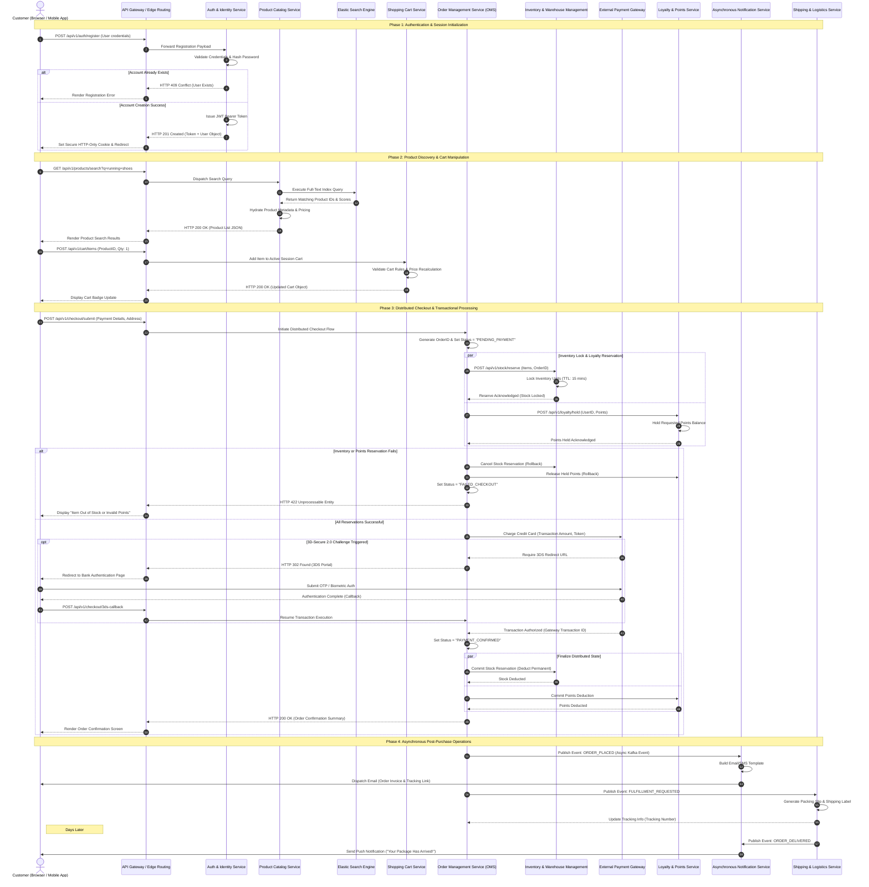

# Technical Design Document: E-Commerce Microservices Architecture

| Metadata | Details |
| --- | --- |
| **Document Version** | 1.2.0 |
| **Status** | Approved |
| **Author** | Principal Systems Architect |
| **Target Release** | Q4 2026 |

---

## 1. Executive Summary

This Technical Design Document (TDD) outlines the system architecture, integration patterns, and data persistence models for the next-generation E-Commerce Microservices Platform. The solution is designed to handle high-throughput transactional traffic, support distributed multi-party event flows, and ensure resilient failure recovery across cloud-native microservices.

---

## 2. End-to-End System Sequence Diagram

The following sequence diagram illustrates the lifecycle of a user request across all participating systems—from initial account onboarding and product search to complex distributed checkout transactions, third-party payment gateways, asynchronous inventory locking, and fulfillment orchestration.



---

## 3. High-Level System Architecture

The system follows an event-driven microservices architecture hosted within an Elastic Kubernetes Service (EKS) cluster.

```
                                  +-----------------------+
                                  |   API Gateway (Edge)  |
                                  +-----------+-----------+
                                              |
      +-------------------+-------------------+-------------------+-------------------+
      |                   |                   |                   |                   |
+-----+-----+       +-----+-----+       +-----+-----+       +-----+-----+       +-----+-----+
|   Auth    |       |  Catalog  |       |   Cart    |       |   Order   |       | Inventory |
|  Service  |       |  Service  |       |  Service  |       |  Service  |       |  Service  |
+-----------+       +-----------+       +-----------+       +-----------+       +-----------+

```

### Core Architecture Components

* **API Gateway / Edge Routing**: Handles TLS termination, Rate Limiting (Token Bucket algorithm), Authentication verification, and Request routing.
* **Order Management Service (OMS)**: Acts as the primary saga orchestrator for distributed order processing.
* **Inventory & Warehouse Management**: Manages stock allocation, temporary holds via TTL locks, and warehouse fulfillment sync.
* **External Integrations**: Third-party payment gateways (Stripe/Adyen), notification delivery networks (Twilio/SendGrid), and carrier logistics APIs.

---

## 4. Key Non-Functional Requirements (NFRs)

* **Performance & Latency**:
* P95 API Response Time < 200ms for read operations.
* P99 API Response Time < 1200ms for transactional checkout execution.


* **Availability**:
* 99.99% uptime target across multi-region active-passive deployments.


* **Data Consistency**:
* Eventual consistency for catalog indexing and notification services.
* Strict ACID compliance for order processing and inventory allocation utilizing Saga-pattern compensation handlers.


---