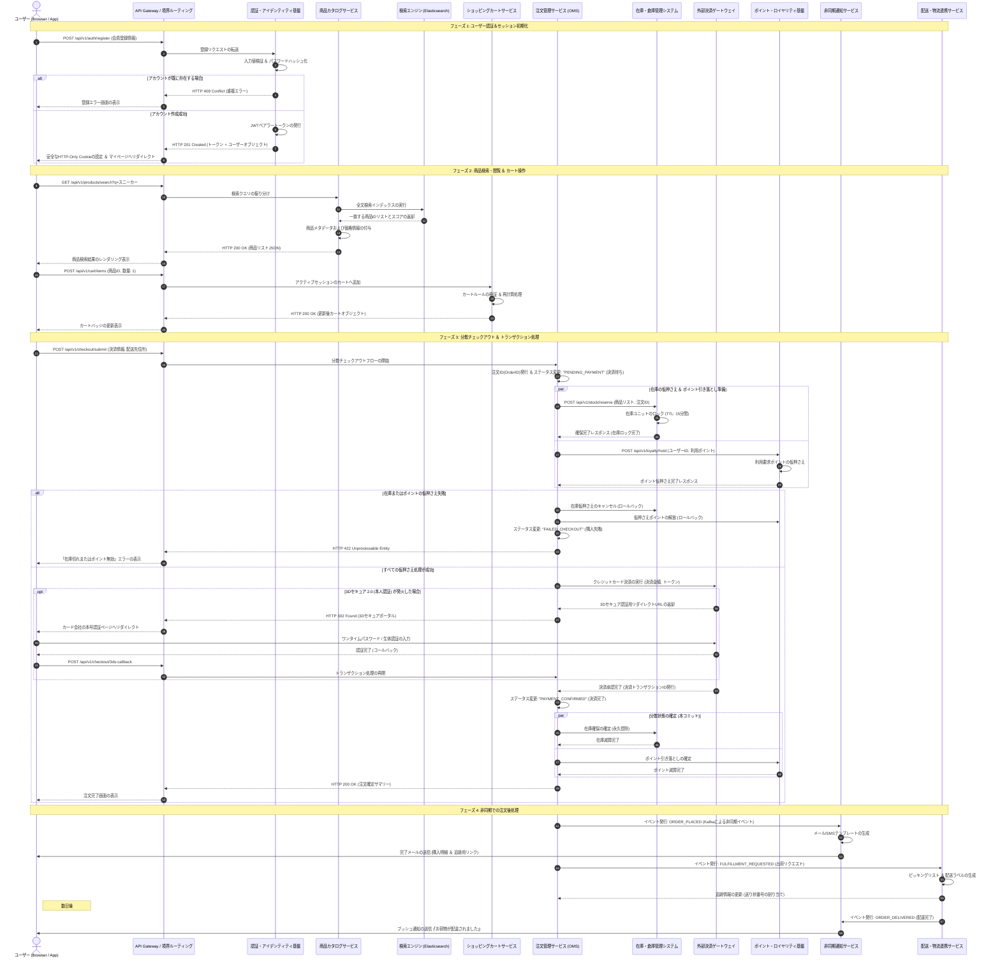

# 技術詳細設計書：マイクロサービスECプラットフォーム

| メタデータ | 詳細内容 |
| --- | --- |
| **ドキュメントバージョン** | 1.2.0 |
| **ステータス** | 承認済み (Approved) |
| **作成者** | プリンシパル・システムアーキテクト |
| **対象リリース** | 2026年 第4四半期 |

---

## 1. エグゼクティブ・サマリー（概要）

本技術設計書（TDD）は、次世代ECマイクロサービスプラットフォームのシステムアーキテクチャ、統合パターン、およびデータ永続化モデルを定義するものです。本システムは、高トラフィックなトランザクション処理に耐えうる設計となっており、分散システム間における複数パーティのイベントフロー、並びにクラウドネイティブなマイクロサービス間におけるレジリエンス（障害復旧性）の高いリカバリ機構を備えています。

---

## 2. エンドツーエンド・システムシーケンス図

以下のシーケンス図は、システム全体に関わるリクエストのライフサイクルを示しています。ユーザーの新規アカウント登録、商品検索から、分散環境下での複雑な決済トランザクション処理、外部決済ゲートウェイ連携、非同期での在庫ロック、および配送指示（出荷処理）までの一連の流れを網羅しています。



---

## 3. ハイレベル・システムアーキテクチャ概要

本システムは、Elastic Kubernetes Service (EKS) クラスター上で稼働するイベント駆動型マイクロサービスアーキテクチャを採用しています。

```
                                  +-----------------------+
                                  |   API Gateway (Edge)  |
                                  +-----------+-----------+
                                              |
      +-------------------+-------------------+-------------------+-------------------+
      |                   |                   |                   |                   |
+-----+-----+       +-----+-----+       +-----+-----+       +-----+-----+       +-----+-----+
| 認証・認可  |       | カタログ  |       | カート    |       | 注文管理  |       | 在庫・倉庫 |
| サービス  |       | サービス  |       | サービス  |       | (OMS)     |       | サービス  |
+-----------+       +-----------+       +-----------+       +-----------+       +-----------+

```

### 主要コンポーネント

* **API Gateway / 境界ルーティング**: TLS終端、レート制限（Token Bucketアルゴリズム）、認証トークン検証、およびリクエストのルーティングを担当。
* **注文管理サービス (OMS)**: 分散処理における Saga オーケストレーターとして機能し、一連の注文トランザクションを制御。
* **在庫・倉庫管理サービス**: 在庫割り当て、TTL（有効期限）付きロックによる一時保持、および倉庫側システムとの同期を担当。
* **外部連携インターフェース**: 外部決済ゲートウェイ（Stripe / Adyenなど）、通知配信基盤（Twilio / SendGridなど）、および宅配業者APIとの連携。

---

## 4. 主要な非機能要件 (NFRs)

* **性能・レイテンシ (Performance & Latency)**:
* 参照系API：P95レスポンスタイム < 200ms
* 更新系（決済処理）API：P99レスポンスタイム < 1,200ms


* **可用性 (Availability)**:
* マルチリージョン構成（Active-Passive）により、年間 99.99% の稼働率を目標とする。


* **データ整合性 (Data Consistency)**:
* カタログインデックスおよび通知サービスは **結果的整合性 (Eventual Consistency)** を許容。
* 注文・決済・在庫割り当てについては、Sagaパターンの補償トランザクションを用いて **厳密なトランザクション整合性** を保持。


---