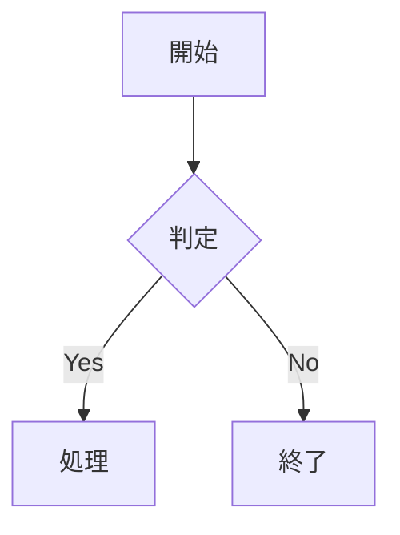
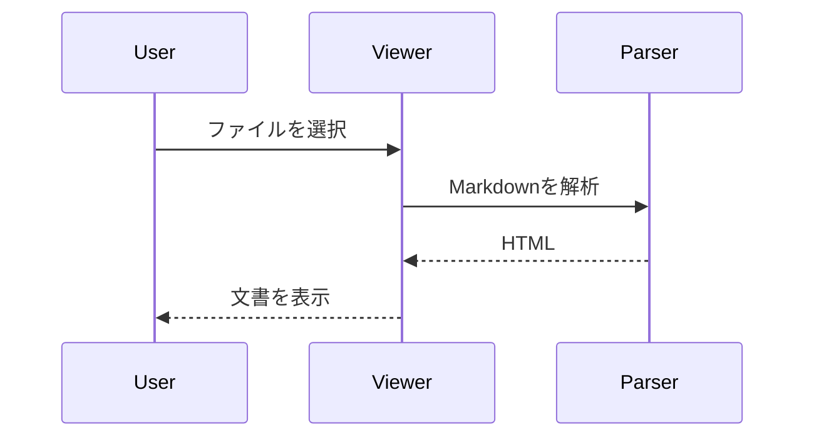
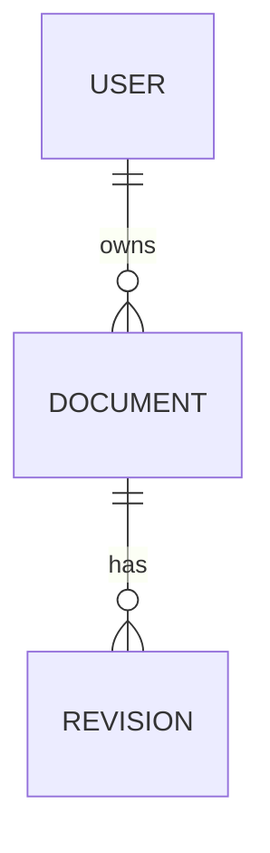
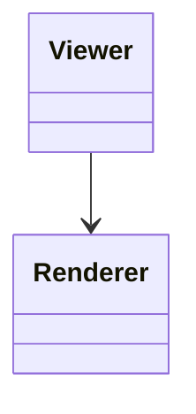

# Markdown Viewer サンプル設計書

## 1. 概要
この文書は日本語の技術文書を長時間閲覧するためのサンプルです。表、コード、図、タスク、引用などをまとめています。

### 1.1 深い見出し
#### 1.1.1 設計方針
##### 1.1.1.1 詳細
###### 1.1.1.1.1 最深部

## 2. タスク
- [x] Markdown読み込み
- [x] 目次生成
- [ ] 完全なMermaid構文互換

> 技術文書は「読む」ことが主目的なので、装飾よりも情報密度と視認性を優先します。

[Markdown公式サイト](https://www.markdownguide.org/)

## 3. 長い表
| ID | 項目 | 担当 | 状態 | 説明 | API | 備考 |
|---|---|---|---|---|---|---|
| 001 | 認証基盤 | Backend | 完了 | 利用者の認証とセッション管理を担当するコンポーネントです。長い文章が入ってもセル内で適切に折り返します。 | `/api/v1/auth/login` | 固定列の確認 |
| 002 | 文書管理 | Frontend | 進行中 | Markdown文書を読み込み、目次やコード、表を表示します。 | `/api/v1/documents` | 横幅確認 |
| 003 | 検索 | Platform | 未着手 | 大量の文書を対象に検索し、現在位置を分かりやすく表示する機能です。 | `/api/v1/search` | 表示設定 |
| 004 | 監査ログ | Security | 完了 | 操作履歴を保存し、障害調査や監査に利用します。 | `/api/v1/audit` | 先頭行固定 |
| 005 | エクスポート | Backend | 進行中 | CSVやテキストとして情報を取り出すための機能です。 | `/api/v1/export` | 両方固定 |
| 006 | 設定 | Frontend | 完了 | テーマ、文字サイズ、行間、本文幅などをローカルに保存します。 | `/api/v1/settings` | LocalStorage |
| 007 | 通知 | Platform | 未着手 | エラーや完了状態を短い通知で知らせます。 | `/api/v1/notify` | a11y |

## 4. Mermaid
### 4.1 Flowchart


### 4.2 Sequence


### 4.3 ER


### 4.4 Class


## 5. コード
```javascript
function loadMarkdown(file) {
  return file.text().then(renderMarkdown);
}
```

```python
def hello(name):
    return f"Hello, {name}!"
```

## 6. 危険なHTMLの確認
以下は**実行されてはいけない**サンプルです。

<script>alert('XSS')</script>

<a href="javascript:alert('XSS')">危険なリンク</a>

## 7. 横幅確認用の表
| 列1 | 列2 | 列3 | 列4 | 列5 | 列6 | 列7 | 列8 | 列9 | 列10 |
|---|---|---|---|---|---|---|---|---|---|
| AAAAAAAAAAAAAAAAAAAAA | B | C | D | E | F | G | H | I | J |
| 長いセル | 長いセル | 長いセル | 長いセル | 長いセル | 長いセル | 長いセル | 長いセル | 長いセル | 長いセル |
| 先頭列固定を試す | 100 | 200 | 300 | 400 | 500 | 600 | 700 | 800 | 900 |

## 8. まとめ
表のツールバーから先頭行・先頭列固定、列幅変更、表サイズ変更、CSV出力、コピーを試してください。
