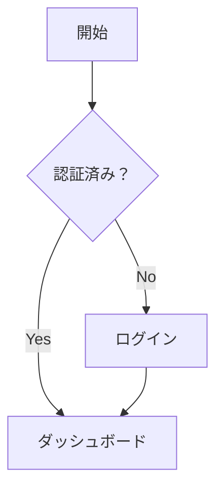
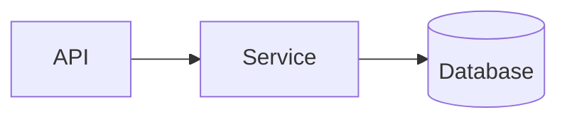
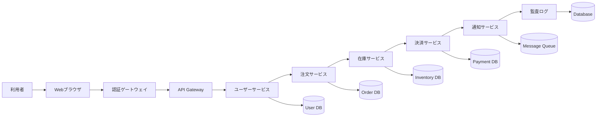
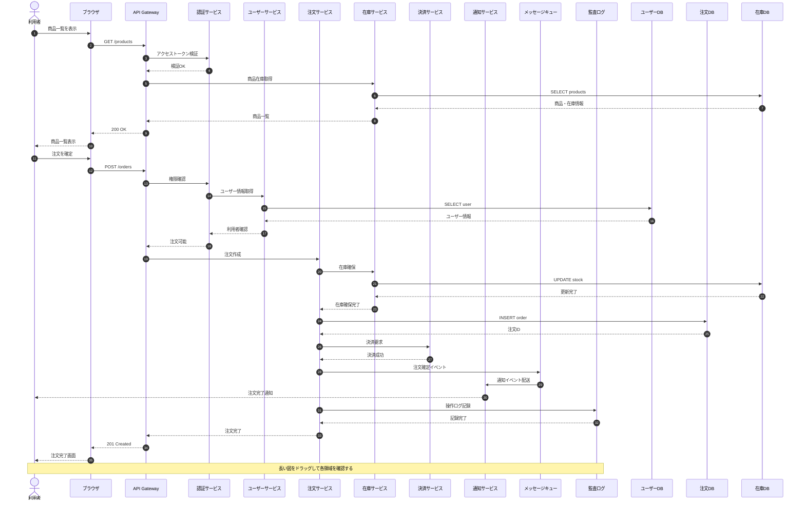
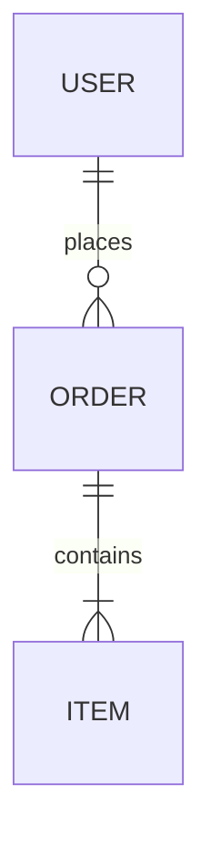
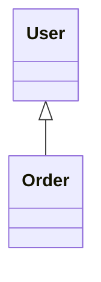

# Mermaid テスト

## Flowchart

## Graph

## Wide Flowchart

横方向に長い図。拡大しても横スクロールバーを使わず、図を掴んで移動して確認できます。

## Long Sequence Diagram

横にも縦にも長いシーケンス図。枠をリサイズし、図をドラッグして各部分を確認するテスト用です。

## ER Diagram

## Class Diagram

## State Diagram

