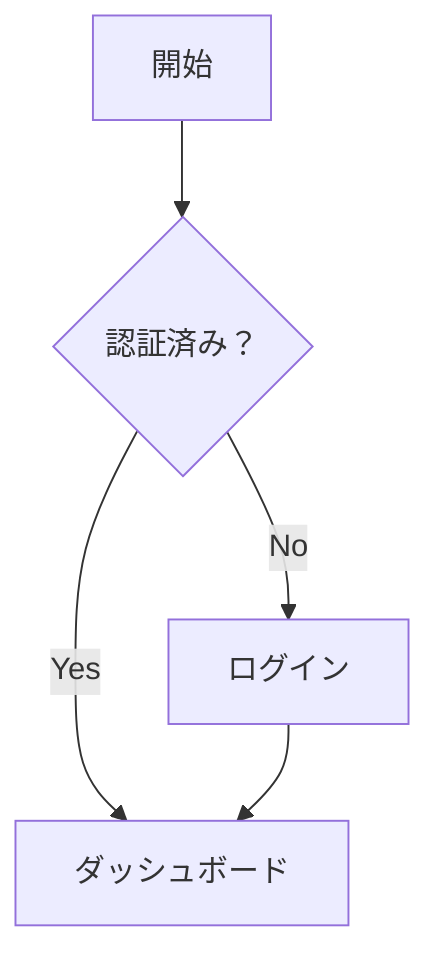
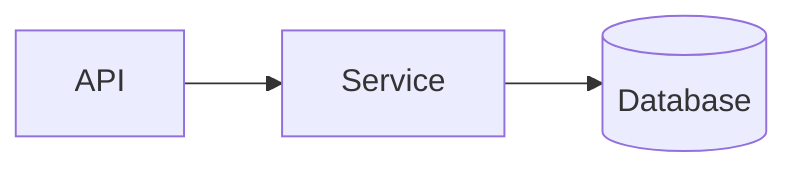
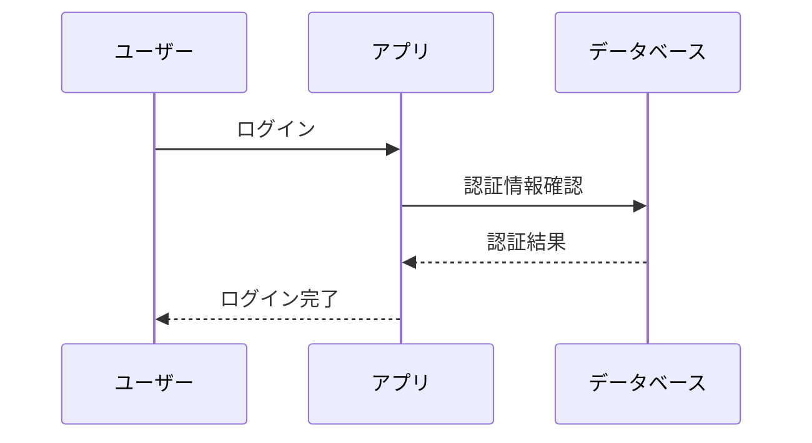
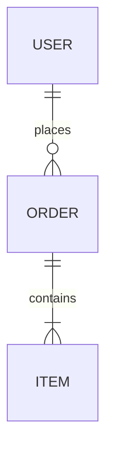
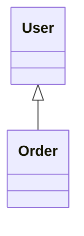
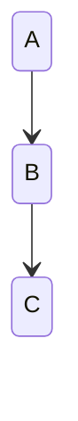

# Mermaid テスト

## Flowchart

```mermaid
flowchart TD
    A[開始] --> B{認証済み？}
    B -->|Yes| C[ダッシュボード]
    B -->|No| D[ログイン]
    D --> C
```

## Graph

```mermaid
graph LR
    A[API] --> B[Service]
    B --> C[(Database)]
```

## Sequence Diagram

```mermaid
sequenceDiagram
    participant User as ユーザー
    participant App as アプリ
    participant DB as データベース
    User->>App: ログイン
    App->>DB: 認証情報確認
    DB-->>App: 認証結果
    App-->>User: ログイン完了
```

## ER Diagram

```mermaid
erDiagram
    USER ||--o{ ORDER : places
    ORDER ||--|{ ITEM : contains
```

## Class Diagram

```mermaid
classDiagram
    class User
    class Order
    User <|-- Order
```

## State Diagram

```mermaid
stateDiagram-v2
    A --> B
    B --> C
```
