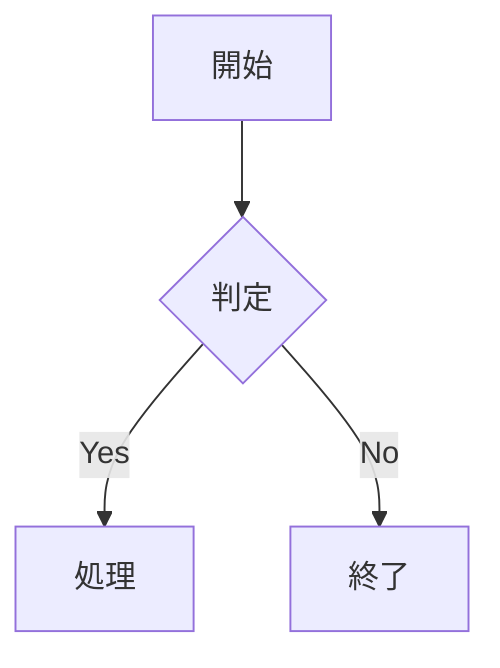
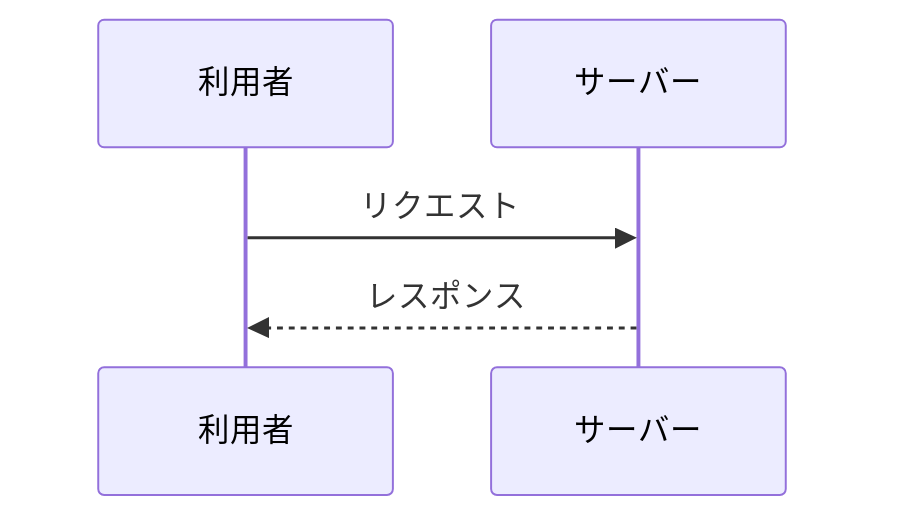
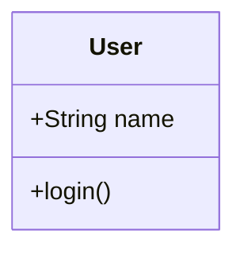
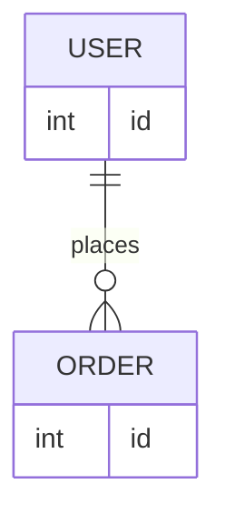

# Mermaid 総合テスト

## Flowchart

```mermaid
flowchart TD
 A[開始] --> B{判定}
 B -->|Yes| C[処理]
 B -->|No| D[終了]
```

## Sequence

```mermaid
sequenceDiagram
 participant U as 利用者
 participant S as サーバー
 U->>S: リクエスト
 S-->>U: レスポンス
```

## Class

```mermaid
classDiagram
 class User {
   +String name
   +login()
 }
```

## ER

```mermaid
erDiagram
 USER ||--o{ ORDER : places
 USER { int id }
 ORDER { int id }
```
