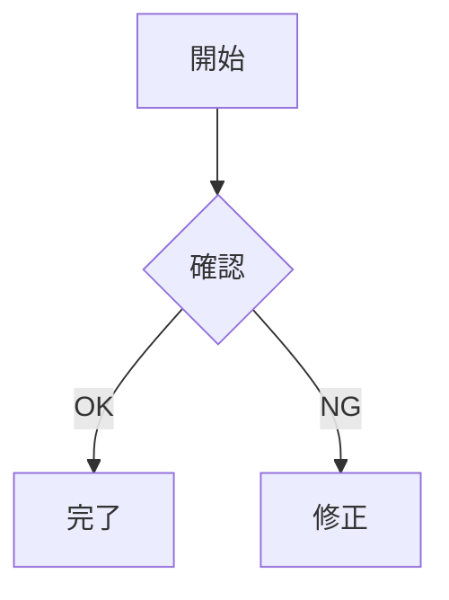

# 総合機能テスト

## 見出し

### h3

###### h6

####### h7

########## h10

## タスクリスト

- [x] Markdown読み込み
- [x] 表操作
- [ ] 追加テスト

## コード

```python
for i in range(5):
    print(f"item={i}")
```

## 表

| 項目 | 値 | 状態 |
|---|---|---|
| A | 100 | OK |
| B | 20 | NG |
| C | 300 | OK |

## Mermaid



## 引用

> これは長時間閲覧用の技術文書を想定した引用です。

## リンク

[Markdown公式](https://daringfireball.net/projects/markdown/)

## 危険なHTML

<script>alert('実行されてはいけません');</script>


<a href="javascript:alert('実行されてはいけません')">危険なリンク</a>
