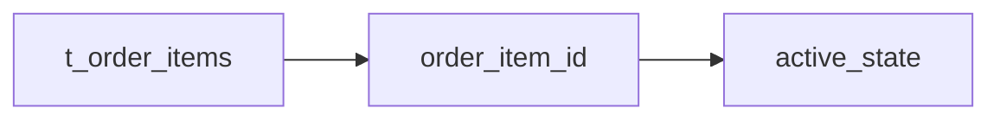

# Markdown Parser / Renderer 耐久テスト

このファイルは、Markdownの表示内容を壊さないことを確認するためのテストデータです。
特に `_`、`*`、`#`、`~`、`|`、backtick、URL、コード、表を重点的に確認します。

## 1. 通常文字列・識別子

以下は **文字を削除せず、そのまま表示**されること。

- `t_order_items`
- `order_item_id`
- `m_products`
- `t_orders`
- `UTF-8MB4`
- `Item_A`
- `Item_B_Plus`
- `C#_Book`
- `Category#1`
- `active_state`
- `user_first_name`
- `variable___name___test`
- `foo_bar`
- `get_data_by_id`

通常文字列:

foo_bar user_first_name m_products t_orders UTF-8MB4 Item_A Item_B_Plus C#_Book Category#1 active_state

## 2. インラインコード

- `t_order_items`
- `order_item_id`
- `C#_Language`
- `#1`
- `$PATH`
- `foo_bar`
- `variable___name___test`

## 3. 強調・打ち消し

- **Bold**
- *Italic*
- ~~Strikethrough~~
- **`t_order_items`**
- **`C#_Book`**
- ~~`active_state`~~
- ***Bold Italic***

## 4. エスケープ

\*this is not italic\*

\_this is not italic\_

\# This is not a header

\`not code\`

\~\~not strikethrough\~\~

## 5. リスト

- **テーブル名**: `t_order_items`
- **主キー**: `order_item_id`
- **文字コード**: UTF-8MB4

1. **テーブル命名規則**
   - マスタテーブル: `m_products`
   - トランザクションテーブル: `t_orders`
     - 詳細テーブル: `t_order_items`
2. **識別子の例**
   - `Item_A`
   - `Item_B_Plus`
   - `C#_Book`

- same text
- same text

1. same text
2. same text

## 6. 表

| ID | Name | Category | Status | Price |
| --- | --- | --- | --- | ---: |
| 001 | Item_A | Category#1 | `active_state` | 1,000 |
| 002 | Item_B_Plus | Category#2 | ~~deprecated~~ | 2,500 |
| 003 | C#_Book | Education | **New** | 500 |
| 004 | UTF-8MB4 | Database | **`active_state`** | 800 |

### 表内パイプ

| A | Value | B |
| --- | --- | --- |
| A | `x|y` | B |
| A | **`x|y`** | B |
| A | x\|y | B |
| A | [x|y](https://example.com) | B |

## 7. コードブロック

```javascript
function testParser(input_string) {
  const hash_count = 10;
  const snake_case = "a_b_c";
  console.log(`Processing #${hash_count}: ${input_string}`);
  return input_string;
}
```

```python
class UserService:
    def __init__(self, repository):
        self.repository = repository

    def find(self, user_id):
        # t_order_items / active_state / C#_Book
        user_name = self.repository.find(user_id)
        return user_name if user_name is not None else None
```

```html
<div id="test-container" class="box_style">
  <p>C# & C++ Guide</p>
</div>
```

## 8. 見出し H7-H10

####### H7 拡張見出し
######## H8 拡張見出し
######### H9 拡張見出し
########## H10 拡張見出し

## 9. インデントされたMarkdown

   ### インデントされたH3

   ```python
   value = "t_order_items"
   print(value)
   ```

   ~~~mermaid
   flowchart LR
   A[Item_A] --> B[active_state]
   ~~~

## 10. URL・リンク

[DocBase ヘルプ](https://help.docbase.io/posts/13697)

[https://example.com](https://example.com)

[画像URL](https://example.com/image_without_extension)

[XSS Link](javascript:alert('XSS'))

## 11. HTML・特殊文字

<script>alert('XSS Test');</script>

<component-name>

<UserInput>

a < b

x > y

1 < 2 && 3 > 2

AT&T

R&D

Q&A

&

## 12. その他の記号

`_` `*` `**` `~` `~~` `#` `-` `+` `>` `|` `[` `]` `(` `)` `:` `.` `/` `&` `<` `>` `$` `%` `\\`

## 13. Mermaid


